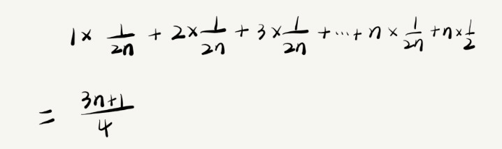

# 复杂度

## 1 为什么需要复杂度分析

把代码跑一遍，通过统计、监控，就能得到算法执行的时间和占用的内存大小。为什么还要做时间、空间复杂度分析呢？这种分析方法能比实实在在跑一遍得到的数据更准确吗？

首先，这种评估算法执行效率的方法是正确的。很多数据结构和算法书籍还给这种方法起了一个名字，叫事后统计法。但是，这种统计方法有非常大的局限性。

**1 测试结果非常依赖测试环境**

测试环境中硬件的不同会对测试结果有很大的影响。比如，我们拿同样一段代码，分别用 Intel Core i9 处理器和 Intel Core i3 处理器来运行，不用说，i9 处理器要比 i3 处理器执行的速度快很多。还有，比如原本在这台机器上 a 代码执行的速度比 b 代码要快，等我们换到另一台机器上时，可能会有截然相反的结果。

**2 测试结果受数据规模的影响很大**

对同一个排序算法，待排序数据的有序度不一样，排序的执行时间就会有很大的差别。极端情况下，如果数据已经是有序的，那排序算法不需要做任何操作，执行时间就会非常短。除此之外，如果测试数据规模太小，测试结果可能无法真实地反应算法的性能。比如，对于小规模的数据排序，插入排序可能反倒会比快速排序要快！

所以，我们需要一个不用具体的测试数据来测试，就可以粗略地估计算法的执行效率的方法。

## 2 大 O 复杂度表示法

算法的执行效率，粗略地讲，就是算法代码执行的时间。但是，如何在不运行代码的情况下，用“肉眼”得到一段代码的执行时间呢？

假设每个语句的执行时间是 unit_time

代码 1，求 1,2,3…n 的累加和：

```java
int cal(int n) {
  int sum = 0;
  int i = 1;
  for (; i <= n; ++i) {
    sum = sum + i;
  }
  return sum;
}
```

- 第 2、3 行代码分别需要 1 个 unit_time 的执行时间
- 第 4、5 行都运行了 n 遍，所以需要 2n\*unit_time 的执行时间

这段代码总的执行时间 T(n) = (2n+2)\*unit_time

代码 2：

```java
int cal(int n) {
  int sum = 0;
  int i = 1;
  int j = 1;
  for (; i <= n; ++i) {
    j = 1;
    for (; j <= n; ++j) {
      sum = sum + i * j;
    }
  }
}
```

- 第 2、3、4 行代码，每行都需要 1 个 unit_time 的执行时间
- 第 5、6 行代码循环执行了 n 遍，需要 2n \* unit_time 的执行时间
- 第 7、8 行代码循环执行了 n<sup>2</sup> 遍，所以需要 2n<sup>2</sup> \* unit_time 的执行时间

整段代码总的执行时间 T(n) = (2n<sup>2</sup>+2n+3)\*unit_time

尽管我们不知道 unit_time 的具体值，但是通过这两段代码执行时间的推导过程，我们可以得到一个非常重要的规律，那就是，所有代码的执行时间 T(n) 与每行代码的执行次数 n 成正比。

我们可以把这个规律总结成一个公式：

```
T(n) = O(f(n))
```

其中，T(n) 我们已经讲过了，它表示代码执行的时间；n 表示数据规模的大小；f(n) 表示每行代码执行的次数总和。因为这是一个公式，所以用 f(n) 来表示。公式中的 O，表示代码的执行时间 T(n) 与 f(n) 表达式成正比。

所以，第一个例子中的 T(n) = O(2n+2)，第二个例子中的 T(n) = O(2n<sup>2</sup>+2n+3)。这就是大 O 时间复杂度表示法。大 O 时间复杂度实际上并不具体表示代码真正的执行时间，而是表示代码执行时间随数据规模增长的变化趋势，所以，也叫作渐进时间复杂度（asymptotic time complexity），简称时间复杂度。

当 n 很大时，你可以把它想象成 10000、100000。而公式中的低阶、常量、系数三部分并不左右增长趋势，所以都可以忽略。我们只需要记录一个最大量级就可以了

> 代码 1 <br>
> T(n) = (2n+2)\*unit_time <br>
> T(n) = O(2n+2) <br>
> T(n) = O(n)

> 代码 2 <br>
> T(n) = (2n<sup>2</sup>+2n+3)\*unit_time <br>
> T(n) = O(2n<sup>2</sup>+2n+3) <br>
> T(n) = O(n<sup>2</sup>)

## 3 时间复杂度分析

### 3.1 只关注循环执行次数最多的一段代码

大 O 这种复杂度表示方法只是表示一种变化趋势。我们通常会忽略掉公式中的常量、低阶、系数，只需要记录一个最大阶的量级就可以了。所以，我们在分析一个算法、一段代码的时间复杂度的时候，也只关注循环执行次数最多的那一段代码就可以了。这段核心代码执行次数的 n 的量级，就是整段要分析代码的时间复杂度。

```java
int cal(int n) {
  int sum = 0;
  int i = 1;
  for (; i <= n; ++i) {
    sum = sum + i;
  }
  return sum;
}
```

其中第 2、3 行代码都是常量级的执行时间，与 n 的大小无关，所以对于复杂度并没有影响。循环执行次数最多的是第 4、5 行代码，所以这块代码要重点分析。这两行代码被执行了 n 次，所以总的时间复杂度就是 O(n)。

### 3.2 加法法则：总复杂度等于量级最大的那段代码的复杂度

```java
int cal(int n) {
  int sum_1 = 0;
  int p = 1;
  for (; p < 100; ++p) {
    sum_1 = sum_1 + p;
  }

  int sum_2 = 0;
  int q = 1;
  for (; q < n; ++q) {
    sum_2 = sum_2 + q;
  }

  int sum_3 = 0;
  int i = 1;
  int j = 1;
  for (; i <= n; ++i) {
    j = 1;
    for (; j <= n; ++j) {
      sum_3 = sum_3 + i \* j;
    }
  }

  return sum_1 + sum_2 + sum_3;
}
```

这个代码分为三部分，分别是求 sum_1、sum_2、sum_3。我们可以分别分析每一部分的时间复杂度，然后把它们放到一块儿，再取一个量级最大的作为整段代码的复杂度。

第一段的时间复杂度是多少呢？这段代码循环执行了 100 次，所以是一个常量的执行时间，跟 n 的规模无关。

即便这段代码循环 10000 次、100000 次，只要是一个已知的数，跟 n 无关，照样也是常量级的执行时间。当 n 无限大的时候，就可以忽略。尽管对代码的执行时间会有很大影响，但是回到时间复杂度的概念来说，它表示的是一个算法执行效率与数据规模增长的变化趋势，所以不管常量的执行时间多大，我们都可以忽略掉。因为它本身对增长趋势并没有影响。

那第二段代码和第三段代码的时间复杂度是 O(n) 和 O(n<sup>2</sup>)

综合这三段代码的时间复杂度，我们取其中最大的量级。所以，整段代码的时间复杂度就为 O(n<sup>2</sup>)。也就是说：总的时间复杂度就等于量级最大的那段代码的时间复杂度

### 3.3 乘法法则：嵌套代码的复杂度等于嵌套内外代码复杂度的乘积

如果 T1(n) = O(f(n))，T2(n) = O(g(n))

那么 T(n) = T1(n) \* T2(n) = O(f(n)) \* O(g(n)) = O(f(n)\*g(n))

也就是说，假设 T1(n) = O(n)，T2(n) = O(n<sup>2</sup>)，则 T1(n) \* T2(n) = O(n<sup>2</sup>)

代码上，我们可以把乘法法则看成是嵌套循环，例如：

```java
int cal(int n) {
  int ret = 0;
  int i = 1;
  for (; i < n; ++i) {
    ret = ret + f(i);
  }
}

int f(int n) {
  int sum = 0;
  int i = 1;
  for (; i < n; ++i) {
    sum = sum + i;
  }
  return sum;
}
```

我们单独看 cal() 函数。假设 f() 只是一个普通的操作，那第 4 ～ 6 行的时间复杂度就是，T1(n) = O(n)

但 f() 函数本身不是一个简单的操作，它的时间复杂度是 T2(n) = O(n)

所以，整个 cal() 函数的时间复杂度就是，T(n) = T1(n) * T2(n) = O(n*n) = O(n<sup>2</sup>)

## 4 几种常见时间复杂度实例分析

虽然代码千差万别，但是常见的复杂度量级并不多

- 常量阶 O(1)
- 对数阶 O(log n)
- 线性阶 O(n)
- 线性对数阶 O(n log n)
- 平方阶 O(n<sup>2</sup>)、立方阶 O(n<sup>3</sup>)...k 次方阶 O(n<sup>k</sup>)
- 指数阶 O(2<sup>n</sup>)
- 阶乘阶 O(n!)

复杂度量级可以粗略地分为两类，多项式量级和非多项式量级。其中，非多项式量级只有两个：O(2n) 和 O(n!)。

当数据规模 n 越来越大时，非多项式量级算法的执行时间会急剧增加，求解问题的执行时间会无限增长。所以，非多项式时间复杂度的算法其实是非常低效的算法。我们主要来看几种常见的多项式时间复杂度。

### 4.1 O(1)

首先必须明确一个概念，O(1) 只是常量级时间复杂度的一种表示方法，并不是指只执行了一行代码。比如这段代码，即便有 3 行，它的时间复杂度也是 O(1），而不是 O(3)

```java
int i = 8;
int j = 6;
int sum = i + j;
```

我稍微总结一下，只要代码的执行时间不随 n 的增大而增长，这样代码的时间复杂度我们都记作 O(1)

或者说，一般情况下，只要算法中不存在循环语句、递归语句，即使有成千上万行的代码，其时间复杂度也是 Ο(1)

### 4.2 O(log n)、O(n log n)

对数阶时间复杂度非常常见，同时也是最难分析的一种时间复杂度

```java
int i=1;
while (i <= n) {
  i = i * 2;
}
```

根据前面讲的复杂度分析方法，第三行代码是循环执行次数最多的。所以，我们只要能计算出这行代码被执行了多少次，就能知道整段代码的时间复杂度。

从代码中可以看出，变量 i 的值从 1 开始取，每循环一次就乘以 2。当大于 n 时，循环结束。

变量 i 的取值就是一个等比数列。如果我把它一个一个列出来，就应该是这个样子的：

> 2<sup>0</sup> 2<sup>1</sup> 2<sup>2</sup> ... 2<sup>k</sup> ... 2<sup>x</sup> = n

所以，我们只要知道 x 值是多少，就知道这行代码执行的次数了

通过 2<sup>x</sup> = n 求解 x

x = log<sub>2</sub>n，所以，这段代码的时间复杂度就是 O(log<sub>2</sub>n)

现在稍微改动代码：

```java
int i=1;
while (i <= n) {
  i = i * 3;
}
```

这段代码的时间复杂度为 O(log<sub>3</sub>n)

实际上，不管是以 2 为底、以 3 为底，还是以 10 为底，我们可以把所有对数阶的时间复杂度都记为 O(log n)

为什么呢？我们知道，对数之间是可以互相转换的，log<sub>3</sub>n = log<sub>3</sub>2 \* log<sub>2</sub>n

所以 O(log<sub>3</sub>n) = O(C \* log<sub>2</sub>n)，其中 C = log<sub>3</sub>2 是一个常量

基于我们前面的一个理论：在采用大 O 标记复杂度的时候，可以忽略系数，即 O(Cf(n)) = O(f(n))。所以，O(log<sub>2</sub>n) 就等于 O(log<sub>3</sub>n)。因此，在对数阶时间复杂度的表示方法里，我们忽略对数的“底”，统一表示为 O(log n)

### 4.3 O(m+n)、O(m\*n)

我们再来看一种跟前面都不一样的时间复杂度，代码的复杂度由两个数据的规模来决定：

```java
int cal(int m, int n) {
  int sum_1 = 0;
  int i = 1;
  for (; i < m; ++i) {
    sum_1 = sum_1 + i;
  }

  int sum_2 = 0;
  int j = 1;
  for (; j < n; ++j) {
    sum_2 = sum_2 + j;
  }

  return sum_1 + sum_2;
}
```

从代码中可以看出，m 和 n 是表示两个数据规模。我们无法事先评估 m 和 n 谁的量级大，所以我们在表示复杂度的时候，就不能简单地利用加法法则，省略掉其中一个

所以，上面代码的时间复杂度就是 O(m+n)

针对这种情况，原来的加法法则就不正确了，我们需要将加法规则改为：T1(m) + T2(n) = O(f(m) + g(n))。但是乘法法则继续有效：T1(m) _ T2(n) = O(f(m) _ f(n))

## 5 空间复杂度分析

空间复杂度全称就是渐进空间复杂度（asymptotic space complexity），表示算法的存储空间与数据规模之间的增长关系。

```java
void print(int n) {
  int i = 0;
  int[] a = new int[n];
  for (i; i <n; ++i) {
    a[i] = i * i;
  }

  for (i = n-1; i >= 0; --i) {
    print out a[i];
  }
}
```

跟时间复杂度分析一样，我们可以看到，第 2 行代码中，我们申请了一个空间存储变量 i，但是它是常量阶的，跟数据规模 n 没有关系，所以我们可以忽略。第 3 行申请了一个大小为 n 的 int 类型数组，除此之外，剩下的代码都没有占用更多的空间，所以整段代码的空间复杂度就是 O(n)。

我们常见的空间复杂度就是 O(1)、O(n)、O(n<sup>x</sup>)，像 O(log n)、O(n log n) 这样的对数阶复杂度平时都用不到。空间复杂度分析比时间复杂度分析要简单很多

## 6 最好、最坏情况时间复杂度

```java
// n 表示数组 array 的长度
int find(int[] array, int n, int x) {
  int i = 0;
  int pos = -1;
  for (; i < n; ++i) {
    if (array[i] == x) pos = i;
  }
  return pos;
}
```

这段代码要实现的功能是，在一个无序的数组（array）中，查找变量 x 出现的位置。如果没有找到，就返回 -1

按照上面的分析方法，这段代码的复杂度是 O(n)，其中，n 代表数组的长度。

我们在数组中查找一个数据，并不需要每次都把整个数组都遍历一遍，因为有可能中途找到就可以提前结束循环了。但是，这段代码写得不够高效。我们可以这样优化一下这段查找代码。

```java
// n 表示数组 array 的长度
int find(int[] array, int n, int x) {
  int i = 0;
  int pos = -1;
  for (; i < n; ++i) {
    if (array[i] == x) {
       pos = i;
       break;
    }
  }
  return pos;
}
```

要查找的变量 x 可能出现在数组的任意位置。如果数组中第一个元素正好是要查找的变量 x，那就不需要继续遍历剩下的 n-1 个数据了，那时间复杂度就是 O(1)

但如果数组中不存在变量 x，那我们就需要把整个数组都遍历一遍，时间复杂度就成了 O(n)。所以，不同的情况下，这段代码的时间复杂度是不一样的。

为了表示代码在不同情况下的不同时间复杂度，我们需要引入三个概念：

> 最好情况时间复杂度、最坏情况时间复杂度和平均情况时间复杂度

## 7 平均情况时间复杂度

我们都知道，最好情况时间复杂度和最坏情况时间复杂度对应的都是极端情况下的代码复杂度，发生的概率其实并不大。为了更好地表示平均情况下的复杂度，我们需要引入另一个概念：平均情况时间复杂度，后面我简称为平均时间复杂度。

我们知道，要查找的变量 x，要么在数组里，要么就不在数组里。这两种情况对应的概率统计起来很麻烦，为了方便理解，我们假设在数组中与不在数组中的概率都为 1/2。另外，要查找的数据出现在 0～n-1 这 n 个位置的概率也是一样的，为 1/n。所以，根据概率乘法法则，要查找的数据出现在 0～n-1 中任意位置的概率就是 1/(2n)。

那平均时间复杂度的计算过程就变成了这样：



这个值就是概率论中的加权平均值，也叫作期望值，所以平均时间复杂度的全称应该叫加权平均时间复杂度或者期望时间复杂度。

引入概率之后，前面那段代码的加权平均值为 (3n+1)/4。用大 O 表示法来表示，去掉系数和常量，这段代码的加权平均时间复杂度仍然是 O(n)。

实际上，在大多数情况下，我们并不需要区分最好、最坏、平均情况时间复杂度三种情况。像我们上一节课举的那些例子那样，很多时候，我们使用一个复杂度就可以满足需求了。只有同一块代码在不同的情况下，时间复杂度有量级的差距，我们才会使用这三种复杂度表示法来区分。

## 8 均摊时间复杂度
