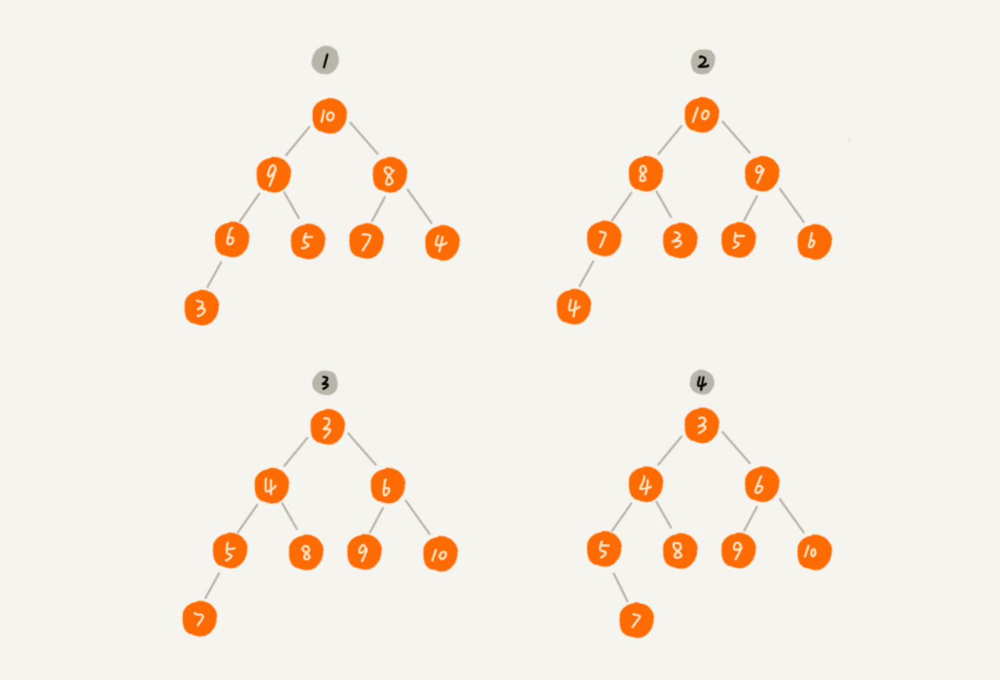
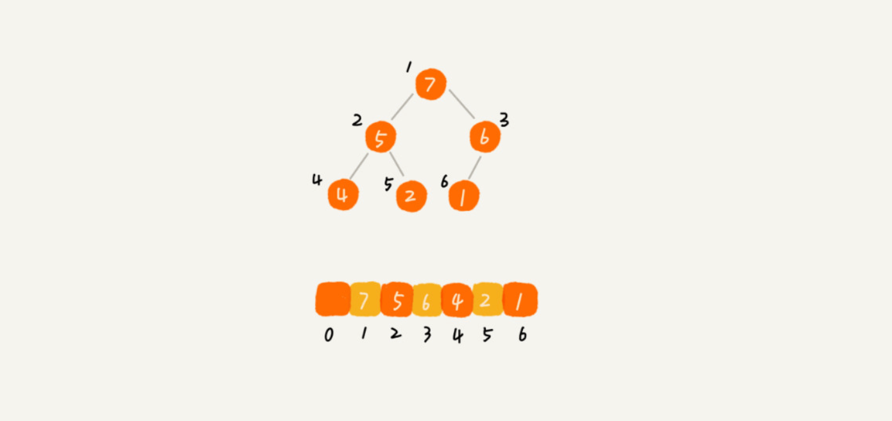
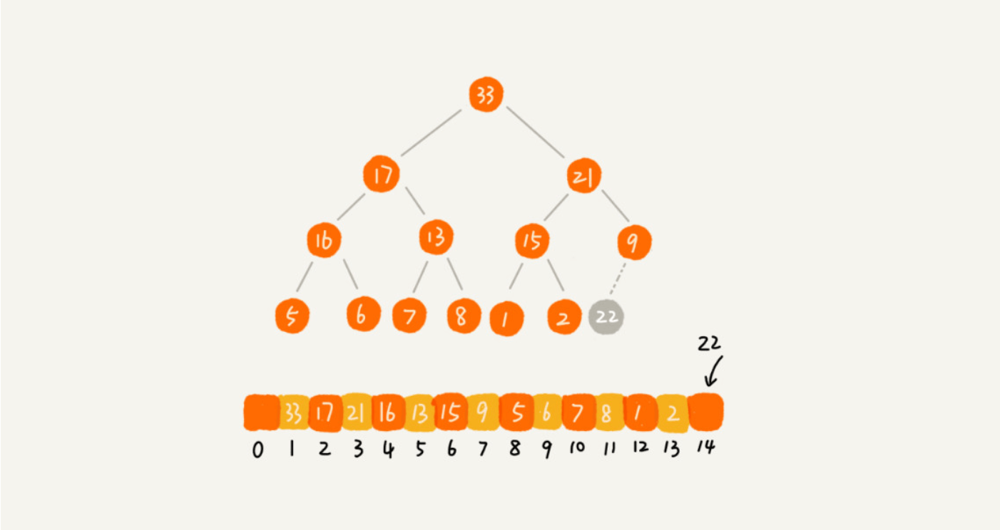
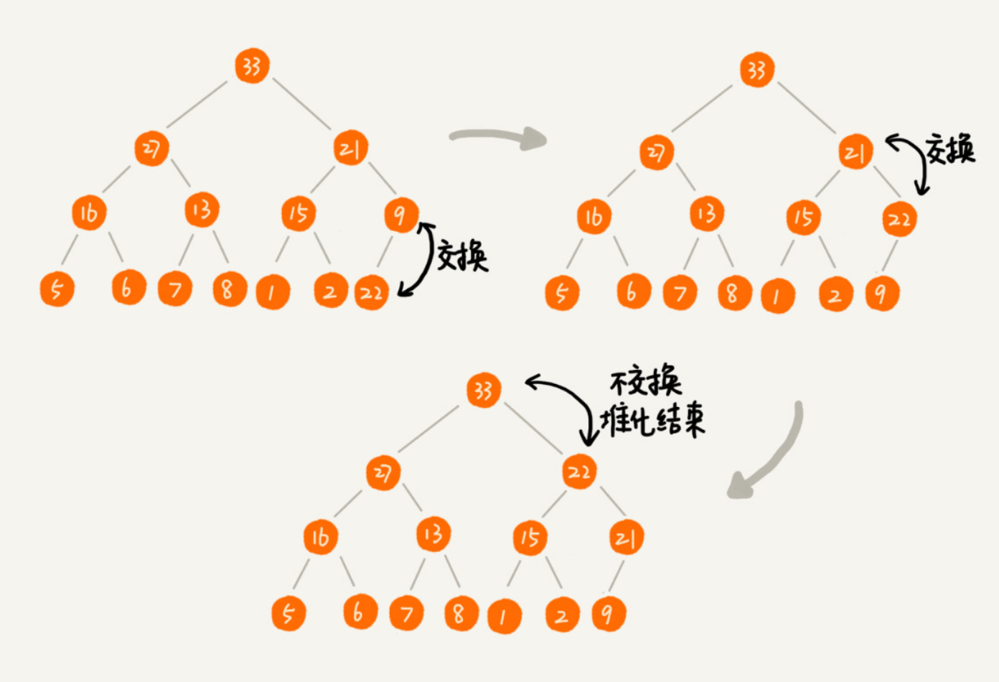
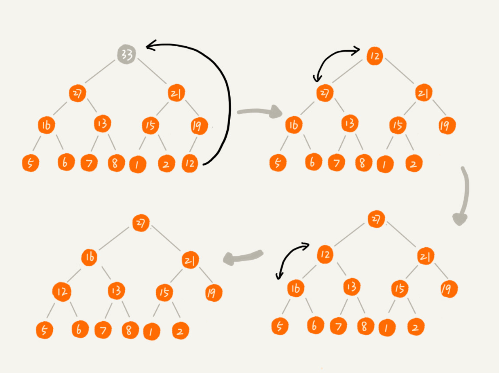
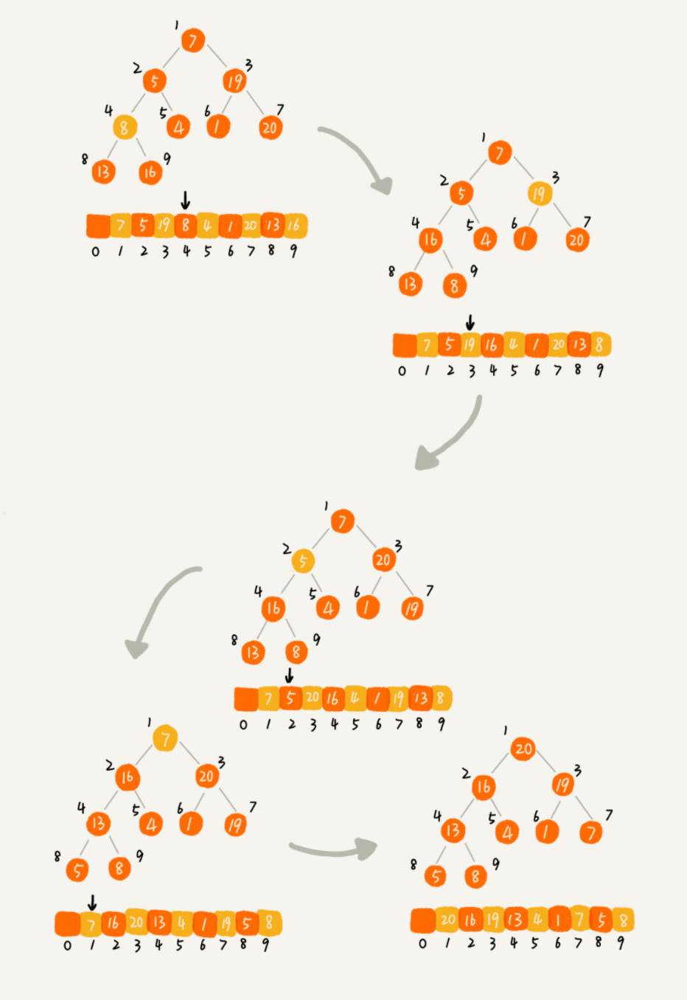
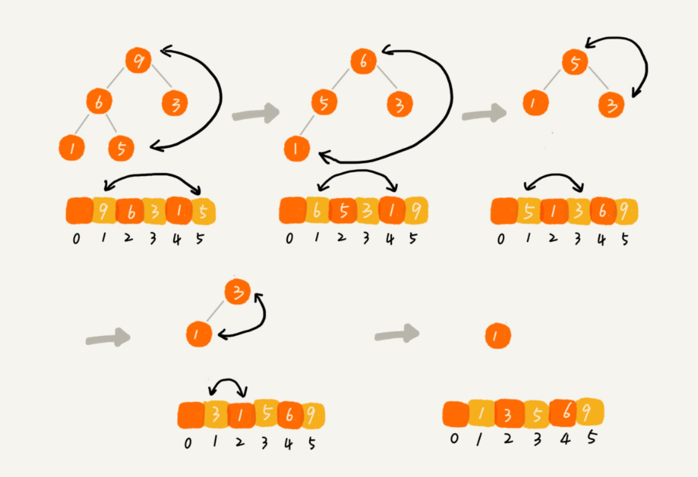
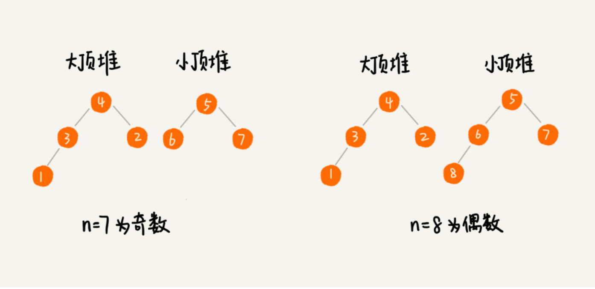
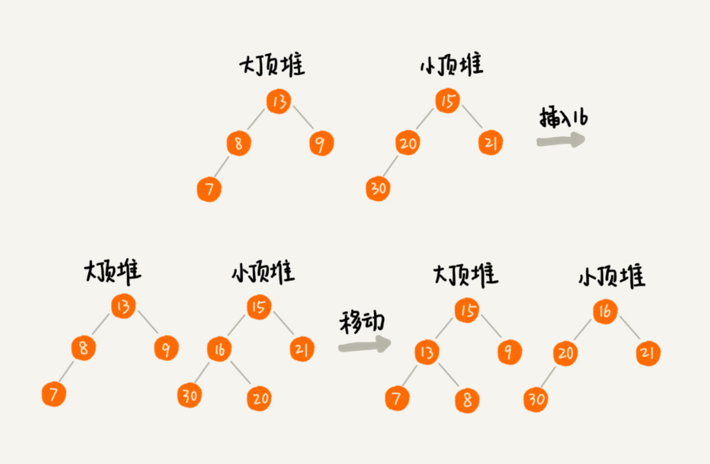

# 堆

## 1 概念

### 1.1 堆的结构

- 堆是一个完全二叉树
- 堆中每一个节点的值都必须大于等于（或小于等于）其子树中每个节点的值
- 对于每个节点的值都大于等于子树中每个节点值的堆，我们叫作“大顶堆”。对于每个节点的值都小于等于子树中每个节点值的堆，我们叫作“小顶堆”

叶子节点都在最底下两层，最后一层的叶子节点都靠左排列，并且除了最后一层，其他层的节点个数都要达到最大，这种二叉树叫作完全二叉树

其中第 1 个和第 2 个是大顶堆，第 3 个是小顶堆，第 4 个不是堆。除此之外，从图中还可以看出来，对于同一组数据，我们可以构建多种不同形态的堆

### 1.2 堆的存储

堆使用数组存储

为计算方便，一般从下标 1 开始存储

访问节点：

- 数组中下标为 `i` 的节点的左子节点，就是下标为 `i∗2` 的节点
- 右子节点就是下标为 `i∗2+1` 的节点
- 父节点就是下标为 `i/2` 的节点

## 2 堆相关操作

### 2.1 往堆中插入一个元素 (堆化)

堆化实际上有两种，`从下往上` 和 `从上往下`。这里展示 `从下往上` 的堆化方法

> 堆化就是顺着节点所在的路径，向上或者向下，对比，然后交换

### 2.2 删除堆顶元素

把最后一个节点放到堆顶，然后利用同样的父子节点对比方法

### 2.3 建堆

建堆可以不借助另一个数组，就在原数组上操作。从后往前处理数组，并且每个数据都是从上往下堆化

从第一个非叶子节点开始，依次堆化

> 对于完全二叉树来说，下标从 `n/2+1` 到 `n` 的节点都是叶子节点。下标从 `n/2` 开始到 `1` 的数据为非叶子节点

> 堆排序的建堆过程的时间复杂度是 `O(n)`

### 2.4 堆排序

数组中的第一个元素就是堆顶，也就是最大的元素。我们把它跟最后一个元素交换，那最大元素就放到了下标为 n 的位置

类似删除堆顶元素的操作，一直重复这个过程，直到最后堆中只剩下标为 1 的一个元素，排序工作就完成了

> 建堆过程的时间复杂度是 `O(n)`，排序过程的时间复杂度是 `O(n log n)`，所以，堆排序整体的时间复杂度是 `O(n log n)`

## 3 堆的应用

### 3.1 优先级队列

队列最大的特性就是先进先出。不过，在优先级队列中，数据的出队顺序不是先进先出，而是按照优先级来，优先级最高的，最先出队

堆和优先级队列非常相似。一个堆就可以看作一个优先级队列

> 往优先级队列中插入一个元素，就相当于往堆中插入一个元素；从优先级队列中取出优先级最高的元素，就相当于取出堆顶元素

### 3.2 求 Top K

实现步骤：

1. 创建一个大小为 `K` 的小顶堆
2. 顺序遍历数组，从数组中取出取数据与堆顶元素比较
3. 如果比堆顶元素大，我们就把堆顶元素删除，并且将这个元素插入到堆中
4. 如果比堆顶元素小，则不做处理，继续遍历数组
5. 等数组中的数据都遍历完之后，堆中的数据就是前 `K` 大数据了

### 3.3 利用堆求中位数

对于一组静态数据，中位数是固定的，我们可以先排序，第 n2 个数据就是中位数

如果是动态数据集合，中位数在不停地变动，如果再用先排序的方法，每次询问中位数的时候，都要先进行排序，那效率就不高了

> 借助堆这种数据结构，我们不用排序，就可以非常高效地实现求中位数操作

实现步骤：

1. 需要维护两个堆，一个大顶堆，一个小顶堆。大顶堆中存储前半部分数据，小顶堆中存储后半部分数据，且小顶堆中的数据都大于大顶堆中的数据
2. 前 `n/2` 个数据存储在大顶堆中，后 `n/2` 个数据存储在小顶堆中
   
3. 如果新加入的数据小于等于大顶堆的堆顶元素，我们就将这个新数据插入到大顶堆；如果新加入的数据大于等于小顶堆的堆顶元素，我们就将这个新数据插入到小顶堆
4. 如果出现两个堆数据个数不一致的情况，可以从一个堆中不停地将堆顶元素移动到另一个堆
   
5. 插入数据因为需要涉及堆化，所以时间复杂度变成了 `O(log n)`
6. 求中位数我们只需要返回大顶堆的堆顶元素就可以了

> 利用两个堆不仅可以快速求出中位数，还可以快速求其他百分位的数据，原理是类似的。

## 4 JavaScript 中的堆

## 5 实例

### 5.1 LeetCode 215 数组中的第 K 个最大元素

### 5.2 LeetCode 347 前 K 个高频元素

### 5.3 LeetCode 23 合并 K 个排序链表
