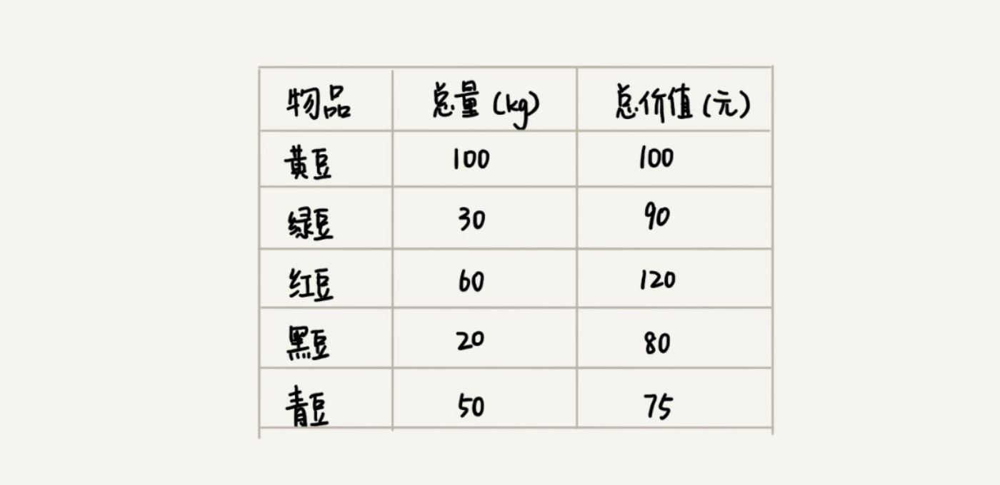
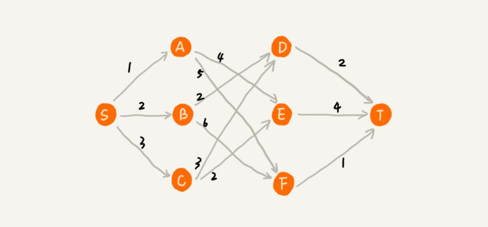

# 贪心算法

## 1 概念

- 贪心算法是算法设计中的一种方法
- 期盼通过 `每个阶段` 的局部最优选择，从而达到全局的最优
- 贪心算法结果不一定是最优的

### 1.1 例子

假设我们有一个可以容纳 100kg 物品的背包，可以装各种物品。我们有以下 5 种豆子，每种豆子的总量和总价值都各不相同。为了让背包中所装物品的总价值最大，我们如何选择在背包中装哪些豆子？每种豆子又该装多少呢？

> 我们只要先算一算每个物品的单价，按照单价由高到低依次来装就好了。这个思路就是贪心算法

### 1.2 结果不一定最优

在一个有权图中，我们从顶点 S 开始，找一条到顶点 T 的最短路径（路径中边的权值和最小）

贪心算法的解决思路是，每次都选择一条跟当前顶点相连的权最小的边，直到找到顶点 T

求出的最短路径是 `S->A->E->T`，路径长度是 `1+4+4=9`。最终求的路径并不是最短路径，因为路径 `S->B->D->T` 才是最短路径，因为这条路径的长度是 `2+2+2=6`

> 在这个问题上，贪心算法不工作的主要原因是，前面的选择，会影响后面的选择

## 2 LeetCode

### 2.1 LeetCode 455 分饼干

### 2.2 LeetCode 122 买卖股票的最佳时机 II
