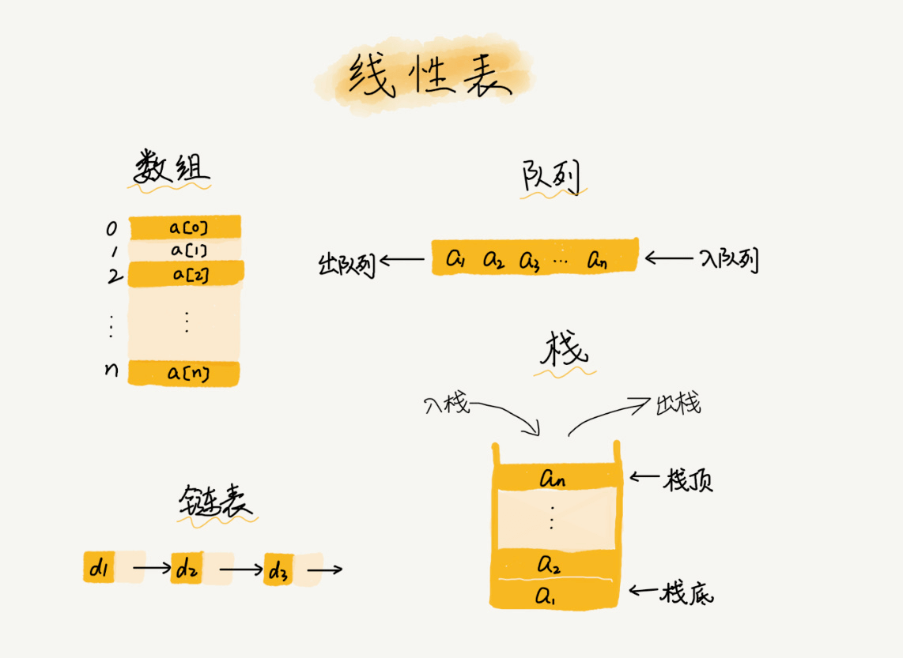
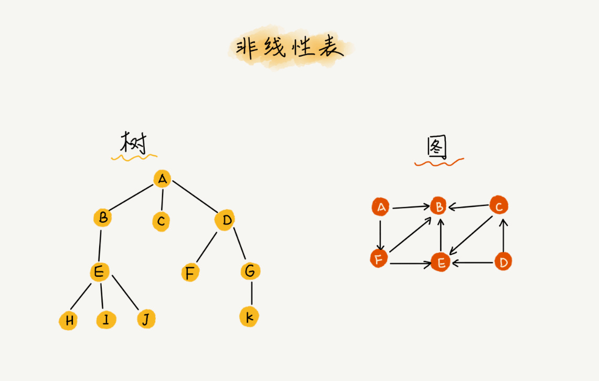
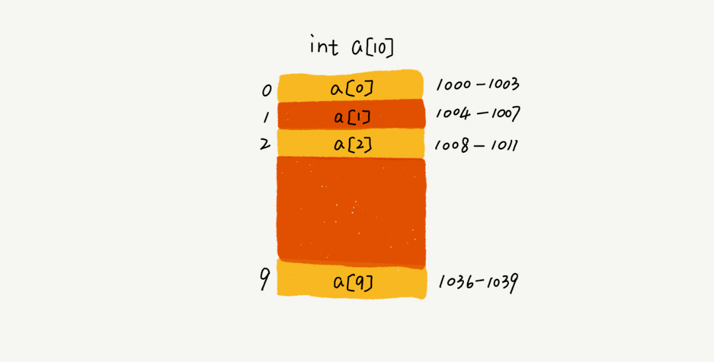

# 数组

## 1 概念

在每一种编程语言中，基本都会有数组这种数据类型。不过，它不仅仅是一种编程语言中的数据类型，还是一种最基础的数据结构

> 数组（Array）是一种线性表数据结构。它用一组连续的内存空间，来存储一组具有相同类型的数据

这个定义里有几个关键词，理解了这几个关键词，就能彻底掌握数组的概念

### 1.1 线性表

第一是线性表（Linear List）。顾名思义，线性表就是数据排成像一条线一样的结构。每个线性表上的数据最多只有前和后两个方向。其实除了数组，链表、队列、栈等也是线性表结构。



而与它相对立的概念是非线性表，比如二叉树、堆、图等。之所以叫非线性，是因为，在非线性表中，数据之间并不是简单的前后关系。



### 1.2 连续的内存空间和相同类型的数据

连续的内存空间和相同类型的数据。正是因为这两个限制，它才有了一个堪称“杀手锏”的特性：“随机访问”

但有利就有弊，这两个限制也让数组的很多操作变得非常低效，比如要想在数组中删除、插入一个数据，为了保证连续性，就需要做大量的数据搬移工作。

## 2 特性

### 2.1 随机访问

我们拿一个长度为 10 的 int 类型的数组 `int[] a = new int[10]` 来举例

计算机给数组 `a[10]`，分配了一块连续内存空间 1000 ～ 1039，其中，内存块的首地址为 `base_address = 1000`



计算机会给每个内存单元分配一个地址，计算机通过地址来访问内存中的数据

当计算机需要随机访问数组中的某个元素时，它会首先通过下面的寻址公式，计算出该元素存储的内存地址：

```
a[i]_address = base_address + i * data_type_size
```

其中 data_type_size 表示数组中每个元素的大小。我们举的这个例子里，数组中存储的是 int 类型数据，所以 data_type_size 就为 4 个字节

### 2.2 数组和链表的区别(随机访问)

面试的时候，常常会问数组和链表的区别，很多人都回答说，“链表适合插入、删除，时间复杂度 O(1)；数组适合查找，查找时间复杂度为 O(1)”。

实际上，这种表述是不准确的。数组是适合查找操作，但是查找的时间复杂度并不为 O(1)。即便是排好序的数组，你用二分查找，时间复杂度也是 O(log n)。所以，正确的表述应该是，数组支持随机访问，根据下标随机访问的时间复杂度为 O(1)

### 2.3 低效的插入和删除

数组为了保持内存数据的连续性，会导致插入、删除这两个操作比较低效

#### 1 插入

假设数组的长度为 n，现在，如果我们需要将一个数据插入到数组中的第 k 个位置。为了把第 k 个位置腾出来，给新来的数据，我们需要将第 k ～ n 这部分的元素都顺序地往后挪一位

如果在数组的末尾插入元素，那就不需要移动数据了，这时的时间复杂度为 O(1)。但如果在数组的开头插入元素，那所有的数据都需要依次往后移动一位，所以最坏时间复杂度是 O(n)。 因为我们在每个位置插入元素的概率是一样的，所以平均情况时间复杂度为 `(1 + 2 + … n) / n = O(n)`

如果数组中的数据是有序的，我们在某个位置插入一个新的元素时，就必须按照刚才的方法搬移 k 之后的数据

#### 2 删除

跟插入数据类似，如果我们要删除第 k 个位置的数据，为了内存的连续性，也需要搬移数据，不然中间就会出现空洞，内存就不连续了。

和插入类似，如果删除数组末尾的数据，则最好情况时间复杂度为 O(1)；如果删除开头的数据，则最坏情况时间复杂度为 O(n)；平均情况时间复杂度也为 O(n)。

### 2.4 数组的访问越界问题

首先，分析一下这段 C 语言代码的运行结果：

```c
int main(int argc, char* argv[]) {
  int i = 0;
  int arr[3] = {0};

  for (; i<=3; i++) {
    arr[i] = 0;
    printf("hello world\n");
  }

  return 0;
}
```

这段代码的运行结果并非是打印三行“hello word”，而是会无限打印“hello world”，这是为什么呢？

因为，数组大小为 3，`a[0]，a[1]，a[2]`，而我们的代码因为书写错误，导致 for 循环的结束条件错写为了 `i <= 3` 而非 `i<3`，所以当 i=3 时，数组 `a[3]` 访问越界。

在 C 语言中，只要不是访问受限的内存，所有的内存空间都是可以自由访问的。根据我们前面讲的数组寻址公式，`a[3]` 也会被定位到某块不属于数组的内存地址上，而这个地址正好是存储变量 i 的内存地址，那么 `a[3] = 0` 就相当于 `i=0`，所以就会导致代码无限循环。

数组越界在 C 语言中是一种未决行为，并没有规定数组访问越界时编译器应该如何处理。因为，访问数组的本质就是访问一段连续内存，只要数组通过偏移计算得到的内存地址是可用的，那么程序就可能不会报任何错误。

但并非所有的语言都像 C 一样，把数组越界检查的工作丢给程序员来做，像 Java 本身就会做越界检查，比如下面这几行 Java 代码，就会抛出 `java.lang.ArrayIndexOutOfBoundsException`

```java
int[] a = new int[3];
a[3] = 10;
```

## 3 JS 中的数组

### 3.1 内部机制

数组是一种特殊的对象。使用方括号来访问属性 `arr[0]` 实际上是来自于对象的语法。它其实与 `obj[key]` 相同，其中 arr 是对象，而数字用作键（key）。

它们扩展了对象，提供了特殊的方法来处理有序的数据集合以及 length 属性。但从本质上讲，它仍然是一个对象

> 数组真正特殊的是它们的内部实现。JavaScript 引擎尝试把这些元素一个接一个地存储在连续的内存区域，而且还有一些其它的优化，以使数组运行得非常快

> 如果我们不像“有序集合”那样使用数组，而是像常规对象那样使用数组，对应的优化就会被关闭

数组误用的几种方式:

1. 添加一个非数字的属性，比如 `arr.test = 5`
2. 制造空洞，比如：添加 `arr[0]`，然后添加 `arr[1000]` (它们中间什么都没有)
3. 以倒序填充数组，比如 `arr[1000]`，`arr[999]` 等

### 3.2 性能

push/pop 方法运行的比较快，而 shift/unshift 比较慢

shift 操作必须做三件事:

1. 移除索引为 0 的元素
2. 把所有的元素向左移动，把索引 1 改成 0，2 改成 1 以此类推，对其重新编号
3. 更新 length 属性

### 3.3 length

length 实际上不是数组里元素的个数，而是最大的数字索引值加一

```javascript
let fruits = [];
fruits[123] = 'Apple';

alert(fruits.length); // 124
```

> length 可更改，增加 length 不会有什么影响。减少 length 数组会被截断，并且是不可逆的
