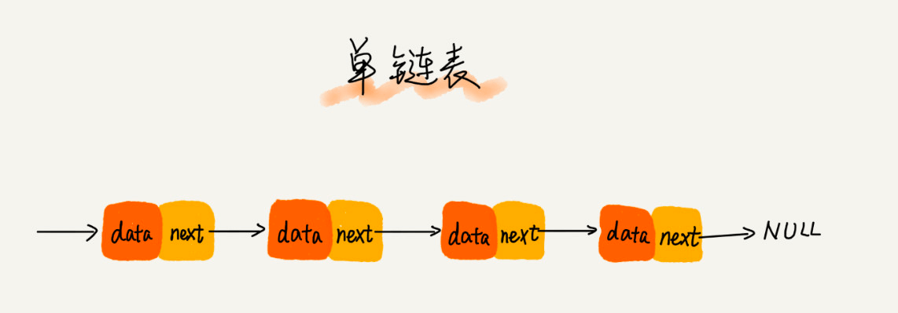
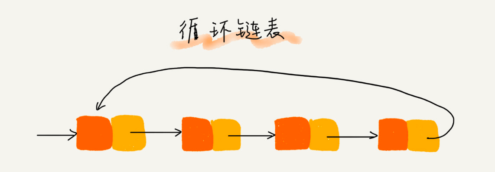
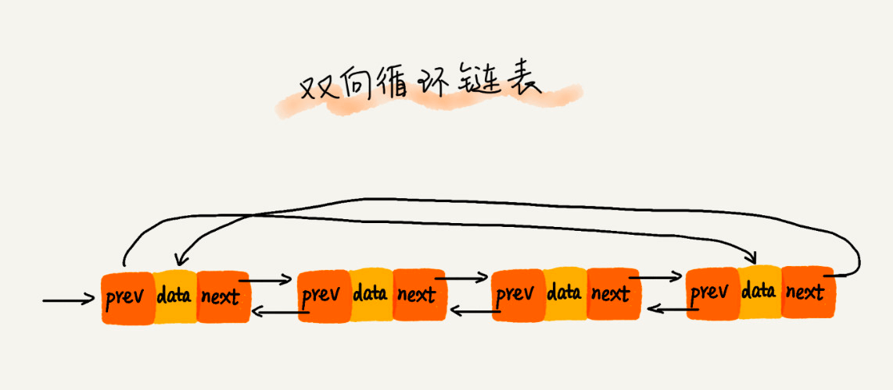

# 链表

## 1 概念

### 1.1 简介

链表通过指针将一组零散的内存块串联在一起。其中，我们把内存块称为链表的“结点”。为了将所有的结点串起来，每个链表的结点除了存储数据之外，还需要记录链上的下一个结点的地址。如图所示，我们把这个记录下个结点地址的指针叫作`后继指针 next`



- `头结点`：第一个结点叫作头结点，用来记录链表的基地址。可以用它遍历得到整条链表
- `尾结点`：最后一个结点叫作尾结点。尾结点指针不是指向下一个结点，而是指向一个空地址 NULL，表示这是链表上最后一个结点

链表也支持数据的查找、插入和删除操作

> 有三种最常见的链表结构，分别是：单链表、双向链表和循环链表

### 1.2 链表和数组

数组需要一块连续的内存空间来存储，对内存的要求比较高。如果我们申请一个 100MB 大小的数组，当内存中没有连续的、足够大的存储空间时，即便内存的剩余总可用空间大于 100MB，仍然会申请失败

而链表恰恰相反，它并不需要一块连续的内存空间，它通过“指针”将一组零散的内存块串联起来使用

> 链表能高效插入、删除。数组的插入、删除操作时，为了保持内存数据的连续性，需要做大量的数据搬移，所以时间复杂度是 O(n)。链表的插入和删除操作，我们只需要考虑相邻结点的指针改变，所以对应的时间复杂度是 O(1)

> 链表要想随机访问某个元素是低效的。因为链表中的数据并非连续存储的，所以无法像数组那样，根据首地址和下标，通过寻址公式就能直接计算出对应的内存地址，而是需要根据指针一个结点一个结点地依次遍历，直到找到相应的结点

数组和链表是两种截然不同的内存组织方式。正是因为内存存储的区别，它们插入、删除、随机访问操作的时间复杂度正好相反


### 1.3 单链表

单链表指针不是指向下一个结点，而是指向一个`空地址 NULL`


### 1.4 循环链表

循环链表的尾结点指针是指向链表的头结点



### 1.5 双向链表

双向链表支持两个方向，每个结点不止有一个后继指针 next 指向后面的结点，还有一个前驱指针 prev 指向前面的结点

双向链表需要额外的两个空间来存储后继结点和前驱结点的地址



## 2 JavaScript 中的链表

js 中没有链表这个数据结构，可以使用 Object 来模拟链表

```js
let a = { val: 'a' };
let b = { val: 'b' };
let c = { val: 'c' };
let e = { val: 'e' };

a.next = b;
b.next = c;
c.next = e;

// 遍历链表
let p = a;
while (p) {
  console.log(p.next);
  p = p.next;
}

// 插入
let d = { val: 'd' };
c.next = d;
d.next = e;

// 删除
c.next = e;
```

## 3 实例

### 3.1 leetcode 237 删除链表中的节点

### 3.2 leetcode 206 反转链表

### 3.3 leetcode 2 两数相加

### 3.4 leetcode 83 删除排序链表中的重复元素

### 3.5 leetcode 141 环形链表

### 3.6 leetcode 148 排序链表
