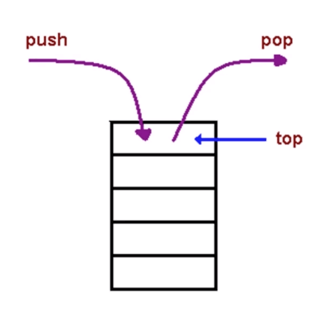
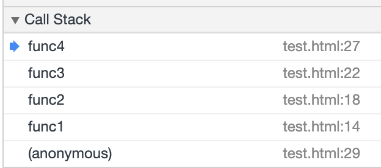

# 栈

## 1 概念

栈是一个后进先出的数据结构

从栈的操作特性上来看，栈是一种 `操作受限的线性表`，只允许在一端插入和删除数据



相比数组和链表，栈带给我的只有限制，并没有任何优势。那我直接使用数组或者链表不就好了吗？为什么还要用这个“操作受限”的“栈”呢？

事实上，从功能上来说，数组或链表确实可以替代栈，但是，特定的数据结构是对特定场景的抽象，而且，数组或链表暴露了太多的操作接口，操作上的确灵活自由，但使用时就比较不可控，自然也就更容易出错。

栈既可以用数组来实现，也可以用链表来实现。用数组实现的栈，叫作顺序栈，用链表实现的栈，叫作链式栈

### 1.1 顺序栈

Java 实现的顺序栈：

```java
// 基于数组实现的顺序栈
public class ArrayStack {
  private String[] items;  // 数组
  private int count;       // 栈中元素个数
  private int n;           // 栈的大小

  // 初始化数组，申请一个大小为 n 的数组空间
  public ArrayStack(int n) {
    this.items = new String[n];
    this.n = n;
    this.count = 0;
  }

  // 入栈操作
  public boolean push(String item) {
    // 数组空间不够了，直接返回 false，入栈失败。
    if (count == n) return false;
    // 将 item 放到下标为 count 的位置，并且 count 加一
    items[count] = item;
    ++count;
    return true;
  }

  // 出栈操作
  public String pop() {
    // 栈为空，则直接返回 null
    if (count == 0) return null;
    // 返回下标为 count-1 的数组元素，并且栈中元素个数 count 减一
    String tmp = items[count-1];
    --count;
    return tmp;
  }
}
```

不管是顺序栈还是链式栈，入栈、出栈只涉及栈顶个别数据的操作，所以时间复杂度都是 `O(1)`

不管是顺序栈还是链式栈，我们存储数据只需要一个大小为 n 的数组就够了。在入栈和出栈过程中，只需要一两个临时变量存储空间，所以空间复杂度是 `O(1)`

注意，这里存储数据需要一个大小为 n 的数组，并不是说空间复杂度就是 `O(n)`。因为，这 n 个空间是必须的，无法省掉。所以我们说空间复杂度的时候，是指除了原本的数据存储空间外，算法运行还需要额外的存储空间

### 1.2 链式栈

## 2 JavaScript 中的栈

> Javascript 中没有栈这个数据结构，但可以用 Arrry 实现栈的所有功能

js 的数组不需要指定长度，所以不需要指定栈的大小

上面 Java 的例子，需要使用 count 标记栈里面元素的个数，出栈入栈都是更改 count 位置的值。而 js 中数组有 push/pop 方法，可以直接在末尾 `插入/删除` 元素

**JavaScript 实现的顺序栈：**

```javascript
class Stack {
  constructor() {
    this.arr = [];
  }

  push(item) {
    return this.arr.push(item);
  }

  pop() {
    this.arr.pop();
  }

  peek() {
    return this.arr[this.arr.length - 1];
  }

  length() {
    return this.arr.length;
  }
}
```

**JavaScript 实现的链式栈：**

```js
class Stack {
  constructor() {
    this.head = null;
    this.length = 0;
  }

  push(item) {
    let node = {
      val: item,
      next: this.head
    };
    this.head = node;
    this.length++;
  }

  pop() {
    if (this.length) {
      let head = this.head;
      this.head = this.head.next;
      this.length--;
      return head.val;
    } else {
      return null;
    }
  }

  peek() {
    return this.length ? this.head.val : null;
  }
}
```

## 3 栈的应用场景

当某个数据集合只涉及在一端插入和删除数据，并且满足后进先出、先进后出的特性，我们就应该首选“栈”这种数据结构

- 十进制转二进制
- 判断字符串的括号是否有效
- 函数调用堆栈

## 4 实例

### 4.1 十进制转二进制

十进制整数转换为二进制整数十进制整数转换为二进制整数采用"除 2 取余，逆序排列"法。具体做法是：用 2 整除十进制整数，可以得到一个商和余数；再用 2 去除商，又会得到一个商和余数，如此进行，直到商为小于 1 时为止，然后把先得到的余数作为二进制数的低位有效位，后得到的余数作为二进制数的高位有效位，依次排列起来

```javascript
function decimalToBinary(val) {
  let stack = [];
  let decimal = val;
  let binary = '';

  while (val !== 0) {
    let bin = decimal % 2;
    stack.push(bin);
    decimal = Math.floor(decimal / 2);
  }

  while (stack.length) {
    binary += stack.pop();
  }

  return binary;
}
```

### 4.2 函数调用堆栈

函数调用堆栈，js 中函数嵌套调用时，会通过栈来管理函数的执行顺序

```javascript
function func1() {
  func2();
}

function func2() {
  func3();
}

function func3() {
  func4();
}

function func4() {
  console.log('233');
}

func1();
```



### 4.3 leetcode 20 有效括号

**题目：**

给定一个只包括 '('，')'，'{'，'}'，'\['，'\]'  的字符串，判断字符串是否有效。

有效字符串需满足：

1. 左括号必须用相同类型的右括号闭合。
2. 左括号必须以正确的顺序闭合。

注意空字符串可被认为是有效字符串。

示例：

```
输入: "()"
输出: true

输入: "()[]{}"
输出: true

输入: "(]"
输出: false

输入: "([)]"
输出: false

输入: "{[]}"
输出: true
```

**解：**

```javascript
var isValid = function(s) {
  const n = s.length;

  // 有效字符串的长度一定为偶数
  if (n % 2 === 1) {
    return false;
  }

  const pairs = new Map([
    [')', '('],
    [']', '['],
    ['}', '{']
  ]);
  const stk = [];

  for (let i = 0; i < s.length; i++) {
    if (pairs.has(s[i])) {
      if (!stk.length || stk[stk.length - 1] !== pairs.get(s[i])) {
        return false;
      }
      stk.pop();
    } else {
      stk.push(s[i]);
    }
  }

  return !stk.length;
};
```

**复杂度：**

- 时间复杂度：`O(n)`，其中 n 是字符串 s 的长度
- 空间复杂度：`O( n + ∣Σ∣)`，其中 Σ 表示字符集，本题中字符串只包含 6 种括号，`∣Σ∣ = 6`。栈中的字符数量为 `O(n)`，而哈希映射使用的空间为 `O(∣Σ∣)`，相加即可得到总空间复杂度

### 4.4 二叉树的前序遍历

### 4.5 leetcode 682 棒球比赛

### 4.6 leetcode 85 最大矩阵
