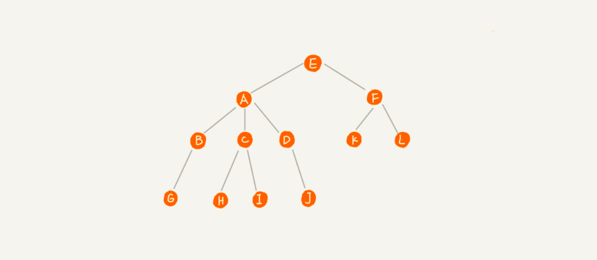
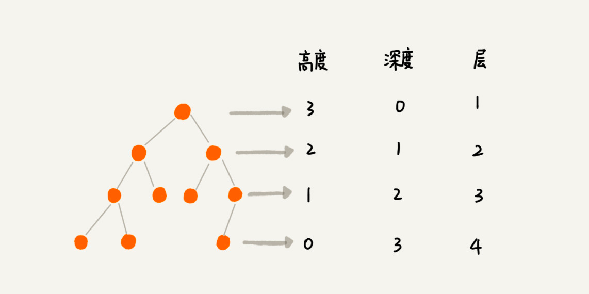
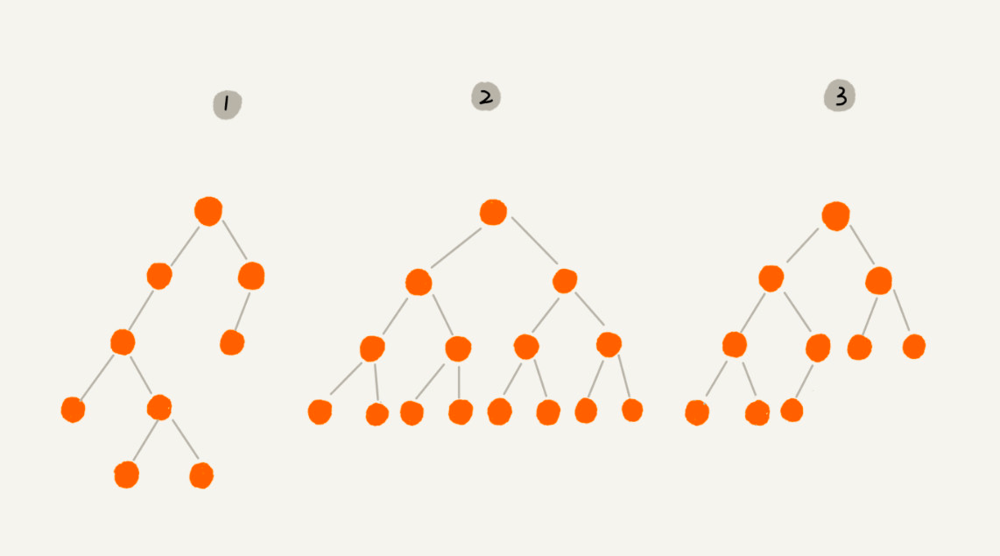
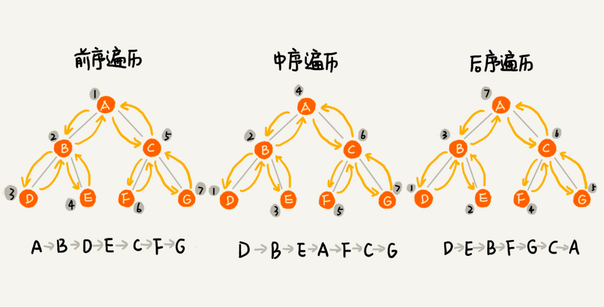
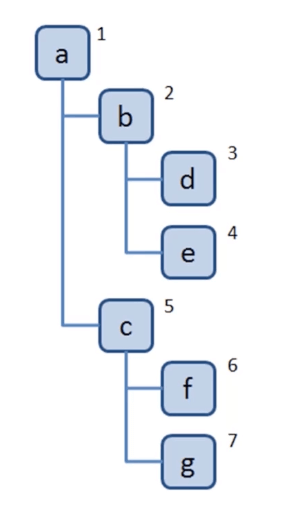
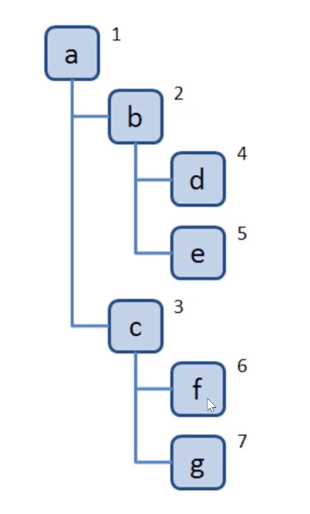

# 树

## 1 概念

### 1.1 节点



A 节点就是 B 节点的`父节点`，B 节点是 A 节点的`子节点`。B、C、D 这三个节点的父节点是同一个节点，所以它们之间互称为`兄弟节点`。没有父节点的节点叫作`根节点`，也就是图中的节点 E。我们把没有子节点的节点叫作`叶子节点`或者`叶节点`

### 1.2 高度、深度、层

- 节点的高度：节点到叶子节点的`最长路径（边数）`
- 节点的深度：跟节点到这个节点所经历的`边的个数`
- 节点的层数：节点的深度 + 1
- 树的高度：根节点的高度



### 1.3 二叉树

二叉树，每个节点最多有两个“叉”，也就是两个子节点，分别是左子节点和右子节点



- 满二叉树：编号 2 的二叉树中，叶子节点全都在最底层，除了叶子节点之外，每个节点都有左右两个子节点，这种二叉树就叫作满二叉树
- 完全二叉树：编号 3 的二叉树中，叶子节点都在最底下两层，最后一层的叶子节点都靠左排列，并且除了最后一层，其他层的节点个数都要达到最大，这种二叉树叫作完全二叉树

> 完全二叉树方便用数组顺序存储。（概念比较复杂，具体参考原文档）

### 1.4 二叉树的遍历

- 前序遍历是指，对于树中的任意节点来说，先打印这个节点，然后再打印它的左子树，最后打印它的右子树
- 中序遍历是指，对于树中的任意节点来说，先打印它的左子树，然后再打印它本身，最后打印它的右子树
- 后序遍历是指，对于树中的任意节点来说，先打印它的左子树，然后再打印它的右子树，最后打印这个节点本身



## 2 JavaScript 中的树

### 2.1 概念

前端常见的树结构有：DOM 树、级联选择、树形控件

js 中没有树，但是可以用 Object 和 Array 构建树

```js
let tree = {
  value: '中国',
  children: [
    {
      value: '江西',
      children: [
        {
          value: '赣州'
        },
        {
          value: '南昌'
        }
      ]
    },
    {
      value: '广东',
      children: [
        {
          value: '深圳',
          children: [
            {
              value: '宝安区'
            }
          ]
        }
      ]
    }
  ]
};
```

### 2.2 深度优先遍历

深度优先遍历：尽可能深的搜索树的分支



```js
const dfs = root => {
  console.log(root); // 访问根节点

  // 遍历子节点
  root.children.forEach(child => {
    dfs(child);
  });
};
```

### 2.3 广度优先遍历

广度优先遍历：先访问离跟节点最近的节点



算法实现步骤：

1. 新建一个队列，把根节点入队
2. 把队头出队并访问
3. 把队头 children 挨个入队
4. 重复第二、三步，直到队列为空

```js
const bfs = root => {
  const queue = [root];

  while (queue.length > 0) {
    const node = queue.shift();

    console.log(node.val);
    node.children.forEach(child => {
      q.push(child);
    });
  }
};
```

### 2.4 二叉树的先中后序遍历

js 中通常使用 Object 来模拟二叉树：

```js
const biaryTree = {
  val: 1,
  left: {
    val: 2,
    left: null,
    right: null
  },
  right: {
    val: 3,
    left: null,
    right: null
  }
};
```

**先序遍历：**

```js
const preorder = root => {
  if (!root) return;

  console.log(root.val);
  preorder(root.left);
  preorder(root.right);
};
```

**中序遍历：**

```js
const inorder = root => {
  if (!root) return;

  inorder(root.left);
  console.log(root.val);
  inorder(root.right);
};
```

**后序遍历：**

```js
const postorder = root => {
  if (!root) return;

  postorder(root.left);
  postorder(root.right);
  console.log(root.val);
};
```

### 2.5 先中后序遍历非递归版

非递归遍历的核心就是使用栈来模拟递归调用

**先序遍历：**

```js
const preorder = root => {
  const stack = [root];

  while (stack.length) {
    let node = stack.pop();

    console.log(node.val);
    if (node.right) stack.push(node.right);
    if (node.left) stack.push(node.left);
  }
};
```

**中序遍历：**

```js
const inorder = root => {
  const stack = [];
  let p = root;

  while (stack.length || p) {
    while (p) {
      stack.push(p);
      p = p.left;
    }

    const node = stack.pop();
    console.log(node.val);
    p = node.right;
  }
};
```

**后序遍历：**

```js
const postorder = root => {
  const stack = [root];
  const outputStack = [];

  while (stack.length) {
    const node = stack.pop();

    outputStack.push(node);
    if (node.left) stack.push(node.left);
    if (node.right) stack.push(node.right);
  }

  while (outputStack.length) {
    const node = outputStack.pop();
    console.log(node.val);
  }
};
```

## 3 实例

### 3.1 leetcode 104 二叉树的最大深度

### 3.2 leetcode 111 二叉树的最小深度

### 3.3 leetcode 102 二叉树的层序遍历

### 3.4 leetcode 94 二叉树的中序遍历

### 3.5 leetcode 112 路径总和
