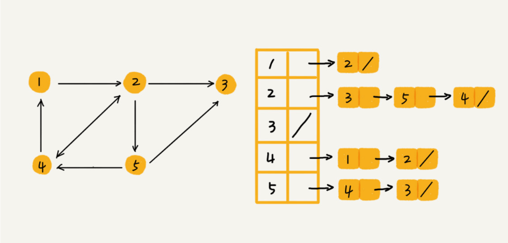

# 图

## 1 概念

涉及图的算法有很多，也非常复杂，比如图的搜索、最短路径、最小生成树、二分图等

- 顶点：树中的元素我们称为节点，图中的元素我们就叫作顶点（vertex）
- 边：图中的一个顶点可以与任意其他顶点建立连接关系。我们把这种建立的关系叫作边（edge）
- 有向图：边有方向的图叫作 `有向图`
- 无向图：边没有方向的图就叫作 `无向图`
- 入度：表示有多少条边指向这个顶点。在有向图中才有入度出度
- 出度：表示有多少条边是以这个顶点为起点指向其他顶点。对应到微博的例子，入度就表示有多少粉丝，出度就表示关注了多少人
- 带权图：在带权图中，每条边都有一个权重（weight），我们可以通过这个权重来表示 QQ 好友间的亲密度

## 2 图的存储

### 2.1 邻接矩阵

图最直观的一种存储方法就是，邻接矩阵（Adjacency Matrix）

邻接矩阵的底层依赖一个二维数组。对于无向图来说，如果顶点 `i` 与顶点 `j` 之间有边，我们就将 `A[i][j]` 和 `A[j][i]` 标记为 `1`；对于有向图来说，如果顶点 `i` 到顶点 `j` 之间，有一条箭头从顶点 `i` 指向顶点 `j` 的边，那我们就将 `A[i][j]` 标记为 `1`。同理，如果有一条箭头从顶点 `j` 指向顶点 `i` 的边，我们就将 `A[j][i]` 标记为 `1`。对于带权图，数组中就存储相应的权重


优缺点：

- 简单、直观
- 方便计算，可以将很多图的运算转换成矩阵之间的运算。比如求解最短路径问题时会提到一个 `Floyd-Warshall` 算法
- 比较浪费存储空间

### 2.3 邻接表

邻接表每个顶点对应一条链表，链表中存储的是与这个顶点相连接的其他顶点



邻接矩阵存储起来比较浪费空间，但是使用起来比较节省时间。相反，邻接表存储起来比较节省空间，但是使用起来就比较耗时间

## 3 图的遍历

- 深度优先遍历（Depth-First-Search）：尽可能深的搜索图的分支
- 广度优先遍历（Breadth-First-Search）：先访问离根节点最近的节点

### 3.1 深度优先遍历

算法实现步骤：

1. 访问一个起始顶点
2. 对顶点的 `没访问过的相邻顶点` 挨个进行深度优先遍历

下面对这个图进行遍历：


```js
const graph = {
  0: [1, 2],
  1: [2],
  2: [0, 3],
  3: [3]
};

function dfs(graph, vertex) {
  const visited = new Set(); // 记录访问过的顶点

  function visit(v) {
    console.log(v); // 访问当前顶点
    visited.add(v);

    // 遍历相邻顶点
    graph[v].forEach(n => {
      // 判断相邻的顶点是否被访问过
      if (!visited.has(n)) {
        visit(n);
      }
    });
  }

  visit(vertex);
}

dfs(graph, 2);
```

### 3.2 广度优先遍历

算法实现步骤：

1. 新建一个队列，把起始顶点入队
2. 把队头出队并访问
3. 把队头的 `没访问过的相邻顶点` 入队
4. 重复第二、三步，直到队列为空

```js
const graph = {
  0: [1, 2],
  1: [2],
  2: [0, 3],
  3: [3]
};

function bfs(graph, vertex) {
  const visited = new Set(); // 记录访问过的顶点
  let queue = [vertex]; // 待访问的顶点的队列

  while (queue.length) {
    const v = queue.shift(); // 把队头出队并访问
    console.log(v);
    visited.add(v);

    // 遍历相邻顶点
    graph[v].forEach(n => {
      // 判断相邻的顶点是否被访问过
      if (!visited.has(n)) {
        queue.push(n); // 把没访问过的相邻顶点入队
      }
    });
  }
}

bfs(graph, 2);
```

## 4 实例

### 4.1 LeetCode 65 有效数字

### 4.2 LeetCode 417 太平洋大西洋水流问题

### 4.3 LeetCode 133 克隆图
