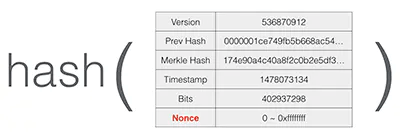
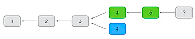

# 共识算法

## 1 BTC 挖矿原理

### 1.1 概念

在比特币的 P2P 网络中，有一类节点，它们时刻不停地进行计算，试图把新的交易打包成新的区块并附加到区块链上，这类节点就是矿工。因为每打包一个新的区块，打包该区块的矿工就可以获得一笔比特币作为奖励。所以，打包新区块就被称为挖矿

比特币的挖矿原理就是一种工作量证明机制。工作量证明 POW 是英文 Proof of Work 的缩写

当成功地打包了一个区块后，除了用户的交易，会在第一笔交易记录里写上一笔 “挖矿” 奖励的交易，从而给自己的地址添加 50 个比特币

### 1.2 计算区块哈希

通过改变区块头部的一个 `nonce` 字段的值，计算机可以计算出不同的区块哈希值：



比特币挖矿的工作量证明原理就是，不断尝试计算区块的哈希，直到计算出一个特定的哈希值，它比难度值要小

大约计算 16 次，我们可以在得到的哈希中找到首位是 0 的哈希值，因为首位是 0 出现的概率是 1/16：

```
hash256("Hello1") = ffb7a43d629d363026b3309586233ab7ffc1054c4f56f43a92f0054870e7ddc9
hash256("Hello2") = e085bf19353eb3bd1021661a17cee97181b0b369d8e16c10ffb7b01287a77173
hash256("Hello3") = c5061965d37b8ed989529bf42eaf8a90c28fa00c3853c7eec586aa8b3922d404
hash256("Hello4") = 42c3104987afc18677179a4a1a984dbfc77e183b414bc6efb00c43b41b213537
hash256("Hello5") = 652dcd7b75d499bcdc61d0c4eda96012e3830557de01426da5b01e214b95cd7a
hash256("Hello6") = 4cc0fbe28abb820085f390d66880ece06297d74d13a6ddbbab3b664582a7a582
hash256("Hello7") = c3eef05b531b56e79ca38e5f46e6c04f21b0078212a1d8c3500aa38366d9786d
hash256("Hello8") = cf17d3f38036206cfce464cdcb44d9ccea3f005b7059cff1322c0dd8bf398830
hash256("Hello9") = 1f22981824c821d4e83246e71f207d0e49ad57755889874d43def42af693a077
hash256("Hello10") = 8a1e475d67cfbcea4bcf72d1eee65f15680515f65294c68b203725a9113fa6bf
hash256("Hello11") = 769987b3833f082e31476db0f645f60635fa774d2b92bf0bab00e0a539a2dede
hash256("Hello12") = c2acd1bb160b1d1e66d769a403e596b174ffab9a39aa7c44d1e670feaa67ab2d
hash256("Hello13") = dab8b9746f1c0bcf5750e0d878fc17940db446638a477070cf8dca8c3643618a
hash256("Hello14") = 51a575773fccbb5278929c08e788c1ce87e5f44ab356b8760776fd816357f6ff
hash256("Hello15") = 0442e1c38b810f5d3c022fc2820b1d7999149460b83dc680abdebc9c7bd65cae
```

如果我们要找出前两位是 0 的哈希值，理论上需要计算 256 次，因为 00 出现的概率是 `16^2 = 256`
如果我们要找出前 3 位是 0 的哈希值，理论上需要计算 `16^3 = 4096 次`，实际计算 6591 次
如果我们要找出前 4 位是 0 的哈希值，理论上需要计算 164=6 万 5 千多次，实际计算 6 万 7 千多次：
如果我们要找出前 5 位是 0 的哈希值，理论上需要计算 165=104 万次，实际计算 158 万次：
如果我们要找出前 6 位是 0 的哈希值，理论上需要计算 166=1677 万次，实际计算 1558 万次：

> 对于给定难度的 `SHA-256`：假设我们用难度 1 表示必须算出首位 1 个 0，难度 2 表示必须算出首位两个 0，难度 N 表示必须算出首位 N 个 0，那么，每增加一个难度，计算量将增加 16 倍

对于比特币挖矿来说，就是先给定一个难度值，然后不断变换 nonce，计算 Block Hash，直到找到一个比给定难度值低的 Block Hash，就算成功挖矿

比特币网络的难度值是不断变化的，它的难度值保证大约每 10 分钟产生一个区块，而难度值在每 2015 个区块调整一次：如果区块平均生成时间小于 10 分钟，说明全网算力增加，难度值也会增加，如果区块平均生成时间大于 10 分钟，说明全网算力减少，难度值也会减少。因此，难度值随着全网算力的增减会动态调整

### 1.3 共识算法

如果两个矿工在同一时间各自找到了有效区块，注意，这两个区块是不同的，因为 `coinbase` 交易不同，所以 `Merkle Hash` 不同，区块哈希也不同。但它们只要符合难度值，就都是有效的。这个时候，网络上的其他矿工应该接收哪个区块并添加到区块链的末尾呢？答案是，都有可能。

通常，矿工接收先收到的有效区块，由于 P2P 网络广播的顺序是不确定的，不同的矿工先收到的区块是有可能的不同的。这个时候，我们说区块发生了分叉



- **分叉：**在分叉的情况下，有的矿工在绿色的分叉上继续挖矿，有的矿工在蓝色的分叉上继续挖矿
- **最长链共识：**但是最终，总有一个分叉首先挖到后续区块，这个时候，由于比特币网络采用最长分叉的共识算法，绿色分叉胜出，蓝色分叉被废弃，整个网络上的所有矿工又会继续在最长的链上继续挖矿

由于区块链虽然最终会保持数据一致，但是，一个交易可能被打包到一个后续被孤立的区块中。所以，要确认一个交易被永久记录到区块链中，需要对交易进行确认。如果后续的区块被追加到区块链上，实际上就会对原有的交易进行确认，因为链越长，修改的难度越大。一般来说，经过 6 个区块确认的交易几乎是不可能被修改的

## 2 隔离见证

隔离见证（通常简写为 SegWit）

Segwit 地址

todo...
