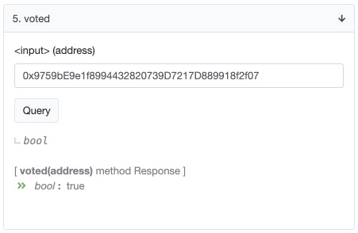
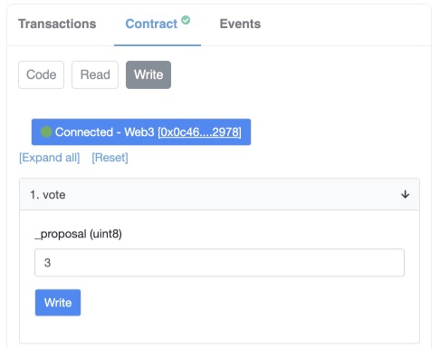
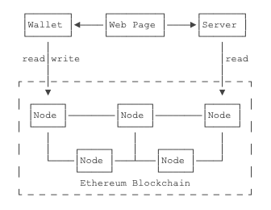

# DApp

## 1 什么是 DApp

### 1.1 前言

我们在学习区块链时，一般是从比特币入手。比如学习区块链的概念、区块格式、共识机制、挖矿等。这些基础知识的学习通常比较顺利

学习完基础知识后，后面的概念就慢慢多了起来。比如 token、DeFi (去中心化金融)、去中心化游戏、NFT (非同质化货币)

这个概念都和 DApp 和智能合约有关。如果不了解 DApp，那么就很难理解上面这些东西。对于他们内部的实现会觉得像魔法一样

**学习区块链的相关疑问：**

1. 以太坊口号是 “世界计算机”，是什么意思？
1. 比特币是一个创新的支付网络，一种新的货币；以太坊是一个为去中心化应用程序而生的全球开源平台。从数字货币到去中心化应用的转变，是如何实现的？
1. 以太坊和比特币有什么区别？

> 文章的目的就是通过一个实例，来了解 DApp 的开发流程，了解它是怎么运作的

### 1.2 什么是 DApp

Decentralized Application 去中心化应用（dapp）


（来自以太网官网）

> 上面的概念来自以太坊官网。解释一下就是：dapp 相当于是前端，智能合约相当于是后端 + 数据库，dapp 提供了界面方便操作智能合约

**dapp 架构：**


### 1.3 什么是智能合约


（来自以太网官网）

对于以太坊来说，智能合约其实就是一段可执行的程序片段

我们把合约代码在本地编译成功后发布到区块链上，可以理解为一个特殊的交易（包括可执行代码），然后会被矿工打包记录在某一个区块中。当需要调用这个智能合约的方法时，需要向这个智能合约的地址发送一笔交易

## 2 写一个智能合约

### 2.1 投票合约

```js
// 最好遵循一个文件一个合约，且文件名保持与合约一致。这里的合约名是 Vote

// 第一行通常是版权声明的注释
// SPDX-License-Identifier: GPL-3.0

// 声明编译器版本
// pragma solidity = 0.8.7;

// 也可以指定版本范围
pragma solidity >=0.8.0 <0.9.0;

// 由关键字 contract 声明一个合约
contract Vote {
    // 一个合约就相当于一个类，合约内部可以有成员变量

    // 合约可以定义事件（Event），我们在 Vote 合约中定义了一个 onVote 事件
    // 只定义事件还不够，触发事件必须在合约的写函数中通过 emit 关键字实现
    event onVote(address indexed voter, uint256 target);

    mapping(address => bool) public voted; // 记录已投票的地址，mapping 是一个键值对
    uint256 endTime; // 记录投票终止时间
    address payable public owner; // 记录管理员地址

    // 结构体
    struct Person {
        string name;
        uint256 votes;
        address payable ads;
    }

    // 记录得票数量
    Person[] public list;

    // 所有的成员变量都默认初始化为 0 或 false（针对 bool）或空（针对 mapping）
    // 如果某个成员变量要指定初始值，那么需要在构造函数中赋值
    constructor(uint256 _endTime) {
        endTime = _endTime;
        owner = payable(msg.sender);

        list.push(Person({ name: "DengShen", votes: 0, ads: payable(0xD96DE875d586743CE457E8Ef72145Ae75715F7E1)}));
        list.push(Person({ name: "LiJilang", votes: 0, ads: payable(0x303fC2FC594Cf19014Da9831646581CDFc7ECa2E)}));
        list.push(Person({ name: "QiuYuhang", votes: 0, ads: payable(0xbe188Cb3730d91Bbf2272e0B827aCF6fFdB4D074)}));
        list.push(Person({ name: "RaoWenbing", votes: 0, ads: payable(0xe8d3Ceab4e5E0D33361DA6c7355835417a9B3bbe)}));
        list.push(Person({ name: "WangXin", votes: 0, ads: payable(0x25309087503C0C7a4f2e9b1A04875747d61340EC)}));
        list.push(Person({ name: "XuWang", votes: 0, ads: payable(0x535186c86B22B423D150530EbD57E48D4297a9Cc)}));
        list.push(Person({ name: "YangLidong", votes: 0, ads: payable(0x6143CcC61F582b38626AaDAe93D1F119c66b2a70)}));
        list.push(Person({ name: "ZhongDakang", votes: 0, ads: payable(0x8Fb155803f695DBE7B53b94BC1bb6db5D338d60b)}));
        list.push(Person({ name: "ZhouHuiyu", votes: 0, ads: payable(0x5b9edA1F23501D891B299919dee69Ce00004cF12)}));
    }

    // 以太坊合约支持读、写两种类型的成员函数
    // 没有 view 修饰的函数是写入函数，它会修改成员变量，即改变了合约的状态
    function vote(uint256 target) public payable {
        require(block.timestamp < endTime, "-1"); // 判断投票是否截止
        require(msg.value >= 100000000000000000, "-2"); // 投票需要 0.1 eth

        // 给mapping增加一个key-value
        voted[msg.sender] = true;
        list[target].votes++;

        // 当调用 vote() 写方法时，会触发 Voted 事件
        emit onVote(msg.sender, target);
    }

    // 设置结束时间
    function setEndTime(uint256 time) public {
        require(msg.sender == owner, "-3"); // 只有管理员才能调用
        endTime = time;
    }

    // 结束投票
    function endVote() public {
        require(msg.sender == owner, "-3"); // 只有管理员才能调用

        uint256 max = 0;
        uint256 winnerIndex = 0;

        for (uint256 i = 0; i < list.length; i++) {
            if (list[i].votes > max) {
                max = list[i].votes;
                winnerIndex = i;
            }
        }

        list[winnerIndex].ads.transfer(address(this).balance);
    }

    // 以 view 修饰的函数是只读函数，它不会修改成员变量，即不会改变合约的状态
    function getBalance() public view returns (uint256) {
        return address(this).balance;
    }

    receive() external payable {}

    // 接收转账
    fallback() external payable {}
}
```

### 2.2 开发和调试

**Solidity 语言：**

和普通程序不同的是，智能合约要保证在区块链网络的每一个节点中运行的结果完全相同，这样才能使任何一个节点都可以验证智能合约执行的结果对不对。因此，以太坊提供了一个 EVM（Ethereum Virtual Machine）虚拟机来执行智能合约的字节码

> 和普通程序相比，为了消除程序运行的不确定性，智能合约有很多限制，例如，不支持浮点运算（因为浮点数有不同的表示方法，不同架构的 CPU 运行的浮点计算精度都不同），不支持随机数，不支持从外部读取输入等等

类似于 Java 源码被编译为 JVM 可执行的字节码，我们也需要一种高级语言来编写智能合约，然后编译成 EVM 的字节码。最常用的开发智能合约的语言是以太坊专门为其定制的 Solidity 语言

[中文文档 https://learnblockchain.cn/docs/solidity/index.html](https://learnblockchain.cn/docs/solidity/index.html)

**编辑器：**

- [Remix 在线编辑器](http://remix.ethereum.org/)
- VSCode solidity 插件

**编译和调试工具：**

Truffle 是一个在以太坊进行 DApp 开发的开发环境、测试框架

[Truffle 中文文档](https://learnblockchain.cn/docs/truffle/index.html)

```bash
# 安装
npm install -g truffle

# 创建项目
truffle init

# 编译合约
truffle compile

# 部署合约
truffle migrate

# 合约交互
truffle console

# 合约交互
truffle(development)> let instance = await Vote.deployed()
truffle(development)> instance.vote(1, {value: 200000000000000000});
```

**本地私有链：**

[Ganache](https://www.trufflesuite.com/ganache)

Ganache 是一个桌面应用，会创建一个个人模拟的区块链


### 2.3 账户

**以太坊账户分为外部账户和合约账户两类：**

- **外部账户：**即普通用户用私钥控制的账户
- **合约账户：**一种拥有合约代码的账户，它不属于任何人，也没有私钥与之对应

### 2.4 合约执行

一个智能合约被编译后就是一段 EVM 字节码，将它部署在以太坊的区块链时，会根据部署者的地址和该地址的 `nonce` 分配一个合约地址，合约地址和账户地址的格式是没有区别的，但合约地址没有私钥，也就没有人能直接操作该地址的合约数据。**要调用合约，唯一的方法是调用合约的公共函数**

> 这也是合约的一个限制：合约不能主动执行，它只能被外部账户发起调用。如果一个合约要定期执行，那只能由线下服务器定期发起合约调用

此外，合约作为地址，可以接收 `Ether`，也可以发送 `Ether`。合约内部也可以存储数据。合约的数据存储在合约地址关联的存储上，这就使得合约具有了状态，可以实现比较复杂的逻辑，包括存款、取款等

> 任何外部账户都可以发起对合约的函数调用。如果调用只读方法，因为不改变合约状态，所以任何时刻都可以调用，且不需要签名，也不需要消耗 Gas。但如果调用写入方法，就需要签名提交一个交易，并消耗一定的 Gas

### 2.5 部署合约

实际上，部署合约也是一个交易，需要一个外部账户，花费一定的 Gas，就可以把合约部署到链上

因此，我们首先需要一个便于开发和测试的钱包，才能创建一个外部账户，并且账户上要有一定的 `Ether`

**MetaMask：**

`MetaMask` 钱包，这是一个基于浏览器插件的钱包，支持 Chrome、FireFox 等浏览器。使用的时候，通过 `Dapp` 网站的 `JavaScript` 可以发起交易，用户通过 `MetaMask` 确认后即可将交易发送至链上

安装完成后，第一次启动 `MetaMask` 需要创建或导入一个钱包，设置一个解锁口令，`MetaMask` 允许创建多个账号，可随时切换账号，还可切换不同的链，例如，以太坊主网、Ropsten 测试网、Rinkeby 测试网等

在开发阶段，可以使用 Ropsten 测试网，并从 [faucet.ropsten.be](https://faucet.ropsten.be) 或 [faucet.dimensions.network](https://faucet.dimensions.network/) 获取一些测试网的 Ether

## 3 交易

### 3.1 手续费 Gas

在比特币中，交易就是消耗已有 `UTXO`，并通过执行脚本产生新的 `UTXO`，其中隐含的新旧差额即为矿工手续费。

在以太坊中，交易也需要手续费，手续费被称为 `Gas`，它的计算比比特币要复杂得多

以太坊除了最基本的转账（即从一个账户支付 Ether 到另一个账户），还**支持执行合约代码**

> 如果某个合约编写了一个无限循环，那么所有节点执行该合约代码，那不是永远无法结束？

**合约执行需要消耗 Gas：**

为了保证合约代码的可靠执行，以太坊给每一个虚拟机指令都标记了一个 `Gas` 基本费用，称为 `gasUsed`

例如，加减计算的费用是 3，计算 `SHA3` 的费用是 30，输出日志的费用是 375，写入存储的费用高达 20000。总的来说，消耗 CPU 比消耗存储便宜，简单计算比复杂计算便宜，读取比写入便宜

除了 `gasUsed` 外，用户还需要提供一个 `gasPrice`，以 `Gwei（1Gwei = 10^9 Wei）`为单位。通过竞价得到一个矿工愿意接受的 `gasPrice`。如果一个交易消耗了 120000 的 `gasUsed`，而 `gasPrice` 是 50 Gwei，则交易费用是：

```
120000 x 50 Gwei = 6000000 Gwei = 0.006 Ether
```

**预支 Gas：**

在执行代码的时候，存在条件判断、循环等语句，同一段代码，执行的结果也可能不同，因此，事前预计一个合约执行要花费多少 Gas，不现实

所以以太坊规定，一笔交易，先给出 `gasPrice` 和 `gasLimit`，如果执行完成后有剩余，剩余的退还，如果执行过程中消耗殆尽，那么交易执行失败，但已执行的 Gas 不会退

假定某个账户想执行一笔交易，他给出 gasPrice 为 50 Gwei，预估 `gasUsed` 约 120000，设定 `gasLimit` 为 150000，则预支付的 Ether 为：

```
150000 x 50 Gwei = 7500000 Gwei = 0.0075 Ether
```

如果账户的 `Ether` 余额不足 0.0075，则该交易根本无法发送。如果账户余额等于或超过 0.0075，例如余额为 0.008，则矿工可以将该交易打包。假设实际执行消耗的 `gasUsed` 为 120000，则交易费用 0.006，账户剩余 0.002

> 很少有交易能准确预估 `gasUsed`，只有标准转账交易是 21000，因此，标准的转账交易 `gasLimit` 可以设置为 21000（即恰好消耗完毕无剩余）

> Gas Price 是全网用户竞价产生的，它时刻在波动。如果交易少，Gas Price 将下降，如果交易多，网络拥堵，则 Gas Price 将上升。以太坊的 Gas 价格可以在 [Etherscan](https://etherscan.io/gastracker) 跟踪

### 3.2 交易回执

以太坊区块为每一笔交易都会产生一笔回执（Recipt），表示交易的最终状态

**一个回执信息主要包括：**

- **status：**执行结果，1 表示成功，0 表示失败
- **gasUsed：**已消耗的 Gas 数量
- **txHash：**交易 Hash
- **logs：**交易产生的日志
- ……

### 3.3 转账交易

转账交易是指两个外部账号转移 `Ether`

我们以测试网的交易 [0xf04d...b7ba](https://ropsten.etherscan.io/tx/0xf04dfc4f3fe7d7623abbc3ae1e4a6e4f20d14b9db134d573f224dc2994feb7ba) 为例：

- **Transaction Hash:** `0xf04d...b7ba`，这是交易 Hash，即交易的唯一标识
- **Status:** `Success`，表示交易成功
- **From:** `0x0c46...2978`，交易的发送方
- **To:** `0x77e4...e34c`，交易的接收方
- **Value:** 0.02759796846726396 Ether，交易发送的 Ether
- **Gas Price:** 1.500000788 Gwei，Gas 的价格
- **Gas Limit:** 21,000，转账交易恰好消耗 21000 Gas，因此总是 21000
- **Gas Used by Transaction:** 21,000 (100%)，消耗的 Gas 占比，这里恰好全部消耗完
- **Nonce:** 1，发送方的 nonce，1 表示第 2 笔交易
- **Input Data:** `0x`，因为是转账交易，没有输入数据，因此为空

### 3.4 合约交易

合约交易就是指一个外部账号调用某个合约的某个 `public` 函数

我们以测试网的交易 [0x2235...132e](https://ropsten.etherscan.io/tx/0x2f5337a737e6fae0b4f7024bba7b054bb61a5b939bbfc9652731fac942ea0bb7) 为例：

- **From:** `0x0c46...2978`，交易的发起方，该地址一定是外部账户
- **To:** `0x5b2a...5a46`，交易的接收方，这里地址是一个合约地址
- **Value:** 0 Ether，这里发送的 Ether 是 0，即没有向合约发送 Ether
- **Gas Limit:** 105,406，这是交易发起前设定的最大 Gas
- **Gas Used by Transaction:** 70,271 (66.67%)，这是交易实际消耗的 Gas
- **Input Data:** `0xb3f98adc...`，这是交易的输入数据，其中包含了调用哪个函数，以及传递的参数

可见，转账交易的 Gas 费用是固定的，而合约交易只能预估，具体费用以实际执行后消耗的为准

## 4 调用合约

当我们已经成功地将一个合约部署到以太坊链上时，如何调用该合约？

首先，我们通过 `Etherscan` 这个网站可以查看已部署合约的详细信息，例如 [0xe1a235872C272b0FDD0650Ab0EAE147bb4c15831](https://ropsten.etherscan.io/address/0xe1a235872C272b0FDD0650Ab0EAE147bb4c15831)

在调用合约前，我们可以通过 “Verify and Publish” 这个链接将源码上传到 `Etherscan` 并验证。首先选择正确的 `Solidity` 编译器版本，贴入源码，`Etherscan` 自动编译后，如果二进制的字节码完全匹配已部署的合约，则验证通过，该合约有一个绿色小勾的标志：


### 4.1 读取合约

访问合约的只读函数时，无需消耗 Gas，也无需连接钱包，直接切换到 “Read” 面板，即可看到只读函数的返回值：


对于需要填入参数的只读函数，可以直接在对应的输入框填入参数，然后点击 “Query” 调用并获取结果：



### 4.2 写入合约

当我们要写入合约时，就**必须提交一个签名的交易**，并消耗一定的 Gas。我们在 `Etherscan` 的合约页选择“Write”，会出现一个 “Connect to Web3” 的链接：


点击并连接 `MetaMask` 后，我们就可以选择一个写入函数，填入参数，然后点击 “Write”：



在 `MetaMask` 中确认该交易后，交易被发送至链上。等待打包成功后，我们就可以读取到合约内部更新后的状态

## 5 编写 Dapp

### 5.1 前言

通过上面的例子，我们已经清楚如何编写一个智能合约，并且知道它是怎么运作的

那么作为一个普通用户，要进行投票的话，要去手动的调合约的方法门槛就太高了

我们需要一个更方便操作的界面来操作合约

### 5.2 编写 Dapp


### 5.3 ethers.js

我们需要引入 `ethers.js` 这个库，[中文文档](https://learnblockchain.cn/docs/ethers.js/index.html)

这个库可以实现一个以太坊钱包，跟智能合约交互

关键代码：

```js
import { ethers } from 'ethers';
import json from './Vote.json';
import config from '../config';

class Eth {
  init(privateKey) {
    let wallet = this.initWallet(privateKey);
    let provider = this.initProvider();

    this.wallet = wallet.connect(provider);
    this.provider = provider;
    this.contract = this.initContract(this.wallet, this.provider);
  }

  // 通过私钥创建钱包
  initWallet(privateKey) {
    let wallet = new ethers.Wallet(privateKey);
    return wallet;
  }

  // 链接网络
  initProvider() {
    let provider;

    if (config.env === 'test') {
      provider = ethers.getDefaultProvider(config.testProvider);
    } else if (config.env === 'dev') {
      provider = new ethers.providers.JsonRpcProvider(config.devProvider);
    }

    return provider;
  }

  // 连接合约
  initContract(wallet, provider) {
    let contract = new ethers.Contract(config.contractAddress, json.abi, provider);
    let contractWithSigner = contract.connect(wallet);

    return contractWithSigner;
  }
}

export default Eth;
```

写入合约需要合约的 `ABI（Application Binary Interface）`信息，即合约函数调用的接口信息，这些信息在 `Remix` 部署时产生。我们需要回到 `Remix`，在 `contracts-artifacts` 目录下找到 `Vote.json` 文件，它是一个 `JSON`

**下面我们就可以调用合约的方法了：**

```js
async function vote(proposal) {
  try {
    let tx = await this.$eth.contract.vote(this.selected, { value: utils.parseEther('0.1') });

    // 等待 tx 落块，并至少 1 个区块确认
    await tx.wait(1);

    this.$message({
      message: '投票成功！',
      type: 'success'
    });
  } catch (err) {
    this.$message({
      message: '投票失败',
      type: 'error'
    });
  }
}
```

### 5.4 服务端

**一个 Dapp 需不需要服务端？**

对于大多数的 `Dapp` 来说，是需要服务器端的。

如果部署一个服务器端，由服务器连接 `P2P` 网络的节点并读取合约，然后以 `JSON API` 的形式给前端提供相关数据，则可以实现一个更完善的 `Dapp`。通过服务端可以做更多的数据存储或缓存，可以实现更加复杂的 DApp，并且有更好的体验

因此，完整的 `Dapp` 架构如下：



## 6 DApp 的优缺点

### 6.1 优点

1. **零关机** – 一旦将某 dapp 的核心合约部署到区块链上，整个网络都能为那些希望与之互动的客户提供服务。 因此，恶意行为者无法针对单个 dapp 发起 DoS 攻击
1. **隐私** – 您不需要提供真实世界的身份来部署或与 dapp 进行交互
1. **抵制审查** – 网络上没有任何一个实体可以阻止用户提交交易、部署 dapp 或读取区块链上的数据
1. **数据完整性** – 由于采用了加密基元，存储在区块链上的数据是不可更改和无可争议的。 恶意行为者无法伪造已经公开的交易或其他数据
1. **无需信任关系的计算/可验证的行为** – 智能合约可以被分析，并保证以可预测的方式执行，而无需信任中央权威机构。 这在传统模式下是不存在的，比如我们使用网上银行系统时，我们要相信金融机构不会滥用我们的金融数据，不会篡改记录，也不会被黑客攻击

### 6.2 缺点

1. **维护** – dapp 可能更难维护，因为发布到区块链的代码和数据更难修改。 一旦部署了 dapp（或 dapp 存储的底层数据），开发者就很难对其进行更新——即使在旧版本中发现了 bug 或安全风险
1. **性能开销** – 存在巨大的性能开销，而且扩展更多的性能真的很难。 为了达到以太坊所追求的安全、完整、透明和可靠的水平，每个节点都会运行和存储每一笔交易。 除此之外，工作量证明也需要时间。 粗略计算，开销会达到目前标准计算的 1,000,000 倍左右
1. **网络拥堵** – 至少在当前的模型中，如果一个 dapp 使用了太多的计算资源，整个网络都会承担影响。 目前，该网络每秒只能处理约 10 笔交易；如果交易发送的速度超过这个速度，未确认的交易池会迅速膨胀
1. **用户体验** – 设计用户友好的体验可能更难。普通终端用户可能会发现，以真正安全的方式设置与区块链互动所需的工具栈太难了
1. **中心化** – 建立在以太坊基础层之上的用户友好型和开发者友好型解决方案，最终可能会看起来像中心化服务一样：例如，这种服务可能会在服务器端存储密钥或其他敏感信息，使用中心化服务器为前端服务，或者在写入区块链之前，在中心化服务器上运行重要的业务逻辑。 这消除了区块链与传统模式相比的许多（并不是全部）优势

## 7 热门 DApp

### 7.1 Uniswap

可方便交换代币的应用


### 7.2 CryptoPunks

里面有 1 万个限量版的头像，而且是独一无二的


### 7.3 OpenSea

OpenSea 是一个去中心化的不可同质化代币（NFT）市场，用于购买、销售和交易 NFT


### 7.4 cryptokitties

谜恋猫，一个养猫游戏。

## 8 ERC20 规范

`ERC20` 约定了一个代币合约需要实现的接口

```js
contract ERC20 {
  function totalSupply() constant returns (uint totalSupply);   // 总发行量
  function balanceOf(address _owner) constant returns (uint balance); // 查询某个地址的Token数量 , 结合mapping实现

  // 代币分发 (注意, 这个只有合约的Creator 可以调用)
  function transfer(address _to, uint _value) returns (bool success);

  // 这里是拥有者和拥有者之间的代币转移
  function transferFrom(address _from, address _to, uint _value) returns (bool success);

  // 允许用户可花费的代币数
  function approve(address _spender, uint _value) returns (bool success);
  // 控制代币的交易，如可交易账号及资产, 控制Token的流通
  function allowance(address _owner, address _spender) constant returns (uint remaining);

  event Transfer(address indexed _from, address indexed _to, uint _value);
  event Approval(address indexed _owner, address indexed _spender, uint _value);

  // Token信息
  string public constant name = "MyCoin";
  string public constant symbol = "MYC";
  uint8 public constant decimals = 18;  // token的精度, 大部分都是18
}
```
