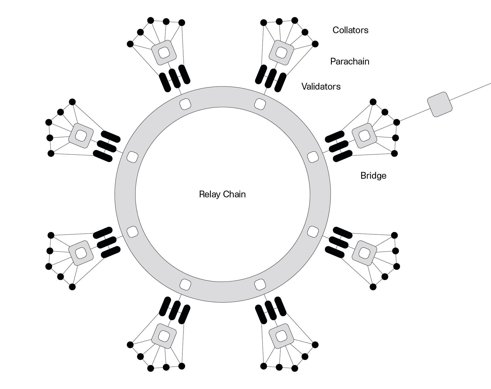

# 区块链发展现状

## 1 区块链的圈层

### 1.1 公链圈

投机者退出后，继续留在这个领域的人逐渐有了认知的分歧。虽然大家都认为区块链技术有更广阔的应用空间，但一部分人坚信比特币 / 以太坊是未来自由世界的流通货币，会成为数字黄金 / 白银，并很有可能挑战主权货币的垄断地位，因此他们继续在公链领域探索

在此期间，陆续涌现了诸多技术应用创新，虽然每一个概念的提出都不免引起新一轮炒作。但总的来说，对于技术的探索一直在向前，这个圈子可称之为**公链圈**，其研究对象是有币的公有开放区块链网络，比如比特币 / 以太坊，这就跟应用开发者在苹果生态系统中开发应用一样

### 1.2 联盟链圈

另一部分人意识到，只要比特币 / 以太币等数字货币存在一天，对其币价的市场操纵永远也不可能停歇，短时间内也看不到其与主权货币稳定汇率的可能性，国家政策也是呈现对有币区块链打压的趋势

与其这样，还不如跳出这个圈子，专注于区块链技术在企业领域的研究，而这个圈子我们称之为联盟链圈，其侧重点是研究如何根据企业自身业务定制联盟区块链，就好比现在各家手机厂商基于安卓开源系统做定制化的系统研发

## 2 公链圈

### 2.1 公链圈的创新

> 公链圈的发展离不开投资激励，一切的技术应用创新都围绕着如何繁荣交易市场

为什么这么说呢？通过总结归纳，我们可以将公链圈的创新大致可以分为两类，一类是应用层面的，主要包括**去中心化金融**和**去中心化存储**；另一类是技术创新层面的，最突出的就是**跨链**

### 2.2 去中心化金融

`DeFi` (Decentralised Finance)，去中心化金融。`DeFi` 就是运行在区块链网络上的金融服务

**金融：**

想要理解它，我们必须先搞明白什么是金融，以一个金融小白的视角来看，金融是通过重新分配资产来获得资产增值的一种渠道，它的本质在于信用、风险和杠杆。金融成立的前提就是控制不确定性风险，只是传统金融跟区块链控制风险的手段不同

去银行办理抵押贷款，流程会很繁琐。那么为什么贷款要这么多证明，经过层层审核才能贷到款呢？这个问题，我们可以从风险控制的角度来理解，传统金融服务对风险的控制主要是考察借贷人的历史信用记录以及抵押物的市场价值，如果借贷人信用不佳或抵押物价值低，可能就无法贷款。像银行这样的传统金融机构，不光要在贷款前严格把关，而且还要承担坏账的风险

**DeFi：**

`DeFi` 就不一样了，它可以通过智能合约来把控风险，其优势在于一切都是由程序代码自动控制。在不满足初始约定条件的情况下，合约会强制平仓，将抵押物没收。而且 `DeFi` 还有一个重要优势，那就是不存在坏账，几乎不需要风险控制，因此 `DeFi` 可实现超额抵押，也就是杠杆

其实，现在数字货币交易所中的合约本质上就是 `DeFi`，以少量现货作为保证金用来博取数字货币价格上涨下跌带来的额外收益，但在市场价格上下急剧波动的行情中，几乎无人是赢家，庄家除外

虽然 `DeFi` 是一个非常新颖的金融创新，但其未来的发展还是不太明朗的，尤其是在国内。`DeFi` 的主战场在以太坊，而以太坊是匿名的公有区块链网络，匿名意味着无法被金融部门监管/审查，传统金融行业在重重监管下都经常出现各种金融丑闻，更不用说不受监管的 `DeFi`。对投资人来说，风险是巨大的，此处的风险不同于上面提到的坏账风险，而是要警惕人为造成的投机风口及暗箱交易

### 2.3 去中心化存储

去中心化存储，是一种利用分布式存储技术，将文件分块存储在不同存储节点的应用型创新。相较于中心化存储，它拥有更高级别的隐私保护，存储成本也更低，且具备更冗余的数据备份副本，能有效避免单点故障

其实去中心化存储跟区块链的关联并没有那么密切，区块链在其中的主要作用是作为存储层之上的一种激励计费机制

拥有空闲硬盘设备的 “矿工” 将空间贡献出来，通过特殊设计的存储证明机制在区块链中记录贡献度，主要考察维度集中在贡献时长、空间大小以及有效空间利用率等等，贡献度可用于获得等额代币回报；而有存储需求的用户需要支付代币，用于获取更多的数据存储空间

**去中心化存储的问题：**

1. 对其币价的炒作几乎从未停止，真实有存储需求的用户几乎无法忍受因币价波动而导致的成本不确定性
1. 不同矿工贡献的空间是极度分散的，虽然在全世界各地都可以搭建，但受制于当地网络环境以及硬盘本身的机械素质，整个去中心化网络的存储性能不高，远不如中心化存储，因此只适合冷数据以及个人数据存储
1. 随着矿工的涌入，大部分项目的存储空间供应规模远远大于真正的需求，已经处于供大于求的局面，数据来源是当前急需解决的问题，怎样解决数据来源是当前重点，否则难有更大的发展

### 2.4 跨链

去中心化金融和去中心化存储都属于应用创新，相较而言，跨链则属于技术创新

不同的区块链网络是独立的，是一个个的数据孤岛，跨链技术就是在这些岛之间构建互通的桥梁，提供不同链之间数据互通的可能性

最初的跨链是两个链之间的直连，而现阶段的跨链更像是一个中枢，链与链之间的交互不再直接，而是通过中继链进行信息的中转，可以说，**跨链技术的发展是其他创新的基础**

下图是一张波卡跨链协议的跨链网络示意图，通过中继链把其他的公链嫁接在同一生态系统中：

## 3 联盟链圈

### 3.1 发展阶段

区块链技术在企业商业活动中，使传统业务在区块链技术的加持下降本增效，降低企业间合作门槛

当然区块链现在也有发展壁垒

**区块链技术在企业的发展的三个阶段：**

1. 数据存证
1. 数据交换
1. 价值转移

### 3.2 数据存证

区块链技术具有时间连续，不可篡改，可回溯等特性，因此非常适合需要留存证据的数据存储。现阶段，像`产品溯源`、`互联网法院`、`电子证照`等应用都属于这一阶段的产物，大多数应用在区块链上存储的也只是数据证明，而非原始数据

这种做法既与区块链本身的数据承载能力有关，也是业务本身的需求决定的。区块链中的数据从网络的维度来看，对存储及网络带宽的需求会随着数据量的增大呈指数级增长的趋势，因此需合理控制数据的取向。数据存证阶段的应用只是将数据存储在区块链上，只有在必要的时候才会利用其中的数据进行取证，绝大多数时候，数据是死的

区块链技术只是这些应用的一种特殊的技术保障，而不是非区块链技术不可。且大多数时候是各家玩各家的，并没有涉及到多方参与。在此阶段，区块链的可替代性较强

### 3.3 数据交换

传统的企业间合作都涉及到了商业数据的交换，一般情况下，数据交换的模式是数据提供方或需求方提供 API 接口的形式进行。而一旦涉及到数据的相互需求以及多于两家企业参与的情况，问题就变得更加棘手

而通过区块链技术可以很方便地解决这个问题，在各家企业内部部署区块链节点，各家只需与自家运维的节点交互，区块链机制自动地将数据同步至其他参与方，任一节点如有新数据上链，区块链的事件通知机制自动通知各企业内部的应用

在此阶段，企业合作强依赖区块链作为数据交换的枢纽，因此区块链的替代性较低。且现在已有企业应用达到了数据交换的阶段，比如联邦学习与区块链技术的结合

### 3.4 价值转移

以太坊存在的意义之一，就是提供了一个将现实价值与数字世界锚定的媒介，也让我们看到了信息网络向价值网络转移的可能性

在企业区块链领域，这种意义可被无限放大，企业对外提供的产品无非是商品 / 服务 / 解决方案等。而如果通过区块链技术将企业产品转换成价值网络中的流通资产，在基础价值之外，亦可延伸出多种资产应用的可能性

而在这个阶段，区块链技术是价值网络的基石，无可替代。当然，现阶段离价值网络还很远，我也无法准确地描述未来的样子。企业区块链发展的时间较短，总的来说还只处于刚刚起步的阶段

但国家对其未来的前景非常看好，积极出台各类政策从高维度引导区块链在国民社会经济等各个领域的发展。在“十四五”规划中，首次将区块链列入五年规划中，与人工智能、大数据、云计算、网络安全等共同被列入新基建行列。政策的出台激起了各行各业对区块链 + 的探索活动，各级政府也带头探索区块链技术在政务领域的内在价值

## 4 参考资料

- 去中心化金融：[Decentralized finance (DeFi)](https://ethereum.org/en/defi/)
- 去中心化存储：[What is Decentralized Storage? (IPFS, FileCoin, Sia, Storj & Swarm)](https://medium.com/bitfwd/what-is-decentralised-storage-ipfs-filecoin-sia-storj-swarm-5509e476995f)
