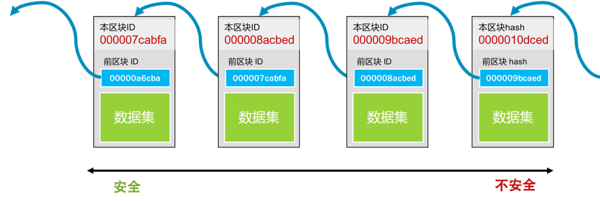
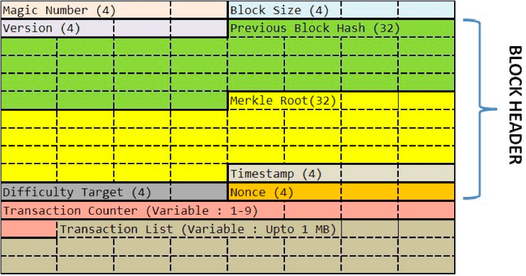
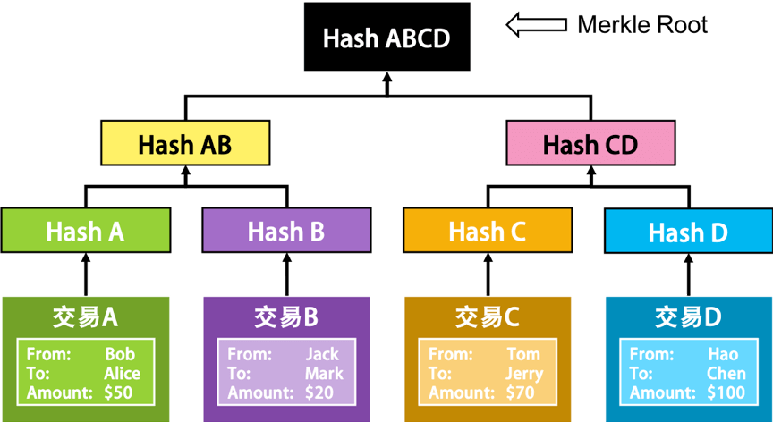
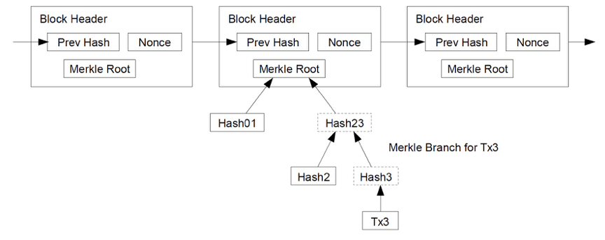
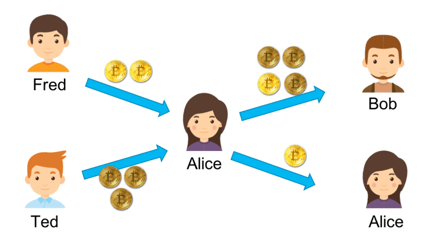
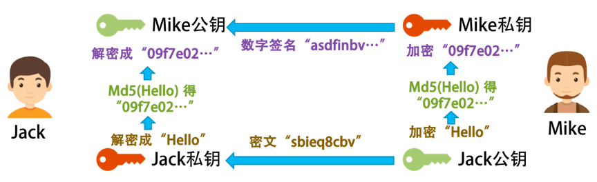
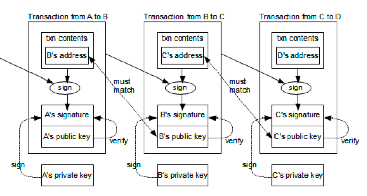

# 比特币

## 1 比特币概念

### 1.1 比特币的特性

1. **去中心化**。这意味着没有中心的服务器，不受某个人的控制，整个系统直接由用户端的电脑构成。这样的技术难度是非常大的，并不像手机 App 或是小网站一样，你想发布就发布，这需要有人来跟你一起玩
1. **数据防篡改**。所有交易记录全量保存，并公开给所有的人，而且还被加密和校验。并不是数据不能被篡改，而是数据被篡改的成本非常大
1. **固定的发行量**。不会像国家中央银行那样乱印钞票，造成通货膨胀

### 1.2 去中心化交易流程

1. 首先，需要交易的用户把交易传到网络中
1. 然后，网络上有些机器叫记账结点，它们通过比拼计算力的方式竞争记账权。这也叫“挖矿”
1. 获得记账权的结点，会把待记账的交易进行计算打包，并向全网广播。收到新的记账包的结点会对其进行验证，验证通过后加入自己的区块

> 注意，整个比特币的世界是没有服务器的，这种 P2P 的去中心化网络**任何人都能修改数据**。为了应对这个风险，数据要能 **很容易被验证是合法的没有被修改过的**，而且也要是 **很难被人修改的**

> 基于这个设计，比特币使用了两个比较大的技术：**区块链技术** 和 **工作量证明共识机制**

### 1.3 数据防篡改-区块链技术

**什么是区块链：**

区块链又叫 blockchain，其中有一个一个的区块，每个区块中包括着一组交易信息，然后，每一个区块都会有一个 ID（或是一个地址），这些区块通过记录前一个区块的 ID 来形成一条链



- **每个块的 ID 都是通过其内容生成的**，所以，只要是内容有一丁点儿的变化，这个 ID 都会完全不一样
- 而生成 ID 的内容中还包括上一个块的 ID。于是只要上一个块的内容变了，其 ID 也要跟着变（不然就不合法了），那么后面指向这个块的 ID 也要变。这样就会形成一个连锁效应——一个块被修改，后续的所有块都要跟着一起改。于是导致了修改成本的提升
- 这种一处改，处处改的方式，并不代表不能篡改，而只是让修改面比较大，让你的改动麻烦一点
- 越旧的区块的篡改会造成越大面积的修改，于是越旧的区块就不容易篡改，就越安全。反之，越新的区块就越不安全

### 1.4 数据放篡改-共识机制

真正让区块链做到非常难篡改的是工作量证明的共识机制

**解决数据一致性相关的问题：**

1. **以谁的数据为准。** 任何结点都可以修改自己所下载的账本，也就是任何一个人都可以伪造账本。那么，谁的数据才是对的？在去中心化的网络下，我们只能认为，大多数人认识的数据是对的
1. **“大多数人”的问题。** 在网络世界里，我可以用程序模拟出无穷多的“人”出来投票，所以，用人数来解决去中心化的问题，在分不清是人还是计算机
1. **意见分歧问题。** 如果在同一个时刻，有多个人都在告诉其他人，这账应该这么记。而且，他们的数据都合法，那么，整个网络应该听谁的？

> 为了解决这几个问题，比特币使用了 `Proof-of-Work` 工作量证明机制，也就是“挖矿”。所谓的“挖矿”其实就是用大规模的计算来找到一个符合系统要求的区块 ID。要找到符合条件的区块 ID 只能通过暴力穷举的方式，所以要付出大量的系统计算资源和电力。

**这种极度消耗计算力的方式有效的解决下面几个问题：**

1. **修改几乎变得不可能。** 如果生成一个区块需要大量的长时间的计算力，也就是在世界上最好的电脑集群下计算 10 分钟才能打好一个包。那么修改一个块数据就很困难，并且如果要伪造一个块，那么你就要修改后面所有的块
1. **能掌握 51% 的算力的人变得几乎不可能。** 除了伪造一条链的成本很高，还要控制大多数人的算力，这意味着需要巨额的资金投入。这两个难度加起来，几乎不太可能
1. **解决分歧。** 就算是出现了合法冲突的区块（同时出现了多个合理的区块，即区块链出现分支 / 分叉），也就是多个合法的账本。而因为挖矿的成本太高，导致要同时跟进多个账本是不可能的，所以矿工们只能赌跟其中一个。大多数人所选择的那一个分支的链就会越来越多，于是另外一边也就无人问津，从而作废了

## 2 区块格式

### 2.1 区块链的协议格式

区块链就像一个单向链表，一个数据块中保存着三个信息：

1. 真正的数据
1. 自己的地址（或是 ID）
1. 前一个数据块的地址

> 数据块的地址使用哈希算法编码

**下图是区块链的协议格式：**



- **区块数据协议头：** `Version` `Previous Block Hash` `Merkle Root` `Timestamp` `Difficulty Target` `Nonce`
- **交易数据：** 分别是：本块中的交易笔数 H 和交易列表（最多不能超过 1MB，为什么是 1MB，后面会说）

**区块头：**

- `Version`：当前区块链协议的版本号，4 个字节。如果升级了，这个版本号会变
- `Previous Block Hash`：前面那个区块的 hash 地址。32 个字节
- `Merkle Root`：这个字段可以简单理解为是后面交易信息的 hash 值 。32 个字节
- `Timestamp`：区块生成的时间。这个时间不能早于前面 11 个区块的中位时间，不能晚于 `网络协调时间` ——你所连接的所有结点时间的中位数。4 个字节
- `Bits`：也就是上图中的 Difficulty Tagrget，表明了当前的 hash 生成的难度。4 个字节
- `Nonce`：一个随机值，用于找到满足某个条件的 hash 值。4 字节

> 对这六字段进行 hash 计算，就可以得到本区块的 hash 值，也就是其 ID 或是地址

```
SHA-256(SHA-256 (Block Header))
```

> 当然，事情并没有这么简单。比特币对这个 `hash` 值是有要求的，其要求是那个 `Bits` 字段控制的，然后你可以调整 `Nonce` 这个 32 位整型的值来找到符合条件的 `hash` 值。我们把这个事情叫做 **挖矿**

### 2.2 Merkle Root

**比特币的 Merkle Root 是怎么计算出来的：**

1. 比特币的每一笔交易会有三个字段，一个是转出方，一个是转入方，还有一个是金额
1. 对每个交易的这三个字段求 hash
1. 然后把交易的 hash 做两两合并，再求其 hash
1. 直到算出最后一个 hash 值，这就是我们的 `Merkle Root`



下图是一个区块链的示意图，来自比特币的白皮书：



> 为什么要这样做呢？为什么不是把所有的交易都放在一起做一次 hash 呢？这不也可以让人无法篡改吗？这样做的好处是——我们把交易数据分成了若干个组。就像上面那个二叉树所表示的一样，我们可以不断地把这个树分成左边的分支和右边的分支，因为它们都被计算过 hash 值，所以可以很快地校验其中的内容有没有被修改过

**这至少带来三个好处：**

1. 大量的交易数据可以被分成各种尺寸的小组，这样有利于我们整合数据和校验数据
1. 这样的开销在存储和内存上并不大，然而我们可以提高校验一组数据的难易程度
1. 在 P2P 的无中心化网络上，我们可以把大量数据拆成一个一个小数据片传输，可以提高网络的传输速度

### 2.3 比特币的交易模型

比特币交易中的两个术语：

- `input` 支出方
- `output` 收入方

- 一个交易可以有多个 output，也就是说我可以把一笔钱汇给多个人
- output 跟 input 的总数要吻合

> **UTXO：** （Unspent Transaction Output）没有花出去的交易。假设，Fred 给了 Alice 2 个比特币，Ted 给了 Alice 3 个比特币，这个时候，Alice 有 5 个比特币。比特币里是没有余额的，所以，对于 Alice 来说，她只有两个没有花出去的交易，一个是 2 个比特币，一个是 3 个比特币。系统计算余额事就是计算 UTXO

如果 Alice 想要转给 Bob 4 个比特币，她发现自己的两个交易中都不够，也不能拆开之前的那两个比特币交易，那么她只能把交易 2 和交易 3 当成 input，然后把自己和 Bob 当成 output，Bob 分得 4 个，她自己分 1 个



UTXO 因为没有账户和余额的概念，所以可以并行进行多笔交易。假如你有多个 UTXO，你可以进行多笔交易而不需要并行锁。然后其还有匿名性的特征，你可以隐藏自己的交易目的地（通过设置的多个 output），而且没有余额意味着是没有状态的。要知道你有多少个比特币，只需要把 UTXO 的交易记录统计一下就可以知道了

## 3 加密方式

### 3.1 密钥对

所谓密钥对，也就是一种非对称加密技术。在对信息进行加密和解密时，使用两个不同的密钥

- **公钥**：公布出去，任何人都能看到。只能加密，解密需要私钥，信息使用公钥加密后只能用私钥解密，其他人无法解密 (可以使用公钥加密，私钥解密，也有反过来用私钥加密，公钥解密)
- **私钥**：只能自己看到。用来解密

### 3.2 数字签名

**非对称加密的缺陷：**

每个人都有我的公钥，别人可以截获发件人发给我的信息，然后自己用我的公钥加密一个别的信息，伪装成发件人发给我，这样我就被黑了

所以，我们需要对发件人的身份进行验证，此时就需要用到 **数字签名** 的概念了

**数字签名的加密过程：**

1. Mike(发件人) 也有一对密钥对，一个公钥给了 Jack，私钥自己保留
1. Mike(发件人) 把需要发送的信息做个 hash，得到一个 hash 串，又叫 **Digest**
1. Mike(发件人) 用自己的私钥，把 Digest 加密，得到一段 Digest 的密文。我们把这个过程叫 **数字签名**，Signature
1. 然后，Mike(发件人) 把需要发送的信息用我的公钥加密后，连同他的数字签名一同发给 Jack
1. Jack 用自己的私钥解密 Mike 发给他的密文，然后用 Mike 的公钥解密其数字签名得到 Digest
1. 然后，对解开的密文做 Hash。如果结果和 Digest 一致，就说明，这个信息是 Mike 发送的，没有人更改过



### 3.3 证书

**中间人攻击：**

1. 假设有个黑客偷偷地把 Jack(收件人) 电脑上的 Mike 的公钥给换了，换成自己的
1. 然后截获 Mike 发出来的信息，用自己的密钥加密一段自己的信息，以及自己的数字签名
1. 对于 Jack(收件人) 来看，因为他用了黑客的公钥，而不是 Mike 的
1. 那么对他来说，他就以为信息来自 Mike，于是黑客可以用自己的私钥伪装成 Mike 给 Jack 通信

**证书：**

1. 为了应对中间人攻击，需要保证自己的公钥匙不被篡改
1. 这就需要一个权威机构来认证公钥。权威机构，用自己的私钥把 Mike(发件人) 的公钥和其相关信息一起加密，生成一个 **证书**
1. Mike(发件人) 只需要在发送信息的时候放上这个权威机构发的数字证书
1. 然后 Jack(收件人) 用这个 `权威机构的公钥` 解密这个证书，得到 Mike 的公钥
1. 再用 Mike 的公钥来验证 Mike 的数字签名

## 4 比特币的加密

在比特币中，每一笔交易的 From 和 To 都是每个用户的公钥（Public Key）。也就是说，使用用户的公钥来做交易的账户

交易的发起方只能是支付方，支付方需要用自己的私钥来加密交易信息并制作相关的交易签名

网络上其他人会用支付方的公钥（也就是交易的支出方）来做解密来验证

> 为什么不需要那个证书机构呢？不怕中间人攻击吗？这是因为，如果黑客想要伪造一笔别人的交易，那么他需要换掉半数以上结点上的被攻击者的公钥，这不太现实

下面是一个交易链的图示。这个交易链的钱从 A -> B -> C -> D，一共 3 笔交易：



- **发起交易**：我们从第一笔交易可以看到，A 用自己的私钥为交易信息和自己的地址生成了交易的签名，然后把交易信息、自己的地址、交易签名和自己的公钥放出去，这样方便别人来验证的确是 A 发起的
- **验证交易**：在验证时，使用 A 的公钥解密交易签名，得到交易的 hash 值。把交易信息和自己的地址做 hash，看看是不是和签名解密后的 hash 值一致

## 5 比特币的挖矿

### 5.1 挖矿的概念

前面说到，在比特币的区块 hash 算法中，要确保下面这个公式成立：

```
SHA-256(SHA-256 (Block Header)) < Target
```

而在区块头中，可以完全自由修改的只有一个字段，就是 Nonce，其他的 Timestamp 可以在特定范围内修改，Merkle Root 和你需要记录的交易信息有关系 **所有的矿工可以自由地从待确认交易列表中挑选自己想要的交易打包**

> Target 是一个数，表示计算出来的 hash 值的字符串最前面有几个零。我们把这个操作叫“哈希碰撞”(hash collision)，碰撞前几个位都是 0 的哈希值。这个 Target 是由区块头中的 Bits 这个字段控制的，也就是难度系数

这个难度系数，会在每出 2016 个区块后就调整一次。现在，这个难度是要在前面找到有 18 个零。如下所示 (一个真实的区块链的 Hash 值)：

```
000000000000000000424118cc80622cb26c07b69fbe2bdafe57fea7d5f59d68
```

> 很有可能穷举完 Nonce 后还找不到，那就只能调整 Timestamp 和 Merkle Root（调整不同的记账交易）了

### 5.2 挖矿的流程

**一般的挖矿流程如下：**

1. 从网络上取得之前的区块信息
1. 从 `待记账区` 中获取一组交易数据（有优先级，比如成长时间、矿工小费等）
1. 形成区块头（计算 `Merkle Root` 并设计记账时间 `Timestamp` 等）
1. 开始穷举 `Nonce`，来计算区块头的 `hash` 值。如果前面有 18 个零（小于 Target），那么记账成功。如果没有，则从第一步重新开始
1. 一旦某矿工成功打包一个区块，他就会告诉其他矿工。收到消息的矿工会停下手上的工作，开始验证，验证通过后，广播给其他矿工

设置这个难度系数就是为了让全网产生的区域名平均在 10 分钟一块。而根据比特币无中心服务器的架构，也就是其挖矿的机器数量是想来就来想走就走的，计算力可能会不一样。因此，为了保证每 10 分钟产生一个区块，当算力不足的时候，难度下降，当算力充足的时候，难度提高

## 6 共识机制

### 6.1 拜占庭问题

拜占庭将军问题（The Byzantine Generals Problem），它是莱斯利·兰伯特（Leslie Lamport）于 1982 年提出来的，用来解释一致性问题的一个虚构模型。同时，它也是分布式领域中最复杂、最严格的容错模型

无论你是搞区块链，还是搞分布式，你都需要知道拜占庭容错系统研究中的三个重要理论：CAP、FLP 和 DLS

- **CAP**：在网络发生阻断（partition）时，只能选择数据的一致性（consistency）或可用性（availability），无法两者兼得
- **FLP**：在异步环境中，如果节点间的网络延迟没有上限，只要有一个恶意节点存在，就没有算法能在有限的时间内达成共识
- **DLS**：容错的上限：
  - 在部分同步的网络环境中（即网络延迟有一定的上限，但我们无法事先知道上限是多少），协议可以容忍最多 1/3 的拜占庭故障
  - 在异步网络环境中，具确定性质的协议无法容忍任何错误
  - 在同步网络环境中（网络延迟有上限且上限是已知的），协议可以容忍 100% 的拜占庭故障。但当超过 1/2 的节点为恶意节点时，会有一些限制条件

### 6.2 分布式一致性算法

- **PoW**：Proof of Work，比特币的区块链网络使用 PoW

### 6.3 Pow 工作量证明

**概念：**

比特币的挖矿算法并不是比特币开创的，其原型叫 Hashcash，一开始这个算法是用来限制垃圾邮件的。Hashcash 一开始要求邮件发送方对邮件头（其中包括时间和收件人地址）计算一个 160bit 的 SHA-1 哈希值。其前面需要有 5 个零，也就是 20bit 的 0

为什么要设计成这个样子？因为如果我们发正常邮件，这点算力对于发送方来说，没有什么。但对于需要大量发送垃圾邮件的人来说，这就是一个很大的成本了。那些控制着用户的僵尸网络的黑客来说，发送垃圾邮件时，导致 CPU 使用率过高，会马上引起电脑所有者的警觉，而且还很容易定位相应的恶意程序

**工作量证明的作用：**

- **提高对数据篡改的成本**：让你修改数据需要付出大量的算力，而区块链的数据相互依赖，导致一处改处处改，因此你要完全修改就需要付出大量的算力
- **提高网络中有不同声音的成本**：如果一个网络有不同的人给出来了不同的账本而且都合法，那么就无法确定需要相信谁。所以挖矿可以解决这个问题，让你要做一个伪造账本的成本极其地大，而校验账本的成本很小
- **解决分歧**：当有不同声音的时候，即区块链出现分叉时，所有的矿工只能选择其中一个分支（因为没人有算力可以同时发出两个不同的声音)。于是，大多数人选择的那个分支就会成为事实，少数人选的那头就被遗忘了。这让整个去中心化系统的一致性，不再以人数多认可的数据为准，而是以算力多的人认可的数据为准

比特币的区块链网络在设计时使用的 PoW（Proof of Work） 算法思路。一个是限制一段时间内整个网络中出现提案的个数（增加提案成本），另外一个是放宽对最终一致性确认的需求，约定好大家都确认并沿着已知最长的链进行拓宽。

也就是说，如果比特币系统在某一个时刻同时出现了两个都合法的区块，那么两个都承认。于是，区块链上会出现两个合法的分支（术语叫 "分叉"）。此时矿工可以选择任何一个分支继续，在某个分支的长度超过了另一个分支时，短的那个分支马上作废

当然，PoW 的初衷是通过消耗资源的方式来阻止一些恶意攻击。然而在区块链的去中心化的世界里，PoW 还有另一个功能，那就是让这些不受控制的分布式 P2P 网络里的结点统一思想。也就是说我们常说的，分布式一致性。这对分布式系统中的交易系统来说是一件非常重要的事

### 6.4 PoS 股权证明协议

**背景：**

PoW 耗费的电力和时间成本是越来越大了。所以，为了每个 Block 更快的生成，出现了 PoS （Proof of Stake）协议，中文翻译为股权证明协议

**概念：**

- 在 PoS 机制下，矿工不在叫矿工，而是叫 Validator（校验者）
- 假设现在有一个区域需要被生成，而现在有 4 个 Validator，每一个 Validator 需要以 "交押金" 的方式来取得记账权
- 假如，A 交的押金占了 38%，B 占 25%，C 点 21%，D 占 16%。那么，他们按照股权的比权来获得记账权
- 比如，A 有 38% 的概率可以获得记账权（不是由系统随机分配，还是要算 hash 值，只不过是财富越多的人挖矿的难度越小）
- 而如果你发起恶意攻击的话，你的钱就会被系统没收充公。Validator 记账后没有奖金，只有手续费

> 也就是说，在 PoS 机制下，记账权不再像 PoW 那样由谁的算力大谁就越有机会来记账，而是由谁的财富多，谁就越有可能来记账。于是，记账权按大家财富的比例来分配

**PoS 的优势：**

1. 不需要那么费劲的挖矿了。PoS 很明显地解决了这个问题
1. 在 P2P 这种无中心化的网络下，如果你要控制整个网络，就需要超过半数以上的能力。在 PoW 下，需要 51% 的算力。而在 PoS 下，你需要有 51% 的财富，你才可以发起攻击

**PoS 潜在的问题：**

当不需要太多算力的时候，如果账本出现分叉的情况，也就是系统出现两个冲突且合法的区块的时候，在比特币这种算力密集的 PoW 机制下，所有的矿工必需赌其中一个分支往下走。因为算力的问题，所以基本上来说不太可能同时在两个分支上发展。而其中一个分支如果长于另一个分支，较短的那个分支就会被孤立出去，其上的账本就都不作数了，而矿工的奖励也没有了。这是 PoW 机制的好处

而在 PoS 这种不需要算力的机制下，就可以让记账人们在两个分支上同时进行，以争取实现利益的最大化（无论哪个分支最终胜出，我都可以有利）。这样一来，攻击者就可以利用这种情况来发起 Nothin-At-Stake 攻击。

也就是说，如果绝大多数人都在发展两个分支，假设有 99% 的人发展 A 分支，99% 的人也同时发展 B 分支，而有 1% 股份的人在分支 A 中写一笔交易，然后在 B 分支没有这笔交易，当其在 A 分支上达成合约后（比如，收到商品），加入 B 分支，然后 B 分支胜出，导致其没有交易

### 6.5 DPoS 委托股权证明

PoS 的问题也很多，所以有人又提出来了一个进化版，叫 DPoS（Delegated Proof of Stake，委托股权证明）

在常规 PoW 和 PoS 中，一大影响效率之处在于任何一个新加入的区块，都需要被整个网络所有节点做确认。DPoS 优化方案在于：通过不同的策略，不定时地选中一小群节点，这一小群节点做新区块的创建、验证、签名和相互监督。这样就大幅度减少了区块创建和确认所需要消耗的时间和算力成本。

DPoS 下每个 token 都是选票，大家票选 20 个选举人团 +1 个随机选举人 =21 个选举人代表网络。然后每隔一段时间，在这 21 个人中挑选一个出来维护账本并获得收益

## 7 智能合约

### 7.1 以太坊的智能合约

对于以太坊来说，智能合约其实就是一段可执行的程序片段，由发布人使用一种类似于 JavaScript 或是 Python 的编程语言来编写

我们把合约代码在本地编译成功后发布到区块链上，可以理解为一个特殊的交易（包括可执行代码），然后会被矿工打包记录在某一个区块中。当需要调用这个智能合约的方法时，只需要向这个智能合约的地址发送一笔交易即可。

每个节点的电脑都需要安装以太坊客户端，客户端自带了一个和 JVM 类似的一个 EVM。通过交易触发智能合约后，智能合约的代码就会在 EVM 中执行了。这种方式相当于把程序部署到了非常非常多的电脑上，随时都可以通过交易来触发这些智能合约的执行，也从而完成了分布式程序的部署和调用

### 7.2 合同的 Bug

有程序的地方就会有 Bug，现实生活中会有 Bug，合同也会有 Bug。出现了 Bug 后，大家可以相互协商，给合同打补丁（附加条款，或是重新签合同）。然而，代码合同则不一样，Bug 也会被残酷无情地执行，一旦执行就很难补救了

**案例 The DAO：**

最著名的例子就是以太坊一个叫 The DAO 的应用，它是一个去中心化的风险投资基金，以智能合约的形式运行在以太坊区块链上。它也是一个盈利性的去中心化自治组织，它将利用自己掌控的以太币资金通过投资以太坊上的应用为其成员创造价值。在 The DAO 创建期，任何人都可以向它的众筹合约发送以太币，获得 DAO 代币。

因为 The DAO 这个程序写得不好，黑客在其智能合约里找到 Bug，把所有的钱给调走了，大约 7000 多万美刀。这成为有史以来最大宗的数字劫案，而且 FBI 也找不到人。这个项目因为钱被偷走而倒闭以后，引起了以太坊的强行分叉，变成 ETH 和 ETC

**案例 Parity 被盗：**

还有一个案例，是 2017 年发生的智能钱包（多签名钱包）Parity 被盗事件。它号称自己的智能合约被很多很厉害的安全人员都审查过，都认为没问题。但最后还是被黑客利用了一个叫做 initwallet 的函数，反复调用它，转走了 3000 万美金
