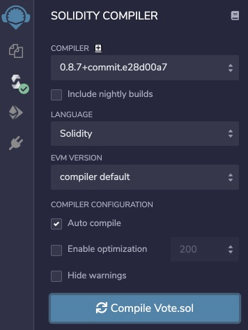
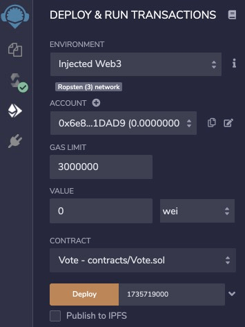

# 以太坊

## 1 概览

### 1.1 概念

以太坊是一个为去中心化应用（DApp）而生的全球开源平台。名字来源与 Ether (以太) 和后缀 ruem (希腊语义是“石油”)，国内的早期社区成员将其翻译成“以太坊”

以太坊是去中心化的、可以运行可转移计算和数据的自洽经济系统，一个去中心化的区块链平台，用于构建去中心化应用程序（DApp），以太币（Ether）是该平台所使用的加密货币。

以太坊可以轻松创建智能合约，自行执行代码，开发人员可以利用这些代码来处理各种应用程序

以太坊几乎可以用于任何类型的交易或协议，其成本比传统的替代方案要低，例如银行卡支付，PayPal 和投票等，并且全程采用去中心化、去信任（无需中介）、安全有效并且抗审查的形式

### 1.2 以太坊的价值

以太坊比单纯的加密货币更有效用。通过以太坊，用户可以创建任何去中心化应用程序（即 DApp）和智能合约，理论上可编程的以太坊可以用于任何经济或治理活动

在以太坊上，你可以通过编写代码管理数字资产、运行程序，不受地域限制

以太坊为全球金融系统打开了一扇大门，用户只需要通过互联网就能够以去信任化的方式访问应用程序、产品和服务。每一个人都可以与以太坊网络进行交互，亲自参与到这种数字经济形式中，而不需要第三方

我们可以使用智能合约来为项目众筹资金、公司可以在区块链上运用智能合约进行股票发行、银行等金融机构可以用它来管理贷款收发、保险公司可以用它来实现自动理赔等等等等，甚至任何现实金融交易都可以被改造到区块链上进行

### 1.3 以太坊运作

以太坊区块链的结构与比特币十分相似，因为它是整个交易历史的共享记录。网络上的每个节点都存储了这个历史记录的副本

以太坊与比特币的最大区别在于，除了所有以太坊交易外，它的节点还存储着每个智能合约的最新状态。对于每个以太坊应用程序，网络都需要跟踪“状态”或所有这些应用程序的当前信息，包括每个用户的余额、所有智能合约代码以及它们的存储位置等

### 1.4 DApp

得益于区块链技术，以太坊没有中心服务器，所以在以太坊上运行的 APP 不存在崩溃、死机的可能，数据也不会泄露，甚至不能被关闭！它跟区块链一样也是分布式和去中心化的，所以又叫分布式应用（Decentralized Application，简称 DApp）

DApp 一旦被 “上传” 到以太坊，它们将始终按照编好的程序运行。这些应用程序可以控制数字资产；同时还是去中心化的，这意味着没有任何单一实体或个人可以控制它们

目前，全世界有成千上万名开发者正在以太坊上构建应用程序，其中有许多现在已经可以使用：

- **加密货币钱包：**让你可以使用 ETH 或其他数字资产进行低成本的即时支付
- **金融应用程序：**让你可以借贷、投资数字资产
- **去中心化市场：**让你可以交易数字资产，甚至就现实世界事件的 “预测” 进行交易
- **游戏：**你可以拥有游戏内的资产，甚至可以由此获得现实收益

### 1.5 智能合约

根据区块链可编程的特点，人们可以将合同变成代码的形式放到区块链上，并在约定的条件下自动执行， 这就是所谓的智能合约

当满足某些条件时，它则执行特定任务。因此，智能合约系统通常遵循 `if ... then ...` 语句。但是，即便智能合约成为一种主流的技术，但智能合约既不是法定的也不是智能化的。它们只是在分布式系统（区块链）上运行的一段代码

### 1.6 以太坊和比特币区别

与比特币相似，以太坊也采用 POW 机制，通过矿工挖矿来产生新的以太坊。不同的是，以太坊是一个可以编程的区块链，它允许任何人在上面创建去中心化的 APP、编写智能合约和发行属于自己的数字货币

不同于比特币的货币定义，以太坊释放了区块链前所未有的潜力，通过一系列的重新设计，包括虚拟机(EVM, Etheruem Virtual Machine)、账户系统，在其上可以运行智能合约

### 1.7 以太坊的优缺点

**优点：**

- 以太坊允许用户在区块链上使用完整的编程语言，在网络上执行更复杂的智能合约，而不需要依靠任何第三方服务
- 以太坊可为其他产品和服务平台提供强大的生态系统
- 以太坊拥有一个强大的发展路线图（3-5 年），这意味着社区对未来几年的预期有明确的标准
- 有很多公司参与改善以太坊以外的基础。在以太坊企业联盟（EEA）和 Hyperledger 团队批准其第一个以太坊项目之间，有数十家企业组织致力于以太坊的改善生态系统。除了比特币之外，其他区块链还没有得到如此多商业社区的大力支持

**缺点：**

- 因为以太坊是一个平台，它永远不会像专门设计成加密货币的其他一样有效。比特币只是真正的分类帐，但是以太坊正在试图成为一个分类账/超级计算机/智能合约产生器/等等，为更多的用户提供服务。这种复杂性使其具有了灵活性，但是对于以上任何一种用例而言，都没有进行过深度优化
- 由于以太坊发展路线的原因，以太坊的一些重大升级包括将工作证明转移到证明权益的平台。如果这种转换不顺利，可能会在架构中引入一些关键问题并导致系统崩溃。相信以太坊团队可以确保这一切都不会发生，但这是一种风险
- 缺乏帮助开发人员的教程或文档是成为以太坊开发人员的严重障碍。你所搜索到的大多数教程都是过时的，或者只是教授对技术的概念性理解，或者只是一个基本的 `hello world` 教程，没有任何实质性内容

## 2 账户

### 2.1 概念

以太坊账户负责存储用户的以太坊余额。对大多数普通用户来说，**以太坊账户和银行账户非常类似**，通常只需要一个账户即可

**以太坊账户分为外部账户和合约账户两类：**

- **外部账户：**即普通用户用私钥控制的账户
- **合约账户：**一种拥有合约代码的账户，它不属于任何人，也没有私钥与之对应

### 2.2 以太坊地址算法

和比特币类似，一个以太坊账户就是一个公钥哈希后得到的地址，它是由一个私钥推导出对应的公钥，然后再计算出地址。其中，私钥与公钥算法与比特币完全相同，均为 `secp256k1` 椭圆曲线，但和比特币不同的是，以太坊采用非压缩公钥，然后直接对公钥做 `keccak256` 哈希，得到 32 字节的哈希值，取后 20 字节加上 `0x` 前缀即为地址：


```js
const randomBytes = require('randombytes')；
const ethUtil = require('ethereumjs-util');

// 生成 256bit 的随机数作为私钥:
let priKey = randomBytes(32).toString('hex');
// 计算公钥(非压缩格式):
let pubKey = ethUtil.privateToPublic(new Buffer(priKey, 'hex')).toString('hex');
// 计算地址:
let addr = ethUtil.pubToAddress(new Buffer(pubKey, 'hex')).toString('hex');

console.log('Private key: 0x' + priKey);
console.log('Public key: 0x' + pubKey);
console.log('Address: 0x' + addr);
```

> 和比特币采用 `Base58` 或 `Bech32` 编码不同，以太坊对私钥和地址均采用十六进制编码，因此它没有任何校验，如果某一位写错了，仍然是一个有效的私钥或地址

> `keccak256` 哈希算法在以太坊中也被称为 `SHA3` 算法。**但是要注意**，`keccak` 算法原本是 `SHA3` 的候选算法，然而在 `SHA3` 最后的标准化时，对 `keccak` 做了改进，因此，标准的 `SHA3` 算法和 `keccak` 是不同的，只是以太坊在开发时就选择了尚未成为 `SHA3` 标准的 `keccak` 算法。后续我们在讨论以太坊的哈希算法时，一律使用 `keccak256` 而不是 `SHA3-256`

### 2.3 带校验的地址

因为以太坊的地址就是原始哈希的后 20 字节，并且以十六进制表示，这种方法简单粗暴，但没有校验。地址中任何数字出错都仍是一个有效地址

为了防止抄错，以太坊通过 `EIP-55` 实现了一个带校验的地址格式，它的实现非常简单，即对地址做一个 `keccak256` 哈希，然后按位对齐，将哈希值 `>=8` 的字母变成大写：

```
original addr = 0x29717bf51d8afca452459936d395668a576bce66
keccak hash = e72ecce2eb2ed0ffab5e05f043ee68fab3df759d...
checksum addr = 0x29717BF51D8AFcA452459936d395668A576Bce66
```

以太坊地址就是依靠部分变成大写的字母进行校验，它的好处是带校验的地址和不带校验的地址对钱包软件都是一样的格式，缺点是有很小的概率无法校验全部小写的地址

### 2.4 HD 钱包

因为以太坊和比特币的非对称加密算法是完全相同的，不同的仅仅是公钥和地址的表示格式，因此，比特币的 HD 钱包体系也完全适用于以太坊。用户通过一套助记词，既可以管理比特币钱包，也可以管理以太坊钱包

以太坊钱包的派生路径是 `m/44'/60'/0'/0/0`

**用代码实现如下：**

```js
const bitcoin = require('bitcoinjs-lib');
const bip39 = require('bip39');
const ethUtil = require('ethereumjs-util');

// 助记词和口令:
let words =
  'bleak version runway tell hour unfold donkey defy digital abuse glide please omit much cement sea sweet tenant demise taste emerge inject cause link';
let password = 'bitcoin';

// 计算 seed:
let seedHex = bip39.mnemonicToSeedHex(words, password);
console.log('seed: ' + seedHex); // b59a8078...c9ebfaaa

// 生成 root:
let root = bitcoin.HDNode.fromSeedHex(seedHex);
console.log('xprv: ' + root.toBase58()); // xprv9s21ZrQH...uLgyr9kF
console.log('xpub: ' + root.neutered().toBase58()); // xpub661MyMwA...oy32fcRG

// 生成派生 key:
let child0 = root.derivePath("m/44'/60'/0'/0/0");
let prvKey = child0.keyPair.d.toString(16);
let pubKey = ethUtil.privateToPublic(new Buffer(prvKey, 'hex')).toString('hex');
let address = '0x' + ethUtil.pubToAddress(new Buffer(pubKey, 'hex')).toString('hex');
let checksumAddr = ethUtil.toChecksumAddress(address);

console.log(" prv m/44'/60'/0'/0/0: 0x" + prvKey); // 0x6c03e50ae20af44b9608109fc978bdc8f081e7b0aa3b9d0295297eb20d72c1c2
console.log(" pub m/44'/60'/0'/0/0: 0x" + pubKey); // 0xff10c2376a9ff0974b28d97bc70daa42cf85826ba83e985c91269e8c975f75f7d56b9f5071911fb106e48b2dbb2b30e0558faa2fc687a813113632c87c3b051c
console.log(" addr m/44'/60'/0'/0/0: " + address); // 0x9759be9e1f8994432820739d7217d889918f2f07
console.log("check-addr m/44'/60'/0'/0/0: " + checksumAddr); // 0x9759bE9e1f8994432820739D7217D889918f2f07
```

因为以太坊采用账户余额模型，通常情况下一个以太坊地址已够用。如果要生成多个地址，可继续派生 `m/44'/60'/0'/0/1`、`m/44'/60'/0'/0/2` 等

## 3 区块结构

### 3.1 和 BTC 的区别

比特币的区块链是由 `PoW` 保证每个区块都指向前一个区块，而在每一个区块内部，由一个独立的 `Merkle Tree` 来保证所有交易的不可篡改。用户的比特币是以 `UTXO` 的方式存储的，因此，比特币的交易就是不断地消耗现有的 `UTXO`，并产生新的 `UTXO`

而**以太坊采用的是账户模型**，所以以太坊的区块结构必须能在每个区块持续地跟踪并记录用户的账户余额变动。因此和比特币相比，以太坊的区块数据结构更加复杂

### 3.2 Merkle Patricia Tree

以太坊存储账户数据的数据结构是 `MPT：Merkle Patricia Tree`，它是一种改进的 `Merkle Tree`。当 `MPT` 的每个叶子结点的值确定后，计算出的 `Root Hash` 就是完全确定的

例如，在第一个区块中，4 个账户的余额确定后，即可确定 Root1：


在第二个区块中，如果发生了转账，将计算出一个新的 Root2：


每一个区块通过 `Root Hash` 将完全确定所有账户的状态，所以，从全局看，以太坊就是一个状态机，每个区块通过记录一个 `stateRoot` 来表示一个新状态。如果给定某个区块的 `stateRoot`，我们肯定能完全确定所有账户的所有余额等信息。因此，**stateRoot 就被称为当前的世界状态**

如果第一个区块只有几个账户，随着账户的增加，如果有数百万个账户，到后面岂不是区块存储的数据量会越来越大？

> 实际上，每个区块的 `stateRoot` 表示的是一个完全状态的逻辑树，但每个区块记录的数据只包括修改的部分，如果我们观察第二个区块的树，它实际上只记录修改的两个账户，以及两个账户因修改后导致的上层路径的 Hash 发生的变化：


想要将一个有几百万节点的树完整地放入内存需要消耗大量的内存，而以太坊全节点也并不会将整颗逻辑树放入内存。实际上，每个节点的数据被存放到 `LevelDB` 中，节点仅在内存中存储当前活动的一些账户信息。如果需要操作某个不在内存的账户，则会将其从 `LevelDB` 加载到内存。如果内存不够，也会将长期不活动的节点从内存中移除，因为将来可以通过节点的路径再次从 `LevelDB` 加载

### 3.3 账户数据

**一个以太坊账户由 4 部分数据构成：**

- **nonce:** 一个递增的整数，每发送一次交易，nonce 递增 1，因此，nonce 记录的就是交易次数
- **balance:** 记录的就是账户余额，以 wei 为单位，1 Ether 等于 `10^18 wei`
- **storageRoot:** storageRoot 存储合约相关的状态数据。合约账户才有这个数据
- **codeHash:** 存储合约代码的 Hash。合约账户才有这个数据

### 3.4 区块数据

一个以太坊区块由区块头和一系列交易构成。区块头除了记录 `parentHash`（上一个区块的 Hash）、`stateRoot`（世界状态）外，还包括：

- **sha3Uncles：**记录引用的叔块
- **transactionRoot：**记录当前区块所有交易的 Root Hash
- **receiptsRoot：**记录当前区块所有交易回执的 Root Hash
- **logsBloom：**一个 Bloom Filter，用于快速查找 Log
- **difficulty：**挖矿难度值
- **number：**区块高度，严格递增的整数
- **timestamp：**区块的时间戳（以秒为单位）

`transactionRoot` 和 `receiptsRoot` 也是两个 `MPT` 树，但他两和 `stateRoot` 不同，他们仅表示当前区块的两棵树，与前面的区块状态无关

### 3.5 叔块

以太坊采用和比特币类似的 `PoW` 挖矿，只是算法为改进的 `Ethash` 算法。`PoW` 挖矿肯定会产生分叉，但由于最长链共识，最终某个分叉将胜出：


但是和比特币不同的是，虽然 `#4` 的竞争导致一个胜出另一个失败，但以太坊鼓励后续的 `#5` 区块引用另一个废弃的 `#4` 块，这种引用的废弃块被称为叔块（Uncle Block）：


区块头记录的 `sha3Uncles` 就是叔块，一个区块可引用 `0 ～ 2` 个叔块，且叔块高度必须在前 7 层之内。

叔块的目的是给予竞争失败的矿工部分奖励，避免出现较长的分叉

## 4 交易

### 4.1 手续费 Gas

在比特币中，交易就是消耗已有 `UTXO`，并通过执行脚本产生新的 `UTXO`，其中隐含的新旧差额即为矿工手续费。

在以太坊中，交易也需要手续费，手续费被称为 `Gas`，它的计算比比特币要复杂得多

以太坊除了最基本的转账（即从一个账户支付 Ether 到另一个账户），还**支持执行合约代码**。合约代码是图灵完备的编程语言，通过 EVM（以太坊虚拟机）执行

> 如果某个合约编写了一个无限循环，那么所有节点执行该合约代码，那不是永远无法结束？

**合约执行需要消耗 Gas：**

为了保证合约代码的可靠执行，以太坊给每一个虚拟机指令都标记了一个 `Gas` 基本费用，称为 `gasUsed`

例如，加减计算的费用是 3，计算 `SHA3` 的费用是 30，输出日志的费用是 375，写入存储的费用高达 20000。总的来说，消耗 CPU 比消耗存储便宜，简单计算比复杂计算便宜，读取比写入便宜

除了 `gasUsed` 外，用户还需要提供一个 `gasPrice`，以 `Gwei（1Gwei = 10^9 Wei）`为单位。通过竞价得到一个矿工愿意接受的 `gasPrice`。如果一个交易消耗了 120000 的 `gasUsed`，而 `gasPrice` 是 50 Gwei，则交易费用是：

```
120000 x 50 Gwei = 6000000 Gwei = 0.006 Ether
```

**预支 Gas：**

在执行代码的时候，存在条件判断、循环等语句，同一段代码，执行的结果也可能不同，因此，事前预计一个合约执行要花费多少 Gas，不现实

所以以太坊规定，一笔交易，先给出 `gasPrice` 和 `gasLimit`，如果执行完成后有剩余，剩余的退还，如果执行过程中消耗殆尽，那么交易执行失败，但已执行的 Gas 不会退

假定某个账户想执行一笔交易，他给出 gasPrice 为 50 Gwei，预估 `gasUsed` 约 120000，设定 `gasLimit` 为 150000，则预支付的 Ether 为：

```
150000 x 50 Gwei = 7500000 Gwei = 0.0075 Ether
```

如果账户的 `Ether` 余额不足 0.0075，则该交易根本无法发送。如果账户余额等于或超过 0.0075，例如余额为 0.008，则矿工可以将该交易打包。假设实际执行消耗的 `gasUsed` 为 120000，则交易费用 0.006，账户剩余 0.002

> 很少有交易能准确预估 `gasUsed`，只有标准转账交易是 21000，因此，标准的转账交易 `gasLimit` 可以设置为 21000（即恰好消耗完毕无剩余）

> Gas Price 是全网用户竞价产生的，它时刻在波动。如果交易少，Gas Price 将下降，如果交易多，网络拥堵，则 Gas Price 将上升。以太坊的 Gas 价格可以在 `Etherscan` 跟踪

### 4.2 交易回执

以太坊区块为每一笔交易都会产生一笔回执（Recipt），表示交易的最终状态

**一个回执信息主要包括：**

- **status：**执行结果，1 表示成功，0 表示失败
- **gasUsed：**已消耗的 Gas 数量
- **txHash：**交易 Hash
- **logs：**交易产生的日志
- ……

### 4.3 转账交易

转账交易是指两个外部账号转移 `Ether`

我们以测试网的交易 [0xf04d...b7ba](https://ropsten.etherscan.io/tx/0xf04dfc4f3fe7d7623abbc3ae1e4a6e4f20d14b9db134d573f224dc2994feb7ba) 为例：

- **Transaction Hash:** `0xf04d...b7ba`，这是交易 Hash，即交易的唯一标识
- **Status:** `Success`，表示交易成功
- **From:** `0x0c46...2978`，交易的发送方
- **To:** `0x77e4...e34c`，交易的接收方
- **Value:** 0.02759796846726396 Ether，交易发送的 Ether
- **Gas Price:** 1.500000788 Gwei，Gas 的价格
- **Gas Limit:** 21,000，转账交易恰好消耗 21000 Gas，因此总是 21000
- **Gas Used by Transaction:** 21,000 (100%)，消耗的 Gas 占比，这里恰好全部消耗完
- **Nonce:** 1，发送方的 nonce，1 表示第 2 笔交易
- **Input Data:** `0x`，因为是转账交易，没有输入数据，因此为空

### 4.4 合约交易

合约交易就是指一个外部账号调用某个合约的某个 `public` 函数

我们以测试网的交易 [0x2235...132e](https://ropsten.etherscan.io/tx/0x223572134e999599c24d255e1beee78c8c33dcc52262a9ef5524f8f2a552132e) 为例：

- **From:** `0x0c46...2978`，交易的发起方，该地址一定是外部账户
- **To:** `0x5b2a...5a46`，交易的接收方，这里地址是一个合约地址
- **Value:** 0 Ether，这里发送的 Ether 是 0，即没有向合约发送 Ether
- **Gas Limit:** 105,406，这是交易发起前设定的最大 Gas
- **Gas Used by Transaction:** 70,271 (66.67%)，这是交易实际消耗的 Gas
- **Input Data:** `0xb3f98adc...`，这是交易的输入数据，其中包含了调用哪个函数，以及传递的参数

可见，转账交易的 Gas 费用是固定的，而合约交易只能预估，具体费用以实际执行后消耗的为准

## 5 智能合约

以太坊相比比特币的一个重大创新就是它支持智能合约（Smart Contract）

### 5.1 什么是智能合约

所谓智能合约，就是一种运行在区块链上的程序。和普通程序不同的是，智能合约要保证在区块链网络的每一个节点中运行的结果完全相同，这样才能使任何一个节点都可以验证智能合约执行的结果对不对。因此，以太坊提供了一个 EVM（Ethereum Virtual Machine）虚拟机来执行智能合约的字节码

> 和普通程序相比，为了消除程序运行的不确定性，智能合约有很多限制，例如，不支持浮点运算（因为浮点数有不同的表示方法，不同架构的 CPU 运行的浮点计算精度都不同），不支持随机数，不支持从外部读取输入等等

类似于 Java 源码被编译为 JVM 可执行的字节码，我们也需要一种高级语言来编写智能合约，然后编译成 EVM 的字节码。最常用的开发智能合约的语言是以太坊专门为其定制的 Solidity 语言

### 5.2 部署和执行

一个智能合约被编译后就是一段 EVM 字节码，将它部署在以太坊的区块链时，会根据部署者的地址和该地址的 `nonce` 分配一个合约地址，合约地址和账户地址的格式是没有区别的，但合约地址没有私钥，也就没有人能直接操作该地址的合约数据。**要调用合约，唯一的方法是调用合约的公共函数**

> 这也是合约的一个限制：合约不能主动执行，它只能被外部账户发起调用。如果一个合约要定期执行，那只能由线下服务器定期发起合约调用

此外，合约作为地址，可以接收 `Ether`，也可以发送 `Ether`。合约内部也可以存储数据。合约的数据存储在合约地址关联的存储上，这就使得合约具有了状态，可以实现比较复杂的逻辑，包括存款、取款等

合约在执行的过程中，**可以调用其他已部署的合约**，前提是知道其他合约的地址和函数签名，这就大大扩展了合约的功能

例如，一个合约可以调用另一个借贷合约的借款方法，再调用交易合约，最后再调用还款方法，实现所谓的“闪电贷”（即在一个合约调用中实现借款-交易-还款）功能。多个合约的嵌套调用也使得因为代码编写的漏洞导致黑客攻击的可能性大大增加。为了避免漏洞，编写合约时需要更加小心

## 6 编写合约

以太坊的智能合约就是一段由 EVM 虚拟机执行的字节码，类似于 Java 虚拟机执行 Java 字节码。直接编写字节码非常困难，通常都是由编译器负责把高级语言编译为字节码

编写以太坊合约最常用的高级语言是 `Solidity`，这是一种类似 JavaScript 语法的高级语言。通过 Solidity 的[官方网站](https://soliditylang.org/)可以快速上手

### 6.1 实例

**简单的投票合约：**

```js
// 最好遵循一个文件一个合约，且文件名保持与合约一致。这里的合约名是 Vote

// 第一行通常是版权声明的注释
// SPDX-License-Identifier: GPL-3.0

// 声明编译器版本
pragma solidity = 0.8.7;

// 也可以指定版本范围
// pragma solidity >= 0.8.0 < 0.9.0;

// 由关键字 contract 声明一个合约
contract Vote {
  // 一个合约就相当于一个类，合约内部可以有成员变量

  // 合约可以定义事件（Event），我们在 Vote 合约中定义了一个 Voted 事件
  // 只定义事件还不够，触发事件必须在合约的写函数中通过 emit 关键字实现
  event Voted(address indexed voter, uint8 proposal);

  // 记录已投票的地址
  mapping(address => bool) public voted;

  // 记录投票终止时间
  uint256 public endTime;

  // 记录得票数量
  uint256 public proposalA;
  uint256 public proposalB;
  uint256 public proposalC;

  // 所有的成员变量都默认初始化为 0 或 false（针对 bool）或空（针对 mapping）
  // 如果某个成员变量要指定初始值，那么需要在构造函数中赋值
  constructor(uint256 _endTime) {
    endTime = _endTime;
  }

  // 以太坊合约支持读、写两种类型的成员函数
  // 没有 view 修饰的函数是写入函数，它会修改成员变量，即改变了合约的状态
  function vote(uint8 _proposal) public {
    require(block.timestamp < endTime, "Vote expired.");
    require(_proposal >= 1 && _proposal <= 3, "Invalid proposal.");
    require(!voted[msg.sender], "Cannot vote again.");

    // 给mapping增加一个key-value
    voted[msg.sender] = true;

    if (_proposal == 1) {
      // 修改proposalA
      proposalA ++;
    } else if (_proposal == 2) {
      // 修改proposalB
      proposalB ++;
    } else if (_proposal == 3) {
      // 修改proposalC
      proposalC ++;
    }

    // 当调用 vote() 写方法时，会触发 Voted 事件
    emit Voted(msg.sender, _proposal);
  }

  // 以 view 修饰的函数是只读函数，它不会修改成员变量，即不会改变合约的状态
  function votes() public view returns (uint256) {
    return proposalA + proposalB + proposalC;
  }
}
```

`Solidity` 支持整型（细分为 `uint256`、`uint128`、`uint8` 等）、`bytes32` 类型、映射类型（相当于 `Java` 的 `Map`）、布尔型（`true` 或 `false`）和特殊的 `address` 类型表示一个以太坊地址

> 以太坊合约不支持浮点数类型，是为了保证每个节点运行合约都能得到完全相同的结果。浮点数运算在不同的 ISA 体系下存在表示方式、运算精度的不同，无法保证两个节点执行浮点运算会得到相同的结果

事件可用来通知外部感兴趣的第三方，他们可以在区块链上监听产生的事件，从而确认合约某些状态发生了改变

**用 Solidity 编写一个完整的合约所涉及的几个要素：**

- 声明版权（可选）
- 声明编译器版本
- 以 `contract` 关键字编写一个合约
- 可以包含若干成员变量
- 可以在构造函数中对成员变量初始化（可选）
- 可以编写只读方法
- 可以编写写入方法
- 可以声明 `Event` 并在写入方法中触发
- 函数又可以用 `public` 或 `private` 修饰。顾名思义，`public` 函数可以被外部调用，而 `private` 函数不能被外部调用，他们只能被 `public` 函数在内部调用

### 6.2 合约执行流程

当一个合约编写完成并成功编译后，我们就可以把它部署到以太坊上。合约部署后将自动获得一个地址，通过该地址即可访问合约

把 `contract Vote {...}` 看作一个类，**部署就相当于一个实例化**。如果部署两次，将得到两个不同的地址，相当于实例化两次，两个部署后的合约对应的成员变量是完全独立的，互不影响

构造函数在部署合约时就会立刻执行，且仅执行一次。合约部署后就无法调用构造函数

任何外部账户都可以发起对合约的函数调用。如果调用只读方法，因为不改变合约状态，所以任何时刻都可以调用，且不需要签名，也不需要消耗 Gas。但如果调用写入方法，就需要签名提交一个交易，并消耗一定的 Gas

在一个交易中，只能调用一个合约的一个写入方法。无需考虑并发和同步的问题，因为以太坊交易的写入是严格串行的

### 6.3 验证

由于任何外部账户都可以发起对合约的函数调用，所以任何验证工作都必须在函数内部自行完成。最常用的 `require()` 可以断言一个条件，如果断言失败，将抛出错误并中断执行

**常用的检查包括几类：**

参数检查：

```js
// 参数必须为 1,2,3:
require(_proposal >= 1 && _proposal <= 3, 'Invalid proposal.');
```

条件检查：

```js
// 当前区块时间必须小于设定的结束时间:
require(block.timestamp < endTime, 'Vote expired.');
```

调用方检查：

```js
// msg.sender 表示调用方地址:
require(!voted[msg.sender], 'Cannot vote again.');
```

以太坊合约具备类似数据库事务的特点，如果中途执行失败，则整个合约的状态保持不变，不存在修改某个成员变量后，后续断言失败导致部分修改生效的问题：

```js
function increment() {
  // 假设 a,b 均为成员变量:
  a++;
  emit AChanged(a);

  // 如果下面的验证失败，a 不会被更新，也没有 AChanged 事件发生:
  require(b < 10, 'b >= 10');
  b++;
}
```

即合约如果执行失败，其状态不会发生任何变化，也不会有任何事件发生，仅仅是调用方白白消耗了一定的 Gas

## 7 部署合约

实际上，部署合约也是一个交易，需要一个外部账户，花费一定的 Gas，就可以把合约部署到链上

因此，我们首先需要一个便于开发和测试的钱包，才能创建一个外部账户，并且账户上要有一定的 `Ether`

### 7.1 MetaMask

`MetaMask` 钱包，这是一个基于浏览器插件的钱包，支持 Chrome、FireFox 等浏览器。使用的时候，通过 `Dapp` 网站的 `JavaScript` 可以发起交易，用户通过 `MetaMask` 确认后即可将交易发送至链上

安装完成后，第一次启动 `MetaMask` 需要创建或导入一个钱包，设置一个解锁口令，`MetaMask` 允许创建多个账号，可随时切换账号，还可切换不同的链，例如，以太坊主网、Ropsten 测试网、Rinkeby 测试网等

在开发阶段，直接使用主网太费钱，可以使用 Ropsten 测试网，并从 [faucet.ropsten.be](https://faucet.ropsten.be) 或 [faucet.dimensions.network](https://faucet.dimensions.network/) 获取一些测试网的 Ether

### 7.2 部署合约

以太坊官方提供了一个 `Remix` 的在线 IDE，用于编写、编译和部署以太坊合约。这是从零开始部署一个合约的最简单的方式

我们访问 [Remix](http://remix.ethereum.org/)（注意：要部署合约，只能通过 http 访问，不能使用 https），在左侧选择 “File explorers”，在默认的 `Workspace` 的 `contracts` 目录下新建文件 `Vote.sol`，然后贴入上面的投票代码：


接下来是编译该合约。选择左侧的 “Solidity compiler”，点击 “Compile Vote.sol” 开始编译：



如果没有编译错误，可以看到编译成功的标志。接下来选择 “Deploy & run transactions”：



在 “ENVIRONMENT” 中，选择 “Injected Web3”，表示我们要使用 `MetaMask` 注入的 `Web3` 环境，如果已正确连接 `MetaMask`，可以看到 “Ropsten (3) network”，表示已连接到 `Ropsten` 测试网

在 “CONTRACT” 中，选择 “Vote - contracts/Vote.sol”，这是我们将要部署的合约

在 “Deploy” 按钮左侧，填入构造函数的参数，例如 `1735719000`，然后点击 “Deploy” 按钮开始部署，此时会弹出 `MetaMask` 的交易签名确认，确认后部署合约的交易即被发送至测试链。在 `MetaMask` 的账户 - 活动中可以看到正在发送的交易，查看详情可以在 `Etherscan` 查看该交易的详细信息。当交易被打包确认后，即可获得部署后合约的地址 `0x5b2a...5a46`

至此，我们就成功地部署了一个以太坊合约

对于熟练的 `Solidity` 开发者，可以使用 `Truffle` 这个 `JavaScript` 工具通过 `JavaScript` 脚本全自动部署合约，减少手动操作导致的出错的可能

## 8 调用合约

当我们已经成功地将一个合约部署到以太坊链上时，如何调用该合约？

首先，我们通过 `Etherscan` 这个网站可以查看已部署合约的详细信息，例如 [0x5b2a...5a46](https://ropsten.etherscan.io/address/0x5b2a057e1db47463695b4629114cbdae99235a46)

在调用合约前，我们可以通过 “Verify and Publish” 这个链接将源码上传到 `Etherscan` 并验证。首先选择正确的 `Solidity` 编译器版本，贴入源码，`Etherscan` 自动编译后，如果二进制的字节码完全匹配已部署的合约，则验证通过，该合约有一个绿色小勾的标志：


### 8.1 读取合约

访问合约的只读函数时，无需消耗 Gas，也无需连接钱包，直接切换到 “Read” 面板，即可看到只读函数的返回值：


从结果可知，`endTime()` 返回 1735719000，`proposalA()` 返回 1

我们在 `Vote` 合约只有 `endTime` 字段并没有 `endTime()` 函数，为什么可以访问 `endTime()`？原因是 **public 字段会自动对应一个同名的只读函数**，即：

```js
contract Vote {
  uint256 public endTime;
}
```

完全等价于：

```js
contract Vote {
uint256 private _endTime;
  function endTime() public view returns (uint256) {
    return _endTime;
  }
}
```

对于需要填入参数的只读函数，可以直接在对应的输入框填入参数，然后点击 “Query” 调用并获取结果：


### 8.2 写入合约

当我们要写入合约时，就**必须提交一个签名的交易**，并消耗一定的 Gas。我们在 `Etherscan` 的合约页选择“Write”，会出现一个 “Connect to Web3” 的链接：


点击并连接 `MetaMask` 后，我们就可以选择一个写入函数，填入参数，然后点击 “Write”：


在 `MetaMask` 中确认该交易后，交易被发送至链上。等待打包成功后，我们就可以读取到合约内部更新后的状态

## 9 编写 Dapp

### 9.1 Dapp 的作用

通过 Etherscan 这个网站不仅可以查看合约代码，还可以调用合约的读取和写入方法。可见，调用一个合约是非常简单的

但是对于普通用户来说，这种调用方式还是过于复杂。比如发个微博，如果需要用户自己去调接口的话，门槛就太高了

所以，要求普通用户自己去 `Etherscan` 调用合约不现实。开发一个 Dapp，就可以让用户通过页面，点击按钮来调用合约

### 9.2 Dapp 架构

一个 Dapp 的架构实际上包含以下部分：


以太坊的区块链网络实际上是一个由若干节点构成的 `P2P` 网络，所谓读写合约，实际上是向网络中的**某个节点**发送 `JSON-PRC` 请求。当我们想要做一个基于 `Vote` 合约的 `Dapp` 时，我们需要开发一个页面，并连接到浏览器的 `MetaMask` 钱包，这样，页面的 JavaScript 就可以通过 `MetaMask` 读写 `Vote` 合约，页面效果如下：


### 9.3 编写 Dapp

**第一步**，引入相关库，这里我们引入 ethers.js 这个库，它封装了读写合约的逻辑。在页面中用 `<script>` 引入如下：

```html
<script src="https://cdn.jsdelivr.net/npm/ethers@5.0.32/dist/ethers.umd.min.js"></script>
```

**第二步**，我们需要获取 `MetaMask` 注入的 `Web3`，可以通过一个简单的函数实现：

```js
function getWeb3Provider() {
  if (!window.web3Provider) {
    if (!window.ethereum) {
      console.error('there is no web3 provider.');
      return null;
    }

    window.web3Provider = new ethers.providers.Web3Provider(window.ethereum, 'any');
  }

  return window.web3Provider;
}
```

**第三步**，在用户点击页面 “Connect Wallet” 按钮时，尝试连接 `MetaMask`：

```js
async function connect() {
  if (window.getWeb3Provider() === null) {
    console.error('there is no web3 provider.');
    return false;
  }

  try {
    // 获取当前连接的账户地址:
    let account = await window.ethereum.request({
      method: 'eth_requestAccounts'
    });

    // 获取当前连接的链 ID:
    let chainId = await window.ethereum.request({
      method: 'eth_chainId'
    });

    console.log('wallet connected.');

    return true;
  } catch (e) {
    console.error('could not get a wallet connection.', e);
    return false;
  }
}
```

**第四步**，当我们已经连接到 `MetaMask` 钱包后，即可写入合约。写入合约需要合约的 `ABI（Application Binary Interface）`信息，即合约函数调用的接口信息，这些信息在 `Remix` 部署时产生。我们需要回到 `Remix`，在 `contracts-artifacts` 目录下找到 `Vote.json` 文件，它是一个 `JSON`，右侧找到 `"abi": [...]`，把 `abi` 对应的部分复制出来：


以常量的形式引入 `Vote` 合约的地址和 `ABI`：

```js
const VOTE_ADDR = '0x5b2a057e1db47463695b4629114cbdae99235a46';
const VOTE_ABI = ['...'];
```

**第五步**，现在我们就可以在页面调用 `vote()` 写入函数了：

```js
async function vote(proposal) {
  // TODO: 检查 MetaMask 连接信息
  // 根据地址和 ABI 创建一个 Contract 对象:
  let contract = new ethers.Contract(VOTE_ADDR, VOTE_ABI, window.getWeb3Provider().getSigner());

  // 调用 vote()函数，并返回一个 tx 对象:
  let tx = await contract.vote(proposal);

  // 等待 tx 落块，并至少 1 个区块确认:
  await tx.wait(1);
}
```

以上就是调用合约的全部流程

### 9.4 服务器端

**我们需要明确几个要点：**

1. 页面的 `JavaScript` 代码无法直接访问以太坊网络的 `P2P` 节点，只能间接通过 `MetaMask` 钱包访问
1. 钱包之所以能访问以太坊网络的节点，是因为它们内置了某些公共节点的域名信息
1. 如果用户的浏览器没有安装 `MetaMask` 钱包，则页面无法通过钱包读取合约或写入合约

**因此引出了一个个问题：一个 Dapp 到底需不需要服务器端？**

对于大多数的 `Dapp` 来说，是需要服务器端的，这是因为，当用户浏览器没有安装钱包，或者钱包并没有连接到 `Dapp` 期待的网络时，页面将无法获得合约的任何数据。例如，上述 `Dapp` 就无法读取到三种投票的数量，因此无法在页面上绘制对比图

如果部署一个服务器端，由服务器连接 `P2P` 网络的节点并读取合约，然后以 `JSON API` 的形式给前端提供相关数据，则可以实现一个更完善的 `Dapp`。因此，完整的 `Dapp` 架构如下：


**为 Dapp 搭建后端服务器时要严格遵循以下规范：**

1. 后端服务器只读取合约，不存储任何私钥，因此无法写入合约，保证了安全性
1. 后端服务器要读取合约，就必须连接到 `P2P` 节点，要么选择公共的节点服务（例如 Infura），要么自己搭建一个以太坊节点（维护的工作量较大）
1. 后端服务器应该通过合约产生的日志（即合约运行时触发的 `event`）监听合约的状态变化，而不是定期扫描。监听日志需要通过 `P2P` 节点创建 `Filter` 并获取 `Filter` 返回的日志
1. 后端服务器应该将从日志获取的数据做聚合、缓存，以便前端页面能快速展示相关数据
1. 因此，设计 `Dapp` 时，既要考虑将关键业务逻辑写入合约，又要考虑日志输出有足够的信息让后端服务器能聚合历史数据。前端、后端和合约三方开发必须紧密配合

不同的编程语言实现后端服务时，可以选择封装好的第三方库，例如 `Java` 可以使用 `Web3j`，`Python` 可以使用 `Web3.py`，详细的说明可以参考官方文档
