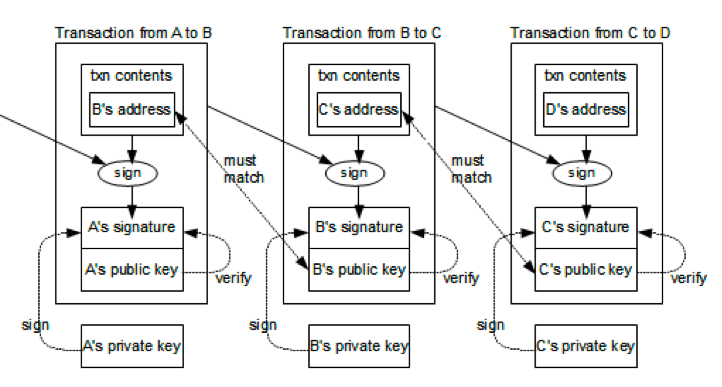

# 加密算法

区块链中主要应用了两类密码学算法，第一类是哈希算法，第二类是非对称加密算法

## 1 哈希算法

### 1.1 概念

哈希算法是一类数学函数算法，又称散列算法，它是一种数据映射关系

**哈希算法具有下面的 4 种特性：**

1. **正向快速：**可快速计算哈希值
1. **逆向困难：**一个优秀的哈希算法是不可能通过密文反推明文的
1. **输入敏感：**原始信息即使发生一丁点的变化，重新计算的哈希值与之前比较会完全不同
1. **抗碰撞性：**不同的明文会产生不同的哈希值 (极低的概率相同)

**流行的 Hash 算法：**

目前流行的 Hash 算法包括了 `MD5`、`SHA-1` 和 `SHA-2`，其中 `MD5` 被证明不具有强抗碰撞性。`SHA（Secure Hash Algorithm）`是一个 `Hash` 函数族，分为 `SHA-1`、`SHA-2`、`SHA-3`，代表了三代哈希标准，目前使用比较多的是 SHA-2 系列

- 第一代 `SHA-1` 基于 MD4 设计，并且模仿了该算法，`SHA-1` 已被证明了不具备“强抗碰撞性”，所以安全性不够高
- 第二代 `SHA-2` 一共包含了 `SHA-224`、`SHA-256`、`SHA-384`，和 `SHA-512` 算法（统称为 `SHA-2`），它们跟 `SHA-1` 算法原理类似
- `SHA-3` 相关算法也已被提出，它的出现并不是要取代 `SHA-2`，因为 `SHA-2` 目前并没有出现明显的弱点

| 哈希算法  | 输出长度(bit) | 输出长度(字节) |
| --------- | ------------- | -------------- |
| MD5       | 128 bit       | 16 bytes       |
| RipeMD160 | 160 bits      | 20 bytes       |
| SHA-1     | 160 bits      | 20 bytes       |
| SHA-256   | 256 bits      | 32 bytes       |
| SHA-512   | 512 bits      | 64 bytes       |

### 1.2 区块链上的哈希算法

哈希算法被广泛地使用在构造和验证区块、交易的完整性上，由于哈希算法的四个特性，使得我们可以把任意的交易数据做成数据摘要，然后再一个一个链接起来，形成数据块的链式结构

## 2 加密算法

### 2.1 对称加密

常见的对称加密算法有 DES、3DES、AES、IDEA 等

对称加密和非对称加密使用区别体现在密钥是否可以公开，对称密钥要求加解密过程均使用相同的密钥，而非对称加密可以提供一对钥匙，私钥自己保管，公钥可以公开

### 2.2 非对称加密

常见的非对称加密算法有 RSA、ECC 等

所谓密钥对，也就是一种非对称加密技术。在对信息进行加密和解密时，使用两个不同的密钥

- **公钥**：公布出去，任何人都能看到。只能加密，解密需要私钥，信息使用公钥加密后只能用私钥解密，其他人无法解密 (可以使用公钥加密，私钥解密，也有反过来用私钥加密，公钥解密)
- **私钥**：只能自己看到。用来解密

### 2.3 数字签名

**非对称加密的缺陷：**

每个人都有我的公钥，别人可以截获发件人发给我的信息，然后自己用我的公钥加密一个别的信息，伪装成发件人发给我，这样我就被黑了

所以，我们需要对发件人的身份进行验证，此时就需要用到 **数字签名** 的概念了

**数字签名的加密过程：**

1. Mike(发件人) 也有一对密钥对，一个公钥给了 Jack，私钥自己保留
1. Mike(发件人) 把需要发送的信息做个 hash，得到一个 hash 串，又叫 **Digest**
1. Mike(发件人) 用自己的私钥，把 Digest 加密，得到一段 Digest 的密文。我们把这个过程叫 **数字签名**，Signature
1. 然后，Mike(发件人) 把需要发送的信息用我的公钥加密后，连同他的数字签名一同发给 Jack
1. Jack 用自己的私钥解密 Mike 发给他的密文，然后用 Mike 的公钥解密其数字签名得到 Digest
1. 然后，对解开的密文做 Hash。如果结果和 Digest 一致，就说明，这个信息是 Mike 发送的，没有人更改过


**数字签名算法：**

常用的数字签名算法有：`RSA` 算法，`DSA` 算法和 `ECDSA` 算法。比特币采用的签名算法是椭圆曲线签名算法：`ECDSA`，使用的椭圆曲线是一个已经定义好的标准曲线 `secp256k1`

比特币采用的 `ECDSA` 签名算法需要一个私钥和公钥组成的秘钥对：私钥本质上就是一个 `1 ～ 2^256` 的随机数，公钥是由私钥根据 `ECDSA` 算法推算出来的

### 2.4 证书

**中间人攻击：**

1. 假设有个黑客偷偷地把 Jack(收件人) 电脑上的 Mike 的公钥给换了，换成自己的
1. 然后截获 Mike 发出来的信息，用自己的密钥加密一段自己的信息，以及自己的数字签名
1. 对于 Jack(收件人) 来看，因为他用了黑客的公钥，而不是 Mike 的
1. 那么对他来说，他就以为信息来自 Mike，于是黑客可以用自己的私钥伪装成 Mike 给 Jack 通信

**证书：**

1. 为了应对中间人攻击，需要保证自己的公钥不被篡改
1. 这就需要一个权威机构来认证公钥。权威机构，用自己的私钥把 Mike(发件人) 的公钥和其相关信息一起加密，生成一个 **证书**
1. Mike(发件人) 只需要在发送信息的时候放上这个权威机构发的数字证书
1. 然后 Jack(收件人) 用这个 `权威机构的公钥` 解密这个证书，得到 Mike 的公钥
1. 再用 Mike 的公钥来验证 Mike 的数字签名

## 3 比特币的加密

在比特币中，每一笔交易的 From 和 To 都是每个用户的公钥（Public Key）。也就是说，使用用户的公钥来做交易的账户

交易的发起方只能是支付方，支付方需要用自己的私钥来加密交易信息并制作相关的交易签名

网络上其他人会用支付方的公钥（也就是交易的支出方）来做解密来验证

> 为什么不需要那个证书机构呢？不怕中间人攻击吗？这是因为，如果黑客想要伪造一笔别人的交易，那么他需要换掉半数以上结点上的被攻击者的公钥，这不太现实

下面是一个交易链的图示。这个交易链的钱从 A -> B -> C -> D，一共 3 笔交易：



- **发起交易**：我们从第一笔交易可以看到，A 用自己的私钥为交易信息和自己的地址生成了交易的签名，然后把交易信息、自己的地址、交易签名和自己的公钥放出去，这样方便别人来验证的确是 A 发起的
- **验证交易**：在验证时，使用 A 的公钥解密交易签名，得到交易的 hash 值。把交易信息和自己的地址做 hash，看看是不是和签名解密后的 hash 值一致

## 4 私钥

### 4.1 概念

比特币私钥本质上就是一个随机数，是一个 256 位，由 0 和 1 组成的数字

私钥会转成 base58 格式，例如：`KwYHFL7WfhJPkfQkp1LsUwHvy1Pd9KynuxjjVDMZvRSV5D9VJq3v`

**私钥的作用：**

- 钱包地址通过私钥计算得到
- 交易需要通过私钥签名授权发出
- 资产在钱包恢复需要使用私钥

### 4.2 实例：创建私钥

在 `JavaScript` 中，内置的 `Number` 类型使用 56 位表示整数和浮点数，最大可表示的整数最大只有 `9007199254740991`。其他语言如 Java 一般也仅提供 64 位的整数类型。要表示一个 256 位的整数，只能使用数组来模拟

```js
const bitcoin = require('bitcoinjs-lib');

// ECPair 创建私钥，每次生成的私钥都是不同的
let keyPair = bitcoin.ECPair.makeRandom();

console.log('private key = ' + keyPair.d); // 打印私钥 (整数):
console.log('hex = ' + keyPair.d.toHex()); // 以十六进制打印:
console.log('hex = ' + keyPair.d.toHex(32)); // 补齐 32 位:
```

256 位的整数通常以十六进制表示，使用 `toHex(32)` 我们可以获得一个固定 64 字符的十六进制字符串。注意每两个十六进制字符表示一个字节，因此，64 字符的十六进制字符串表示的是 `32 字节 = 256` 位整数

### 4.3 Base58 编码

想要记住一个 256 位的整数是非常困难的，并且，如果记错了其中某些位，这个记错的整数仍然是一个有效的私钥，因此，比特币有一种对私钥进行编码的方式，这种编码方式就是带校验的 Base58 编码。

对私钥进行 Base58 编码有两种方式：

- 非压缩的私钥格式
- 压缩的私钥格式，它们分别对应非压缩的公钥格式和压缩的公钥格式

**非压缩的私钥格式 (已弃用)：**


1. 在 32 字节的私钥前添加一个 `0x80` 字节前缀，得到 33 字节的数据
1. 计算 4 字节的校验码：对其进行两次 `SHA256`，取开头 4 字节作为校验码
1. 将校验码附加到最后，一共得到 37 字节的数据
1. 对这 37 字节的数据进行 `Base58` 编码，得到总是以 5 开头的字符串编码
1. 这个字符串就是私钥地址，又称为钱包导入格式：`WIF（Wallet Import Format）`


**使用 `wif` 库实现 `WIF` 编码：**

```js
const wif = require('wif');

// 十六进制表示的私钥:
let privateKey = '0c28fca386c7a227600b2fe50b7cae11ec86d3bf1fbe471be89827e19d72aa1d';

// 对私钥编码:
let encoded = wif.encode(
  0x80, // 0x80 前缀
  Buffer.from(privateKey, 'hex'), // 转换为字节
  false // 非压缩格式
);

console.log(encoded);
```

**压缩的私钥格式：**

与非压缩格式不同的是，压缩的私钥格式会在 32 字节的私钥前后各添加一个 `0x80` 字节前缀和 `0x01` 字节后缀，共 34 字节的数据，对其计算 4 字节的校验码，附加到最后，一共得到 38 字节的数据：


对这 38 字节的数据进行 Base58 编码，得到总是以 K 或 L 开头的字符串编码，整个过程如下图所示：


通过代码实现压缩格式的 `WIF` 编码如下：

```js
const wif = require('wif');

// 十六进制表示的私钥:
let privateKey = '0c28fca386c7a227600b2fe50b7cae11ec86d3bf1fbe471be89827e19d72aa1d';

// 对私钥编码:
let encoded = wif.encode(
  0x80, // 0x80 前缀
  Buffer.from(privateKey, 'hex'), // 转换为字节
  true // 压缩格式
);

console.log(encoded);
```

> 非压缩的格式几乎已经不使用了。`bitcoinjs` 提供的 `ECPair` 总是使用压缩格式的私钥表示

```js
const bitcoin = require('bitcoinjs-lib');
const BigInteger = require('bigi');

let priv = '0c28fca386c7a227600b2fe50b7cae11ec86d3bf1fbe471be89827e19d72aa1d';
let d = BigInteger.fromBuffer(Buffer.from(priv, 'hex'));
let keyPair = new bitcoin.ECPair(d);

// 打印 WIF 格式的私钥:
console.log(keyPair.toWIF());
```

## 5 公钥和地址

### 5.1 概念

有了私钥，可以通过下面操作得到公钥和地址：


> 私钥 --> 公钥 --> 钱包地址。这个推导次序是单向，不可能反向

**例如 (某个比特币地址)：**

```bash
# 可以将私钥设置成这样：
0000000000000000000000000000000000000000000000000000000000000001

#  通过椭圆曲线函数得到公钥
0479BE667EF9DCBBAC55A06295CE870B07029BFCDB2DCE28D959F2815B16F81798483ADA7726A3C4655DA4FBFC0E1108A8FD17B448A68554199C47D08FFB10D4B8

# 通过一系列哈希算法得到比特币地址 (这个地址是真实存在的)
1EHNa6Q4Jz2uvNExL497mE43ikXhwF6kZm
```

### 5.2 公钥

1. 私钥本质上是一个 256 位整数
1. 比特币采用的 ECDSA 算法，可以推导出两个 256 位整数，记作 `(x, y)`，这两个 256 位整数即为非压缩格式的公钥
1. 可以根据 `(x, y)` 推算出 `x'`，作为压缩格式的公钥
1. 压缩格式的公钥实际上只保存 x 这一个 256 位整数，但需要根据 y 的奇偶性在 x 前面添加 `02` 或 `03` 前缀，y 为偶数时添加 `02`，否则添加 `03`，这样，得到一个 `1 + 32 = 33` 字节的压缩格式的公钥数据，记作 `x'`

> 非压缩格式的公钥目前已很少使用，原因是非压缩格式的公钥签名脚本数据会更长

**实例 - 私钥->公钥：**

```js
const bitcoin = require('bitcoinjs-lib');

let wif = 'KwdMAjGmerYanjeui5SHS7JkmpZvVipYvB2LJGU1ZxJwYvP98617';
let ecPair = bitcoin.ECPair.fromWIF(wif); // 导入私钥

// 计算公钥:
let pubKey = ecPair.getPublicKeyBuffer(); // 返回 Buffer 对象

console.log(pubKey.toString('hex')); // 02 或 03 开头的压缩公钥
```

### 5.3 地址

> 比特币的地址并不是公钥，而是公钥的哈希，即从公钥能推导出地址，但从地址不能反推公钥

1. 以压缩格式的公钥为例，从公钥计算地址的方法是
1. 首先对 `1 + 32 = 33` 字节的公钥数据进行 `Hash160`（即先计算 `SHA256`，再计算 `RipeMD160`），得到 20 字节的哈希
1. 然后，添加 `0x00` 前缀，得到 `1 + 20 = 21` 字节数据，再计算 4 字节校验码，拼在一起，总计得到 `1 + 20 + 4 = 25` 字节数据
1. 对 25 字节数据进行 `Base58` 编码，得到总是以 1 开头的字符串
1. 该字符串即为比特币地址


整个过程如下：


**实例 - 公钥->地址：**

```js
const bitcoin = require('bitcoinjs-lib');

let publicKey = '02d0de0aaeaefad02b8bdc8a01a1b8b11c696bd3d66a2c5f10780d95b7df42645c';
let ecPair = bitcoin.ECPair.fromPublicKeyBuffer(Buffer.from(publicKey, 'hex')); // 导入公钥

// 计算地址:
let address = ecPair.getAddress();

console.log(address); // 1 开头的地址
```

> 仅提供地址并不能让其他人得知公钥。通常来说，公开公钥并没有安全风险。实际上，如果某个地址上有对应的资金，要花费该资金，就需要提供公钥。如果某个地址的资金被花费过至少一次，该地址的公钥实际上就公开了

**私钥、公钥以及地址的推导关系如下：**


## 6 签名

### 6.1 实例

**使用 `ECDSA` 通过私钥对消息进行签名：**

```js
const bitcoin = require('bitcoinjs-lib');

let message = 'a secret message!'; // 原始消息
let hash = bitcoin.crypto.sha256(message); // 消息哈希

let wif = 'KwdMAjGmerYanjeui5SHS7JkmpZvVipYvB2LJGU1ZxJwYvP98617';
let keyPair = bitcoin.ECPair.fromWIF(wif);

// 用私钥签名:
let signature = keyPair.sign(hash).toDER(); // ECSignature 对象

console.log('signature = ' + signature.toString('hex')); // 打印签名:
console.log('public key = ' + keyPair.getPublicKeyBuffer().toString('hex')); // 打印公钥以便验证签名:
```

**验证签名：**

验证签名需要先构造一个不含私钥的 `ECPair`，然后调用 `verify()` 方法验证签名：

```js
const bitcoin = require('bitcoinjs-lib');

let signAsStr =
  '304402205d0b6e817e01e22ba6ab19c0' +
  'ab9cdbb2dbcd0612c5b8f990431dd063' +
  '4f5a96530220188b989017ee7e830de5' +
  '81d4e0d46aa36bbe79537774d56cbe41' +
  '993b3fd66686';

let signAsBuffer = Buffer.from(signAsStr, 'hex');
let signature = bitcoin.ECSignature.fromDER(signAsBuffer); // ECSignature 对象

let message = 'a secret message!'; // 原始消息
let hash = bitcoin.crypto.sha256(message); // 消息哈希

let pubKeyAsStr = '02d0de0aaeaefad02b8bdc8a01a1b8b11c696bd3d66a2c5f10780d95b7df42645c'; // 公钥
let pubKeyAsBuffer = Buffer.from(pubKeyAsStr, 'hex');
let pubKeyOnly = bitcoin.ECPair.fromPublicKeyBuffer(pubKeyAsBuffer); // 从 public key 构造 ECPair

// 验证签名:
let result = pubKeyOnly.verify(hash, signature);
console.log('Verify result: ' + result);
```

注意上述代码只引入了公钥，并没有引入私钥

## 7 密码

很多钱包还需要一个密码，这是一个双重保护

把私钥明文的存在电脑硬盘或手机上不太安全，对于黑客或者其他人拿到了硬件后通过简单的搜索就能找到钱包文件。所以大多数钱包是把私钥再用一个密码加密一下，然后只存储加密过的私钥。没有密码就无法访问私钥

它仅仅是是一个保护私钥的密码

## 8 助记词

`BIP39` (Bitcoin Improvement Proposal 39) 定义了 2048 个单词的列表，每个单词都有编号

比如：

```
voice ==>1964

again ==> 38
```

> 这些数字按照一些复杂的算法拼起来就可以还原出来私钥
