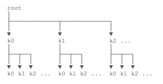
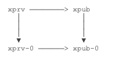
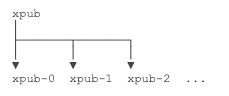
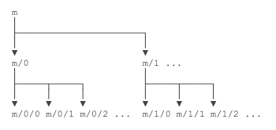

# HD 钱包

## 1 原理

### 1.1 什么是 HD 钱包

**钱包的特性：**

- 任何人都可以自己独立的，不联网的生成自己的钱包
- 钱不在钱包里。钱包唯一记录就是一个私钥
- 钱的数量存在区块链上

通常不同币种的钱包生成的私钥是不同的

**HD 钱包：**

能不能只用一个私钥管理成千上万个地址？实际上是可以的。虽然椭圆曲线算法决定了一个私钥只能对应一个公钥，但是，可以通过某种确定性算法，先确定一个私钥 k1，然后计算出 `k2、k3、k4……` 等其他私钥，就相当于只需要管理一个私钥，剩下的私钥可以按需计算出来

> 这种根据某种确定性算法，只需要管理一个根私钥，即可实时计算所有 “子私钥” 的管理方式，称为 HD 钱包。HD 是 `Hierarchical Deterministic` 的缩写，意思是分层确定性

先确定根私钥 root，然后根据索引计算每一层的子私钥：



HD 层级实际上是无限的，每一层索引从 0 ～ 232，约 43 亿个子 key。这种计算被称为衍生（Derivation）

### 1.2 如何计算子私钥

如何根据某个私钥计算下一层的子私钥？

HD 钱包采用的计算子私钥的算法是一个扩展的 512 位私钥，记作 xprv，它通过 SHA-512 算法配合 ECC 计算出子扩展私钥，仍然是 512 位。**通过扩展私钥可计算出用于签名的私钥以及公钥**

简单来说，只要给定一个根扩展私钥（随机 512 位整数），即可计算其任意索引的子扩展私钥。扩展私钥总是能计算出扩展公钥，记作 xpub：



从 xprv 及其对应的 xpub 可计算出真正用于签名的私钥和公钥。之所以要设计这种算法，是因为扩展公钥 xpub 也有一个特点，那就是可以直接计算其子层级的扩展公钥：



> 因为 xpub 只包含公钥，不包含私钥，因此，可以安全地把 xpub 交给第三方（例如，一个观察钱包），它可以根据 xpub 计算子层级的所有地址，然后在比特币的链上监控这些地址的余额

**因此，HD 钱包通过分层确定性算法，实现了以下功能：**

- 只要确定了扩展私钥 xprv，即可根据索引计算下一层的任何扩展私钥
- 只要确定了扩展公钥 xpub，即可根据索引计算下一层的任何扩展公钥
- 用户只需保存顶层的一个扩展私钥，即可计算出任意一层的任意索引的扩展私钥

> 比特币的 BIP-32 规范详细定义了 HD 算法原理和各种推导规则，可阅读此文档以便实现 HD 钱包

## 2 钱包层级

通常把根扩展私钥记作 `m`，子扩展私钥按层级记作 `m/x/y/z` 等



例如，`m/0/2` 表示从 `m` 扩展到 `m/0`（索引为 0）再扩展到 `m/0/2`（索引为 2）

### 2.1 实例：计算 HD 地址

**通过 `bitcoinjs-lib` 来计算 HD 地址：**

```js
const bitcoin = require('bitcoinjs-lib');

// 以 xprv 开头的 xprv9s21ZrQH...是 512 位扩展私钥的 Base58 编码，解码后得到的就是原始扩展私钥
let xprv =
  'xprv9s21ZrQH143K4EKMS3q1vbJo564QAbs98BfXQME6nk8UCrnXnv8vWg9qmtup3kTug96p5E3AvarBhPMScQDqMhEEm41rpYEdXBL8qzVZtwz';
let root = bitcoin.HDNode.fromBase58(xprv);

// m/0:
let m_0 = root.derive(0);
console.log('xprv m/0: ' + m_0.toBase58());
console.log('xpub m/0: ' + m_0.neutered().toBase58());
console.log(' prv m/0: ' + m_0.keyPair.toWIF());
console.log(' pub m/0: ' + m_0.keyPair.getAddress());

// m/1:
let m_1 = root.derive(0);
console.log('xprv m/1: ' + m_1.toBase58());
console.log('xpub m/1: ' + m_1.neutered().toBase58());
console.log(' prv m/1: ' + m_1.keyPair.toWIF());
console.log(' pub m/1: ' + m_1.keyPair.getAddress());
```

**某个 xpub 在没有 xprv 的前提下推算子公钥：**

```js
const bitcoin = require('bitcoinjs-lib');

let xprv =
  'xprv9s21ZrQH143K4EKMS3q1vbJo564QAbs98BfXQME6nk8UCrnXnv8vWg9qmtup3kTug96p5E3AvarBhPMScQDqMhEEm41rpYEdXBL8qzVZtwz';
let root = bitcoin.HDNode.fromBase58(xprv);

// m/0:
let m_0 = root.derive(0);
let xprv_m_0 = m_0.toBase58();
let xpub_m_0 = m_0.neutered().toBase58();

// 方法一：从 m/0 的扩展私钥推算 m/0/99 的公钥地址:
let pub_99a = bitcoin.HDNode.fromBase58(xprv_m_0)
  .derive(99)
  .getAddress();

// 方法二：从 m/0 的扩展公钥推算 m/0/99 的公钥地址:
let pub_99b = bitcoin.HDNode.fromBase58(xpub_m_0)
  .derive(99)
  .getAddress();

// 比较公钥地址是否相同:
console.log(pub_99a);
console.log(pub_99b);
```

### 2.2 BIP-44 钱包层级规范

HD 钱包理论上有无限的层级，对使用 `secp256k1` 算法的任何币都适用。但是，如果一种钱包使用 `m/1/2/x`，另一种钱包使用 `m/3/4/x`，没有一种统一的规范，就会乱套

**比特币的 `BIP-44` 规范定义了一种如何派生私钥的标准：**

```
m / purpose' / coin_type' / account' / change / address_index
```

- `purpose` 总是 44
- `coin_type` 在 `SLIP-44` 中定义，例如，`0 = BTC`，`2 = LTC`，`60 = ETH` 等
- `account` 表示用户的某个“账户”，由用户自定义索引
- `change = 0` 表示外部交易，`change = 1` 表示内部交易
- `address_index` 则是真正派生的索引为 `0 ～ 2^31` 的地址

**例如，某个比特币钱包给用户创建的一组 HD 地址实际上是：**

```
m/44'/0'/0'/0/0
m/44'/0'/0'/0/1
m/44'/0'/0'/0/2
m/44'/0'/0'/0/3
...
```

**如果是莱特币钱包，则用户的 HD 地址是：**

```
m/44'/2'/0'/0/0
m/44'/2'/0'/0/1
m/44'/2'/0'/0/2
m/44'/2'/0'/0/3
...
```

> 实现了 `BIP-44` 规范的钱包可以管理所有币种。相同的根扩展私钥在不同钱包上派生的一组地址都是相同的

## 3 助记词

### 3.1 助记词是什么

从 HD 钱包的创建方式可知，要创建一个 HD 钱包，我们必须首先有一个确定的 `512bit`（64 字节）的随机数种子

如果用电脑生成一个 64 字节的随机数作为种子当然是可以的，但是恐怕谁也记不住。

如果自己想一个句子，例如 `bitcoin is awesome`，然后计算 `SHA-512` 获得这个 64 字节的种子，虽然是可行的，但是其安全性取决于自己想的句子到底有多随机。像 `bitcoin is awesome` 本质上就是 3 个英文单词构成的随机数，长度太短，所以安全性非常差

> 为了解决初始化种子的易用性问题，`BIP-39` 规范提出了一种通过助记词来推算种子的算法

### 3.2 如何生成助记词

1. 挑选 2048 个常用的英文单词，构造一个数组：`const words = ['abandon', 'ability', 'able', ..., 'zoo']`
1. 生成 `128~256` 位随机数，注意随机数的总位数必须是 32 的倍数。例如，生成的 256 位随机数以 16 进制表示为：`179e5af5ef66e5da5049cd3de0258c5339a722094e0fdbbbe0e96f148ae80924`
1. 在随机数末尾加上校验码，校验码取 `SHA-256` 的前若干位，并使得总位数凑成 11 的倍数
1. 上述随机数校验码的二进制表示为 `00010000`
1. 将 `随机数 + 校验码` 按每 `11 bit` 一组，得到范围是 `0 ~ 2047` 的 24 个整数
1. 把这 24 个整数作为索引，就得到了最多 24 个助记词

例如：bleak version runway tell hour unfold donkey defy digital abuse glide please omit much cement sea sweet tenant demise taste emerge inject cause link

由于在生成助记词的过程中引入了校验码，所以，助记词如果弄错了，软件可以提示用户输入的助记词可能不对

> 生成助记词的过程是计算机随机产生的，用户只要记住这些助记词，就可以根据助记词推算出 HD 钱包的种子。注意：不要自己挑选助记词，原因一是随机性太差，二是缺少校验

### 3.3 实例：生成助记词

```js
// 生成助记词可以使用 bip39 这个 JavaScript 库
const bip39 = require('bip39');

let words = bip39.generateMnemonic(256);

console.log(words);
console.log('is valid mnemonic? ' + bip39.validateMnemonic(words));
```

如果想用中文作助记词也是可以的，给 `generateMnemonic()` 传入一个中文助记词数组即可：

```js
const bip39 = require('bip39');

// 第二个参数 rng 可以为 null:
let words = bip39.generateMnemonic(256, null, bip39.wordlists.chinese_simplified);

console.log(words);
```

> 注意：同样索引的中文和英文生成的 HD 种子是不同的。各种语言的助记词定义在 `bip-0039-wordlists.md`

### 3.4 根据助记词推算种子

根据助记词推算种子的算法是 `PBKDF2`，使用的哈希函数是 `Hmac-SHA512`，其中，输入是助记词的 `UTF-8` 编码，并设置 `Key` 为 `mnemonic + 用户口令`，循环 2048 次，得到最终的 64 字节种子

上述助记词加上口令 bitcoin 得到的 HD 种子是：

```
b59a8078d4ac5c05b0c92b775b96a466cd136664bfe14c1d49aff3ccc94d52dfb1d59ee628426192eff5535d6058cb64317ef2992c8b124d0f72af81c9ebfaaa
```

**该种子即为 HD 钱包的种子**

> 注意：用户除了需要记住助记词外，还可以额外设置一个口令。HD 种子的生成依赖于助记词和口令，丢失助记词或者丢失口令（如果设置了口令的话）都将导致 HD 钱包丢失！

### 3.4 实例：生成种子

```js
const bip39 = require('bip39');

// 生成助记词
let words = bip39.generateMnemonic(256);

// 生成种子
let seedBuffer = bip39.mnemonicToSeed(words);
let seedAsHex = seedBuffer.toString('hex');
// or use bip39.mnemonicToSeedHex(words)

console.log(words);
console.log(seedAsHex);
```

根据助记词和口令生成 HD 种子的方法是在 `mnemonicToSeed()` 函数中传入 `password`：

```js
const bip39 = require('bip39');

// 生成助记词
let words = bip39.generateMnemonic(256);
console.log(words);

let password = 'bitcoin';

// 生成种子
let seedAsHex = bip39.mnemonicToSeedHex(words, password);
console.log(seedAsHex);
```

### 3.5 完整实例

我们使用 `助记词 + 口令` 的方式来生成一个 HD 钱包的 HD 种子并计算出根扩展私钥：

```js
const bitcoin = require('bitcoinjs-lib');
const bip39 = require('bip39');

const words =
  'bleak version runway tell hour unfold donkey defy digital abuse glide please omit much cement sea sweet tenant demise taste emerge inject cause link';
const password = 'bitcoin';

// 计算 seed
let seedHex = bip39.mnemonicToSeedHex(words, password);
console.log('seed: ' + seedHex); // b59a8078...c9ebfaaa

// 生成 root
let root = bitcoin.HDNode.fromSeedHex(seedHex);
console.log('xprv: ' + root.toBase58()); // xprv9s21ZrQH...uLgyr9kF
console.log('xpub: ' + root.neutered().toBase58()); // xpub661MyMwA...oy32fcRG

// 生成派生 key
let child0 = root.derivePath("m/44'/0'/0'/0/0");
console.log("prv m/44'/0'/0'/0/0: " + child0.keyPair.toWIF()); // KzuPk3PXKdnd6QwLqUCK38PrXoqJfJmACzxTaa6TFKzPJR7H7AFg
console.log("pub m/44'/0'/0'/0/0: " + child0.getAddress()); // 1PwKkrF366RdTuYsS8KWEbGxfP4bikegcS
```

可以通过 [https://iancoleman.io/bip39/](https://iancoleman.io/bip39/) 在线测试 `BIP-39` 并生成 HD 钱包

## 4 地址监控

**地址数量过大问题：**

一个 HD 钱包管理的是一组自动计算的地址。以比特币为例，在确定了根扩展私钥 m 后，得到一组地址为 `m/44'/0'/0'/0/x`，其中 `x = 0 ~ 2^31`

HD 钱包需要在链上监控每个 TX 的输入和输出，看看上述管理的一组地址是否存在于输入和输出中。如果作为输入，则钱包余额减少，如果作为输出，则钱包余额增加

现在问题来了：如何根据 TX 的输入和输出地址快速判断这些地址中是否存在 HD 钱包管理的地址？

首先，可用的地址高达 `2^31` 个，这个数太大了，用户不可能用完，因此，HD 钱包只会预生成前 1000 个地址（即索引号为 0 ～ 999）并保存在本地数据库中，如果不够了，再继续扩展 1000 个，这样，HD 钱包管理的地址数量不会太大

**如何高效查询地址：**

其次，要在上千个地址集合中快速判断某个地址是否存在，查询数据库是一个非常低效的方式。以哈希表存储在内存中虽然效率很高，但管理的集合数量太多，占用的内存会非常大。

要做到高效的查询和低空间占用率，可以使用 **布隆过滤器（Bloom Filter）**，它是由 Burton Howard Bloom 在 1970 年提出的

其原理是将每个元素通过若干个哈希函数映射成一个位数组的若干个点，将其置 1。检索的时候，先计算给定元素对应位是否全 1，如果是全 1，则给定元素很可能存在，否则，元素必定不存在
