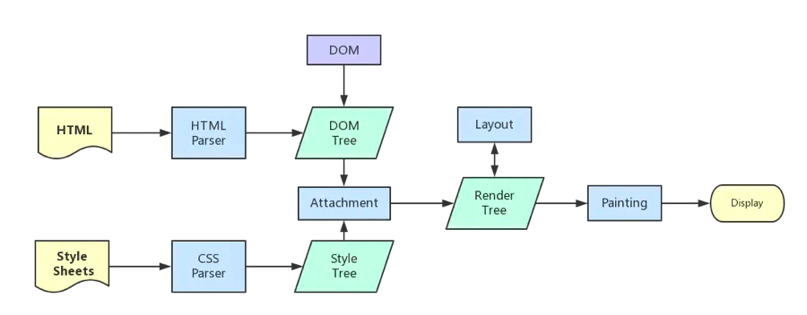
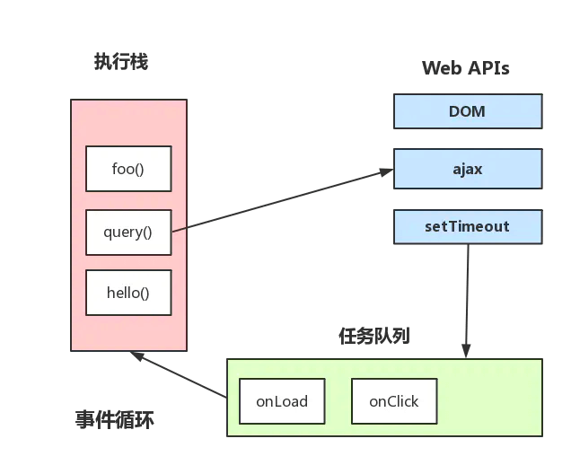

# 浏览器工作原理

文章搬运自：

作者：dailc

链接：https://juejin.cn/post/6844903553795014663

来源：掘金

## 1 进程和线程

**下面通过比喻描述进程和线程：**

- 进程是一个工厂，工厂有它的独立资源 -> 系统分配的内存（独立的一块内存）
- 工厂之间的相互独立 -> 进程之间相互独立
- 多个工人协作完成任务 -> 多个线程在进程中协作完成任务
- 工厂内有一个或多个工人 -> 一个进程由一个或多个线程组成
- 工人之间共享空间 -> 同一进程下的各个线程之间共享程序的内存空间（包括代码段、数据集、堆等）

**较为官方的术语描述进程和线程：**

- 进程是 cpu 资源分配的最小单位（是能拥有资源和独立运行的最小单位）
- 线程是 cpu 调度的最小单位（线程是建立在进程的基础上的一次程序运行单位，一个进程中可以有多个线程）

**注意点：**

- 不同进程之间也可以通信，不过代价较大
- 现在，一般通用的叫法：单线程与多线程，都是指在一个进程内的单和多（所以核心还是得属于一个进程才行）

## 2 浏览器是多进程的

**浏览器进程与线程的简化理解：**

- 浏览器是多进程的
- 浏览器之所以能够运行，是因为系统给它的进程分配了资源（cpu、内存）
- 简单点理解，每打开一个 `Tab` 页，就相当于创建了一个独立的浏览器进程。

> **注意：**在这里浏览器应该也有自己的优化机制，有时候打开多个 `tab` 页后，可以在 `Chrome` 任务管理器中看到，有些进程被合并了

### 2.1 浏览器都包含哪些进程

**浏览器包含哪些进程：（为了简化理解，仅列举主要进程）**

- `Browser` 进程：浏览器的主进程（负责协调、主控），只有一个。作用有：
  1. 负责浏览器界面显示，与用户交互。如前进，后退等
  2. 负责各个页面的管理，创建和销毁其他进程
  3. 将 `Renderer` 进程得到的内存中的 `Bitmap`，绘制到用户界面上
  4. 网络资源的管理，下载等
- 第三方插件进程：每种类型的插件对应一个进程，仅当使用该插件时才创建
- `GPU` 进程：最多一个，用于 3D 绘制等
- 浏览器渲染进程（浏览器内核）（`Renderer` 进程，内部是多线程的）：默认每个 Tab 页面一个进程，互不影响。主要作用为：
  1. 页面渲染
  2. 脚本执行
  3. 事件处理等
  4. 异步请求

### 2.2 浏览器多进程的优势

**相比于单进程浏览器，多进程有如下优点：**

- 避免单个页面崩溃影响整个浏览器
- 避免第三方插件崩溃影响整个浏览器
- 多进程充分利用多核优势
- 方便使用沙盒模型隔离插件等进程，提高浏览器稳定性

> 简单点理解：如果浏览器是单进程，那么某个 `Tab` 页崩溃了，就影响了整个浏览器，体验有多差；同理如果是单进程，插件崩溃了也会影响整个浏览器；而且多进程还有其它的诸多优势。。。

当然，内存等资源消耗也会更大，有点空间换时间的意思。

### 2.3 重点是浏览器内核（渲染进程）

重点来了，我们可以看到，上面提到了这么多的进程，那么，对于普通的前端操作来说，最终要的是什么呢？答案是渲染进程

> 可以这样理解，页面的渲染，JS 的执行，事件的循环，都在这个进程内进行

**浏览器进程包含了哪些线程：**

- `UI 线程` 负责绘制工具栏中的按钮、地址栏等
- `网络线程` 负责从网络中获取数据
- `存储线程` 负责文件等功能

**渲染进程包含了哪些线程（列举一些主要常驻线程）：**

- `GUI` 渲染线程
  1. 负责渲染浏览器界面，解析 `HTML`，`CSS`，构建 `DOM` 树和 `RenderObject` 树，布局和绘制等
  1. 当界面需要重绘（Repaint）或由于某种操作引发回流 (reflow) 时，该线程就会执行
  1. 注意，**GUI 渲染线程与 JS 引擎线程是互斥的**，当 `JS` 引擎执行时 `GUI` 线程会被挂起（相当于被冻结了），`GUI` 更新会被保存在一个队列中等到 `JS` 引擎空闲时立即被执行
- `JS` 引擎线程
  1. 也称为 `JS` 内核，负责处理 `Javascript` 脚本程序。（例如 V8 引擎）
  1. `JS` 引擎线程负责解析 `Javascript` 脚本，运行代码
  1. `JS` 引擎一直等待着任务队列中任务的到来，然后加以处理，一个 `Tab` 页（`renderer` 进程）中无论什么时候都只有一个 `JS` 线程在运行 `JS` 程序
  1. 同样注意，**`GUI` 渲染线程与 `JS` 引擎线程是互斥的**，所以如果 `JS` 执行的时间过长，这样就会造成页面的渲染不连贯，导致页面渲染加载阻塞
- 事件触发线程
  1. 归属于浏览器而不是 `JS` 引擎，用来控制事件循环（可以理解，`JS` 引擎自己都忙不过来，需要浏览器另开线程协助）
  1. 当 `JS` 引擎执行代码块如 `setTimeOut` 时（也可来自浏览器内核的其他线程,如鼠标点击、`AJAX` 异步请求等），会将对应任务添加到事件线程中
  1. 当对应的事件符合触发条件被触发时，该线程会把事件添加到待处理队列的队尾，等待 `JS` 引擎的处理
  1. 注意，由于 `JS` 的单线程关系，所以这些待处理队列中的事件都得排队等待 `JS` 引擎处理（当 `JS` 引擎空闲时才会去执行）
- 定时触发器线程
  1. 传说中的 `setInterval` 与 `setTimeout` 所在线程
  1. 浏览器定时计数器并不是由 `JavaScript` 引擎计数的,（因为 `JavaScript` 引擎是单线程的, 如果处于阻塞线程状态就会影响记计时的准确）
  1. 因此通过单独线程来计时并触发定时（计时完毕后，添加到事件队列中，等待 `JS` 引擎空闲后执行）
  1. 注意，`W3C` 在 `HTML` 标准中规定，规定要求 `setTimeout` 中低于 `4ms` 的时间间隔算为 `4ms`
- 异步 http 请求线程
  1. 在 `XMLHttpRequest` 在连接后是通过浏览器新开一个线程请求
  1. 将检测到状态变更时，如果设置有回调函数，异步线程就产生状态变更事件，将这个回调再放入事件队列中。再由 `JavaScript` 引擎执行。

### 2.4 主进程和渲染进行的通信过程

**整个的过程：(简化了很多)**

- `Browser` 进程收到用户请求，首先需要获取页面内容（譬如通过网络下载资源），随后将该任务通过 `RendererHost` 接口传递给 `Render` 进程 (http 请求获取页面资源是在主进程)
- `Renderer` 进程的 `Renderer` 接口收到消息，简单解释后，交给渲染线程，然后开始渲染
  1. 渲染线程接收请求，加载网页并渲染网页，这其中可能需要 `Browser` 进程获取资源和需要 `GPU` 进程来帮助渲染
  1. 当然可能会有 `JS` 线程操作 `DOM`（这样可能会造成回流并重绘）
  1. 最后 `Render` 进程将结果传递给 `Browser` 进程
- `Browser` 进程接收到结果并将结果绘制出来

## 3 浏览器内核中线程之间的关系

### 3.1 GUI 渲染线程与 JS 线程互斥

由于 `JavaScript` 是可操纵 `DOM` 的，如果在修改这些元素属性同时渲染界面（即 `JS` 线程和 `UI` 线程同时运行），那么渲染线程前后获得的元素数据就可能不一致了

因此为了防止渲染出现不可预期的结果，浏览器设置 `GUI` 渲染线程与 `JS` 引擎为互斥的关系，当 `JS` 引擎执行时 `GUI` 线程会被挂起，`GUI` 更新则会被保存在一个队列中等到 `JS` 引擎线程空闲时立即被执行

### 3.2 JS 阻塞页面渲染

从上述的互斥关系，可以推导出，`JS` 如果执行时间过长就会阻塞页面

譬如，假设 `JS` 引擎正在进行巨量的计算，此时就算 `GUI` 有更新，也会被保存到队列中，等待 `JS` 引擎空闲后执行。然后，由于巨量计算，所以 JS 引擎很可能很久很久后才能空闲，自然会感觉到巨卡无比

所以，要尽量避免 JS 执行时间过长，这样就会造成页面的渲染不连贯，导致页面渲染加载阻塞的感觉

### 3.3 WebWorker

前文中有提到 `JS` 引擎是单线程的，而且 `JS` 执行时间过长会阻塞页面，那么 `JS` 就真的对 `cpu` 密集型计算无能为力么？

所以，后来 HTML5 中支持了 Web Worker

**MDN 的官方解释是：**

`Web Worker` 为 `Web` 内容在后台线程中运行脚本提供了一种简单的方法。线程可以执行任务而不干扰用户界面

一个 `worker` 是使用一个构造函数创建的一个对象(`e.g. Worker()`) 运行一个命名的 `JavaScript` 文件

这个文件包含将在工作线程中运行的代码; `workers` 运行在另一个全局上下文中，不同于当前的 `window`

因此，使用 `window` 快捷方式获取当前全局的范围 (而不是 `self`) 在一个 `Worker` 内将返回错误

**这样理解下：**

- 创建 `Worker` 时，`JS` 引擎向浏览器申请开一个子线程（子线程是浏览器开的，完全受主线程控制，而且不能操作 `DOM`）
- `JS` 引擎线程与 `worker` 线程间通过特定的方式通信（`postMessage API`，需要通过序列化对象来与线程交互特定的数据）

所以，如果有非常耗时的工作，请单独开一个 `Worker` 线程，这样里面不管如何翻天覆地都不会影响 `JS` 引擎主线程，只待计算出结果后，将结果通信给主线程即可，perfect!

而且注意下，**JS 引擎是单线程的**，这一点的本质仍然未改变，Worker 可以理解是浏览器给 JS 引擎开的外挂，专门用来解决那些大量计算问题

### 3.4 WebWorker 与 SharedWorker

这里再提一下 `SharedWorker`（避免后续将这两个概念搞混）

- `WebWorker` 只属于某个页面，不会和其他页面的 `Render` 进程（浏览器内核进程）共享
  - 所以 `Chrome` 在 `Render` 进程中（每一个 `Tab` 页就是一个 `render` 进程）创建一个新的线程来运行 `Worker` 中的 `JavaScript` 程序
- `SharedWorker` 是浏览器所有页面共享的，不能采用与 `Worker` 同样的方式实现，因为它不隶属于某个 `Render` 进程，可以为多个 `Render` 进程共享使用
  - 所以 `Chrome` 浏览器为 `SharedWorker` 单独创建一个进程来运行 `JavaScript` 程序，在浏览器中每个相同的 `JavaScript` 只存在一个 `SharedWorker` 进程，不管它被创建多少次

看到这里，应该就很容易明白了，本质上就是进程和线程的区别。`SharedWorker` 由独立的进程管理，`WebWorker` 只是属于 `render` 进程下的一个线程

## 4 浏览器渲染流程

**为了简化理解，前期工作直接省略成：**

1. 浏览器输入 `url`，浏览器主进程接管
1. 按下回车开始访问时，开一个下载线程，主进程的 `UI` 线程将借助网络线程访问站点资源
1. 同时网络线程会根据适当的网络协议，例如 `DNS lookup` 和 `TLS` 为这次请求建立连接
1. 然后进行 `http` 请求（略去 `DNS` 查询，`IP` 寻址等等操作），然后等待响应，获取内容，随后将内容通过 `RendererHost` 接口转交给 `Renderer` 进程

- 浏览器渲染流程开始

**额外资源的加载:**

1. 一个网站通常还会使用类似图片，样式文件和 `JavaScript` 代码等额外的资源
1. 这些资源也需要从网络或缓存中获取，主线程在转化 `HTML` 的过程中理应挨个加载它们
1. 为了提高效率，预加载扫描（Preload Scanner）与转换过程会同时运行着
1. 当预加载扫描在分析器分析 `HTML` 过程中发现了类似 `img` 或 `link` 这样的标签时，就会发送请求给浏览器进程的网络线程
1. 主线程会根据这些额外资源是否会阻塞转化过程而决定是否等待资源加载完毕

**浏览器器内核拿到内容后，渲染大概可以划分成以下几个步骤：**

1. 解析 `html` 建立 `dom` 树
1. 解析 `css` 构建 `render` 树（将 `CSS` 代码解析成树形的数据结构，然后结合 `DOM` 合并成 `render` 树）
1. 布局 `render` 树（Layout/reflow），负责各元素尺寸、位置的计算
1. 绘制 `render` 树（paint），绘制页面像素信息
1. 浏览器会将各层的信息发送给 `GPU`，`GPU` 会将各层合成（`composite`），显示在屏幕上

所有详细步骤都已经略去，渲染完毕后就是 `load` 事件了，之后就是自己的 `JS` 逻辑处理了



### 4.1 load 与 DOMContentLoaded

上面提到，渲染完毕后会触发 `load` 事件，那么你能分清楚 `load` 事件与 `DOMContentLoaded` 事件的先后么？

- 当 `DOMContentLoaded` 事件触发时，仅当 `DOM` 加载完成，不包括样式表，图片。(譬如如果有 `async` 加载的脚本就不一定完成)
- 当 `onload` 事件触发时，页面上所有的 `DOM`，样式表，脚本，图片都已经加载完成了。（渲染完毕了）

> 所以，顺序是：`DOMContentLoaded -> load`

### 4.2 css 加载会阻塞渲染

这里说的是头部引入 `css` 的情况

> 首先，我们都知道：css 是由单独的下载线程异步下载的

**然后再说下几个现象：**

- `css` 加载不会阻塞 `DOM` 树解析（异步加载时 `DOM` 照常构建）
- 但会阻塞 `render` 树渲染（渲染时需等 `css` 加载完毕，因为 `render` 树需要 `css` 信息）

这也是浏览器的一种优化机制:

因为你加载 `css` 的时候，可能会修改下面 `DOM` 节点的样式，如果 `css` 加载不阻塞 `render` 树渲染的话，那么当 `css` 加载完之后，`render` 树可能又得重新重绘或者回流了，这就造成了一些没有必要的损耗。所以干脆就先把 `DOM` 树的结构先解析完，把可以做的工作做完，然后等你 `css` 加载完之后，在根据最终的样式来渲染 `render` 树，这种做法性能方面确实会比较好一点

### 4.3 普通图层和复合图层

渲染步骤中就提到了 `composite` 概念

可以简单的这样理解，浏览器渲染的图层一般包含两大类：`普通图层` 以及 `复合图层`

首先，普通文档流内可以理解为一个复合图层（这里称为`默认复合层`，里面不管添加多少元素，其实都是在同一个复合图层中）

其次，`absolute` 布局（`fixed` 也一样），虽然可以脱离普通文档流，但它仍然属于默认复合层

然后，可以通过 `硬件加速` 的方式，声明一个 `新的复合图层`，它会单独分配资源（当然也会脱离普通文档流，这样一来，不管这个复合图层中怎么变化，也不会影响 `默认复合层` 里的回流重绘）

可以简单理解下：**GPU 中，各个复合图层是单独绘制的，所以互不影响**，这也是为什么某些场景硬件加速效果一级棒

**如何变成复合图层（硬件加速）:**

将该元素变成一个复合图层，就是传说中的硬件加速技术

- 最常用的方式：`translate3d`、`translateZ`
- `opacity` 属性/过渡动画（需要动画执行的过程中才会创建合成层，动画没有开始或结束后元素还会回到之前的状态）
- `will-chang` 属性（这个比较偏僻），一般配合 `opacity` 与 `translate` 使用（而且经测试，除了上述可以引发硬件加速的属性外，其它属性并不会变成复合层）
- `<video>` `<iframe>` `<canvas>` `<webgl>` 等元素

**absolute 和硬件加速的区别：**

可以看到，`absolute` 虽然可以脱离普通文档流，但是无法脱离默认复合层。所以，就算 `absolute` 中信息改变时不会改变普通文档流中 render 树，但是，浏览器最终绘制时，是整个复合层绘制的，所以 `absolute` 中信息的改变，仍然会影响整个复合层的绘制。（浏览器会重绘它，如果复合层中内容多，`absolute` 带来的绘制信息变化过大，资源消耗是非常严重的）

而硬件加速直接就是在另一个复合层了（另起炉灶），所以它的信息改变不会影响默认复合层（当然了，内部肯定会影响属于自己的复合层），仅仅是引发最后的合成（输出视图）

**复合图层的作用：**

一般一个元素开启硬件加速后会变成复合图层，可以独立于普通文档流中，改动后可以避免整个页面重绘，提升性能

> 但是尽量不要大量使用复合图层，否则由于资源消耗过度，页面反而会变的更卡

**硬件加速时请使用 index：**

使用硬件加速时，尽可能的使用 `index`，防止浏览器默认给后续的元素创建复合层渲染

具体的原理时这样的：`webkit CSS3` 中，如果这个元素添加了硬件加速，并且 `index` 层级比较低，那么在这个元素的后面其它元素（层级比这个元素高的，或者相同的，并且 `releative` 或 `absolute` 属性相同的），
会默认变为复合层渲染，如果处理不当会极大的影响性能

简单点理解，其实可以认为是一个隐式合成的概念：**如果 `a` 是一个复合图层，而且 `b` 在 `a` 上面，那么 `b` 也会被隐式转为一个复合图层**，这点需要特别注意

## 5 从 Event Loop 谈 JS 的运行机制

注意，这里不谈 **可执行上下文**，**VO**，**scop chain** 等概念，这里主要是结合 Event Loop 来谈 JS 代码是如何执行的

**同步任务和异步任务：**

1. JS 分为同步任务和异步任务
1. 同步任务都在主线程上执行，形成一个执行栈
1. 主线程之外，事件触发线程管理着一个任务队列，只要异步任务有了运行结果，就在任务队列之中放置一个事件
1. 一旦执行栈中的所有同步任务执行完毕（此时 `JS` 引擎空闲），系统就会读取任务队列，将可运行的异步任务添加到可执行栈中，开始执行

> 看到这里，应该就可以理解了：为什么有时候 setTimeout 推入的事件不能准时执行？因为可能在它推入到事件列表时，主线程还不空闲，正在执行其它代码，所以自然有误差

### 5.1 事件循环机制进一步补充

引用一张图片来协助理解：（参考自 Philip Roberts 的演讲《Help, I'm stuck in an event-loop》）



**上图大致描述就是：**

1. 主线程运行时会产生执行栈
1. 栈中的代码调用某些 `api` 时，它们会在事件队列中添加各种事件（当满足触发条件后，如 `ajax` 请求完毕）
1. 而栈中的代码执行完毕，就会读取事件队列中的事件，去执行那些回调
1. 如此循环
1. 注意，总是要等待栈中的代码执行完毕后才会去读取事件队列中的事件

### 5.2 定时器

**上述事件循环机制的核心是：**JS 引擎线程和事件触发线程

但事件上，里面还有一些隐藏细节，譬如调用 `setTimeout` 后，是如何等待特定时间后才添加到事件队列中的？

是 `JS` 引擎检测的么？当然不是了。它是由定时器线程控制（因为 `JS` 引擎自己都忙不过来，根本无暇分身）

为什么要单独的定时器线程？因为 `JavaScript` 引擎是单线程的, 如果处于阻塞线程状态就会影响记计时的准确，因此很有必要单独开一个线程用来计时

什么时候会用到定时器线程？当使用 `setTimeout` 或 `setInterval` 时，它需要定时器线程计时，计时完成后就会将特定的事件推入事件队列中

譬如:

```js
setTimeout(function() {
  console.log('hello!');
}, 1000);
```

这段代码的作用是当 `1000` 毫秒计时完毕后（由定时器线程计时），将回调函数推入事件队列中，等待主线程执行

```js
setTimeout(function() {
  console.log('hello!');
}, 0);

console.log('begin');
```

这段代码的效果是最快的时间内将回调函数推入事件队列中，等待主线程执行

**注意：**

- 执行结果是：先 `begin` 后 `hello!`
- 虽然代码的本意是 `0` 毫秒后就推入事件队列，但是 `W3C` 在 `HTML` 标准中规定，规定要求 `setTimeout` 中低于 `4ms` 的时间间隔算为 `4ms`

### 5.3 setTimeout 而不是 setInterval

> 用 `setTimeout` 模拟定期计时和直接用 `setInterval` 是有区别的

因为每次 `setTimeout` 计时到后就会去执行，然后执行一段时间后才会继续 `setTimeout`，中间就多了误差
（误差多少与代码执行时间有关）

而 `setInterval` 则是每次都精确的隔一段时间推入一个事件（但是，事件的实际执行时间不一定就准确，还有可能是这个事件还没执行完毕，下一个事件就来了）

**`setInterval` 有一些比较致命的问题就是：**

- 累计效应（上面提到的），如果 `setInterval` 代码在（setInterval）再次添加到队列之前还没有完成执行，

就会导致定时器代码连续运行好几次，而之间没有间隔。就算正常间隔执行，多个 `setInterval` 的代码执行时间可能会比预期小（因为代码执行需要一定时间）

**目前一般认为的最佳方案是：** 用 `setTimeout` 模拟 `setInterval`，或者特殊场合直接用 `requestAnimationFrame`

## 6 宏任务与微任务

上文中将 JS 事件循环机制梳理了一遍，在 ES5 的情况是够用了，但是在 ES6 盛行的现在，仍然会遇到一些问题，譬如下面这题：

```js
console.log('script start');

setTimeout(function() {
  console.log('setTimeout');
}, 0);

Promise.resolve()
  .then(function() {
    console.log('promise1');
  })
  .then(function() {
    console.log('promise2');
  });

console.log('script end');
```

它的正确执行顺序是这样子的：

```
script start
script end
promise1
promise2
setTimeout
```

为什么呢？因为 `Promise` 里有了一个一个新的概念：`microtask`

或者，进一步，`JS` 中分为两种任务类型：`macrotask` 和 `microtask`，在 `ECMAScript` 中，`microtask` 称为 `jobs`，`macrotask` 可称为 `task`

**它们的定义和区别，简单点可以按如下理解：**

- `macrotask`（又称之为宏任务），可以理解是每次执行栈执行的代码就是一个宏任务（包括每次从事件队列中获取一个事件回调并放到执行栈中执行）
  1. 每一个 `task` 会从头到尾将这个任务执行完毕，不会执行其它
  1. 浏览器为了能够使得 `JS` 内部 `task` 与 `DOM` 任务能够有序的执行，会在一个 `task` 执行结束后，在下一个 `task` 执行开始前，对页面进行重新渲染
- `microtask`（又称为微任务），可以理解是在当前 `task` 执行结束后立即执行的任务
  1. 也就是说，在当前 `task` 任务后，下一个 `task` 之前，在渲染之前，会执行 **所有的** 微任务
  1. 所以它的响应速度相比 `setTimeout`（`setTimeout` 是 `task`）会更快，因为无需等渲染

> 也就是说，在某一个 `macrotask` 执行完后，就会将在它执行期间产生的所有 microtask 都执行完毕（在渲染前）

**分别很么样的场景会形成 `macrotask` 和 `microtask`：**

- `macrotask`：主代码块，`setTimeout`，`setInterval` 等（可以看到，事件队列中的每一个事件都是一个 `macrotask`）
- `microtask`：`Promise`，`process.nextTick` 等

**再根据线程来理解下：**

- `macrotask` 中的事件都是放在一个事件队列中的，而这个队列由 **事件触发线程维护**
- `microtask` 中的所有微任务都是添加到微任务队列（Job Queues）中，等待当前 `macrotask` 执行完毕后执行，而这个队列由 **JS 引擎线程维护**

（这点由自己理解+推测得出，因为它是在主线程下无缝执行的）

**所以，总结下运行机制：**

1. 执行一个宏任务（栈中没有就从事件队列中获取）
1. 执行过程中如果遇到微任务，就将它添加到微任务的任务队列中
1. 宏任务执行完毕后，立即执行当前微任务队列中的所有微任务（依次执行）
1. 当前宏任务执行完毕，开始检查渲染，然后 `GUI` 线程接管渲染
1. 渲染完毕后，`JS` 线程继续接管，开始下一个宏任务（从事件队列中获取）

**另外，请注意下 Promise 的 polyfill 与官方版本的区别：**

- 官方版本中，是标准的 `microtask` 形式
- `polyfill`，一般都是通过 `setTimeout` 模拟的，所以是 `macrotask` 形式

**MutationObserver 可以用来实现 microtask：**

（它属于 `microtask`，优先级小于 `Promise`，一般是 `Promise` 不支持时才会这样做）

它是 `HTML5` 中的新特性，作用是：监听一个 `DOM` 变动，当 `DOM` 对象树发生任何变动时，`Mutation Observer` 会得到通知
