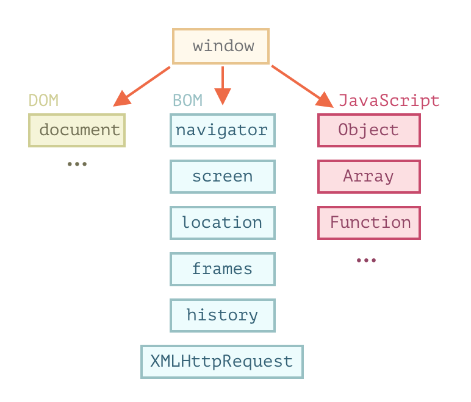
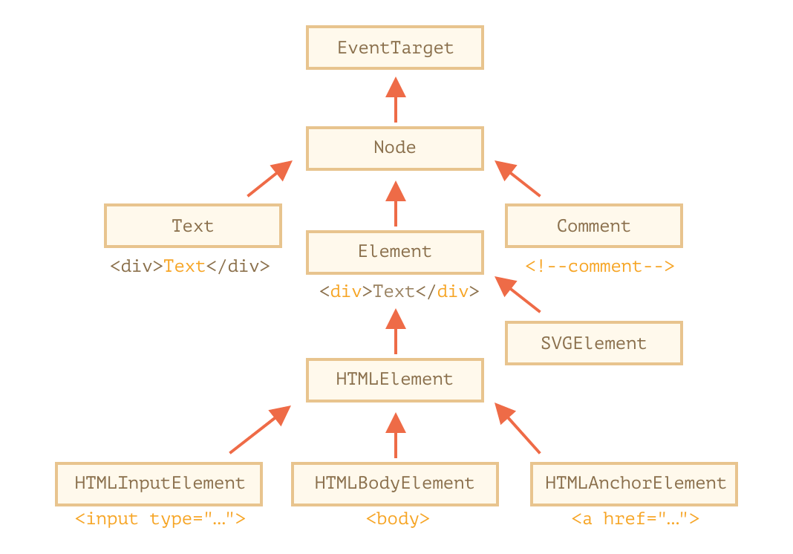
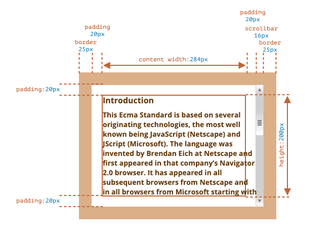
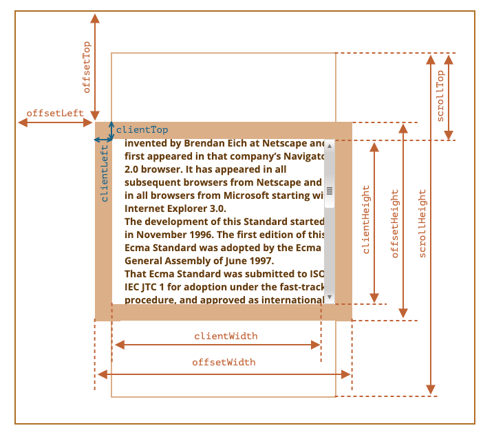
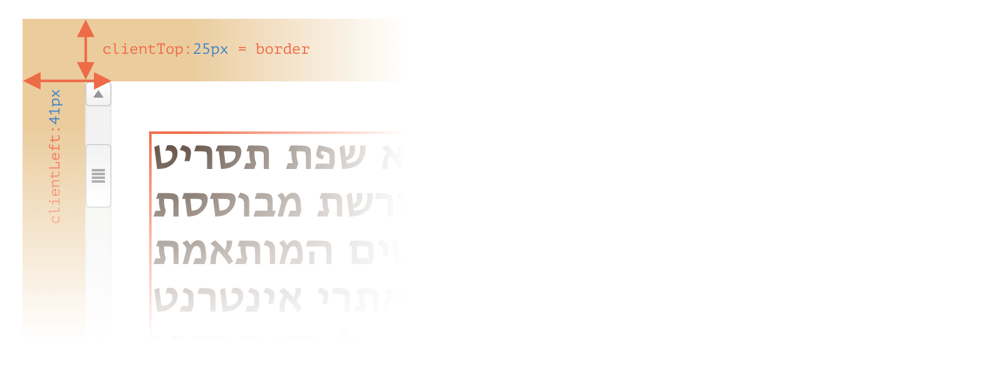
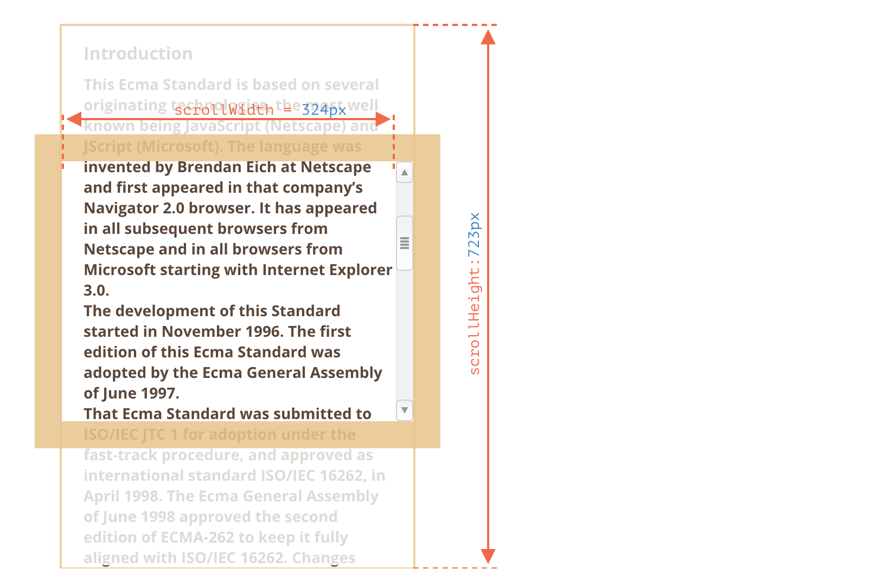
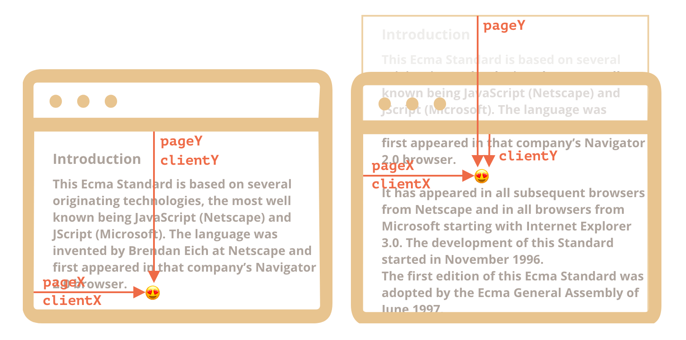
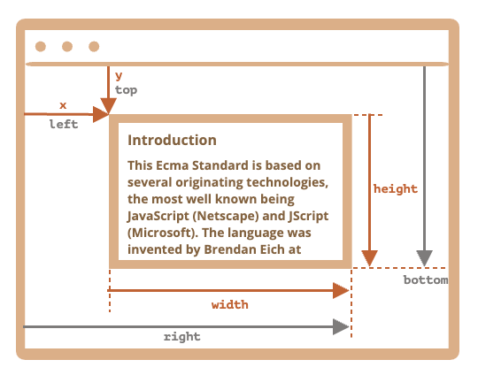

# Document

## 1 浏览器环境

JavaScript 在浏览器中运行时的环境：



### 1.1 文档对象模型（DOM）

文档对象模型（Document Object Model），简称 DOM，将所有页面内容表示为可以修改的对象

`document` 对象是页面的主要“入口点”

> 另外也有一份针对 `CSS` 规则和样式表的、单独的规范 `CSS Object Model (CSSOM)`

### 1.2 浏览器对象模型（BOM）

浏览器对象模型（Browser Object Model），简称 `BOM`，表示由浏览器（主机环境）提供的用于处理文档（document）之外的所有内容的其他对象。例如：`navigator` 对象，`location` 对象

## 2 DOM 树

> DOM 树中的对象叫做节点，节点包括元素节点、文本节点等

常用到的节点类型：

- document — DOM 的“入口点”
- 元素节点 — HTML 标签，树构建块
- 文本节点 — 包含文本
- 注释 — 有时我们可以将一些信息放入其中，它不会显示，但 JS 可以从 DOM 中读取它

## 3 遍历 DOM

### 3.1 顶层节点

- `<html> = document.documentElement`
- `<body> = document.body`
- `<head> = document.head`

### 3.2 子节点

- `childNodes` 集合(不是数组)列出了所有子节点，包括文本节点
- `firstChild` 第一个子元素
- `lastChild` 最后一个子元素

`elem.hasChildNodes()` 用于检查节点是否有子节点

### 3.3 兄弟节点和父节点

- `nextSibling` 下一个兄弟节点
- `previousSibling` 上一个兄弟节点
- `parentNode` 父节点

### 3.4 元素节点

上面列出的导航（navigation）属性引用所有节点。例如，在 `childNodes` 中我们可以看到文本节点，元素节点，甚至如果注释节点存在的话，也能访问到

只访问元素节点：

`children` — 仅那些作为元素节点的子代的节点
`firstElementChild`，`lastElementChild` — 第一个和最后一个子元素
`previousElementSibling`，`nextElementSibling` — 兄弟元素
`parentElement` — 父元素

## 4 获取元素

- `getElementById` 通过 id 获取，如果 id 不唯一就会随机获取
- `querySelectorAll` 使用 CSS 选择器
- `querySelector`
- `matches` 检查当前 elem 是否与给定的 CSS 选择器匹配，返回 true/false
- `closest` 使用 CSS 选择器，查找上级元素

> 所有的 `getElementsBy*` 方法都会返回一个 `实时的（live）` 集合。这样的集合始终反映的是文档的当前状态，并且在文档发生更改时会“自动更新”

> `querySelectorAll` 返回的是一个 `静态的` 集合

## 5 节点属性

### 5.1 DOM 节点类

DOM 节点的继承关系：

层次结构（hierarchy）的根节点是 `EventTarget`，`Node` 继承自它，其他 `DOM` 节点继承自 `Node`



- `EventTarget` — 是根的“抽象（abstract）”类。该类的对象从未被创建。它作为一个基础，以便让所有 DOM 节点都支持所谓的“事件（event）”
- `Node` — 也是一个“抽象”类，充当 DOM 节点的基础。它提供了树的核心功能：`parentNode`，`nextSibling`，`childNodes` 等（它们都是 `getter`）。Node 类的对象从未被创建。但是有一些继承自它的具体的节点类，例如：文本节点的 Text，元素节点的 Element，以及更多异域（exotic）类，例如注释节点的 Comment
- `Element` — 是 DOM 元素的基本类。它提供了元素级的导航（navigation），例如 `nextElementSibling`，`children`，以及像 `getElementsByTagName` 和 `querySelector` 这样的搜索方法。浏览器中不仅有 HTML，还会有 XML 和 SVG。Element 类充当更多特定类的基本类：SVGElement，XMLElement 和 HTMLElement
- `HTMLElement` — 最终是所有 HTML 元素的基本类。各种 HTML 元素均继承自它：
  - `HTMLInputElement` — `<input>` 元素的类
  - `HTMLBodyElement` — `<body>` 元素的类
  - `HTMLAnchorElement` — `<a>` 元素的类
  - ……等，每个标签都有自己的类，这些类可以提供特定的属性和方法

### 5.2 nodeType 属性

nodeType 是一个数值型值：

- 对于元素节点 `elem.nodeType == 1`
- 对于文本节点 `elem.nodeType == 3`
- 对于 document 对象 `elem.nodeType == 9`

> 这个属性是过时的，现在一般用 `instanceof` 和其他基于类的检查方法来查看节点类型

### 5.3 nodeName/tagName 标签名

`nodeName` 或者 `tagName` 都能获取标签名

区别：

- `tagName` 属性仅适用于 Element 节点
- `nodeName` 是为任意 Node 定义的：
  - 对于元素，它的意义与 tagName 相同
  - 对于其他节点类型（text，comment 等），它拥有一个对应节点类型的字符串

### 5.4 innerHTML/outerHTML 元素内容

**`innerHTML` 可以 `获取/修改` 元素内容**

> 脚本不会执行：如果 `innerHTML` 将一个 `<script>` 标签插入到 document 中 — 它会成为 HTML 的一部分，但是不会执行

`innerHTML` 不是附加内容，而是 `完全地重写`

> `innerHTML` 会将所有的图片和其他资源都将重写加载。带有用户输入的文本的 `<input>`，被输入的文本也会被移除

**`outerHTML` 获取元素的完整 HTML**

> 与 `innerHTML` 不同，写入 `outerHTML` 不会改变元素，而是在 DOM 中替换它。需要通过查询 DOM 来获取对新元素的引用

```js
let div = document.querySelector('div');

// 使用 <p>...</p> 替换 div.outerHTML
div.outerHTML = '<p>A new element</p>'; // (*)

// 蛤！'div' 还是原来那样！
alert(div.outerHTML); // <div>Hello, world!</div> (**)
```

- div 被从文档（document）中移除
- 另一个 HTML 片段 `<p>A new element</p>` 被插入到其位置上
- div 仍拥有其旧的值。新的 HTML 没有被赋值给任何变量

### 5.5 nodeValue/data 文本节点内容

`innerHTML` 属性仅对元素节点有效。

其他节点类型，例如文本节点，具有它们的对应项：`nodeValue` 和 `data` 属性。这两者在实际使用中几乎相同，只有细微规范上的差异

```html
<body>
  Hello
  <!-- Comment -->
  <script>
    let text = document.body.firstChild;
    alert(text.data); // Hello

    let comment = text.nextSibling;
    alert(comment.data); // Comment
  </script>
</body>
```

### 5.6 textContent 纯文本方式读写

`textContent` 提供了对元素内的文本的访问权限：仅文本，去掉所有 `<tags>`

> 写入 `textContent` 要有用得多，因为它允许以“安全方式”写入文本

- 使用 `innerHTML`，我们将其“作为 HTML”插入，带有所有 HTML 标签
- 使用 `textContent`，我们将其“作为文本”插入，所有符号（symbol）均按字面意义处理

### 5.7 其他属性

- `hidden` - 指定元素是否可见
- `value` — `<input>`，`<select>` 和 `<textarea>`（`HTMLInputElement`，`HTMLSelectElement`……）的 `value`
- `href` — `<a href="...">`（`HTMLAnchorElement`）的 `href`。
- `id` — 所有元素的 “id” `attribute` 的值

## 6 attributes 和 properties

- `attributes` - 是指写在 HTML 标签中的属性
- `properties` - JS 中 DOM 对象的属性

> 对于元素节点，大多数 `标准的` HTML 特性（attributes）会自动变成 DOM 对象的属性（properties）

### 6.1 DOM 属性 properties

DOM 节点是常规的 JavaScript 对象，DOM 属性和方法的行为就像常规的 Javascript 对象一样

可以自行添加属性和方法，还可以修改内建属性的原型，例如修改 `Element.prototype` 为所有元素添加一个新方法

### 6.2 HTML 属性 attributes

当浏览器解析 HTML 文本，并根据标签创建 DOM 对象时，浏览器会辨别 `标准的` `attributes` 并以此创建 DOM 属性，非 `标准的` `attributes` 则不会

```html
<!-- 这个 myname 就是非标准的 attributes -->
<div myname="div"></div>
```

如果一个 `attributes` 不是标准的，那么就没有相对应的 `DOM` 属性

**可以使用下面方法访问非标准 attributes：**

- `elem.hasAttribute(name)` — 检查 `attributes` 是否存在
- `elem.getAttribute(name)` — 获取这个 `attributes` 值
- `elem.setAttribute(name, value)` — 设置这个 `attributes` 值
- `elem.removeAttribute(name)` — 移除这个 `attributes`

**HTML 特性 (attributes) 有以下几个特征：**

- 它们的名字是大小写不敏感的（id 与 ID 相同）
- 它们的值总是字符串类型的

**注意点：**

- `getAttribute('About')` — 这里的第一个字母是大写的，但是在 HTML 中，它们都是小写的。但这没有影响：特性的名称是大小写不敏感的
- 我们可以将任何东西赋值给 `attributes`，但是这些东西会变成字符串类型的
- 所有 `attributes`，包括我们设置的那个 `attributes`，在 `outerHTML` 中都是可见的
- `attributes` 集合是可迭代对象，该对象将所有元素的 `attributes`（标准和非标准的）作为 `name` 和 `value` 属性存储在对象中

### 6.3 properties - attributes 同步

当一个 `标准的` `attributes` 被改变，对应的属性也会自动更新，（除了几个特例）反之亦然

> 这里也有些例外，例如 `input.value` 只能从 `attributes` 同步到 `properties`，反过来则不行

```html
<input />

<script>
  let input = document.querySelector('input');

  // attributes => properties
  input.setAttribute('value', 'text');
  alert(input.value); // text

  // 这个操作无效，properties => attributes
  input.value = 'newValue';
  alert(input.getAttribute('value')); // text（没有被更新！）
</script>
```

### 6.4 DOM 属性是多类型的

DOM 属性不总是字符串类型的。例如，`input.checked` 属性（对于 `checkbox` 的）是布尔型

```html
<input id="input" type="checkbox" checked /> checkbox

<script>
  alert(input.getAttribute('checked')); // attributes 值是：空字符串
  alert(input.checked); // properties 值是：true
</script>
```

**注意点：**

- HTML 特性 (attributes) 和 DOM 属性 (properties) 取到的值可能会不一致
- 如果要取与 HTML 中所写的完全相同的 `attributes`，可以使用 `getAttribute`

### 6.5 dataset

自定义的 `attributes` 也存在问题。HTML 语言是在不断发展的，如果我们出于我们的目的使用了非标准的 `attributes`，之后它被引入到了标准中并有了其自己的用途，就会有冲突

> 所以 `data-` 开头的 `attributes` 均被保留供程序员使用

```html
<body data-about="Elephants">
  <div id="order" class="order" data-order-state="new">A new order.</div>

  <script>
    alert(document.body.dataset.about); // Elephants

    // 读取，驼峰式
    alert(order.dataset.orderState); // new
    // 修改
    order.dataset.orderState = 'pending';
  </script>
</body>
```

## 7 修改文档

### 7.1 创建节点

- `document.createElement(tag)` 用给定的标签创建一个新 `元素节点`
- `document.createTextNode(text)`

```js
let div = document.createElement('div');
let textNode = document.createTextNode('Here I am');
```

**DocumentFragment 节点包装器**

这个方法不常用

`DocumentFragment` 是一个特殊的 `DOM` 节点，是一个包装器

插入时只会将内容插入，不会插入自身，它只是一个容器

```html
<ul id="ul"></ul>

<script>
  function getListContent() {
    let fragment = new DocumentFragment();

    for (let i = 1; i <= 3; i++) {
      let li = document.createElement('li');
      li.append(i);
      fragment.append(li);
    }

    return fragment;
  }

  ul.append(getListContent()); // (*)
</script>
```

### 7.2 插入节点

`node.append(...nodes or strings)` —— 在 `node` 末尾 插入节点或字符串
`node.prepend(...nodes or strings)` —— 在 `node` 开头 插入节点或字符串
`node.before(...nodes or strings)` —— 在 `node` 前面 插入节点或字符串
`node.after(...nodes or strings)` —— 在 `node` 后面 插入节点或字符串
`node.replaceWith(...nodes or strings)` —— 将 `node` 替换为给定的节点或字符串

```js
let div = document.createElement('div');
div.className = 'alert';
div.innerHTML = "<strong>Hi there!</strong> You've read an important message.";

document.body.append(div);
```

> 如果插入一个页面中已存在的节点，那么原有的节点会自动删除 (相当于挪一个位置)

**nsertAdjacentHTML/Text/Element**

上面这种方式需要先创建节点，然后再插入，是一种比较安全的方式

`insertAdjacentHTML` 可以直接插入 HTML 代码，就像 `innerHTML` 那样，但是这种方式不安全

**参数：**

- `beforebegin` — 将 html 插入到 elem 前插入
- `afterbegin` — 将 html 插入到 elem 开头
- `beforeend` — 将 html 插入到 elem 末尾
- `afterend` — 将 html 插入到 elem 后。

```html
<div id="div"></div>
<script>
  div.insertAdjacentHTML('beforebegin', '<p>Hello</p>');
  div.insertAdjacentHTML('afterend', '<p>Bye</p>');
</script>
```

### 7.3 移除节点

`node.remove()` 移除节点

> 如果我们要将一个元素 `移动` 到另一个地方，则无需将其从原来的位置中删除。所有插入方法都会自动从旧位置删除该节点

### 7.4 克隆节点

`elem.cloneNode()` 克隆节点

- `elem.cloneNode(true)` 深克隆 — 具有所有特性（attribute）和 `子元素`
- `elem.cloneNode(false)` 不包括子元素

### 7.5 旧式方法

所有操作是基于父元素的

- `parentElem.appendChild(node)` - 在末尾插入一个子元素
- `parentElem.insertBefore(node, nextSibling)` - `nextSibling` 是一个子元素，在 `nextSibling` 前插入 `node`
- `parentElem.replaceChild(node, oldChild)` - 将 `parentElem` 的后代中的 `oldChild` 替换为 `node`
- `parentElem.removeChild(node)` - 从 `parentElem` 中删除 `node`，（`node` 为 `parentElem` 的后代）

**document.write**

也是一个远古方法，现在不常用。直接从写 html 下的内容

## 8 样式和类

### 8.1 className 和 classList

**className:**

像 `class` 这样的保留字不能用作对象的属性，所以用 `className` 来表示

```html
<body class="main page">
  <script>
    alert(document.body.className); // main page
  </script>
</body>
```

> `className` 获取 HTML attributes 中的 class，给 `className` 赋值会替换整个属性

**classList:**

`elem.classList` 是一个特殊的对象，可以对单个类进行操作

- `elem.classList.add/remove(class)` — 添加/移除类
- `elem.classList.toggle(class)` — 如果类不存在就添加类，存在就移除它
- `elem.classList.contains(class)` — 检查给定类，返回 `true/false`

### 8.2 元素样式

**elem.style**

`elem.style` 属性是一个对象，它对应于 `style` 特性（attribute）中所写的内容

> `elem.style` 只能获取行内样式，其他地方设置的样式无法获取。设置的也是行内样式

- 对于多词属性，使用驼峰式 `elem.style.backgroundColor`
- 前缀属性 `-moz-border-radius` => `button.style.MozBorderRadius = '5px'`
- 删除某个样式，置空就行 `elem.style.display = ""`

**style.cssText**

`elem.style` 只能设置当个样式，想要以字符串的形式设置完整的样式，可以使用特殊属性 `style.cssText`

它会 **替换** 整个元素中整个 style 属性

```js
ele.style.cssText = `color: red !important;
    background-color: yellow;
    width: 100px;
    text-align: center;
  `;
```

### 8.3 getComputedStyle

`style` 属性仅对 "style" 特性（attribute）值起作用，而没有任何 CSS 级联，无法获取实际的 CSS 样式

`getComputedStyle` 可以获取元素计算后的样式，即当前实际的样式

```js
getComputedStyle(element, [pseudo]);
```

`element` - 需要被读取样式值的元素
`pseudo` - 伪元素（如果需要），例如 `::before`。空字符串或无参数则意味着元素本身

> `getComputedStyle` 获取的是解析后的值，使用的单位是固定的。比如 `height:1em` 或 `font-size:125%`，获取到的值为 `height:20px` 或 `font-size:16px`

## 9 元素大小和滚动





### 9.1 offsetParent

`offsetParent` 是最接近的祖先（ancestor），在浏览器渲染期间，它被用于计算坐标

**最近的祖先为下列之一：**

1. CSS 定位的（`position` 为 `absolute`，`relative` 或 `fixed`）
2. `<td>`，`<th>`，`<table>`
3. `<body>`

```html
<main style="position: relative" id="main">
  <article>
    <div id="example" style="position: absolute; left: 180px; top: 180px">...</div>
  </article>
</main>
<script>
  alert(example.offsetParent.id); // main
  alert(example.offsetLeft); // 180（注意：这是一个数字，不是字符串 "180px"）
  alert(example.offsetTop); // 180
</script>
```

### 9.2 位置相关属性

- `offsetLeft/offsetTop` 提供相对于 `offsetParent` 左上角的 `x/y` 坐标
- `offsetWidth/Height` 包含 `border` 的大小
- `clientTop/Left` 内侧与外侧的相对坐标，可以理解为 边框+滚动条 的宽度
- `clientWidth/Height` 元素 border 内的大小，即 `content width` 和 `padding`，但不包括滚动条宽度。如果有滚动条的话，获取的到值会比 CSS 设置的小
- `scrollWidth/Height` 包含滚动隐藏部分的宽高，不包括滚动条的宽度

> 对于未显示的元素，即 `display:none` 或不在文档中，`offsetParent` 为 `null`，并且 `offsetWidth` 和 `offsetHeight` 为 0





> 不要从 `CSS` 中获取 `width/height`，因为会受滚动条和 `box-sizing` 属性的影响

## 10 Window 大小和滚动

### 10.1 窗口宽高

- `document.documentElement.clientWidth/clientHeight` 获取窗口大小，不包含滚动条宽度
- `window.innerWidth/innerHeight` 获取窗口大小，包含滚动条宽度

### 10.2 文档宽高

**通常情况** 可以使用 `documentElement.scrollWidth/scrollHeight` 来测量文档的完整大小

但是会有兼容性问题，获取到的值会不准确

需要去下面这些值的最大值，才能准确获取文档宽高

```js
let scrollHeight = Math.max(
  document.body.scrollHeight,
  document.documentElement.scrollHeight,
  document.body.offsetHeight,
  document.documentElement.offsetHeight,
  document.body.clientHeight,
  document.documentElement.clientHeight
);
```

### 10.3 滚动条位置

**获取和设置滚动条 (有兼容性问题)：**

- `document.documentElement.scrollLeft/scrollTop` - 支持大多数浏览器
- `document.body.scrollLeft/scrollTop` - 少数浏览器

**新的方法 (旧浏览器不支持)：**

- `scrollBy(x,y)` 将页面滚动至 相对于当前位置的 `(x, y)` 位置。例如，`scrollBy(0,10)` 会将页面向下滚动 `10px`
- `scrollTo(pageX,pageY)` 将页面滚动至绝对坐标
- `elem.scrollIntoView(top)` 将滚动页面以使 `elem` 可见
  - 如果 `top=true`（默认值），页面滚动，使 `elem` 出现在窗口顶部。元素的上边缘将与窗口顶部对齐
  - 如果 `top=false`，页面滚动，使 `elem` 出现在窗口底部。元素的底部边缘将与窗口底部对齐

## 11 坐标

### 11.1 两种方式

JavaScript 方法处理的是以下两种坐标系中的一个:

- **相对于窗口** — 从窗口的顶部/左侧边缘计算得出，我们将这些坐标表示为 `clientX/clientY`
- **相对于文档** — 从文档的顶部/左侧边缘计算得出，我们将它们表示为 `pageX/pageY`



### 11.2 元素坐标

方法 `elem.getBoundingClientRect()` 返回最小矩形的窗口坐标，该矩形将 `elem` 作为内建 `DOMRect` 类的对象

- `x/y` — 矩形原点相对于窗口的 X/Y 坐标
- `width/height` — 矩形的 width/height（可以为负）
- `top/bottom` — 顶部/底部矩形边缘的 Y 坐标
- `left/right` — 左/右矩形边缘的 X 坐标



> 由于历史原因，**IE 浏览器不支持 x/y 属性**

### 11.3 获取坐标处的元素

`document.elementFromPoint(x, y)` 会返回在窗口坐标 `(x, y)` 处嵌套最多的元素

```js
let elem = document.elementFromPoint(x, y);
```

> 对于在窗口之外的坐标，`elementFromPoint` 返回 `null` <br>
> 方法 `document.elementFromPoint(x,y)` 只对在可见区域内的坐标 `(x,y)` 起作用

### 11.4 文档坐标

文档相对坐标从文档的左上角开始计算，而不是窗口

没有标准方法来获取元素的文档坐标，但是可以通过其他方式获取

```
pageY = clientY + 文档的垂直滚动出的部分的高度
pageX = clientX + 文档的水平滚动出的部分的宽度
```

```js
// 获取元素的文档坐标
function getCoords(elem) {
  let box = elem.getBoundingClientRect();

  return {
    top: box.top + window.pageYOffset,
    right: box.right + window.pageXOffset,
    bottom: box.bottom + window.pageYOffset,
    left: box.left + window.pageXOffset
  };
}
```
