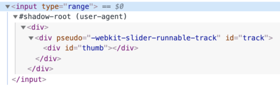
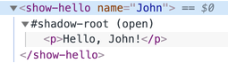

# web components

## 1 概念

浏览器已经原生支持了「Web Components」，我们就可以不用再自己去模拟组件化的结构了。

**组件化架构：**

- **Custom elements** —— 用于自定义 HTML 元素
- **Shadow DOM** —— 为组件创建内部 DOM，它对外部是不可见的
- **CSS Scoping** —— 申明仅应用于组件的 Shadow DOM 内的样式
- **Event retargeting** 以及更多的小东西，让自定义组件更适用于开发工作

## 2 Custom elements

### 2.1 概述

我们可以通过描述带有自己的方法、属性和事件等的类来创建自定义 HTML 元素

在 custom elements （自定义标签）定义完成之后，我们可以将其和 HTML 的内建标签**一同使用**

我们可以把上述的标签定义为特殊的类，然后使用它们，就好像它们本来就是 HTML 的一部分一样

**Custom elements 有两种：**

- `Autonomous custom elements （自主自定义标签）` —— “全新的” 元素, 继承自 `HTMLElement` 抽象类
- `Customized built-in elements （自定义内建元素）` —— 继承内建的 HTML 元素，比如自定义 `HTMLButtonElement` 等

在创建 custom elements 的时候，需要告诉浏览器一些细节，包括：如何展示它，以及在添加元素到页面和将其从页面移除的时候需要做什么，等等

通过创建一个带有几个特殊方法的类，我们可以完成这件事

**如何创建：**

```js
class MyElement extends HTMLElement {
  constructor() {
    super();
    // 元素在这里创建
  }

  connectedCallback() {
    // 在元素被添加到文档之后，浏览器会调用这个方法
    //（如果一个元素被反复添加到文档／移除文档，那么这个方法会被多次调用）
  }

  disconnectedCallback() {
    // 在元素从文档移除的时候，浏览器会调用这个方法
    // （如果一个元素被反复添加到文档／移除文档，那么这个方法会被多次调用）
  }

  static get observedAttributes() {
    return [
      /* 属性数组，这些属性的变化会被监视 */
    ];
  }

  attributeChangedCallback(name, oldValue, newValue) {
    // 当上面数组中的属性发生变化的时候，这个方法会被调用
  }

  adoptedCallback() {
    // 在元素被移动到新的文档的时候，这个方法会被调用
    // （document.adoptNode 会用到, 非常少见）
  }

  // 还可以添加更多的元素方法和属性
}
```

在申明了上面几个方法之后，我们需要注册元素：

```js
// 让浏览器知道我们新定义的类是为 <my-element> 服务的
customElements.define('my-element', MyElement);
```

现在当任何带有 `<my-element>` 标签的元素被创建的时候，一个 `MyElement` 的实例也会被创建，并且前面提到的方法也会被调用。我们同样可以使用 `document.createElement('my-element')` 在 JavaScript 里创建元素

> **Custom element 名称必须包括一个短横线 -**
>
> 比如 `my-element` 和 `super-button` 都是有效的元素名，但 `myelement` 并不是
>
> 这是为了确保 custom element 和内建 HTML 元素之间不会发生命名冲突

### 2.2 实例

举个例子，HTML 里面已经有 `<time>` 元素了，用于显示日期／时间。但是这个标签本身并不会对时间进行任何格式化处理

让我们来创建一个可以展示适用于当前浏览器语言的时间格式的 `<time-formatted>` 元素：

```html
<script>
  class TimeFormatted extends HTMLElement {
    // (1)

    connectedCallback() {
      let date = new Date(this.getAttribute('datetime') || Date.now());

      this.innerHTML = new Intl.DateTimeFormat('default', {
        year: this.getAttribute('year') || undefined,
        month: this.getAttribute('month') || undefined,
        day: this.getAttribute('day') || undefined,
        hour: this.getAttribute('hour') || undefined,
        minute: this.getAttribute('minute') || undefined,
        second: this.getAttribute('second') || undefined,
        timeZoneName: this.getAttribute('time-zone-name') || undefined
      }).format(date);
    }
  }

  customElements.define('time-formatted', TimeFormatted); // (2)
</script>

<!-- (3) -->
<time-formatted
  datetime="2019-12-01"
  year="numeric"
  month="long"
  day="numeric"
  hour="numeric"
  minute="numeric"
  second="numeric"
  time-zone-name="short"
></time-formatted>
```

1. 这个类只有一个方法 `connectedCallback()` —— 在 `<time-formatted>` 元素被添加到页面的时候，浏览器会调用这个方法（或者当 HTML 解析器检测到它的时候），它使用了内建的时间格式化工具 `Intl.DateTimeFormat`，这个工具可以非常好地展示格式化之后的时间，在各浏览器中兼容性都非常好
1. 我们需要通过 `customElements.define(tag, class)` 来注册这个新元素
1. 接下来在任何地方我们都可以使用这个新元素了

> **Custom elements 升级**
>
> 如果浏览器在 `customElements.define` 之前的任何地方见到了 `<time-formatted>` 元素，并不会报错。但会把这个元素当作未知元素，就像任何非标准标签一样
>
> `:not(:defined)` CSS 选择器可以对这样「未定义」的元素加上样式
>
> 当 `customElement.define` 被调用的时候，它们被「升级」了：一个新的 `TimeFormatted` 元素为每一个标签创建了，并且 `connectedCallback` 被调用。它们变成了 `:defined`
>
> **我们可以通过这些方法来获取更多的自定义标签的信息：**
>
> - `customElements.get(name)` —— 返回指定 custom element `name` 的类
> - `customElements.whenDefined(name)` —— 返回一个 `promise`，将会在这个具有给定 `name` 的 custom element 变为已定义状态的时候 resolve（不带值）

> **在 `connectedCallback` 中渲染，而不是 `constructor` 中**
>
> 在上面的例子中，元素里面的内容是在 `connectedCallback` 中渲染（创建）的
>
> 为什么不在 `constructor` 中渲染？
>
> 原因很简单：在 `constructor` 被调用的时候，还为时过早。虽然这个元素实例已经被创建了，但还没有插入页面。在这个阶段，浏览器还没有处理／创建元素属性：调用 `getAttribute` 将会得到 `null`。所以我们并不能在那里渲染元素
>
> 而且，这样作对于性能更好 —— 推迟渲染直到真正需要的时候
>
> 在元素被添加到文档的时候，它的 `connectedCallback` 方法会被调用。这个元素不仅仅是被添加为了另一个元素的子元素，同样也成为了页面的一部分。因此我们可以构建分离的 DOM，创建元素并且让它们为之后的使用准备好。它们只有在插入页面的时候才会真的被渲染

### 2.3 监视属性

上面的 `<time-formatted>` 实现中，在元素渲染以后，后续的属性变化并不会带来任何影响

为了监视这些属性，我们可以在 `observedAttributes()` static getter 中提供属性列表。当这些属性发生变化的时候，`attributeChangedCallback` 会被调用。出于性能优化的考虑，其他属性变化的时候并不会触发这个回调方法

以下是 `<time-formatted>` 的新版本，它会在属性变化的时候自动更新：

```html
<script>
  class TimeFormatted extends HTMLElement {
    render() {
      // (1)
      let date = new Date(this.getAttribute('datetime') || Date.now());

      this.innerHTML = new Intl.DateTimeFormat('default', {
        year: this.getAttribute('year') || undefined,
        month: this.getAttribute('month') || undefined,
        day: this.getAttribute('day') || undefined,
        hour: this.getAttribute('hour') || undefined,
        minute: this.getAttribute('minute') || undefined,
        second: this.getAttribute('second') || undefined,
        timeZoneName: this.getAttribute('time-zone-name') || undefined
      }).format(date);
    }

    connectedCallback() {
      // (2)
      if (!this.rendered) {
        this.render();
        this.rendered = true;
      }
    }

    static get observedAttributes() {
      // (3)
      return ['datetime', 'year', 'month', 'day', 'hour', 'minute', 'second', 'time-zone-name'];
    }

    attributeChangedCallback(name, oldValue, newValue) {
      // (4)
      this.render();
    }
  }

  customElements.define('time-formatted', TimeFormatted);
</script>

<time-formatted id="elem" hour="numeric" minute="numeric" second="numeric"></time-formatted>

<script>
  setInterval(() => elem.setAttribute('datetime', new Date()), 1000); // (5)
</script>
```

- 渲染逻辑被移动到了 `render()` 这个辅助方法里面
- 这个方法在元素被插入到页面的时候调用
- `attributeChangedCallback` 在 `observedAttributes()` 里的属性改变的时候被调用
- 然后重渲染元素

### 2.4 渲染顺序

在 HTML 解析器构建 DOM 的时候，会按照先后顺序处理元素，先处理父级元素再处理子元素。例如，如果我们有 `<outer><inner></inner></outer>`，那么 `<outer>` 元素会首先被创建并接入到 DOM，然后才是 `<inner>`

这对 custom elements 产生了重要影响

比如，如果一个 custom element 想要在 `connectedCallback` 内访问 `innerHTML`，它什么也拿不到:

```html
<script>
  customElements.define(
    'user-info',
    class extends HTMLElement {
      connectedCallback() {
        alert(this.innerHTML); // empty (*)
      }
    }
  );
</script>

<user-info>John</user-info>
```

运行上面的代码，`alert` 出来的内容是空的

这正是因为在那个阶段，子元素还不存在，DOM 还没有完成构建。HTML 解析器先连接 custom element <user-info>，然后再处理子元素，但是那时候子元素还并没有加载上。

如果我们要给 custom element 传入信息，我们可以使用元素属性。它们是即时生效的

或者，如果我们需要子元素，我们可以使用延迟时间为零的 `setTimeout` 来推迟访问子元素

这样是可行的：

```html
<script>
  customElements.define(
    'user-info',
    class extends HTMLElement {
      connectedCallback() {
        setTimeout(() => alert(this.innerHTML)); // John (*)
      }
    }
  );
</script>

<user-info>John</user-info>
```

另一方面，这个方案并不是完美的。如果嵌套的 custom element 同样使用了 `setTimeout` 来初始化自身，那么它们会按照先后顺序执行：外层的 `setTimeout` 首先触发，然后才是内层的

这样外层元素还是早于内层元素结束初始化

让我们用一个例子来说明：

```html
<script>
  customElements.define(
    'user-info',
    class extends HTMLElement {
      connectedCallback() {
        alert(`${this.id} 已连接。`);
        setTimeout(() => alert(`${this.id} 初始化完成。`));
      }
    }
  );
</script>

<user-info id="outer">
  <user-info id="inner"></user-info>
</user-info>
```

输出顺序：

```
outer 已连接。
inner 已连接。
outer 初始化完成。
inner 初始化完成。
```

我们可以很明显地看到外层元素并没有等待内层元素

> 并没有任何内建的回调方法可以在嵌套元素渲染好之后通知我们。但我们可以自己实现这样的回调。比如，内层元素可以分派像 `initialized` 这样的事件，同时外层的元素监听这样的事件并做出响应

### 2.5 Customized built-in elements

我们创建的 `<time-formatted>` 这些新元素，并没有任何相关的语义。搜索引擎并不知晓它们的存在，同时无障碍设备也无法处理它们

但上述两点同样是非常重要的。比如，搜索引擎会对这些事情感兴趣，比如我们真的展示了时间。或者如果我们创建了一个特别的按钮，为什么不复用已有的 `<button>` 功能呢？

我们可以通过继承内建元素的类来扩展和定制它们

比如，按钮是 `HTMLButtonElement` 的实例

```html
<script>
  // 这个按钮在被点击的时候说 "hello"

  // 类继承自 HTMLButtonElement
  class HelloButton extends HTMLButtonElement {
    constructor() {
      super();
      this.addEventListener('click', () => alert('Hello!'));
    }
  }

  // 给 customElements.define 提供定义标签的第三个参数
  // 这一步是必要的，因为不同的标签会共享同一个类
  customElements.define('hello-button', HelloButton, { extends: 'button' });
</script>

<!-- 插入一个普通的 <button> 标签，但添加 is="hello-button" 到这个元素，这样就可以使用我们的 custom element -->
<button is="hello-button">Click me</button>

<button is="hello-button" disabled>Disabled</button>
```

我们新定义的按钮继承了内建按钮，所以它拥有和内建按钮相同的样式和标准特性，比如 `disabled` 属性

**引用参考:**

- HTML 现行标准： https://html.spec.whatwg.org/#custom-elements
- 兼容性： https://caniuse.com/#feat=custom-elements

## 3 影子 DOM（Shadow DOM）

> Shadow DOM 为封装而生。它可以让一个组件拥有自己的「影子」DOM 树，这个 DOM 树不能在主文档中被任意访问，可能拥有局部样式规则，还有其他特性

### 3.1 内建 shadow DOM

你是否曾经思考过复杂的浏览器控件是如何被创建和添加样式的？

比如 `<input type="range">`

浏览器在内部使用 `DOM/CSS` 来绘制它们。这个 DOM 结构一般来说对我们是隐藏的，但我们可以在开发者工具里面看见它。比如，在 Chrome 里，我们需要打开「Show user agent shadow DOM」选项

然后 `<input type="range">` 看起来会像这样：



你在 `#shadow-root` 下看到的就是被称为「shadow DOM」的东西

> 我们不能使用一般的 JavaScript 调用或者选择器来获取内建 shadow DOM 元素。它们不是常规的子元素，而是一个强大的封装手段

### 3.2 Shadow tree

一个 DOM 元素可以有以下两类 DOM 子树：

- Light tree（光明树） —— 一个常规 DOM 子树，由 HTML 子元素组成
- Shadow tree（影子树） —— 一个隐藏的 DOM 子树，不在 HTML 中反映，无法被察觉

如果一个元素同时有以上两种子树，那么浏览器只渲染 shadow tree

影子树可以在自定义元素中被使用，**其作用是隐藏组件内部结构和添加只在组件内有效的样式**

比如，这个 `<show-hello>` 元素将它的内部 DOM 隐藏在了影子里面：

```html
<script>
  customElements.define(
    'show-hello',
    class extends HTMLElement {
      connectedCallback() {
        const shadow = this.attachShadow({ mode: 'open' });
        shadow.innerHTML = `<p>
      Hello, ${this.getAttribute('name')}
    </p>`;
      }
    }
  );
</script>

<show-hello name="John"></show-hello>
```

这就是在 Chrome 开发者工具中看到的最终样子，所有的内容都在「#shadow-root」下：



调用 `elem.attachShadow({mode: …})` 可以创建一个 shadow tree

**这里有两个限制：**

1. 在每个元素中，我们只能创建一个 shadow root
1. `elem` 必须是自定义元素，或者是以下元素的其中一个：「article」、「aside」、「blockquote」、「body」、「div」、「footer」、「h1…h6」、「header」、「main」、「nav」、「p」、「section」或者「span」。其他元素，比如 ``，不能容纳 shadow tree

**`mode` 选项可以设定封装层级：**

- `open` —— shadow root 可以通过 `elem.shadowRoot` 访问。任何代码都可以访问 elem 的 shadow tree。
- `closed` —— `elem.shadowRoot` 永远是 null。只能通过 `attachShadow` 返回的指针来访问 shadow DOM（并且可能隐藏在一个 class 中）。浏览器原生的 shadow tree，比如 `<input type="range">`，是封闭的。没有任何方法可以访问它们

`attachShadow` 返回的 `shadow root`，和任何元素一样：我们可以使用 `innerHTML` 或者 DOM 方法，比如 `append` 来扩展它

我们称有 shadow root 的元素叫做「shadow tree host」，可以通过 shadow root 的 `host` 属性访问：

```js
// 假设 {mode: "open"}，否则 elem.shadowRoot 是 null
alert(elem.shadowRoot.host === elem); // true
```

### 3.3 封装

Shadow DOM 被非常明显地和主文档分开：

1. Shadow DOM 元素对于 light DOM 中的 `querySelector` 不可见。实际上，Shadow DOM 中的元素可能与 light DOM 中某些元素的 id 冲突
2. Shadow DOM 有自己的样式。外部样式规则在 shadow DOM 中不产生作用

```html
<style>
  /* 文档样式对 #elem 内的 shadow tree 无作用 (1) */
  p {
    color: red;
  }
</style>

<div id="elem"></div>

<script>
  elem.attachShadow({ mode: 'open' });
  // shadow tree 有自己的样式 (2)
  elem.shadowRoot.innerHTML = `
    <style> p { font-weight: bold; } </style>
    <p>Hello, John!</p>
  `;

  // <p> 只对 shadow tree 里面的查询可见 (3)
  alert(document.querySelectorAll('p').length); // 0
  alert(elem.shadowRoot.querySelectorAll('p').length); // 1
</script>
```

## 4 模板元素

### 4.1 概念

内建的 `<template>` 元素用来存储 HTML 模板。浏览器将忽略它的内容，仅检查语法的有效性，但是我们可以在 JavaScript 中访问和使用它来创建其他元素

从理论上讲，我们可以在 HTML 中的任何位置创建不可见元素来储存 HTML 模板

例如，我们可以在其中放置一行表格 `<tr>` ：

```html
<template>
  <tr>
    <td>Contents</td>
  </tr>
</template>
```

通常，如果我们在 `<tr>` 内放置类似 `<div>` 的元素，浏览器会检测到无效的 DOM 结构并对其进行“修复”，然后用 `<table>` 封闭 `<tr>`，那不是我们想要的。而 `<template>` 则完全保留我们储存的内容

我们也可以将样式和脚本放入 `<template>` 元素中：

```html
<template>
  <style>
    p {
      font-weight: bold;
    }
  </style>
  <script>
    alert('Hello');
  </script>
</template>
```

浏览器认为 `<template>` 的内容“不在文档中”：样式不会被应用，脚本也不会被执行， `<video autoplay>` 也不会运行，等

当我们将内容插入文档时，该内容将变为活动状态（应用样式，运行脚本等）

### 4.2 插入模板

模板的 `content` 属性可看作 `DocumentFragment` —— 一种特殊的 DOM 节点

我们可以将其视为普通的 DOM 节点，除了它有一个特殊属性：将其插入某个位置时，会被插入的则是其子节点

例如：

```html
<template id="tmpl">
  <script>
    alert('Hello');
  </script>
  <div class="message">Hello, world!</div>
</template>

<script>
  let elem = document.createElement('div');

  // Clone the template content to reuse it multiple times
  elem.append(tmpl.content.cloneNode(true));

  document.body.append(elem);
  // Now the script from <template> runs
</script>
```

让我们用 `<template>` 重写上一章的 Shadow DOM 示例：

```html
<template id="tmpl">
  <style>
    p {
      font-weight: bold;
    }
  </style>
  <p id="message"></p>
</template>

<div id="elem">Click me</div>

<script>
  elem.onclick = function() {
    elem.attachShadow({ mode: 'open' });

    elem.shadowRoot.append(tmpl.content.cloneNode(true)); // (*)

    elem.shadowRoot.getElementById('message').innerHTML = 'Hello from the shadows!';
  };
</script>
```

`tmpl.content` 作为 `DocumentFragment` 克隆和插入，它的子节点（`<style>`，`<p>`）将代为插入

它们会变成一个 Shadow DOM：

```html
<div id="elem">
  #shadow-root
  <style>
    p {
      font-weight: bold;
    }
  </style>
  <p id="message"></p>
</div>
```

## 5 Shadow DOM 插槽，组成

## 6 给 Shadow DOM 添加样式

## 7 Shadow DOM 和事件（events）
