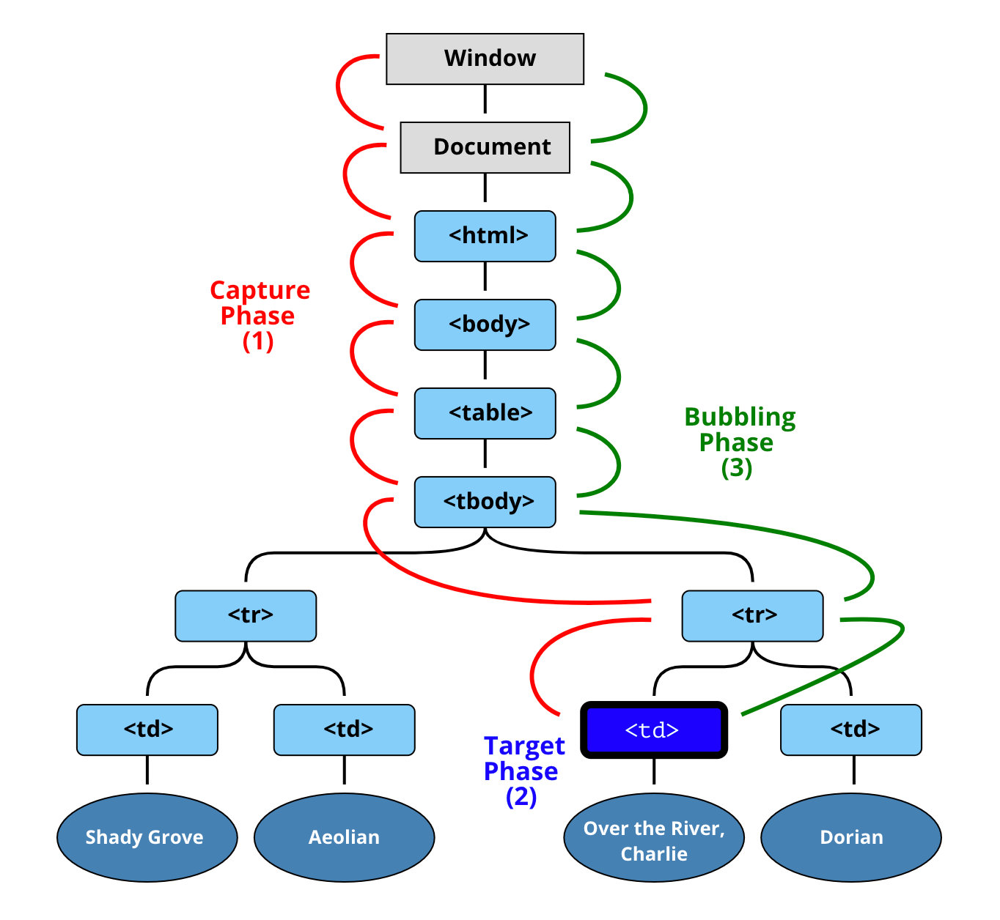

# 事件

## 1 事件模型

### 1.1 事件处理程器

**HTML 属性 (attributes) 中：**

```html
<input value="Click me" onclick="alert('Click!')" type="button" />
```

**DOM 属性 (properties) 中：**

```html
<input id="elem" type="button" value="Click me" />

<script>
  elem.onclick = function() {
    alert('Thank you');
  };
</script>
```

这两种方式本质是一样的，只是写的位置不一样

> 事件处理函数中 `this` 指向处理程序所绑定的那个元素

### 1.2 addEventListener

```js
element.addEventListener(event, handler[, options]);

element.removeEventListener(handler[, capture]);
```

- `event` - 事件名
- `handler` - 处理程序
- `options` 具有以下属性的附加可选对象：
  - `once`：如果为 `true`，那么会在被触发后自动删除监听器。
  - `capture`：事件处理的阶段，`options` 也可以是 `false/true`，它与 `{capture: false/true}` 相同，`true` 为捕获
  - `passive`：如果为 `true`，那么处理程序将不会调用 `preventDefault()`

### 1.3 事件对象

**`event` 对象的一些常用属性：**

- `event.type` - 事件类型，比如 "click"
- `event.currentTarget` - 处理事件的元素。这与 this 相同，除非处理程序是一个箭头函数，或者它的 this 被绑定到了其他东西上，之后我们就可以从 `event.currentTarget` 获取元素了
- `event.clientX / event.clientY` - 指针事件（pointer event）的指针的窗口相对坐标

### 1.4 对象处理程序

我们不仅可以分配函数，还可以使用 `addEventListener` 将一个对象分配为事件处理程序。当事件发生时，就会调用该对象的 `handleEvent` 方法

```html
<button id="elem">Click me</button>

<script>
  class Menu {
    handleEvent(event) {
      // mousedown -> onMousedown
      let method = 'on' + event.type[0].toUpperCase() + event.type.slice(1);
      this[method](event);
    }

    onMousedown() {
      elem.innerHTML = 'Mouse button pressed';
    }

    onMouseup() {
      elem.innerHTML += '...and released.';
    }
  }

  let menu = new Menu();
  elem.addEventListener('mousedown', menu);
  elem.addEventListener('mouseup', menu);
</script>
```

这种方式方便管理代码和维护

## 2 冒泡和捕获

### 2.1 事件传播

**DOM 事件传播有 3 个阶段：**

- 捕获阶段（Capturing phase）—— 事件（从 Window）向下走近元素
- 目标阶段（Target phase）—— 事件到达目标元素
- 冒泡阶段（Bubbling phase）—— 事件从元素上开始冒泡



点击 `<td>`，事件首先通过祖先链向下到达元素（捕获阶段），然后到达目标（目标阶段），最后上升（冒泡阶段），在途中调用处理程序

> **几乎** 所有事件都会冒泡。少部分事件不冒泡，例如 `focus` 事件不会冒泡

> 如果我们 `addEventListener(..., true)`，那么我们应该在 `removeEventListener(..., true)` 中提到同一阶段，以正确删除处理程序

### 2.2 阻止冒泡

`event.stopPropagation()` 阻止冒泡

`event.stopImmediatePropagation()` 如果一个元素在一个事件上有多个处理程序，即使其中一个停止冒泡，其他处理程序仍会执行。这个方法可以用于停止冒泡，并阻止当前元素上的处理程序运行

### 2.3 event 对象

- `event.target` —— 引发事件的层级最深的元素，即触发事件的元素。事件代理会用到
- `event.currentTarget（=this）` —— 处理事件的当前元素（具有处理程序的元素）
- `event.eventPhase` —— 当前阶段（capturing=1，target=2，bubbling=3）

## 3 事件委托

**原理：**

将事件绑定在上级元素上，然后获取 `event.target` 以查看事件实际发生的位置并进行处理

```html
<div id="menu">
  <button data-action="save">Save</button>
  <button data-action="load">Load</button>
  <button data-action="search">Search</button>
</div>

<script>
  class Menu {
    constructor(elem) {
      this._elem = elem;
      elem.onclick = this.onClick.bind(this); // (*)
    }

    save() {
      alert('saving');
    }
    load() {
      alert('loading');
    }
    search() {
      alert('searching');
    }

    onClick(event) {
      let action = event.target.dataset.action;
      if (action) {
        this[action]();
      }
    }
  }

  new Menu(menu);
</script>
```

## 4 浏览器默认行为

**概念：**

许多事件会自动触发浏览器执行某些行为

**例如：**

- 点击一个链接 —— 触发导航（navigation）到该 URL
- 点击表单的提交按钮 —— 触发提交到服务器的行为
- 在文本上按下鼠标按钮并移动 —— 选中文本

> `event.preventDefault()` 阻止默认行为

> `event.defaultPrevented` 如果默认行为被阻止，那么 `event.defaultPrevented` 属性为 `true`，否则为 `false`。在事件代理中比较有用

**addEventListener 的 passive 选择：**

表明处理程序将不会调用 `preventDefault()`

例如 `touchmove`，默认情况下会导致滚动。当浏览器检测到此类事件时，它必须首先处理所有处理程序，然后如果没有任何地方调用 `preventDefault`，则页面可以继续滚动。但这可能会导致 UI 中不必要的延迟和“抖动”

`passive` 可以告诉浏览器不需要关心事件处理程序，可以优先处理滚动，防止卡顿

## 5 自定义事件

### 5.1 创建自定义事件

```js
let event = new Event(type[, options]);

event.dispatchEvent(); // 触发这个事件
```

- `type` —— 事件类型，可以是像这样 "click" 的字符串，或者我们自己的像这样 "my-event" 的参数
- `options` —— 具有两个可选属性的对象：
  - `bubbles`: `true/false` —— 默认 false，如果为 true，那么事件会冒泡
  - `cancelable`: `true/false` —— 默认 false，如果为 true，那么“默认行为”就会被阻止

> `bubbles` 如果为 false，`event.dispatchEvent()` 就不会冒泡

```html
<button id="elem" onclick="alert('Click!');">Autoclick</button>

<script>
  let event = new Event('click');
  elem.dispatchEvent(event); // 触发这个 click 事件
</script>
```

### 5.2 不同类型的事件

除了 `Event`，还有其他类型的事件：

- `UIEvent`
- `FocusEvent`
- `MouseEvent`
- `WheelEvent`
- `KeyboardEvent`
- `CustomEvent` 自定义事件

```js
// 可以在实例化时添加属性
let event = new MouseEvent('click', {
  bubbles: true,
  cancelable: true,
  clientX: 100,
  clientY: 100
});

alert(event.clientX); // 100
```

Event 也可以添加属性，但是需要实例化后才能添加。使用相对于的事件更符合规范

> `CustomEvent` 从技术上讲，`CustomEvent` 和 `Event` 一样。`CustomEvent` 可以添加一个附加属性 `detail`

```js
elem.addEventListener('hello', function(event) {
  alert(event.detail.name);
});

elem.dispatchEvent(
  new CustomEvent('hello', {
    detail: { name: 'John' }
  })
);
```

### 5.3 事件中的事件是同步的

通常事件是在队列中处理的。也就是说：如果浏览器正在处理 `onclick`，这时发生了一个新的事件，例如鼠标移动了，那么它的处理程序会被排入队列，相应的 `mousemove` 处理程序将在 `onclick` 事件处理完成后被调用

事件中的事件是例外：

```html
<button id="menu">Menu (click me)</button>

<script>
  menu.onclick = function() {
    alert(1);

    menu.dispatchEvent(
      new CustomEvent('menu-open', {
        bubbles: true
      })
    );

    alert(2);
  };

  // 在 1 和 2 之间触发
  document.addEventListener('menu-open', () => alert('nested'));
</script>
```
