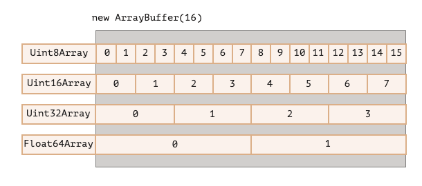
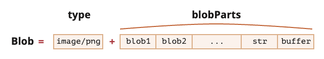

# 二进制数据和文件

## 1 二进制数组

处理文件时（创建，上传，下载），经常会遇到二进制数据。另一个典型的应用场景是图像处理

这些都可以通过 JavaScript 进行处理，而且二进制操作性能更高

> 与其他语言相比，JavaScript 中的二进制数据是以非标准方式实现的

### 1.1 ArrayBuffer

基本的二进制对象是 `ArrayBuffer` —— 对固定长度的连续内存空间的引用

```js
let buffer = new ArrayBuffer(16); // 创建一个长度为 16 的 buffer
alert(buffer.byteLength); // 16
```

它会分配一个 16 字节的连续内存空间，并用 0 进行预填充

> `ArrayBuffer` 不是某种东西的数组。`ArrayBuffer` 与 `Array` 没有任何共同之处

- 它的长度是固定的，我们无法增加或减少它的长度
- 它正好占用了内存中的那么多空间
- 要访问单个字节，需要另一个视图对象，而不是 `buffer[index]`

`ArrayBuffer` 是一个内存区域。它里面存储了什么无从判断。只是一个原始的字节序列

如要操作 `ArrayBuffer`，我们需要使用视图对象

视图对象本身并不存储任何东西。它是一副眼镜，透过它来解释存储在 `ArrayBuffer` 中的字节

例如：

- `Uint8Array` —— 将 `ArrayBuffer` 中的每个字节视为 `0` 到 `255` 之间的单个数字（每个字节是 8 位，因此只能容纳那么多）。这称为 “8 位无符号整数”
- `Uint16Array` —— 将每 `2` 个字节视为一个 `0` 到 `65535` 之间的整数。这称为 “16 位无符号整数”
- `Uint32Array` —— 将每 `4` 个字节视为一个 0 到 `4294967295` 之间的整数。这称为 “32 位无符号整数”
- `Float64Array` —— 将每 `8` 个字节视为一个 `5.0x10^-324` 到 `1.8x10^308` 之间的浮点数。



> `ArrayBuffer` 是核心对象，是所有的基础，是原始的二进制数据。但是，如果我们要写入值或遍历它，基本上几乎所有操作 —— 我们必须使用视图（view）

```js
let buffer = new ArrayBuffer(16); // 创建一个长度为 16 的 buffer

let view = new Uint32Array(buffer); // 将 buffer 视为一个 32 位整数的序列

alert(Uint32Array.BYTES_PER_ELEMENT); // 每个整数 4 个字节

alert(view.length); // 4，它存储了 4 个整数
alert(view.byteLength); // 16，字节中的大小

// 写入一个值
view[0] = 123456;

// 遍历值
for (let num of view) {
  alert(num); // 123456，然后 0，0，0（一共 4 个值）
}
```

### 1.2 TypedArray

所有这些视图（`Uint8Array`，`Uint32Array` 等）的通用术语是 `TypedArray`。它们都享有同一组方法和属性

`TypedArray` 只是表示 ArrayBuffer 上的视图之一的通用总称术语：`Int8Array`，`Uint8Array` 及其他。在这里是一个代称，不是构造器

**类型化数组 (`TypedArray`)：**

- `Uint8Array`，`Uint16Array`，`Uint32Array` —— 用于 8、16 和 32 位的整数
  - `Uint8ClampedArray` —— 用于 8 位整数，在赋值时便“固定“其值
- `Int8Array`，`Int16Array`，`Int32Array` —— 用于有符号整数（可以为负数）
- `Float32Array`，`Float64Array` —— 用于 32 位和 64 位的有符号浮点数

**一个类型化数组的构造器根据不同的参数会有不同的行为：**

```js
new TypedArray(buffer, [byteOffset], [length]);
new TypedArray(object);
new TypedArray(typedArray);
new TypedArray(length);
new TypedArray();
```

**参数为 ArrayBuffer：**

如果给定的是 `ArrayBuffer` 参数，则会在其上创建视图

可以给定起始位置 `byteOffset`（默认为 0）以及 `length`（默认至 `buffer` 的末尾），这样视图将仅涵盖 `buffer` 的一部分

**参数为 Array：**

如果给定的是 `Array`，或任何类数组对象，则会创建一个相同长度的类型化数组，并复制其内容

```js
let arr = new Uint8Array([0, 1, 2, 3]);
alert(arr.length); // 4，创建了相同长度的二进制数组
alert(arr[1]); // 1，用给定值填充了 4 个字节（无符号 8 位整数）
```

**参数为 TypedArray：**

会创建一个相同长度的类型化数组，并复制其内容。如果需要的话，数据在此过程中会被转换为新的类型

```js
let arr16 = new Uint16Array([1, 1000]);
let arr8 = new Uint8Array(arr16);
alert(arr8[0]); // 1
alert(arr8[1]); // 232，试图复制 1000，但无法将 1000 放进 8 位字节中
```

**参数为 length：**

创建包含 `length` 个元素的类型化数组。它的字节长度将是 `length` 乘以单个 `TypedArray.BYTES_PER_ELEMENT` 中的字节数：

```js
let arr = new Uint16Array(4); // 为 4 个整数创建类型化数组
alert(Uint16Array.BYTES_PER_ELEMENT); // 每个整数 2 个字节
alert(arr.byteLength); // 8（字节中的大小）
```

**不带参数：**

不带参数的情况下，创建长度为零的类型化数组

> 可以直接创建一个 `TypedArray`，而无需提及 `ArrayBuffer`。除第一种情况（已提供 `ArrayBuffer`）外，其他所有情况都会自动创建 `ArrayBuffer`

访问 `ArrayBuffer`，可以用以下属性：

- `arr.buffer` —— 引用 `ArrayBuffer`
- `arr.byteLength` —— `ArrayBuffer` 的长度

### 1.3 TypedArray 方法

`TypedArray` 具有大部分常规的 `Array` 方法

**不可用的方法：**

- `splice` —— 无法删除一个值，因为类型化数组是缓冲区（buffer）上的视图，并且缓冲区（buffer）是固定的、连续的内存区域
- `concat` 方法

**额外的方法：**

- `arr.set(fromArr, [offset])` 从 `offset`（默认为 0）开始，将 `fromArr` 中的所有元素复制到 `arr`
- `arr.subarray([begin, end])` 创建一个从 `begin` 到 `end`（不包括）相同类型的新视图。这类似于 `slice` 方法，但不复制任何内容 —— 只是创建一个新视图，以对给定片段的数据进行操作

### 1.4 DataView

`DataView` 是在 `ArrayBuffer` 上的一种特殊的超灵活 “未类型化” 视图。它允许以任何格式访问任何偏移量（offset）的数据

- 对于类型化的数组，构造器决定了其格式。整个数组应该是统一的。第 `i` 个数字是 `arr[i]`
- 通过 `DataView`，我们可以使用 `.getUint8(i)` 或 `.getUint16(i)` 之类的方法访问数据。我们在调用方法时选择格式，而不是在构造的时候

**语法：**

```js
new DataView(buffer, [byteOffset], [byteLength]);
```

- `buffer` —— 底层的 `ArrayBuffer`。与类型化数组不同，`DataView` 不会自行创建缓冲区（buffer）。我们需要事先准备好
- `byteOffset` —— 视图的起始字节位置（默认为 0）
- `byteLength` —— 视图的字节长度（默认至 buffer 的末尾）

例如，这里我们从同一个 buffer 中提取不同格式的数字：

```js
// 4 个字节的二进制数组，每个都是最大值 255
let buffer = new Uint8Array([255, 255, 255, 255]).buffer;

let dataView = new DataView(buffer);

// 在偏移量为 0 处获取 8 位数字
alert(dataView.getUint8(0)); // 255

// 现在在偏移量为 0 处获取 16 位数字，它由 2 个字节组成，一起解析为 65535
alert(dataView.getUint16(0)); // 65535（最大的 16 位无符号整数）

// 在偏移量为 0 处获取 32 位数字
alert(dataView.getUint32(0)); // 4294967295（最大的 32 位无符号整数）

dataView.setUint32(0, 0); // 将 4 个字节的数字设为 0，即将所有字节都设为 0
```

当我们将混合格式的数据存储在同一缓冲区（buffer）中时，`DataView` 非常有用。例如，当我们存储一个成对序列（16 位整数，32 位浮点数）时，用 `DataView` 可以轻松访问它们

## 2 TextDecoder

如果二进制数据实际上为字符串，例如一个内容为文本的文件，可以用 `TextDecoder` 和 `TextEncoder` 处理

### 2.1 TextDecoder

内建的 `TextDecoder` 对象在给定缓冲区（buffer）和编码格式（encoding）的情况下，能够将值读取到实际的 `JavaScript` 字符串中

```js
let decoder = new TextDecoder([label], [options]);
```

- `label` —— 编码格式，默认为 `utf-8`，但同时也支持 `big5`，`windows-1251` 等许多其他编码格式
- `options` —— 可选对象：
  - `fatal` —— 布尔值，如果为 `true` 则为无效（不可解码）字符抛出异常，否则（默认）用字符 `\uFFFD` 替换无效字符
  - `ignoreBOM` —— 布尔值，如果为 `true` 则 `BOM`（可选的字节顺序 unicode 标记），很少需要使用

```js
let str = decoder.decode([input], [options]);
```

- `input` —— 要被解码的 `BufferSource`
- `options` —— 可选对象：
  - `stream` —— 对于解码流，为 `true`，则将传入的数据块（chunk）作为参数重复调用 `decoder`。在这种情况下，多字节的字符可能偶尔会在块与块之间被分割。这个选项告诉 `TextDecoder` 记住未完成的字符，并在下一个数据块来的时候进行解码

**例如：**

```js
let uint8Array = new Uint8Array([72, 101, 108, 108, 111]);

alert(new TextDecoder().decode(uint8Array)); // Hello
```

```js
let uint8Array = new Uint8Array([228, 189, 160, 229, 165, 189]);

alert(new TextDecoder().decode(uint8Array)); // 你好
```

我们可以通过为其创建子数组视图来解码部分缓冲区：

```js
let uint8Array = new Uint8Array([0, 72, 101, 108, 108, 111, 0]);

// 该字符串位于中间
// 在不复制任何内容的前提下，创建一个新的视图
let binaryString = uint8Array.subarray(1, -1);

alert(new TextDecoder().decode(binaryString)); // Hello
```

### 2.2 TextEncoder

`TextEncoder` 做相反的事情 —— 将字符串转换为字节

只支持 `utf-8` 编码

```js
let encoder = new TextEncoder();
```

它有两种方法：

- `encode(str)` —— 从字符串返回 `Uint8Array`
- `encodeInto(str, destination)` —— 将 `str` 编码到 `destination` 中，该目标必须为 `Uint8Array`

```js
let encoder = new TextEncoder();

let uint8Array = encoder.encode('Hello');
alert(uint8Array); // 72,101,108,108,111
```

## 3 Blob

`Blob` 由一个可选的字符串 `type`（通常是 `MIME` 类型）和 `blobParts` 组成 —— 一系列其他 `Blob` 对象，字符串和 `BufferSource`



**语法：**

```js
new Blob(blobParts, options);
```

- `blobParts` 是 `Blob/BufferSource/String` 类型的值的数组
- `options` 可选对象：
  - `type` —— Blob 类型，通常是 MIME 类型，例如 image/png
  - `endings` —— 是否转换换行符，使 Blob 对应于当前操作系统的换行符（\r\n 或 \n）。默认为 "transparent"（啥也不做），不过也可以是 "native"（转换）

**例如：**

```js
// 从字符串创建 Blob
let blob = new Blob(['<html>…</html>'], { type: 'text/html' });
// 请注意：第一个参数必须是一个数组 [...]
```

```js
// 从类型化数组（typed array）和字符串创建 Blob
let hello = new Uint8Array([72, 101, 108, 108, 111]); // 二进制格式的 "hello"

let blob = new Blob([hello, ' ', 'world'], { type: 'text/plain' });
```

可以用 `slice` 方法来提取 `Blob` 片段：

```js
blob.slice([byteStart], [byteEnd], [contentType]);
```

- `byteStart` —— 起始字节，默认为 `0`
- `byteEnd` —— 最后一个字节（专有，默认为最后）
- `contentType` —— 新 `blob` 的 `type`，默认与源 `blob` 相同

> `Blob` 对象是不可改变的，但我们可以通过 `slice` 获得 `Blob` 的多个部分，从这些部分创建新的 `Blob` 对象，将它们组成新的 `Blob`

### 3.1 Blob 用作 URL

下载一个具有动态生成的内容的 `Blob` 的文件：

```html
<!-- download 特性（attribute）强制浏览器下载而不是导航 -->
<a download="hello.txt" href="#" id="link">Download</a>

<script>
  let blob = new Blob(['Hello, world!'], { type: 'text/plain' });

  link.href = URL.createObjectURL(blob);
</script>
```

在 Javascript 中动态创建一个链接：

```js
let link = document.createElement('a');
link.download = 'hello.txt';

let blob = new Blob(['Hello, world!'], { type: 'text/plain' });

link.href = URL.createObjectURL(blob);

link.click();

URL.revokeObjectURL(link.href);
```

`URL.createObjectURL` 取一个 `Blob`，并为其创建一个唯一的 `URL`，形式为 `blob:<origin>/<uuid>`

也就是 `link.href` 的值的样子：

```
blob:https://javascript.info/1e67e00e-860d-40a5-89ae-6ab0cbee6273
```

> 浏览器内部为每个通过 `URL.createObjectURL` 生成的 `URL` 存储了一个 `URL → Blob` 映射。因此，此类 `URL` 很短，但可以访问 `Blob`

不过它有个副作用。虽然这里有 `Blob` 的映射，但 `Blob` 本身只保存在内存中的。浏览器无法释放它

`URL.revokeObjectURL(url)` 从内部映射中移除引用，因此允许 `Blob` 被删除（如果没有其他引用的话），并释放内存

### 3.2 Blob 转换为 base64

使用内建的 `FileReader` 对象来将 `Blob` 转换为 `base64`。它可以将 `Blob` 中的数据读取为多种格式

下面是下载 `Blob` 的示例，这次是通过 `base-64`：

```js
let link = document.createElement('a');
link.download = 'hello.txt';

let blob = new Blob(['Hello, world!'], { type: 'text/plain' });

let reader = new FileReader();
reader.readAsDataURL(blob); // 将 Blob 转换为 base64 并调用 onload

reader.onload = function() {
  link.href = reader.result; // data url
  link.click();
};
```

**特点：**

- 无需撤销（revoke）任何操作
- 对大的 `Blob` 进行编码时，性能和内存会有损耗

### 3.3 Image 转换为 blob

通过 canvas 实现：

```js
// 获取任何图像
let img = document.querySelector('img');

// 生成同尺寸的 <canvas>
let canvas = document.createElement('canvas');
canvas.width = img.clientWidth;
canvas.height = img.clientHeight;

let context = canvas.getContext('2d');

// 向其中复制图像（此方法允许剪裁图像）
context.drawImage(img, 0, 0);
// 我们 context.rotate()，并在 canvas 上做很多其他事情

// toBlob 是异步操作，结束后会调用 callback
canvas.toBlob(function(blob) {
  // blob 创建完成，下载它
  let link = document.createElement('a');
  link.download = 'example.png';

  link.href = URL.createObjectURL(blob);
  link.click();

  // 删除内部 blob 引用，这样浏览器可以从内存中将其清除
  URL.revokeObjectURL(link.href);
}, 'image/png');
```

### 3.4 Blob 转换为 arrayBuffer

`Blob` 构造器允许从几乎所有东西创建 `blob`，包括任何 `BufferSource`

但是，如果我们需要执行低级别的操作的话，则可以使用 `blob.arrayBuffer()` 从 `blob` 中获取最低级别的 `arrayBuffer`：

```js
// 从 blob 获取 arrayBuffer
const bufferPromise = await blob.arrayBuffer();

// 或者
blob.arrayBuffer().then(buffer => {
  /* 处理 arrayBuffer */
});
```

### 3.5 Blob 转换为 stream

当读取和写入超过 `2 GB` 的 `blob` 时，将其转换为 `arrayBuffer` 会更加占用内存。stream 会更适合处理

`stream` 是一种特殊的对象，我们可以从它那里逐部分地读取（或写入）

`Blob` 接口里的 `stream()` 方法返回一个 `ReadableStream`，在被读取时可以返回 `Blob` 中包含的数据

```js
// 从 blob 获取可读流（readableStream）
const readableStream = blob.stream();
const stream = readableStream.getReader();

while (true) {
  // 对于每次迭代：data 是下一个 blob 数据片段
  let { done, data } = await stream.read();

  if (done) {
    // 读取完毕，stream 里已经没有数据了
    console.log('all blob processed.');
    break;
  }

  // 对刚从 blob 中读取的数据片段做一些处理
  console.log(data);
}
```

## 4 File 和 FileReader

### 4.1 File

`File` 对象继承自 `Blob`，并扩展了与文件系统相关的功能

有两种方式可以获取它

第一种，与 `Blob` 类似，有一个构造器：

```js
new File(fileParts, fileName, [options])
```

- `fileParts` —— `Blob/BufferSource/String` 类型值的数组
- `fileName` —— 文件名字符串
- `options` —— 可选对象：
  - `lastModified` —— 最后一次修改的时间戳（整数日期）

第二种，从 `<input type="file">` 或拖放或其他浏览器接口来获取文件。在这种情况下，`file` 将从操作系统（OS）获得 `this` 信息

由于 `File` 是继承自 `Blob` 的，所以 `File` 对象具有相同的属性，附加：

- `name` —— 文件名
- `lastModified` —— 最后一次修改的时间戳

### 4.2 FileReader

`FileReader` 是一个对象，其唯一目的是从 `Blob`（因此也从 File）对象中读取数据

```js
let reader = new FileReader(); // 没有参数
```

**主要方法:**

- `readAsArrayBuffer(blob)` —— 将数据读取为二进制格式的 `ArrayBuffer`
- `readAsText(blob, [encoding])` —— 将数据读取为给定编码（默认为 utf-8 编码）的文本字符串
- `readAsDataURL(blob)` —— 读取二进制数据，并将其编码为 `base64` 的 data url
- `abort()` —— 取消操作

**读取过程中，有以下事件：**

- `loadstart` —— 开始加载
- `progress` —— 在读取过程中出现
- `load` —— 读取完成，没有 `error`
- `abort` —— 调用了 `abort()`
- `error` —— 出现 `error`
- `loadend` —— 读取完成，无论成功还是失败

**读取完成后，我们可以通过以下方式访问读取结果：**

- `reader.result` 是结果（如果成功）
- `reader.error` 是 error（如果失败）

这是一个读取文件的示例：

```html
<input type="file" onchange="readFile(this)">

<script>
function readFile(input) {
  let file = input.files[0];

  let reader = new FileReader();

  reader.readAsText(file);

  reader.onload = function() {
    console.log(reader.result);
  };

  reader.onerror = function() {
    console.log(reader.error);
  };
}
</script>
```

**在 `Web Workers` 中可以使用 `FileReaderSync`:**

对于 `Web Worker`，还有一种同步的 `FileReader` 变体，称为 `FileReaderSync`

它的读取方法 `read*` 不会生成事件，但是会像常规函数那样返回一个结果

不过，这仅在 `Web Worker` 中可用，因为在读取文件的时候，同步调用会有延迟，而在 `Web Worker` 中，这种延迟并不是很重要。它不会影响页面