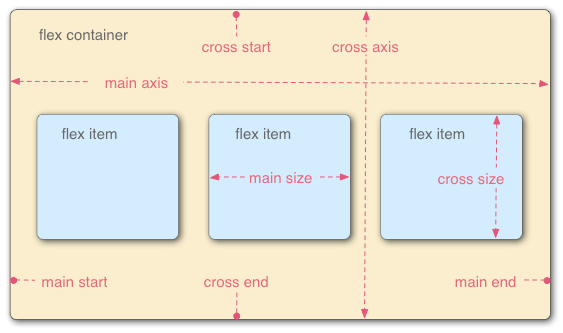
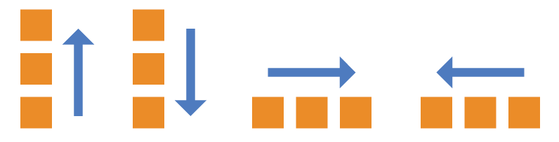
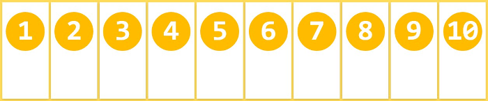
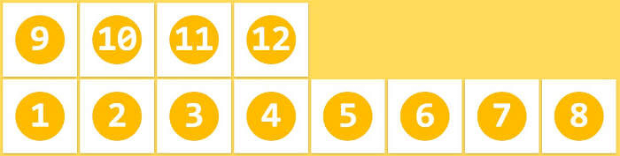
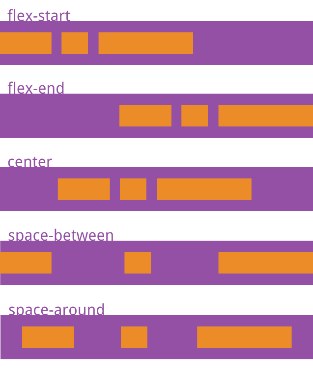
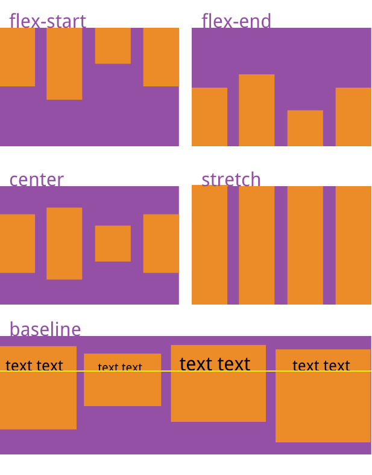
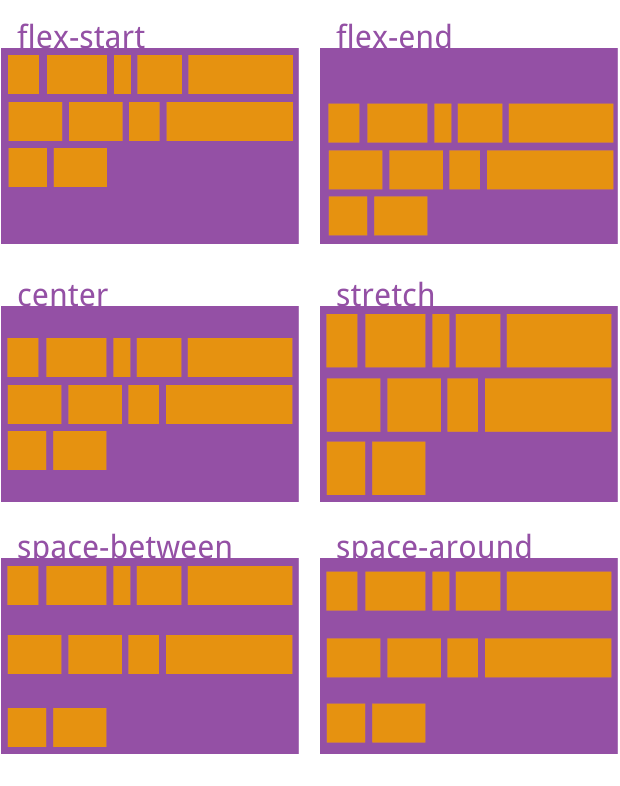
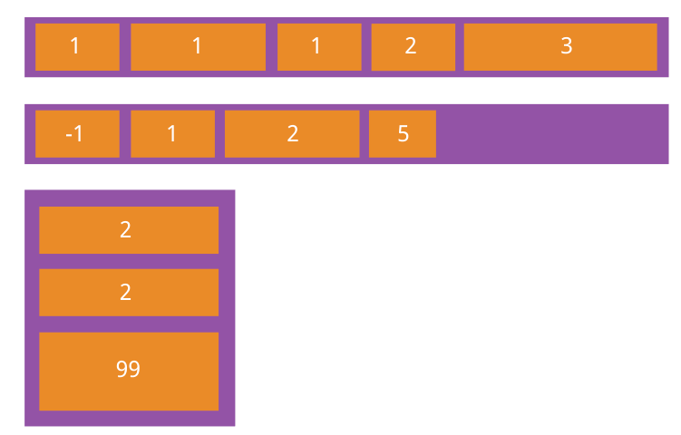
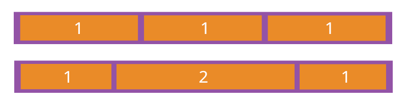
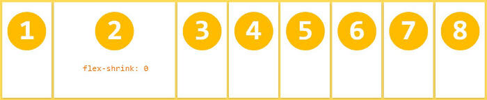

# flex 布局

[搬运自阮一峰](http://www.ruanyifeng.com/blog/2015/07/flex-grammar.html)

2009 年，W3C 提出了一种新的方案----Flex 布局，可以简便、完整、响应式地实现各种页面布局。目前，它已经得到了所有浏览器的支持

## 1 基本概念

Flex 是 Flexible Box 的缩写，意为"弹性布局"，用来为盒状模型提供最大的灵活性

```css
/* 任何一个容器都可以指定为 Flex 布局 */
.box {
  display: flex;
}

/* 行内元素也可以使用 Flex 布局 */
.box {
  display: inline-flex;
}
```

> 注意，设为 Flex 布局以后，子元素的 float、clear 和 vertical-align 属性将失效



容器默认存在两根轴：水平的主轴（main axis）和垂直的交叉轴（cross axis）。主轴的开始位置（与边框的交叉点）叫做 main start，结束位置叫做 main end；交叉轴的开始位置叫做 cross start，结束位置叫做 cross end

项目默认沿主轴排列。单个项目占据的主轴空间叫做 main size，占据的交叉轴空间叫做 cross size

## 2 容器的属性

以下 6 个属性设置在容器上

- flex-direction
- flex-wrap
- flex-flow
- justify-content
- align-items
- align-content

### 2.1 flex-direction

flex-direction 属性决定主轴的方向（即项目的排列方向）

```css
.box {
  flex-direction: row | row-reverse | column | column-reverse;
}
```

- row（默认值）：主轴为水平方向，起点在左端
- row-reverse：主轴为水平方向，起点在右端
- column：主轴为垂直方向，起点在上沿
- column-reverse：主轴为垂直方向，起点在下沿



### 2.2 flex-wrap

默认情况下，项目都排在一条线（又称"轴线"）上。flex-wrap 属性定义，如果一条轴线排不下，如何换行。

```css
.box {
  flex-wrap: nowrap | wrap | wrap-reverse;
}
```

- nowrap（默认）：不换行
  
- wrap：换行，第一行在上方
  
- wrap-reverse：换行，第一行在下方
  

### 2.3 flex-flow

flex-flow 属性是 flex-direction 属性和 flex-wrap 属性的简写形式，默认值为 row nowrap

```css
.box {
  flex-flow: <flex-direction> <flex-wrap>;
}
```

### 2.4 justify-content

justify-content 属性定义了项目在主轴上的对齐方式

```css
.box {
  justify-content: flex-start | flex-end | center | space-between | space-around;
}
```

它可能取 5 个值，具体对齐方式与轴的方向有关。下面假设主轴为从左到右。

- flex-start（默认值）：左对齐
- flex-end：右对齐
- center： 居中
- space-between：两端对齐，项目之间的间隔都相等
- space-around：每个项目两侧的间隔相等。所以，项目之间的间隔比项目与边框的间隔大一倍



### 2.5 align-items

align-items 属性定义项目在交叉轴上如何对齐

```css
.box {
  align-items: flex-start | flex-end | center | baseline | stretch;
}
```

它可能取 5 个值。具体的对齐方式与交叉轴的方向有关，下面假设交叉轴从上到下

- flex-start：交叉轴的起点对齐
- flex-end：交叉轴的终点对齐
- center：交叉轴的中点对齐
- baseline: 项目的第一行文字的基线对齐
- stretch（默认值）：如果项目未设置高度或设为 auto，将占满整个容器的高度



### 2.6 align-content

align-content 属性定义了多根轴线的对齐方式。如果项目只有一根轴线，该属性不起作用

```css
.box {
  align-content: flex-start | flex-end | center | space-between | space-around | stretch;
}
```

- flex-start：与交叉轴的起点对齐
- flex-end：与交叉轴的终点对齐
- center：与交叉轴的中点对齐
- space-between：与交叉轴两端对齐，轴线之间的间隔平均分布
- space-around：每根轴线两侧的间隔都相等。所以，轴线之间的间隔比轴线与边框的间隔大一倍
- stretch（默认值）：轴线占满整个交叉轴



## 3 项目的属性

以下 6 个属性设置在项目上

- order
- flex-grow
- flex-shrink
- flex-basis
- flex
- align-self

### 3.1 order

order 属性定义项目的排列顺序。数值越小，排列越靠前，默认为 0

```css
.item {
  order: <integer>;
}
```



### 3.2 flex-grow

flex-grow 属性定义项目的放大比例，默认为 0，即如果存在剩余空间，也不放大

```css
.item {
  flex-grow: <number>;
}
```

> 如果所有项目的 flex-grow 属性都为 1，则它们将等分剩余空间（如果有的话）。如果一个项目的 flex-grow 属性为 2，其他项目都为 1，则前者占据的剩余空间将比其他项多一倍



### 3.3 flex-shrink

flex-shrink 属性定义了项目的缩小比例，默认为 1，即如果空间不足，该项目将缩小

```css
.item {
  flex-shrink: <number>;
}
```

> 如果所有项目的 flex-shrink 属性都为 1，当空间不足时，都将等比例缩小。如果一个项目的 flex-shrink 属性为 0，其他项目都为 1，则空间不足时，前者不缩小

> 负值对该属性无效



### 3.4 flex-basis

flex-basis 属性定义了在分配多余空间之前，项目占据的主轴空间（main size）。浏览器根据这个属性，计算主轴是否有多余空间。它的默认值为 auto，即项目的本来大小。

```css
.item {
  flex-basis: <length> | auto;
}
```

它可以设为跟 width 或 height 属性一样的值（比如 350px），则项目将占据固定空间

### 3.5 flex

flex 属性是 flex-grow, flex-shrink 和 flex-basis 的简写，默认值为 0 1 auto。后两个属性可选

```css
.item {
  flex: none | [ < 'flex-grow' > < 'flex-shrink' >? || < 'flex-basis' > ];
}
```

该属性有两个快捷值：auto (1 1 auto) 和 none (0 0 auto)

建议优先使用这个属性，而不是单独写三个分离的属性，因为浏览器会推算相关值

### 3.6 align-self

align-self 属性允许单个项目有与其他项目不一样的对齐方式，可覆盖 align-items 属性。默认值为 auto，表示继承父元素的 align-items 属性，如果没有父元素，则等同于 stretch

```css
.item {
  align-self: auto | flex-start | flex-end | center | baseline | stretch;
}
```

该属性可能取 6 个值，除了 auto，其他都与 align-items 属性完全一致。
