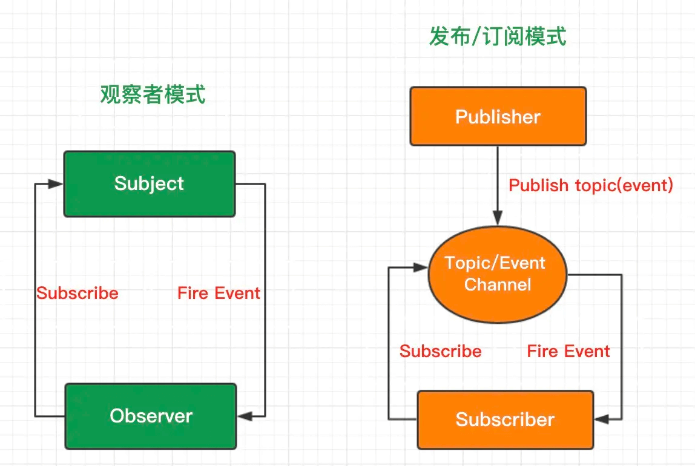

# 观察者模式

## 1 概念

通常又被称为 **发布-订阅者模式** 或 **消息机制**，它定义了对象间的一种一对多的依赖关系，只要当一个对象的状态发生改变时，所有依赖于它的对象都得到通知并被自动更新，解决了主体对象与观察者之间功能的耦合，即一个对象状态改变给其他对象通知的问题



## 2 实例

### 2.1 观察者模式

```js
// 主题，保存状态，状态变化之后触发所有观察者对象
class Subject {
  constructor() {
    this.state = 0;
    this.observers = [];
  }

  getState() {
    return this.state;
  }

  // 状态改变，通知所有观察者
  setState(state) {
    this.state = state;
    this.notifyAllObservers();
  }

  notifyAllObservers() {
    this.observers.forEach(observer => {
      observer.update();
    });
  }

  // 添加观察者
  attach(observer) {
    this.observers.push(observer);
  }
}

// 观察者
class Observer {
  constructor(name, subject) {
    this.name = name;
    this.subject = subject;
    this.subject.attach(this);
  }

  // 接收通知
  update() {
    console.log(`${this.name} update, state: ${this.subject.getState()}`);
  }
}

let s = new Subject();
let o1 = new Observer('o1', s);
let o2 = new Observer('o2', s);

s.setState(1);
s.setState(2);
```

### 2.2 eventEmit

```js
let event = {
  list: {},

  on(key, fn) {
    if (!this.list[key]) {
      this.list[key] = [];
    }
    this.list[key].push(fn);
  },

  emit() {
    let key = [].shift.call(arguments);
    let fns = this.list[key];

    if (!fns || fns.length === 0) {
      return false;
    }

    fns.forEach(fn => {
      fn.apply(this, arguments);
    });
  },

  remove(key, fn) {
    let fns = this.list[key];
    // 如果缓存列表中没有函数，返回false
    if (!fns) return false;
    // 如果没有传对应函数的话
    // 就会将key值对应缓存列表中的函数都清空掉
    if (!fn) {
      fns = [];
    } else {
      // 遍历缓存列表，看看传入的fn与哪个函数相同
      // 如果相同就直接从缓存列表中删掉即可
      fns.forEach((cb, i) => {
        if (cb === fn) {
          fns.splice(i, 1);
        }
      });
    }
  }
};

function cat() {
  console.log('一起喵喵喵');
}
function dog() {
  console.log('一起旺旺旺');
}

event.on('pet', data => {
  console.log('接收数据');
  console.log(data);
});

event.on('pet', cat);
event.on('pet', dog);

// 取消dog方法的订阅
event.remove('pet', dog);
// 发布
event.emit('pet', ['二哈', '波斯猫']);
```

## 3 使用场景

### 3.1 网页事件绑定

所有涉及事件监听的场景都是观察者模式

```html
<div id="btn">btn</div>

<script>
  let btn = document.querySelector('#btn');

  btn.addEventListener('click', () => {
    console.log('点击了');
  });
</script>
```

### 3.2 Promise

Promise 也是观察者模式

```js
// 模拟加载一张图片
function loadImg() {
  return new Promise((resolve, reject) => {
    setTimeout(() => {
      resolve({ width: 600, height: 400 });
    }, 1000);
  });
}

let res = loadImg();
res
  .then(img => {
    console.log(img.width);
    return img;
  })
  .then(img => {
    console.log(img.height);
  });
```

### 3.4 node 自定义事件

```js
const EventEmitter = require('events').EventEmitter;

const emitter = new EventEmitter();

emitter.on('hello', () => {
  console.log('hello world');
});

emitter.emit('hello');
```

一般比较少直接用 EventEmitter 模块，很多 node 模块继承了 EventEmitter 类，比如 `fs.createReadStream`

我们也可以通过继承 EventEmitter 类实现类似的功能

```js
const fs = require('fs');

const file = fs.createReadStream('./README.md');

file.on('data', chunk => {
  console.log(chunk.toString().length);
});
file.on('end', () => {
  console.log('end');
});
```

### 3.5 vue react 组件生命周期触发

### 3.6 vue 双向绑定

```html
<div id="app">
  <form>
    <input type="text" v-model="number" />
    <button type="button" v-click="increment">增加</button>
  </form>
  <h3 v-bind="number"></h3>
  <form>
    <input type="text" v-model="count" />
    <button type="button" v-click="incre">增加</button>
  </form>
  <h3 v-bind="count"></h3>
</div>
```

```js
class MyVue {
  constructor(options) {
    this._init(options);
  }

  _init(options) {
    this.$options = options;
    this.$el = document.querySelector(options.el);
    this.$data = options.data;
    this.$methods = options.methods;

    this._binding = {};
    this._obverse(this.$data);
    this._complie(this.$el);
  }

  _obverse(obj) {
    var _this = this;
    Object.keys(obj).forEach(function(key) {
      if (obj.hasOwnProperty(key)) {
        _this._binding[key] = {
          _directives: []
        };
        console.log(_this._binding[key]);
        var value = obj[key];
        if (typeof value === 'object') {
          _this._obverse(value);
        }
        var binding = _this._binding[key];
        Object.defineProperty(_this.$data, key, {
          enumerable: true,
          configurable: true,
          get: function() {
            console.log(`${key}获取${value}`);
            return value;
          },
          set: function(newVal) {
            console.log(`${key}更新${newVal}`);
            if (value !== newVal) {
              value = newVal;
              binding._directives.forEach(function(item) {
                item.update();
              });
            }
          }
        });
      }
    });
  }

  _complie(root) {
    var _this = this;
    var nodes = root.children;
    for (var i = 0; i < nodes.length; i++) {
      var node = nodes[i];
      if (node.children.length) {
        this._complie(node);
      }

      if (node.hasAttribute('v-click')) {
        node.onclick = (function() {
          var attrVal = nodes[i].getAttribute('v-click');
          return _this.$methods[attrVal].bind(_this.$data);
        })();
      }

      if (node.hasAttribute('v-model') && (node.tagName === 'INPUT' || node.tagName === 'TEXTAREA')) {
        node.addEventListener(
          'input',
          (function(key) {
            var attrVal = node.getAttribute('v-model');
            _this._binding[attrVal]._directives.push(new Watcher('input', node, _this, attrVal, 'value'));

            return function() {
              _this.$data[attrVal] = nodes[key].value;
            };
          })(i)
        );
      }

      if (node.hasAttribute('v-bind')) {
        var attrVal = node.getAttribute('v-bind');
        _this._binding[attrVal]._directives.push(new Watcher('text', node, _this, attrVal, 'innerHTML'));
      }
    }
  }
}

class Watcher {
  constructor(name, el, vm, exp, attr) {
    this.name = name; //指令名称，例如文本节点，该值设为"text"
    this.el = el; //指令对应的DOM元素
    this.vm = vm; //指令所属myVue实例
    this.exp = exp; //指令对应的值，本例如"number"
    this.attr = attr; //绑定的属性值，本例为"innerHTML"

    this.update();
  }

  // 更新 html 中的值
  update() {
    this.el[this.attr] = this.vm.$data[this.exp];
  }
}

window.onload = function() {
  var app = new MyVue({
    el: '#app',

    data: {
      number: 0,
      count: 0
    },

    methods: {
      increment: function() {
        this.number++;
      },

      incre: function() {
        this.count++;
      }
    }
  });
};
```
