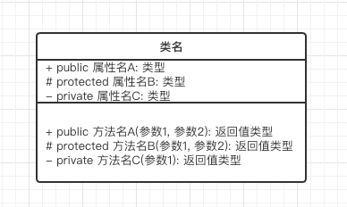
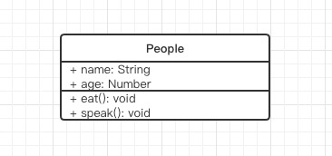
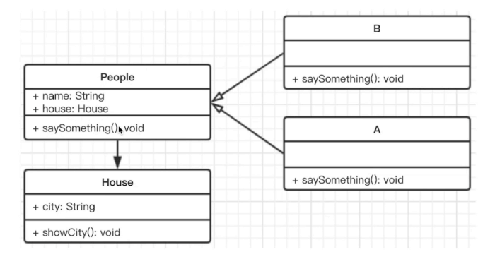
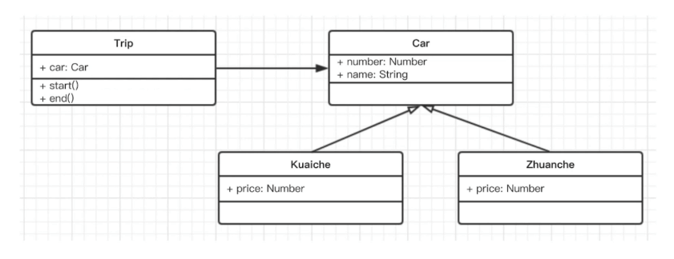

# UML 类图

## 1 概念

Unified Modeling Language (UML) 统一建模语言

UML 包含很多种图，设计模式中用到的是 UML 类图

画图工具 [https://www.processon.com](https://www.processon.com)

## 2 类图

### 2.1 类图概念



- 第一格：类名
- 第二格：属性
- 第三格：方法

**属性和方法前缀符号的含义：**

- `+` public 完全开发
- `#` protected 对子类开放
- `-` private 对自己开放

### 2.2 例子

下面是一个类，画出它的类图

```js
class People {
  constructor(name, age) {
    this.name = name;
    this.age = age;
  }

  eat() {
    console.log(`${this.name} eat something`);
  }

  speak() {
    console.log(`my name is ${this.name}, age ${this.age}`);
  }
}
```



## 3 关系

### 3.1 概念

- 泛化，表示继承 (使用空心箭头)
- 关联，表示引用 (使用实心箭头)

### 3.2 例子

```js
class House {
  constructor(city) {
    this.city = city;
  }

  showCity() {
    alert(`house in ${this.city}`);
  }
}

class People {
  constructor(name, house) {
    this.name = name;
    this.house = house;
  }

  asySomething() {}
}

class A extends People {
  constructor(name, house) {
    super(name, house);
  }

  saySomething() {
    alert('I am A');
  }
}

class B extends People {
  constructor(name, house) {
    super(name, house);
  }

  saySomething() {
    alert('I am B');
  }
}
```



## 4 实例

### 4.1 打车

设计一个打车模型

**题目：**

1. 打车时，可以打专车或者快车。任何车都有车牌号和名称
2. 不同车价格不同，快车每公里 1 元，专车每公里 2 元
3. 行程开始时，显示车辆信息
4. 行程结束时，显示打车金额 (假定行程就 5 公里)

根据上面条件：

- 画出 UML 类图
- 用 ES6 语法写出该示例



```js
class Car {
  constructor(number, name) {
    this.number = number;
    this.name = name;
  }
}

class Kuaiche extends Car {
  constructor(number, name) {
    super(number, name);
    this.price = 1;
  }
}

class Zhuanche extends Car {
  constructor(number, name) {
    super(number, name);
    this.price = 2;
  }
}

class Trip {
  constructor(car) {
    this.car = car;
  }

  start() {
    console.log(`行程开始，名称：${this.car.name}，车牌号：${this.car.number}`);
  }

  end() {
    console.log(`行程结束，价格：${this.car.price * 5}`);
  }
}

let car = new Kuaiche('赣B 00000', '桑塔纳');
let trip = new Trip(car);

trip.start();
trip.end();
```

### 4.2 停车场

设计一个停车场模型

**题目：**

1. 某停车场，分 3 层，每层 100 车位
2. 每个车位都能监控到车辆的驶入和离开
3. 车辆进入前，显示每层的空余车位数量
4. 车辆进入时，摄像头可识别车牌号和时间
5. 车辆出来时，出口显示器显示车牌号和停车时长

根据上面条件：

- 画出 UML 类图
- 用 ES6 语法写出该示例
