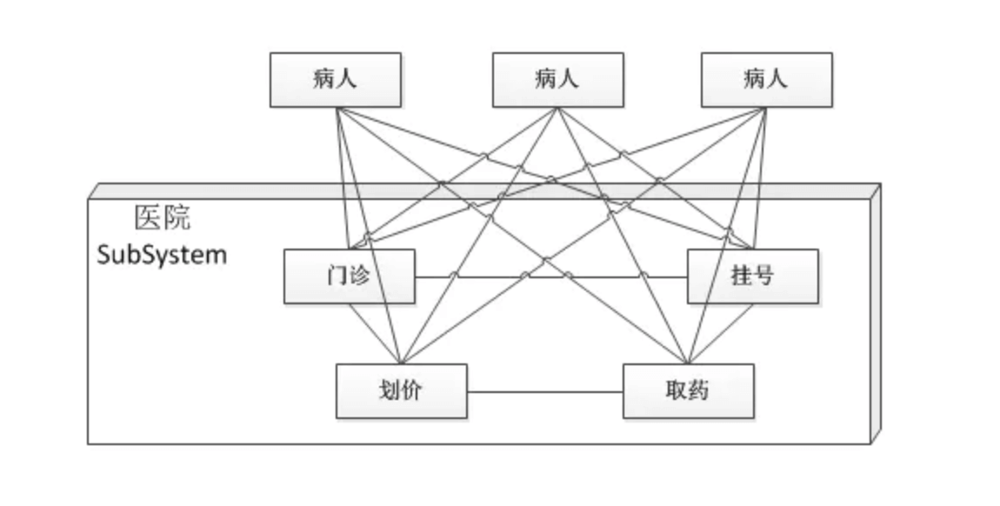
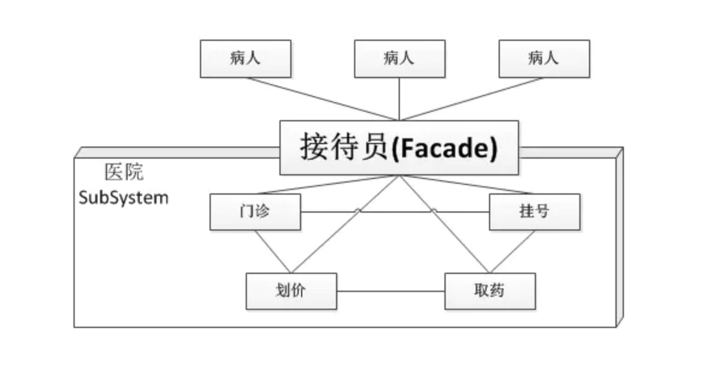

# 外观模式

## 1 概念

外观模式（Facade Pattern）隐藏系统的复杂性，并向客户端提供了一个客户端可以访问系统的接口。这种类型的设计模式属于结构型模式，它向现有的系统添加一个接口，来隐藏系统的复杂性

类似于去医院看病，可能要去挂号、门诊、划价、取药，让患者或患者家属觉得很复杂，如果有提供接待人员，只让接待人员来处理，就很方便

- **优点：** 1、减少系统相互依赖。 2、提高灵活性。 3、提高了安全性
- **缺点：**不符合开闭原则，如果要改东西很麻烦，继承重写都不合适
