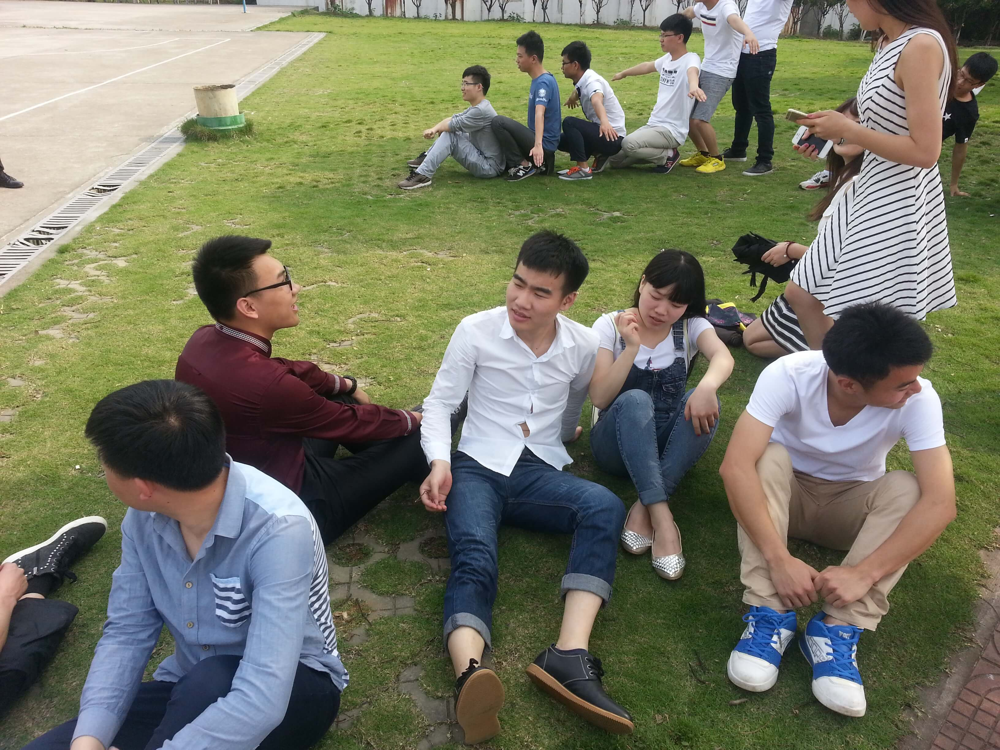
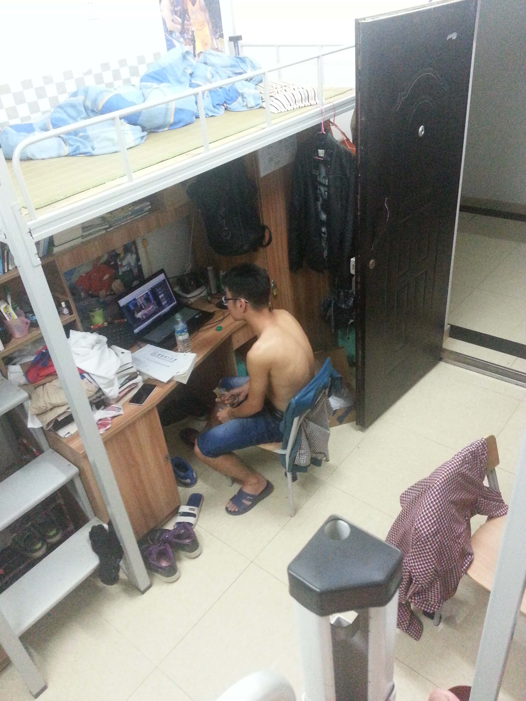
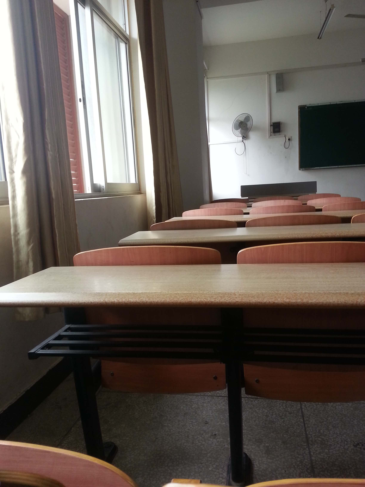
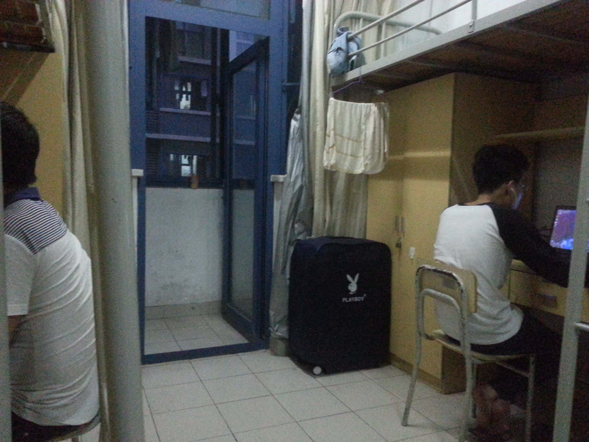
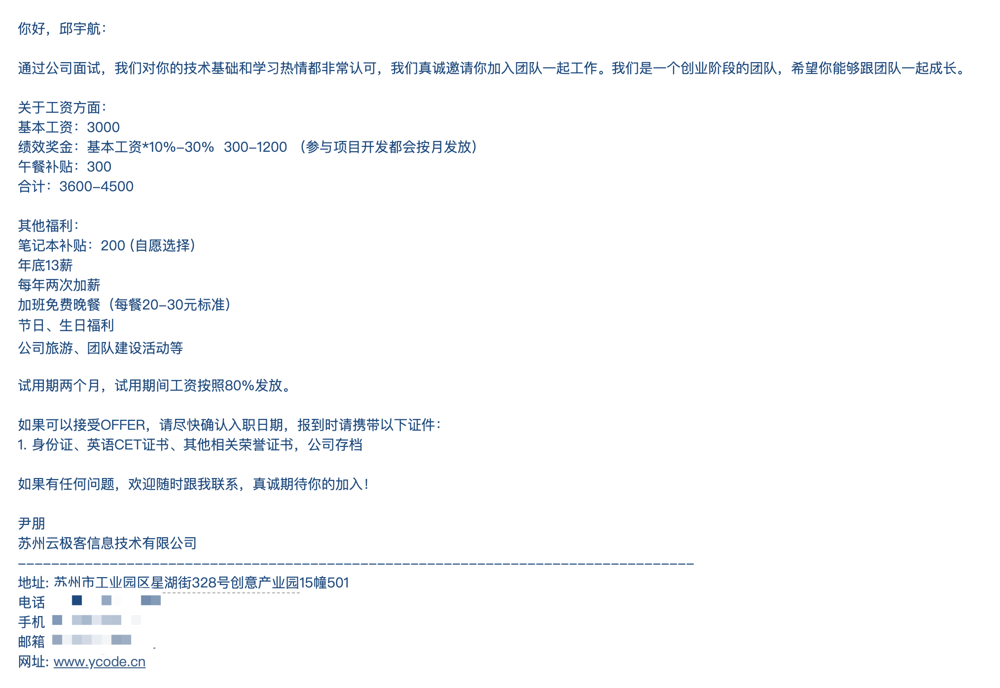
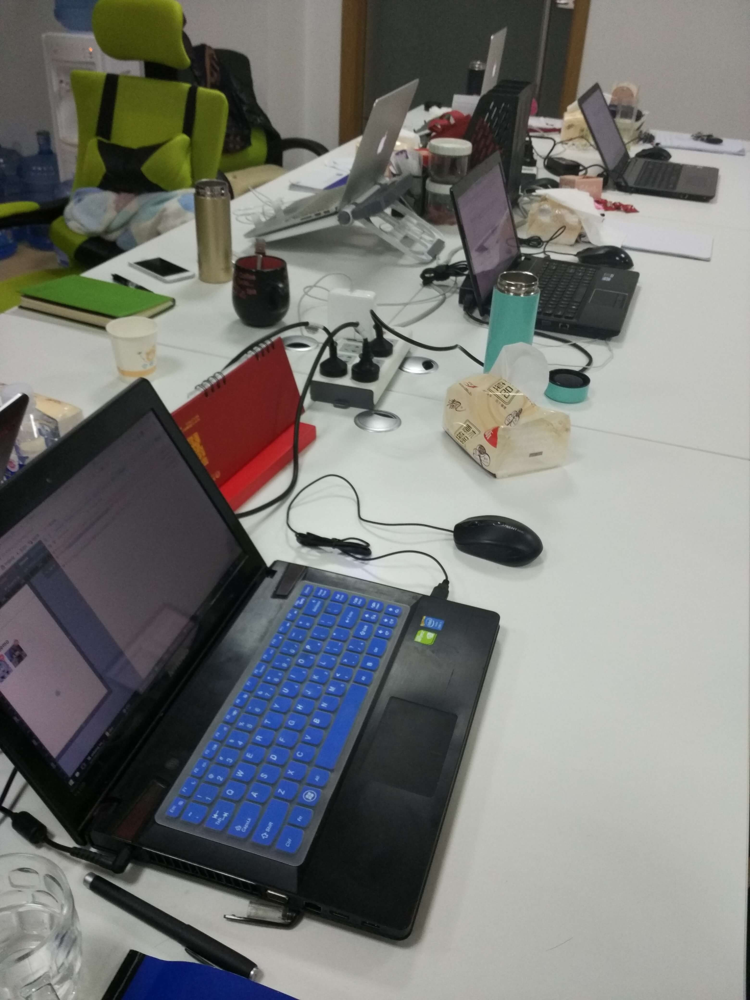
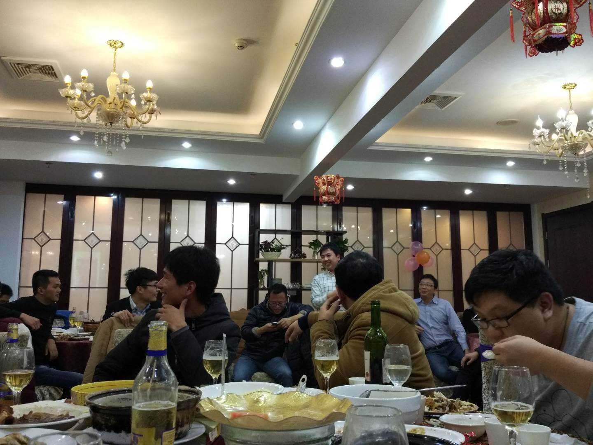
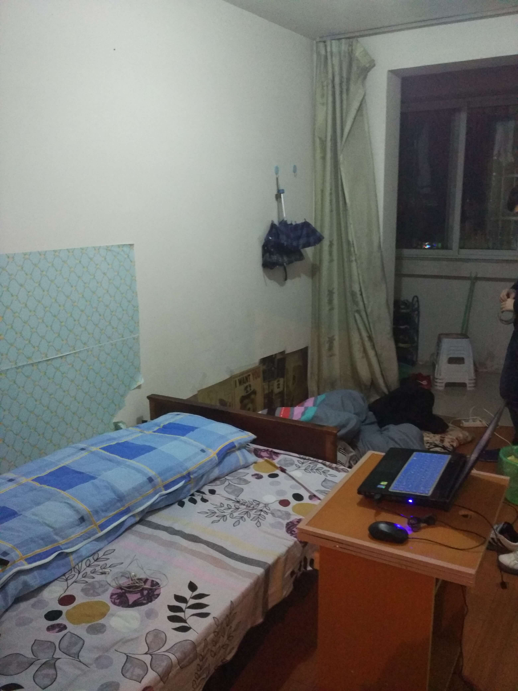
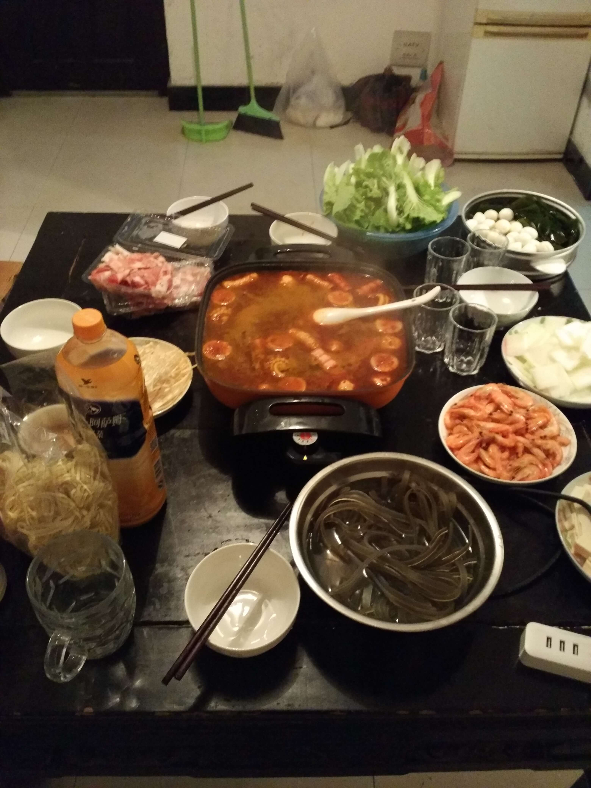
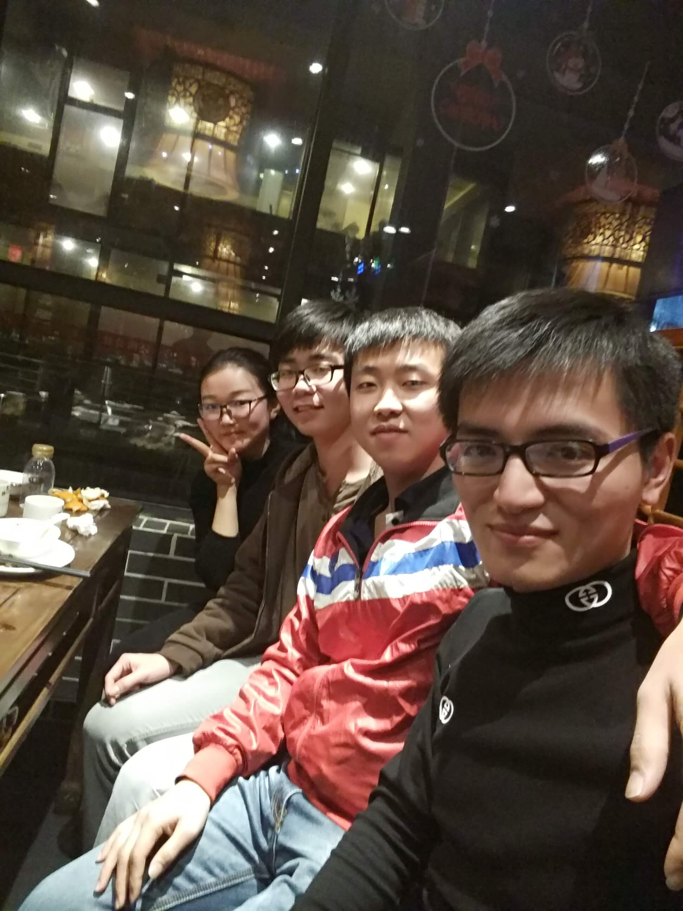

# 2015 年总结

这一年经历了很多，从在学校学习到培训再到工作，从南昌到苏州。认识了一帮新的同学和同事。还有第一次找工作、第一次租房、第一次辞职，各种第一次。相当漫长且丰富的一年。

## 最后的校园时光

2015 年上半年，大三下学期。

上半年记不得在干嘛，拍了毕业照，翻了翻照片，是 5 月 9 日拍的毕业照。

5 月劳动节的时候还画了副画，画了 20 多个小时，就早上起来画到晚上 12 点，那时真的有耐心。画完发在了 QQ 空间装了波逼。第一次尝试用彩铅画三次元人物～

那时经常会去教室学习，不上课的时候就会去找空教室，在慕课网上面学些前端的东西。经常是在 3 栋教学楼的五六楼，一般教室就我一个人，坐在最后一排左下角靠窗的位置，那墙边有个插座。一般就带着电脑看看教程写写代码，比在图书馆自在很多。到晚上 9 点的样子就回宿舍，出了教室整栋教学楼基本没什么人，走廊黑黑的一片，有点小恐怖。回宿舍就玩玩游戏，那时候还在玩剑灵。还是很怀念大学的那段时间，基本没什么压力，学习特别纯粹。

下学期就陆陆续续有培训机构来学校招人。开始是万策，培训 java，好像是学期中来的。刘胜、邓杰、邓斯、肖毅去了培训 java。学期结束后，他们去了厦门。宿舍的刘海涛和隔壁宿舍的叶炳财一起去了北京学 IOS，后来也很少联系了。

学期末还有几场校招，学校组织强制听他们的宣讲，挺无聊的，感觉一脸懵逼，不知道校招可以干嘛。也都是一些不知名的公司。

快到学期末的时候，也纠结过要不要去报培训班，学费还挺贵的。那时对工作一无所知，不知道怎么找工作，也不知道需要些什么技能。听说去培训可以早点出去工作，不用待学校做毕业设计，而且会帮你找工作，就报了个苏州的培训班。学费 8 千 6 吧大概，搞了分期。当时来了一堆培训机构，各种培训都有。跟学校应该都有合作，可能因为培训大幅提升了学校学生的就业率吧。

因为自学了点前端，就跟杨恒一起报了前端。这个培训机构在学校还招了挺多人，有 60 多个。

## 苏州培训

学期快结束的时候，应该是 6 月左右，培训机构的人就带着学校的同学一起去了苏州，坐的火车卧铺。走的时候班里挺多同学去了校门口送，虽然还是大三，出了校门那刻，已经算结束了大学的生活。

到了苏州，安排我们住进了一个研究生宿舍，忘了是哪个大学的。住着宿舍上着课，学校的氛围还是比较浓的。刚到的时候，就是自行组合分宿舍，我们宿舍是我、杨恒、黄伟涛，也忘了是怎么凑一起的。查了下地图，才想起住的宿舍叫文荟人才公寓，培训的地方叫苏州创意产业园。

苏州的环境是真的好，我们住的那边人不多，绿化特别好。经常在宿舍周围跑步，特别方便，哪哪都能跑。骑车也很方便，自行车道很多，很舒服。

开始上课可后就是分学习小组，我这组是杨恒、黄伟涛、刘艳铃、刘鑫、饶禹、黄丹和刘军。培训的老师好像是某些公司在职的程序员，看起来比较牛逼，不过前端教的都是些比较基础的东西。

因为在学校学过一些前端，培训的时候就顺道装了波逼，其实自学的那些都是些皮毛，更尴尬的是自己还真以为自己有点牛逼，现在想想是真 TM 尴尬。上课讲的那些基本都会，上课就没怎么听，自己看些视频。培训期间有两次考评，一次拿了第一，发了 600 块钱，就拿去了组内聚餐。聚餐已经没了照片，杨恒玩大冒险还去了要妹子电话(笑)。然后有段时间就被骗去了助教的那个公司，帮忙写页面，也算学到点东西，第一次接触了 git、项目工程化，还有 angularjs。

日常就是宿舍四个人一起出门早上去门口买个手抓饼，或者去门口的食堂吃早餐。中午有段时间不吃，想减肥，主要还是因为穷。晚上经常吃包子+凉面，手抓饼也常吃。晚上有空就绕着宿舍跑步。宿舍门口还有晚市，到晚上 11 点准时开，各种小吃摊子，热闹的很。宿舍几个经常一起出去买夜宵，回来边吃边玩三国杀。

因为 6 月就离开了学校，期末考试是把试卷寄给培训机构，他们负责组织考试，很顺利就过了。不过有个奇葩，嵌入式的一门课，任课老师是何剑锋，特别较真。考试是一个实践题，需要写代码做出来。这个冷门的科目硬是百度不到，给挂了。后来打电话给辅导员也没用卵用，补考也差点没过，记得补考的时候还是用 PS 搞的代码运行截图因为实在运行不起来，最后打电话给他受尽嘲讽后才勉强给过了。大学挂的唯一一门，印象深刻。

培训期间并没有学到什么东西，唯一值的就是这段经历还挺开心，到了一个新环境，认识了些新的朋友。突然想起培训的时候旁边坐的是卢路，他女朋友就坐在旁边，经常看他们秀恩爱(有点恶心)。

## 参加工作

9 月底培训就差不多结束了，大家都开始着手找工作。人生第一次找工作，也是一脸懵逼，不知道要准备什么。对公司没有什么预期，对工作内容也没什么预期。写了份简历就往招聘网站上挂，然后海投。

找工作找了一周，还去了上海面试。跟黄伟涛一起，坐 1 个多小时公交到苏州站，然后坐动车到上海，到了上海就坐公交只奔面试的公司去了。面试了半个小时就通知回去等通知，我们感觉也没戏，面试完灰溜溜的回去了。回去又是 公交->动车->公交 直奔宿舍，还挺失落的。面的基本都是创业公司，那时我们对公司都没什么要求，期望工资也只有四五千。我记得有四家公司通过了面试开的工资都是 3 千多吧，最终选择了云极客，苏州云极客信息技术有限公司，是一家项目外包公司。跟我一起的还有卢路。

确定工作后国庆安心回了趟家，回来后从此开始了社畜生活。梦想中的年少有为，梦想中的年薪百万，都被现实打败，自己终究是个普通人。打着普通的工，过着普通的生活。

工作之前对专业领域了解的太少，一直以为自己掌握的还不错，把工作想的太简单了。现在看来，那时真的只值 3 千，基础薄弱，大部分业务场景实现都很困难，连切图仔的水平都未达到。还好遇到了一个好的团队。

前端团队加组长一共 5 个人。前端组长李伟，技术不算顶级，但是对于当时的我来说已经是一座大山。他平常不怎么参与开发，人很健谈，有点喜欢装逼，性格不算讨人喜欢。但其他方面对我帮助很大。他经常找组内的同学面对面沟通，善于帮助你总结，对于工作成长和技术提升，会提很多实际的建议。他会时常关注每个成员的工作状态和个人成长。对新人还会帮忙制定学习计划。

前端团队还有一位大牛，叫夏皆成。当时他有一年工作经验，基础特别扎实，业务方面见识也很广。项目开发就是跟着他做，他搭好框架，负责项目项目核心的功能，我就写业务逻辑。写完业务逻辑就看他的代码，研究项目是如何搭建的。跟着他学进步迅速，让我顺利的渡过前端新手瓶颈期。另外前端还有个妹子叫解欣欣。

在这个公司待到年底就辞职了，待了不到半年的时间，准备明年去深圳。在这个公司工作上并没有做出什么贡献，纯粹就是在学习。而且组长也会根据个人能力，安排项目练手，然后夏皆成带着一起做，并不会有太大的压力。真正的在培养新人。非常感谢这个团队。

（当时心态还没转变过来，有点心高气傲，并没有觉得公司在培养自己。一是觉得工资没有达到预期，二是觉得跟卢路比起来自己还是做了挺多工作的，觉得公司欠了自己的，因为他一直在划水。。）

## 第一次租房

10 月的时候还去租了个房子。10 月底培训正式结束，宿舍就不能继续住了。10 月已经开始工作，但是还在宿舍住了段时间。杨恒去了苏州的另一边，住公司的宿舍。刘鑫其他的同学一起去了合租，他们一伙人都在软件园工作。黄伟涛也在软件园工作，到了 10 月底，我就跟黄伟涛合计一起去租个房子，租在了淞泽家园。

第一次租房子，也挺怀念的。在 58 同城上看，上面的图片看着都很豪华。找了几个看着不错的，一个个打电话过去看房。本以为能住个精装豪宅，看了几个才发现都是套路，其实是中介放的假图，实际的房子(1 千 5 左右价位的)基本都是老破小。最后找了个 1 千 6 的两室一厅，家具虽然旧，但还挺齐全的。运气还挺好的，房东人也很好说话，住了几个月过年走的时候要退房，房东觉得我们实习生不容易，押金全退了。跟深圳比起来，这租金是真的便宜。

上班的时候应为穷，基本每天做饭吃。晚上大多不加班，回去就去附近的超市买菜，也不敢买贵的。回来就折腾煮饭，差不多 9 点钟才能吃上饭。跟黄伟涛轮流做，一人一天。刚开始做的真心一般，勉强能下口，还是因为穷凑合着吃。晚上吃完留一半第二天带饭吃。一周两个人的消费不到两百。

周末会搞一餐大的，搞七八个菜，搞点酒然后叫上周围的同学一起吹牛逼，偶尔也搞搞火锅。杨恒也经常会来这边，周末住一晚。

