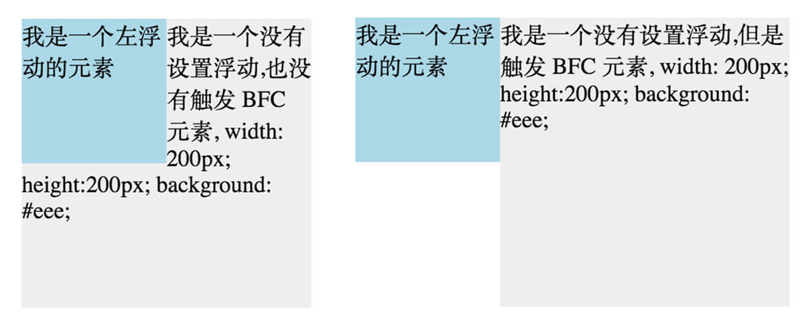
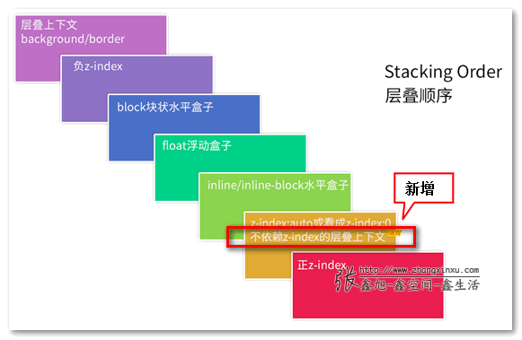

# CSS

## 1 盒模型

### 1.1 概念

盒模型包含了元素内容（content）、内边距（padding）、边框（border）、外边距（margin）几个要素

### 1.2 CSS 改变盒模型

**IE 盒模型跟标准盒模型不一样：**

- IE 模型元素宽度 `width = content + padding`
- 标准模型元素宽度 `width = content`

> 通过 css3 新增的属性 `box-sizing: content-box | border-box` 分别设置盒模型为标准模型（content-box）和 IE 模型（border-box）

### 1.3 js 设置和获取宽高

1. `dom.style.width` 只能取到行内样式的宽和高，CSS 中的样式取不到
2. `dom.currentStyle.width` 取到的是最终渲染后的宽和高，只有 IE 支持此属性
3. `window.getComputedStyle(dom).width` 取到的是最终渲染后的宽和高，IE9 以上支持。
4. `dom.getBoundingClientRect().width` 取到的是最终渲染后的宽和高，IE9 以上支持。除此外还可以取到相对于视窗的上下左右的距离

### 1.4 外边距合并

只有普通文档流中块框的垂直外边距才会发生外边距合并，行内框、浮动框或绝对定位之间的外边距不会合并

合并后的外边距高度等于两个发生合并的外边距的高度中的较大者

> 让元素触发 BFC 可以取消外边距合并

### 题目：介绍下盒子模型

## 2 CSS 选择器

### 2.1 选择器大类

1. 简单选择器（Simple selectors）：元素类型、id、class 等
2. 组合器（Combinators）：选择器组合，比如子元素、兄弟元素
3. 属性选择器（Attribute selectors）：属性 / 属性值
4. 伪类（Pseudo-classes）：处于某个状态的元素，比如 hover
5. 伪元素（Pseudo-elements）：before、after 等
6. 多用选择器（Multiple selectors）：以逗号分隔开的多个选择器放在一个 CSS 规则下面

### 2.2 简单选择器

1. 元素选择器
2. id
3. class
4. 通用选择器 \*

### 2.3 选择器组合

1. 后代选择器 (空格)
2. 子选择器，选择直接子元素 (>)
3. 相邻兄弟选择器，选择紧跟在后面的一个元素 (+)
4. 通用兄弟选择器，相同层级的兄弟元素 (~)

### 2.4 属性选择器

1. `[attribute]` 用于选取带有指定属性的元素
2. `[attribute=value]` 用于选取带有指定属性和值的元素
3. `[attribute~=value]` 用于选取属性值中包含指定词汇的元素
4. `[attribute|=value]` 用于选取带有以指定值开头的属性值的元素，该值必须是整个单词
5. `[attribute^=value]` 匹配属性值以指定值开头的每个元素
6. `[attribute$=value]` 匹配属性值以指定值结尾的每个元素
7. `[attribute*=value]` 匹配属性值中包含指定值的每个元素

```css
/* 只对有 href 的 a 标签生效 */
a[href] {
  color: red;
}
```

### 2.5 伪类

- `:active`
- `:any`
- `:checked`
- `:default`
- `:dir()`
- `:disabled`
- `:empty`
- `:enabled`
- `:first`
- `:first-child`
- `:first-of-type`
- `:fullscreen`
- `:focus`
- `:hover`
- `:indeterminate`
- `:in-range`
- `:invalid`
- `:lang()`
- `:last-child`
- `:last-of-type`
- `:left`
- `:link`
- `:not()`
- `:nth-child()`
- `:nth-last-child()`
- `:nth-last-of-type()`
- `:nth-of-type()`
- `:only-child`
- `:only-of-type`
- `:optional`
- `:out-of-range`
- `:read-only`
- `:read-write`
- `:required`
- `:right`
- `:root`
- `:scope`
- `:target`
- `:valid`
- `:visited`

### 2.6 伪元素

- `::after`
- `::before`
- `::first-letter`
- `::first-line`
- `::selection`
- `::backdrop`

### 题目：CSS 选择器有哪些

## 3 BFC

### 3.1 概念

BFC 即 Block Formatting Contexts (块级格式化上下文)

> 具有 BFC 特性的元素可以看作是隔离了的独立容器，容器里面的元素不会在布局上影响到外面的元素，并且 BFC 具有普通容器所没有的一些特性

通俗一点来讲，可以把 BFC 理解为一个封闭的大箱子，箱子内部的元素无论如何翻江倒海，都不会影响到外部

### 3.2 触发 BFC

1. body 根元素
2. 浮动元素：float 除 none 以外的值
3. 绝对定位元素：position (absolute、fixed)
4. display 为 inline-block、table-cells、flex
5. overflow 除了 visible 以外的值 (hidden、auto、scroll)

### 3.3 BFC 特性

1. 消除外边距合并，同一个 BFC 下外边距会发生折叠，如果想要避免外边距的重叠，可以将其放在不同的 BFC 容器中
2. BFC 可以包含浮动的元素（清除浮动），可以被撑开
3. BFC 可以阻止元素被浮动元素覆盖 (防止文字环绕)



### 题目：什么是 BFC，BFC 有什么作用，如何形成 BFC

## 4 position

### 4.1 知识点

文档流，就是一个垂直的流布局

- `static` 静态定位
- `relative` 相对定位，可以设置 top left，相对于当前位置
- `absolute` 绝对定位，会脱离文档流。定位上下文基于 html 或者上层非静态定位的元素
- `fixed` 固定定位。定位上下文基于窗口
- `sticky` 可用于使导航栏随页面滚动直到特定点，然后粘贴在页面顶部

### 题目：position 有哪些值，作用分别是什么

## 5 flex 布局

### 5.1 知识点

[flex 布局](/css/flex)

### 题目：flex 布局有什么好处

- 传统的布局不方便，而且不容易控制，比如 float
- `flex` 可以简便、完整、响应式地实现各种页面布局

## 6 CSS 样式权重

### 6.1 知识点

1. important 无限大
2. 行内样式 +1000
3. id +100
4. class、伪类、属性 +10
5. 标签、伪元素 +1
6. 通配符 \* +0

### 题目：css 优先级是怎么计算的

## 7 双飞翼/圣杯布局 (三栏布局)

### 7.1 五种实现方式

通俗的来说就是左右两栏固定宽度，中间部分自适应的三栏布局

**1. float**

```html
<div class="container clear-fix">
  <div class="left float-left"></div>
  <div class="right float-right"></div>
  <div class="center">hello</div>
  <!-- 注意 center 在最后 -->
</div>
```

**2. 绝对定位**

**3. flex 布局**

**4. table cell**

**5. grid 布局**

### 题目：双飞冀/圣杯布局

## 8 CSS3 新特性

### 8.1 CSS3 新特性

1. 过渡 transition
2. 动画 animation
3. 形状转换 transform
4. 选择器
5. 阴影、文字阴影
6. 边框、边框圆角
7. 背景 background-size
8. 文字、文字换行、文字省略号 `word-break` `text-overflow`
9. 弹性布局 flex
10. 栅格布局 grid
11. 多列布局 column-count
12. 媒体查询 `@media screen and (max-width: 960px)`

### 8.2 题目：CSS3 有哪些新特性

## 9 CSS 样式隔离

### 9.1 CSS 模块化思想

**什么是 CSS 模块化：**

是一种设计思想。按模块去拆分 CSS，以解决下面问题：

- class 命名看不懂
- class 重名
- 层级结构不清晰
- CSS 代码不能复用
- 像 import js 那样引用 css 代码

**BEM 命名规范：**

BEM 的意思就是块（block）、元素（element）、修饰符（modifier）

```css
/* 块即是通常所说的 Web 应用开发中的组件或模块。每个块在逻辑上和功能上都是相互独立的。 */
.block {
}

/* 元素是块中的组成部分。元素不能离开块来使用。BEM 不推荐在元素中嵌套其他元素。 */
.block__element {
}

/* 修饰符用来定义块或元素的外观和行为。同样的块在应用不同的修饰符之后，会有不同的外观 */
.block--modifier {
}
```

**如何实现模块化：**

1. 使用 BEM 命名规范
2. 使用 CSS Modules，即借助打包工具实现 import css

### 题目：CSS 样式隔离手段

1. 使用 BEM 命名规范
2. vue 中使用 scope
3. 使用打包工具，加 hash 值
4. css in js

## 10 CSS 性能优化

### 10.1 知识点

1. 避免使用 `@import`，外部的 css 文件中使用 `@import` 会使得页面在加载时增加额外的延迟
2. 避免回流和重绘 (参考性能优化专题)
3. css 动画启动 GPU 加速 (参考性能优化专题)
4. 文件压缩、去除无用的代码

### 题目：CSS 相关的性能优化

## 11 层叠上下文

### 11.1 知识点

**什么是层叠上下文：**

元素发生重叠时，表示元素的层级关系

**层叠顺序：**



1. 谁大谁上：当具有明显的层叠水平标示的时候，如识别的 z-indx 值，在同一个层叠上下文领域，层叠水平值大的那一个覆盖小的那一个
2. 后来居上：当元素的层叠水平一致、层叠顺序相同的时候，在 DOM 流中处于后面的元素会覆盖前面的元素

**如何改变层叠顺序：**

使用 `z-index`

### 题目：层叠上下文是什么

就是元素发生重叠时，会有一个层级关系

## 12 div 居中

### 12.1 六种方式

**1 flex 实现 (可以不定宽高)：**

```css
.container {
  width: 300px;
  height: 300px;
  display: flex;
  justify-content: center;
  align-items: center;
}
.box {
  width: 100px;
  height: 100px;
}
```

**2 绝对定位 margin (定宽高)：**

```css
.container {
  position: relative;
  width: 300px;
  height: 300px;
}
.box {
  position: absolute;
  width: 100px;
  height: 100px;
  top: 50%;
  left: 50%;
  margin: -50px 0 0 -50px;
}
```

**3 绝对定位 transform (不定宽高)：**

```css
.container {
  position: relative;
  width: 300px;
  height: 300px;
}
.box {
  position: absolute;
  width: 100px;
  height: 100px;
  top: 50%;
  left: 50%;
  transform: translate(-50%, -50%);
}
```

**4 绝对定位 margin auto (不定宽高)：**

```css
.container {
  position: relative;
  width: 300px;
  height: 300px;
}
.box {
  position: absolute;
  width: 100px;
  height: 100px;
  top: 0;
  left: 0;
  right: 0;
  bottom: 0;
  margin: auto;
}
```

**5 table-cell：**

```css
.container {
  position: relative;
  width: 300px;
  height: 300px;
  display: table-cell;
  vertical-align: middle;
}
.box {
  width: 100px;
  height: 100px;
}
```

**6 使内容（文字，图片）水平垂直居中（table-cell 布局）：**

```css
.container {
  position: relative;
  width: 300px;
  height: 300px;
  display: table-cell;
  vertical-align: middle;
  text-align: center;
}
```

### 题目：有哪些方式可以使 div 居中

## 13 浮动

### 13.1 知识点

> 浮动最开始的目的是用来实现文字环绕，后来通常用来布局

**浮动的特性：**

- 脱离文档流 (不能撑开父元素)
- 影响行内元素的布局，浮动元素会通过影响行内元素间接影响了包含块的布局

**闭合浮动 (让父元素能被撑开)：**

- 形成 BFC
- 清除浮动

```css
.clearfix::after {
  content: '';
  display: block;
  clear: both;
}
```

### 题目：浮动元素会造成什么影响，如何清除浮动
