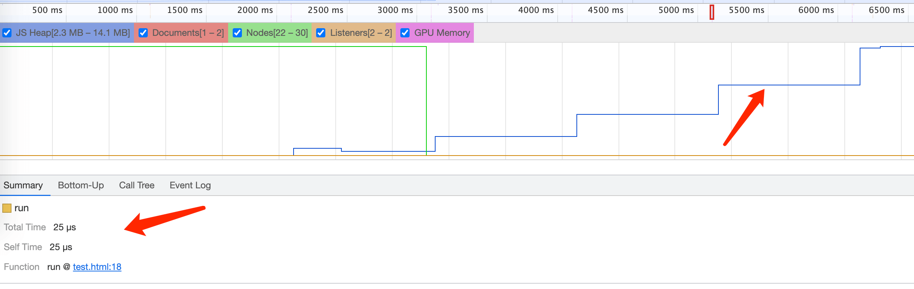
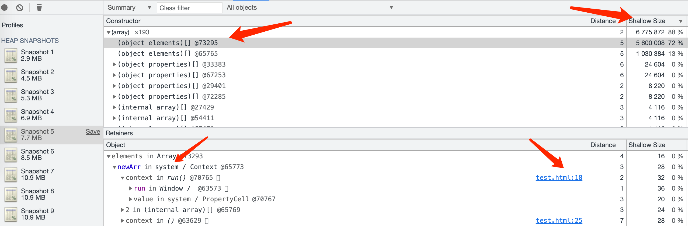

# 浏览器相关

## 1 行内元素、块级元素

**行内元素：**

a, span, label, strong, em, br, img, input, select, textarea

**块级元素：**

div, h1~h6, p, form, ul, li, ol, dl, hr, table

**行内元素和块级元素的区别：**

- 块级元素会独占一行，其宽度自动填满其父元素宽度
- 行内元素不会独占一行，相邻的行内元素会排列在同一行里，知道一行排不下，才会换行，其宽度随元素的内容而变化
- 块级元素可以设置 width, height 属性，【注意：块级元素即使设置了宽度，仍然是独占一行的】
- 行内元素设置 width, height 无效
- 块级元素可以设置 margin 和 padding
- 行内元素的水平方向的 padding-left,padding-right,margin-left,margin-right 都产生边距效果，但是竖直方向的 padding-top,padding-bottom,margin-top,margin-bottom 都不会产生边距效果。（水平方向有效，竖直方向无效）

### 题目：行内元素、块级元素有哪些，区别是什么

## 2 跨标签页通信

### 2.1 知识点

**BroadcastChannel (兼容差)**

safri 不兼容

创建一个用于广播的通信频道。当所有页面都监听同一频道的消息时，其中某一个页面通过它发送的消息就会被其他所有页面收到

```js
const bc = new BroadcastChannel('AlienZHOU');

bc.onmessage = function(e) {
  const data = e.data;
  const text = '[receive] ' + data.msg + ' —— tab ' + data.from;
  console.log('[BroadcastChannel] receive message:', text);
};

bc.postMessage(mydata);
```

**Service Worker**

`IE` 不支持，其他可以

是一个可以长期运行在后台的 `Worker`，能够实现与页面的双向通信。多页面共享间的 `Service Worker` 可以共享

**LocalStorage**

当 LocalStorage 变化时，会触发 storage 事件。利用这个特性，我们可以在发送消息时，把消息写入到某个 LocalStorage 中；然后在各个页面内，通过监听 storage 事件即可收到通知

**轮询**

通过定时检查 cookie 或者 localStorage 的数据是否变化

**postMessage**

和 iframe 通信

```js
// 接送信息
window.addEventListener('message', function(e) {
  // …… do something
});

// 发送信息，需要获取到 iframe 的 window 对象
window.frames[0].window.postMessage(
  {
    type: 'teacherExam',
    data: {
      teacherAuth: $tool.getAuth()
    }
  },
  '*'
);
```

## 3 history 和 hash 两种路由

路由分为后端路由和前端路由

- **后端路由：** 当页面地址改变时，浏览器会自动向服务端发起请求，获取当前地址的资源
- **前端路由：** 当页面地址改变时，浏览器不会自动向服务端发起请求，由 js 监听路由的变化，获取相关的资源

### 3.1 知识点

**单页面的路由：**

单页面 `web` 网页中, 单纯的浏览器地址改变, 网页不会重载，如单纯的 `hash` 网址改变网页不会变化，因此我们的路由主要是通过监听事件，并利用 `js` 实现动态改变网页内容

### 3.1 hash 路由

**hash 的特性：**

1. `hash` 指的是地址中 `#` 号以及后面的字符，也称为散列值。`hash` 也称作锚点，本身是用来做页面跳转定位的。如 `http://localhost/index.html#abc`，这里的 `#abc` 就是 `hash`
1. 散列值是不会随请求发送到服务器端的，所以改变 `hash`，不会重新加载页面
1. 监听 `window` 的 `hashchange` 事件，当散列值改变时，可以通过 `location.hash` 来获取和设置 `hash` 值
1. `location.hash` 值的变化会直接反应到浏览器地址栏

**触发 hashchange 事件的几种情况：**

1. `浏览器地址栏散列值的变化（包括浏览器的前进、后退）` 会触发 `window.location.hash` 值的变化，从而触发 `onhashchange` 事件
1. `输入带 hash 的地址` 例如：当浏览器地址栏中输入 `http://www.baidu.com/#home` 按回车，浏览器发送 `http://www.baidu.com/` 请求至服务器，请求完毕之后设置散列值为 `#home`，进而触发 `onhashchange` 事件
1. `只改变浏览器地址栏 URL 的哈希部分` 这时按下回车，浏览器不会发送任何请求至服务器，这时发生的只是设置散列值新修改的哈希值，并触发 `onhashchange` 事件
1. `html 中 <a> 标签` `href` 可以设置为页面的元素 `ID` 如 `#top`，当点击该链接时页面跳转至该 `id` 元素所在区域，同时浏览器自动设置 `window.location.hash` 属性，地址栏中的哈希值也会发生改变，并触发 `onhashchange` 事件

### 3.2 history 路由

**history 路由特性：**

1. `地址栏输一个地址按回车` 浏览器会重新加载
1. `window.history` 属性指向 `History` 对象，它表示当前窗口的浏览历史。当发生改变时，只会改变页面的路径，不会刷新页面
1. `History` 对象保存了当前窗口访问过的所有页面网址。通过 `history.length` 可以得出当前窗口一共访问过几个网址
1. 由于安全原因，浏览器不允许脚本读取这些地址，但是允许在地址之间导航。
1. 浏览器工具栏的“前进”和“后退”按钮，其实就是对 `History` 对象进行操作
1. 改变页面地址后，强制刷新浏览器时，（如果后端没有做准备的话）会报错

**属性和方法：**

- `History.back()`：后退
- `History.forward()`：前进
- `History.go(-3)`：后退 3 个页面
- `History.pushState()`：不会触发页面刷新，只是导致 `History` 对象发生变化，地址栏会有变化
- `History.replaceState()`：修改 `History` 对象的当前记录
- `popstate 事件`：`history` 对象出现变化时，就会触发 `popstate` 事件。`pushState()` 或 `replaceState()` 方法 ，并不会触发该事件，页面第一次加载的时候，浏览器不会触发 `popstate` 事件

### 3.3 实现 hash 路由

```js
class Routers {
  constructor() {
    this.routes = {};
    this.currentUrl = '';

    this.refresh = this.refresh.bind(this);

    // 监听路由改变
    window.addEventListener('load', this.refresh, false);
    window.addEventListener('hashchange', this.refresh, false);
  }

  // 添加路由
  route(path, callback) {
    this.routes[path] = callback || function() {};
  }

  // 切换到某个路由
  refresh() {
    this.currentUrl = location.hash.slice(1) || '/';
    this.routes[this.currentUrl]();
  }
}
```

### 3.3 实现 history 路由

```js
class Routers {
  constructor() {
    this.routes = {};
    // 在初始化时监听popstate事件
    this._bindPopState();
  }

  // 初始化路由
  init(path) {
    history.replaceState({ path: path }, null, path);
    this.routes[path] && this.routes[path]();
  }

  // 将路径和对应回调函数加入hashMap储存
  route(path, callback) {
    this.routes[path] = callback || function() {};
  }

  // 触发路由对应回调
  go(path) {
    history.pushState({ path: path }, null, path);
    this.routes[path] && this.routes[path]();
  }

  // 监听popstate事件
  _bindPopState() {
    window.addEventListener('popstate', e => {
      const path = e.state && e.state.path;
      this.routes[path] && this.routes[path]();
    });
  }
}

let router = new Routers();

router.route('/hello', () => {
  // 获取相关资源
  // 渲染页面
});

router.go('/hello');
```

### 题目：history 和 hash 两种路由方式的最大区别是什么

## 4 DOM 树

### 4.1 什么是 DOM 树

文档对象模型（Document Object Model），简称 DOM，将所有页面内容表示为可以修改的对象

`DOM` 提供了对 `HTML` 文档结构化的表述。在渲染引擎中，`DOM` 有三个层面的作用：

- 从页面的视角来看，`DOM` 是生成页面的基础数据结构
- 从 `JavaScript` 脚本视角来看，`DOM` 提供给 `JavaScript` 脚本操作的接口，通过这套接口，`JavaScript` 可以对 `DOM` 结构进行访问，从而改变文档的结构、样式和内容
- 从安全视角来看，`DOM` 是一道安全防护线，一些不安全的内容在 DOM 解析阶段就被拒之门外了

简言之，`DOM` 是表述 `HTML` 的内部数据结构，它会将 `Web` 页面和 `JavaScript` 脚本连接起来，并过滤一些不安全的内容

> **DOM 树**是一个树状结构，包含了页面内所有的节点，`DOM` 的“入口点”为 `document`

### 4.2 DOM 树如何生成

在渲染引擎内部，有一个叫 `HTML` 解析器（HTMLParser）的模块，它的职责就是负责将 `HTML` 字节流转换为 `DOM` 结构

> HTML 解析器并不是等整个文档加载完成之后再解析的，而是网络进程加载了多少数据，HTML 解析器便解析多少数据

**HTML 解析器工作流程：**

1. 网络进程接收到响应头之后，会根据响应头中的 `content-type` 字段来判断文件的类型，比如 `content-type` 的值是“text/html”，那么浏览器就会判断这是一个 `HTML` 类型的文件
2. 然后为该请求选择或者创建一个渲染进程
3. 渲染进程准备好之后，网络进程和渲染进程之间会建立一个共享数据的管道，
4. 网络进程接收到数据后就往这个管道里面放，而渲染进程则从管道的另外一端不断地读取数据
5. 渲染进程的 `HTML` 解析器，会动态接收字节流，并将其解析为 `DOM`

### 4.3 JavaScript 是如何影响 DOM 生成的

1. `script` 标签之前，所有的解析流程还是和之前介绍的一样
2. 解析到 `script` 标签时，渲染引擎判断这是一段脚本，此时 `HTML` 解析器就会暂停 `DOM` 的解析
3. 这时候 `HTML` 解析器暂停工作，`JavaScript` 引擎介入，并执行 `script` 标签中的这段脚本
4. 脚本执行完成之后，`HTML` 解析器恢复解析过程，继续解析后续的内容，直至生成最终的 `DOM`

### 4.4 题目：说下你对 DOM 树的理解

## 5 事件模型

### 5.1 事件

[事件相关笔记](/browser/event)

### 题目：说下事件模型

**回答方向：**

- DOM 事件的级别，addEventListener 参数
  - `passive` 表明处理程序将不会调用 `preventDefault()`
- 事件模型 (事件分为捕获和冒泡阶段)
- 事件流 (事件的流向，捕获阶段从 window->document->documentElement->目标元素->冒泡)
- Event 对象
  - `event.target` —— 引发事件的层级最深的元素，即触发事件的元素。事件代理会用到
  - `event.currentTarget（=this）` —— 处理事件的当前元素（具有处理程序的元素）
  - `event.eventPhase` —— 当前阶段（capturing=1，target=2，bubbling=3）
  - `event.stopPropagation()` 阻止冒泡
  - `event.stopImmediatePropagation()` 如果一个元素在一个事件上有多个处理程序，即使其中一个停止冒泡，其他处理程序仍会执行。这个方法可以用于停止冒泡，并阻止当前元素上的处理程序运行
- 事件委托
- 自定义事件

```html
<button id="elem" onclick="alert('Click!');">Autoclick</button>

<script>
  let event = new Event('click');
  elem.dispatchEvent(event); // 触发这个 click 事件
</script>
```

## 6 缓存策略

### 6.1 知识点

[浏览器缓存](/performance/cache)

### 题目：浏览器缓存策略是怎样的

**回答方向：**

- 资源请求过程 (三级缓存策略)
- 缓存类型 (强缓存、协商缓存)
- 强缓存：
- expires：资源失效的时间，一个绝对的时间，本地的时间会影响
- Cache-Control
  - max-age: 资源多久后失效
  - no-cache：需要进行协商缓存，发送请求到服务器确认是否使用缓存
  - no-store：禁止使用缓存，每一次都要重新请求数据
  - public：可以被所有的用户缓存，包括终端用户和 CDN 等中间代理服务器
  - private：只能被终端用户的浏览器缓存，不允许 CDN 等中继缓存服务器对其缓存
  - Cache-Control 与 Expires 可以在服务端配置同时启用，同时启用的时候 Cache-Control 优先级高
- 协商缓存：当强缓存没有命中的时候，浏览器会发送一个请求到服务器，服务器根据 header 中的部分信息来判断是否命中缓存。如果命中，则返回 304 ，告诉浏览器资源未更新，可使用本地的缓存
  - Last-Modify：资源最后修改的时间，资源请求的时候会通过 If-Modify-Since 带上这个时间。服务端需要根据这个时间来判断，返回新的资源还是 304
  - Etag：返回的是一个校验码，资源变化都会导致 ETag 变化。资源请求时通过 If-None-Match 带上这个校验码

**注意点：**

- 强缓存和协商缓存都需要服务端返回相应的 `response header`
- 协商缓存需要服务端去对比 `requese header` 中的 `If-Modify-Since/If-None-Match`，然后返回资源或 `304`

## 7 浏览器架构

### 7.1 知识点

> 从浏览器进程和线程描述

**浏览器进程与线程的简化理解：**

- 浏览器是多进程的
- 浏览器之所以能够运行，是因为系统给它的进程分配了资源（cpu、内存）
- 简单点理解，每打开一个 `Tab` 页，就相当于创建了一个独立的浏览器进程。

> **注意：**在这里浏览器应该也有自己的优化机制，有时候打开多个 `tab` 页后，可以在 `Chrome` 任务管理器中看到，有些进程被合并了

**浏览器包含哪些进程：（为了简化理解，仅列举主要进程）**

- `Browser` 进程：浏览器的主进程（负责协调、主控），只有一个。作用有：
  1. 负责浏览器界面显示，与用户交互。如前进，后退等
  2. 负责各个页面的管理，创建和销毁其他进程
  3. 将 `Renderer` 进程得到的内存中的 `Bitmap`，绘制到用户界面上
  4. 网络资源的管理，下载等
- 第三方插件进程：每种类型的插件对应一个进程，仅当使用该插件时才创建
- `GPU` 进程：最多一个，用于 3D 绘制等
- 浏览器渲染进程（浏览器内核）（`Renderer` 进程，内部是多线程的）：默认每个 Tab 页面一个进程，互不影响。主要作用为：
  1. 页面渲染
  2. 脚本执行
  3. 事件处理等
  4. 异步请求

**相比于单进程浏览器，多进程有如下优点：**

- 避免单个页面崩溃影响整个浏览器
- 避免第三方插件崩溃影响整个浏览器
- 多进程充分利用多核优势
- 方便使用沙盒模型隔离插件等进程，提高浏览器稳定性

> 简单点理解：如果浏览器是单进程，那么某个 `Tab` 页崩溃了，就影响了整个浏览器，体验有多差；同理如果是单进程，插件崩溃了也会影响整个浏览器；而且多进程还有其它的诸多优势。。。

**浏览器进程包含了哪些线程：**

- `UI 线程` 负责绘制工具栏中的按钮、地址栏等
- `网络线程` 负责从网络中获取数据
- `存储线程` 负责文件等功能

**渲染进程包含了哪些线程（列举一些主要常驻线程）：**

- `GUI` 渲染线程
  1. 负责渲染浏览器界面，解析 `HTML`，`CSS`，构建 `DOM` 树和 `RenderObject` 树，布局和绘制等
  1. 当界面需要重绘（Repaint）或由于某种操作引发回流 (reflow) 时，该线程就会执行
  1. 注意，**GUI 渲染线程与 JS 引擎线程是互斥的**，当 `JS` 引擎执行时 `GUI` 线程会被挂起（相当于被冻结了），`GUI` 更新会被保存在一个队列中等到 `JS` 引擎空闲时立即被执行
- `JS` 引擎线程
  1. 也称为 `JS` 内核，负责处理 `Javascript` 脚本程序。（例如 V8 引擎）
  1. `JS` 引擎线程负责解析 `Javascript` 脚本，运行代码
  1. `JS` 引擎一直等待着任务队列中任务的到来，然后加以处理，一个 `Tab` 页（`renderer` 进程）中无论什么时候都只有一个 `JS` 线程在运行 `JS` 程序
  1. 同样注意，**`GUI` 渲染线程与 `JS` 引擎线程是互斥的**，所以如果 `JS` 执行的时间过长，这样就会造成页面的渲染不连贯，导致页面渲染加载阻塞
- 事件触发线程
  1. 归属于浏览器而不是 `JS` 引擎，用来控制事件循环（可以理解，`JS` 引擎自己都忙不过来，需要浏览器另开线程协助）
  1. 当 `JS` 引擎执行代码块如 `setTimeOut` 时（也可来自浏览器内核的其他线程,如鼠标点击、`AJAX` 异步请求等），会将对应任务添加到事件线程中
  1. 当对应的事件符合触发条件被触发时，该线程会把事件添加到待处理队列的队尾，等待 `JS` 引擎的处理
  1. 注意，由于 `JS` 的单线程关系，所以这些待处理队列中的事件都得排队等待 `JS` 引擎处理（当 `JS` 引擎空闲时才会去执行）
- 定时触发器线程
  1. 传说中的 `setInterval` 与 `setTimeout` 所在线程
  1. 浏览器定时计数器并不是由 `JavaScript` 引擎计数的,（因为 `JavaScript` 引擎是单线程的, 如果处于阻塞线程状态就会影响记计时的准确）
  1. 因此通过单独线程来计时并触发定时（计时完毕后，添加到事件队列中，等待 `JS` 引擎空闲后执行）
  1. 注意，`W3C` 在 `HTML` 标准中规定，规定要求 `setTimeout` 中低于 `4ms` 的时间间隔算为 `4ms`
- 异步 http 请求线程
  1. 在 `XMLHttpRequest` 在连接后是通过浏览器新开一个线程请求
  1. 将检测到状态变更时，如果设置有回调函数，异步线程就产生状态变更事件，将这个回调再放入事件队列中。再由 `JavaScript` 引擎执行

### 题目：聊下你知道的浏览器架构

- 从浏览器进程方便回答
- 浏览器是多进程的
- 主进程：负责用户交互、子进程管理和文件储存等功能
- 网络进程：面向渲染进程和浏览器进程等提供网络下载功能
- GPU 进程
- 渲染进程：把从网络下载的 HTML、JavaScript、CSS、图片等资源解析为可以显示和交互的页面
  - GUI 渲染线程
  - JS 引擎线程
  - 事件触发线程 (管理消息队列)
  - 定时器线程

## 8 浏览器工作原理

### 8.1 浏览器渲染流程

**为了简化理解，前期工作直接省略成：**

1. 浏览器输入 `url`，浏览器主进程接管
1. 按下回车开始访问时，开一个下载线程，主进程的 `UI` 线程将借助网络线程访问站点资源
1. 同时网络线程会根据适当的网络协议，例如 `DNS lookup` 和 `TLS` 为这次请求建立连接
1. 然后进行 `http` 请求（略去 `DNS` 查询，`IP` 寻址等等操作），然后等待响应，获取内容，随后将内容通过 `RendererHost` 接口转交给 `Renderer` 进程

- 浏览器渲染流程开始

**额外资源的加载:**

1. 一个网站通常还会使用类似图片，样式文件和 `JavaScript` 代码等额外的资源
1. 这些资源也需要从网络或缓存中获取，主线程在转化 `HTML` 的过程中理应挨个加载它们
1. 为了提高效率，预加载扫描（Preload Scanner）与转换过程会同时运行着
1. 当预加载扫描在分析器分析 `HTML` 过程中发现了类似 `img` 或 `link` 这样的标签时，就会发送请求给浏览器进程的网络线程
1. 主线程会根据这些额外资源是否会阻塞转化过程而决定是否等待资源加载完毕

**浏览器器内核拿到内容后，渲染大概可以划分成以下几个步骤：**

1. 解析 `html` 建立 `dom` 树
1. 解析 `css` 构建 `render` 树（将 `CSS` 代码解析成树形的数据结构，然后结合 `DOM` 合并成 `render` 树）
1. 布局 `render` 树（Layout/reflow），负责各元素尺寸、位置的计算
1. 绘制 `render` 树（paint），绘制页面像素信息
1. 浏览器会将各层的信息发送给 `GPU`，`GPU` 会将各层合成（`composite`），显示在屏幕上

所有详细步骤都已经略去，渲染完毕后就是 `load` 事件了，之后就是自己的 `JS` 逻辑处理了


## 9 内存泄露

### 9.1 什么是内存泄露

> 内存泄漏指由于疏忽或错误造成程序未能释放已经不再使用的内存。内存泄漏并非指内存在物理上的消失，而是应用程序分配某段内存后，由于设计错误，导致在释放该段内存之前就失去了对该段内存的控制，从而造成了内存的浪费

1. 浏览器引擎对内存的使用是有限制的，`V8` 引擎在 `64` 位系统下最多只能使用约 `1.4GB` 的内存，在 `32` 位系统下最多只能使用约 `0.7GB` 的内存
1. 在 `V8` 引擎逐行执行 `JavaScript` 代码的过程中，当遇到函数的情况时，会为其创建一个函数执行上下文(Context)环境并添加到调用堆栈的栈顶
1. 函数的作用域(handleScope)中包含了该函数中声明的所有变量
1. 当该函数执行完毕后，对应的执行上下文从栈顶弹出，函数的作用域会随之销毁，其包含的所有变量也会统一释放并被自动回收
1. 如果在这个作用域被销毁的过程中，其中的变量不被回收，即持久占用内存，那么就可能会导致卡顿

### 9.2 如何避免内存泄露

1. **尽可能少的创建全局变量：** 全局变量不会释放，除非手动设置为 null
1. **手动清除定时器：** 比如 `setInterval`，不清除会一直执行
1. **清除事件监听器：** 比如 `window.addEventListener('resize')`，不需要时需要手动清除
1. **少用闭包：** 注意清除引用
1. **清除 DOM 的引用：** 比如 `let ele = document.getElementById('button')`，如果 `ele` 为清除，那么即使节点在 html 中被删除，也还会留在内存中
1. **弱引用：** WeakMap、WeakSet

### 9.3 如何定位内存泄露

**使用 Performance：**



1. 开启录制
1. 打开 Memory 选项
1. 就能看到内存的走势图
1. 点击走势图的一个位置，就能看到 JS 在这个时间点运行了什么，哪个函数被运行了

**使用 Memory 工具**



1. 截取几次快照
1. 观察内存的大小
1. 如果有异常，把内存大小从大往小排
1. 从内存占用大的地方开始排查，点开列表里面的对象就能找到代码里面定义的变量

### 题目：如何定位内存泄露
