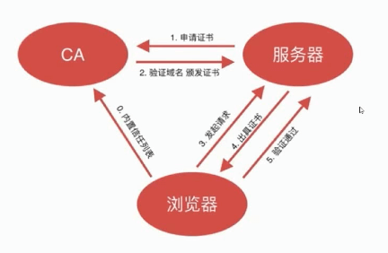
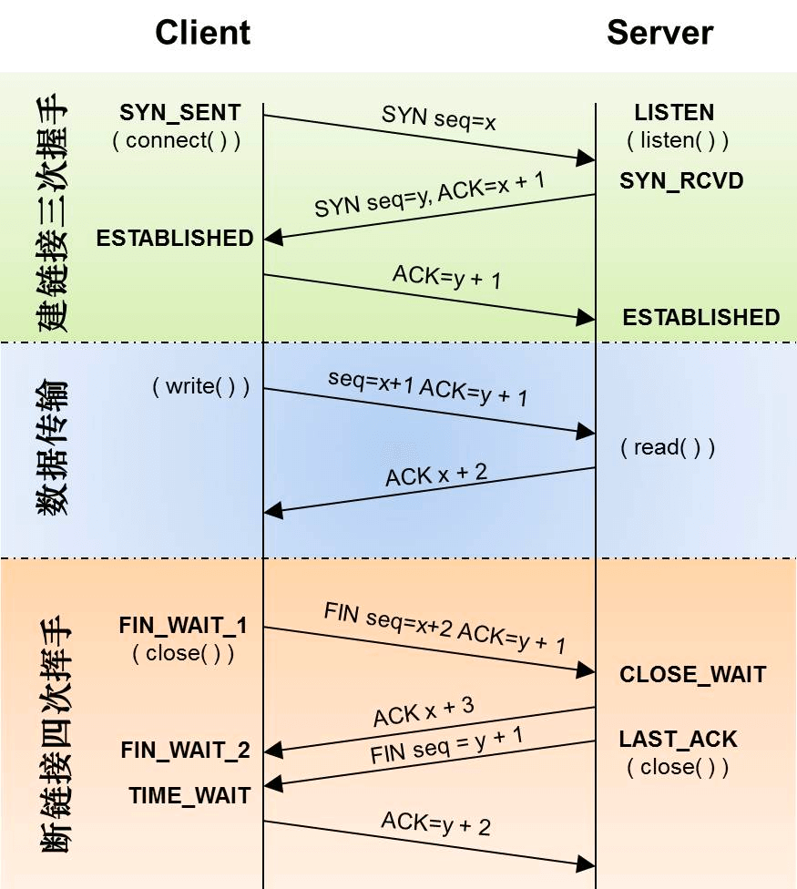

# 计算机网络

## 1 七层网络模型

### 1.1 知识点

| OSI 7 层模型               | TCP/IP 4 层模型 |                |
| :------------------------- | :-------------- | :------------- |
| 应用层 表示层 会话层 | 应用层          | HTTP、FTP、DNS |
| 传输层                     | 传输层          | TCP、UDP       |
| 网络层                     | 网际互联层      | IP             |
| 数据链路层                 | 网络接口层      | Ethernet 802.3 |
| 物理层                     |                 |                |

## 2 http

**HTTP 是什么：**

1. HTTP 是一个两点之间传输文字、图片、音频、视频等超文本数据的约定和规范
1. 浏览器里面请求资源就是使用 HTTP 协议

**HTTP 请求方法：**

1. GET：获取资源，可以理解为读取或者下载数据；
2. HEAD：获取资源的元信息；
3. POST：向资源提交数据，相当于写入或上传数据；
4. PUT：类似 POST；
5. DELETE：删除资源；
6. CONNECT：建立特殊的连接隧道；
7. OPTIONS：列出可对资源实行的方法；
8. TRACE：追踪请求 - 响应的传输路径

**Restful 接口：**

1. GET：查找
1. POST：新增
1. PUT：修改
1. DELETE：删除

**GET/POST 的区别：**

1. GET 请求的参数放在 URL 上面，POST 请求通过 request body 传递参数
1. Get 请求传输数据量小，Post 请求传输数据量大
1. POST 的安全性比 GET 的高

## 3 https

### 3.1 https 的作用

http 是明文的，数据会被篡改或伪造

https 全称是“HTTP over SSL/TLS”，也就是运行在 `SSL/TLS` 协议上的 `HTTP`

> Https = Http + 加密 + 认证 + 完整性验证

**https 的作用：**

- **数据加密** 传输内容进行混淆
- **身份验证** 通信双方验证对方的身份真实性
- **数据完整性保护** 检测传输的内容是否被篡改或伪造

### 3.2 TLS/SSL 协议的握手过程

> SSL 工作在 OSI 七层模型中的表示层，TCP/IP 四层模型的应用层

TLS 协议的握手过程:

1. 客户端先给服务端发送一个消息，消息内容包括：客户端支持的加密方式，支持的压缩方法，SSL 的版本号，客户端生成的随机数，文本内容“Hello”等
2. 服务端接收到消息后，也回发一个 Hello，并携带从客户端支持的加密方式中选择的加密方式，服务端生成的随机数，服务端的 SSL 版本号等信息
3. 随后服务器给客户端发送一个 Certificate 报文，报文中包含服务端的公钥证书
4. 紧接着服务器给客户端发送 Server Hello Done, 表示最初的协商握手过程结束
5. 客户端接收到服务端发送的握手结束的消息后，以 Client Key Exchange 作为回应，此报文中包含通信加密过程中使用的一种被称为 Pre-master secret 的随机密码串，并使用第三步接收到的公钥证书进行了加密
6. 接着客户端发送 Change Cipher Spec 报文，该报文告知服务端，此步骤之后的所有数据将使用第五步中生成的 master secret 进行加密
7. 随后客户端发送 Finish 报文，此报文中包含连接至今所有报文的整体校验值，用于完整性验证
8. 服务端接收到客户端发送的 Change Cliper Spec 报文后，同样以 Change Cliper Spec 报文作为回应
9. 接着服务端发送 Finish 报文给客户端，表示服务端已正确解析客户端发送的整体校验值，至此，SSL 握手的过程结束
10. 随后开始使用 HTTP 协议传输使用 master secret 加密过的数据

> 证书需要向正规的服务商申请，而且浏览器内置了一个信任的 CA 证书列表，如果证书不是来自这个列表那么校验不通过

TLS 协议安全性几个关键的点：

- 证书无法伪造 (证书是向 CA 申请的)
- 证书私钥不被泄漏 (保证服务端不被攻击，私钥被盗)
- 域名管理权不泄漏
- CA 坚守原则 (CA 不随意发证书)

### 3.3 题目：https 加密过程是怎样的

## 4 http 2.0

### 4.1 知识点

http2 是由 Google 主导推出的协议，于 2015 年发布

**http2 做的改进：**

1. `HTTP/2` 是一个二进制协议，增加了数据传输的效率
1. `HTTP/2` 是可以在一个 `TCP` 链接中并发请求多个 `HTTP` 请求，移除了 `HTTP/1.1` 中的串行请求
1. `HTTP/2` 会压缩头，如果你同时发出多个请求，他们的头是一样的或是相似的，那么，协议会帮你消除重复的部分
1. `HTTP/2` 允许服务端在客户端放 `cache`，又叫服务端 `push`，也就是说，你没有请求的东西，我服务端可以先送给你放在你的本地缓存中。比如，你请求 X，我服务端知道 X 依赖于 Y，虽然你没有的请求 Y，但我把把 Y 跟着 X 的请求一起返回客户端

### 4.1 http2.0 做了哪些改进

## 5 http 3.0

### 5.1 知识点

**http2 的不足：**

若干个 `HTTP` 的请求在复用一个 `TCP` 的连接，底层的 `TCP` 协议是不知道上层有多少个 `HTTP` 的请求的，所以，一旦发生丢包，造成的问题就是所有的 `HTTP` 请求都必需等待这个丢了的包被重传回来

**http3 做的改进：**

- `http3` 把 `HTTP` 底层的 `TCP` 协议改成了 `UDP`

### 题目：http2.0 有哪些不足，http3.0 是什么

## 6 websocket

### 题目：websocket 建立过程

## 7 tcp

### 7.1 三次握手

- 浏览器发起请求，发送初始化的 Sequence Number `x`
- 服务器回复收到请求，发送 ACK `x-1`，同时发送服务端初始化的 Sequence Number `y`
- 浏览器回复收到请求，发送 ACK `y+1`

**说明：**

- **seq：** `Sequence Number` 是包的序号，用来解决网络包乱序（reordering）问题
- **ACK：** `Acknowledgement Number` 就是 ACK——用于确认收到，用来解决不丢包的问题
- **SYN：** `Synchronize Sequence Numbers` 初始化的 Sequence Number，这个号要作为以后的数据通信的序号

**三次握手的作用：**

1. 建立连接
2. 初始化 Sequence Number 的初始值，通信的双方要互相通知对方自己的初始化的 Sequence Number，这个过程叫 SYN。这个号要作为以后的数据通信的序号，以保证应用层接收到的数据不会因为网络上的传输的问题而乱序

### 7.2 四次挥手

- 浏览器发送关闭连接 FIN
- 服务器发送收到 ACK
- 服务器发送关闭连接 FIN
- 浏览器发送收到 ACK

### 题目：三次握手过程

### 题目：tcp 滑动窗口是什么

### 题目：tcp 重试机制

## 8 udp

### 8.1 知识点

`UDP` 提供不可靠服务，具有 `TCP` 所没有的优势：

- **UDP 无连接：** 时间上不存在建立连接需要的时延。空间上，TCP 需要在端系统中维护连接状态，需要一定的开销。此连接装入包括接收和发送缓存，拥塞控制参数和序号与确认号的参数。UDP 不维护连接状态，也不跟踪这些参数，开销小。空间和时间上都具有优势。
- **UDP 没有拥塞控制：** 应用层能够更好的控制要发送的数据和发送时间，网络中的拥塞控制也不会影响主机的发送速率。某些实时应用要求以稳定的速度发送，能容忍一些数据的丢失，但是不能允许有较大的时延（比如实时视频，直播等）
- **UDP 不保证可靠交付：** 所有维护传输可靠性的工作需要用户在应用层来完成。没有 TCP 的确认机制、重传机制。如果因为网络原因没有传送到对端，UDP 也不会给应用层返回错误信息
- **UDP 常用一次性传输比较少量数据的网络应用：** 如 DNS,SNMP 等，因为对于这些应用，若是采用 TCP，为连接的创建，维护和拆除带来不小的开销。
- **UDP 也常用于多媒体应用：** 如 IP 电话，实时视频会议，流媒体等。数据的可靠传输对他们而言并不重要，TCP 的拥塞控制会使他们有较大的延迟，也是不可容忍的

## 9 跨域

**jsonp：**

- jsonp 本质不是 ajax 请求
- 需要先在前端的 js 中定义一个回调函数
- 然后生成 script 标签，发请求给后端，只支持 get 请求
- 后端可以拿到回调函数名，把数据作为回调函数的参数传回去
- 前端就能接收到数据
