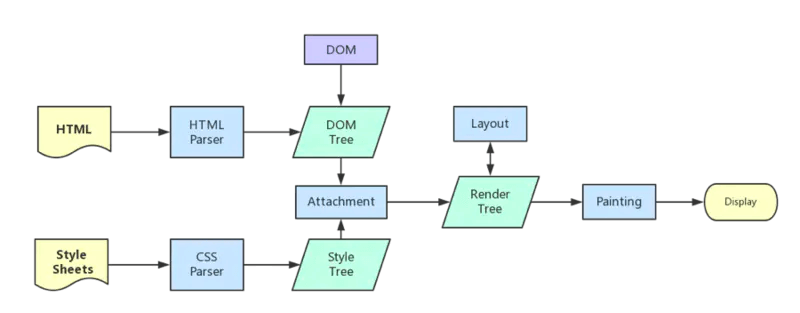

# 性能优化

## 1 前端性能优化指标 RAIL

### 1.1 知识点

**RAIL 是一个以用户为中心的性能模型：**

- **Response:** (事件响应优化) 事件处理最好在 50ms 内完成
- **Animation:** (动画优化) 在 10ms 内产生一帧，保证动画的流畅
- **Idle:** (足够的空闲时间) 最大化空闲时间，以增大 50ms 内响应用户输入的几率
- **Load:** (首屏优化) 传输内容到页面可交互的时间不超过 5 秒

### 题目：有听过前端性能优化指标 RAIL 吗

## 2 前端性能优化手段

### 2.1 知识点

- 渲染优化
  1. 避免重绘
  1. 读写分离，避免触发强制回流
  1. 避免阻塞渲染，CSS JS 会阻塞渲染
  1. 高频事件防抖，requestAnimationFrame 将帧数控制在合理范围
- 代码优化
  1. JS 缩短解析时间
  1. 函数优化
  1. 对象优化
  1. HTML 优化
  1. CSS 优化
- 资源优化
  1. 资源压缩与合并
  1. 图片格式优化
  1. 图片加载优化
  1. 字体优化
- 构建优化
  1. webpack 性能优化
  1. webpack 依赖优化
  1. webpack 代码拆分
  1. webpack 资源压缩
  1. webpack 持久化缓存
- 传输加载优化
  1. 懒加载
  1. 预加载
  1. 启用 gzip
  1. 启用 keep alive
  1. SSR 服务端渲染
- 浏览器缓存

### 题目：你知道的前端性能优化手段有哪些

## 3 重绘和重排

### 3.1 页面生成过程

1. HTML 被 HTML 解析器解析成 DOM 树
2. CSS 被 CSS 解析器解析成 CSSOM 树
3. 结合 DOM 树和 CSSOM 树，生成一棵渲染树(Render Tree)，这一过程称为 Attachment
4. 生成布局(flow)，浏览器在屏幕上“画”出渲染树中的所有节点
5. 将布局绘制(paint)在屏幕上，显示出整个页面

第四步和第五步是最耗时的部分，这两步合起来，就是我们通常所说的**渲染**

重排(reflow)和重绘(repaint)就是重新渲染

- **重绘：**某些元素的外观被改变，例如：元素的填充颜色
- **重排：**重新生成布局，重新排列元素

### 3.2 重绘

**概念：**

当一个元素的外观发生改变，但没有改变布局,重新把元素外观绘制出来的过程，叫做重绘

**常见的引起重绘的属性：**

| 属性            |                  |                     |                   |
| --------------- | ---------------- | ------------------- | ----------------- |
| color           | border-style     | visibility          | background        |
| text-decoration | background-image | background-position | background-repeat |
| outline-color   | outline          | outline-style       | border-radius     |
| outline-width   | box-shadow       | background-size     |                   |

### 3.3 重排

**概念：**

当 DOM 的变化影响了元素的几何信息(元素的的位置和尺寸大小)，浏览器需要重新计算元素的几何属性，将其安放在界面中的正确位置，这个过程叫做重排

**发生重排的情况：**

- 页面初始渲染，这是开销最大的一次重排
- 添加/删除可见的 DOM 元素
- 改变元素位置
- 改变元素尺寸，比如边距、填充、边框、宽度和高度等
- 改变元素内容，比如文字数量，图片大小等
- 改变元素字体大小
- 改变浏览器窗口尺寸，比如 resize 事件发生时
- 激活 CSS 伪类（例如：:hover）
- 设置 style 属性的值，因为通过设置 style 属性改变结点样式的话，每一次设置都会触发一次 reflow
- 查询某些属性或调用某些计算方法：offsetWidth、offsetHeight 等，除此之外，当我们调用 getComputedStyle 方法，或者 IE 里的 currentStyle 时，也会触发重排，原理是一样的，都为求一个“即时性”和“准确性”

**重排范围：**

- 全局范围：从根节点 html 开始对整个渲染树进行重新布局。
- 局部范围：对渲染树的某部分或某一个渲染对象进行重新布局

**局部范围：**把一个 dom 的宽高之类的几何信息定死，然后在 dom 内部触发重排，就只会重新渲染该 dom 内部的元素，而不会影响到外界

### 3.3 重排优化

**1. 减少重排范围**

**2. 减少重排次数**

- 样式集中改变，不要一条条修改样式，使用 class 修改
- 分离读写操作，读写不要穿插混合在一起。浏览器对渲染做了优化
- 将 DOM 离线，`display:none` 或 复制节点，就不会频繁触发
- 使用 `absolute` 或 `fixed` 脱离文档流，重排就只针对这个元素
- 优化动画

### 3.4 调试工具

- `Layout`：重排，又叫回流
- `Paint`：重绘，重排重绘这些步骤都是在 CPU 中发生的。
- `Compostite Layers`：CPU 把生成的 BitMap（位图）传输到 GPU，渲染到屏幕

### 3.5 题目：重排和重绘是什么，有什么区别

## 4 白屏

### 4.1 知识点

**白屏时间的重要性：**

用户等待的时间越短，留存率越高

**优化方案：**

- 优化资源加载的时间
  1. DNS 优化
  1. 资源压缩和合并，减少 http 请求数
  1. 按需加载，非本页的资源不加载
  1. TreeShaking 删除无关代码
  1. 懒加载，非必要的图片不加载
  1. 启用 gzip，减少资源的大小
  1. 利用浏览器缓存
- 渲染优化
  1. SSR 服务端渲染，减少前端渲染的时间，还可以利用服务端的缓存做其他优化
  1. 避免阻塞渲染，CSS JS 放在合适的位置避免阻塞渲染，JS 使用 defer 或 async 加载

### 题目：如何减少白屏的时间

## 5 大量图片加载优化

### 5.1 知识点

**解决方案：**

- **加载合适大小的图片：** 提供不同大小的图片，加载时根据屏幕分辨率加载合适的图片
- **按需加载：** 先加载首屏的图片，加载完成后再加载后面的图片

### 题目：网站首页有大量的图片，加载很慢，如何去优化呢

## 6 浏览器重输入网址到页面展现整个过程

### 6.1 知识点

[浏览器重输入网址到页面展现整个过程](/browser/browser)

### 题目：描述下浏览器从输入网址到页面展现的整个过程

## 7 动画性能

### 7.1 知识点

**优化动画性能：**

- **减少回流：** 使用 `transform` 代替 `left、top` 减少使用引起页面重排的属性
- **开启硬件加速：**
- **使用单独的层：**
- **DOM 元素读写分离：** 避免强制回流

### 题目：动画性能如何优化

## 8 渲染合成层

### 8.1 知识点

**浏览器渲染的图层一般包含两大类：** `普通图层` 以及 `复合图层`

> 可以通过 `硬件加速` 的方式，声明一个 `新的复合图层`，它会单独分配资源（当然也会脱离普通文档流，这样一来，不管这个复合图层中怎么变化，也不会影响 `默认复合层` 里的回流重绘）

**如何变成复合图层（硬件加速）:**

将该元素变成一个复合图层，就是传说中的硬件加速技术

- 最常用的方式：`translate3d`、`translateZ`
- `opacity` 属性/过渡动画（需要动画执行的过程中才会创建合成层，动画没有开始或结束后元素还会回到之前的状态）
- `will-chang` 属性（这个比较偏僻），一般配合 `opacity` 与 `translate` 使用（而且经测试，除了上述可以引发硬件加速的属性外，其它属性并不会变成复合层）
- `<video>` `<iframe>` `<canvas>` `<webgl>` 等元素

**复合图层的作用：**

一般一个元素开启硬件加速后会变成复合图层，可以独立于普通文档流中，改动后可以避免整个页面重绘，提升性能

> 但是尽量不要大量使用复合图层，否则由于资源消耗过度，页面反而会变的更卡

### 题目：渲染合成层是什么

## 9 错误和性能监控

**错误监控：**

1. 全局捕获 **window.onerror**
1. Vue `Vue.config.errorHandler = function`
1. React `ErrorBoundary` 组件

**性能监控：**

1. 在 head 记录初始时间
2. 监听 DOMContentLoaded 和 load 事件
3. window.performance 接口 timing 属性
