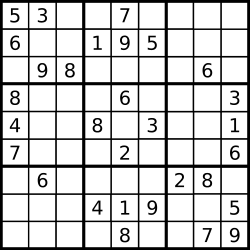

# 算法

## 1 斐波那契数列

**题目：**

斐波那契数，通常用  `F(n)` 表示，形成的序列称为 斐波那契数列 。该数列由  0 和 1 开始，后面的每一项数字都是前面两项数字的和。也就是：

```
F(0) = 0，F(1) = 1
F(n) = F(n - 1) + F(n - 2)，其中 n > 1
```

给你 n ，请计算 F(n)

**思路：**

使用动态规划，动态规划的思想是将任务拆分为相同的子任务

```js
var fib = function(n) {
  if (n < 2) return n;

  let val = 1;
  let n1 = 0;
  let n2 = 0;

  // 相同的子任务
  for (let i = 2; i <= n; i++) {
    n1 = n2;
    n2 = val; // n1,n2 往后移一步
    val = n1 + n2; // 计算 n3
  }

  return val;
};
```

### 题目：实现一个斐波那契数列

## 2 合并二维有序数组成一维有序数组

**思路：**

取两个数组的第一个对比，小的放入新数组中

```js
// 合并两个数组
function merge2(arr1, arr2) {
  let p1 = 0;
  let p2 = 0;
  let arr = [];

  while (p1 < arr1.length && p2 < arr2.length) {
    // 取两个数组的第一个对比，小的放入新数组中
    // 如果一个数组空了，直接放入新数组中
    if (arr1[p1] < arr2[p2]) {
      arr.push(arr1[p1]);
      p1++;
    } else {
      arr.push(arr2[p2]);
      p2++;
    }
  }

  while (p1 < arr1.length) {
    arr.push(arr1[p1]);
    p1++;
  }
  while (p2 < arr2.length) {
    arr.push(arr2[p2]);
    p2++;
  }

  return arr;
}

// 合并二维数组
function mergeArr(arr) {
  let arr1 = arr[0];
  let arr2 = arr[1];
  let i = 1;

  while (i < arr.length) {
    i++;
    arr1 = merge2(arr1, arr2);
    arr2 = arr[i];
  }

  return arr1;
}
```

### 题目：合并二维有序数组成一维有序数组

## 3 链表：反转链表

### 3.1 while 迭代

**思路：**

1. 创建一个新的链表 (不是真的创建，便于理解)
2. 每次取旧链表的表头
3. 塞到新链表中作为表头

```js
var reverseList = function(head) {
  let newhead = null; // 创建一个新的链表 (不是真的创建，便于理解)
  let curr = head; // 取旧链表的表头

  while (curr) {
    let temp = curr.next; // 暂存新的表头

    // 旧链表的表头，塞到新链表中作为表头
    curr.next = newhead;
    newhead = curr;
    // 取旧链表的新表头
    curr = temp;
  }

  return newhead;
};
```

### 3.2 递归

## 4 链表：链表有环

判断链表是否有环

注意：环形链表并不一定是首尾相连

### 4.1 保存访问过的节点

**解法 1：保存访问过的节点**

**思路：**

保存所有访问过的节点，每次遍历去保存的节点中查找是否访问过

**注意：**

- `WeakSet` 的特性

```js
var hasCycle = function(head) {
  // 保存访问过的节点
  const visited = new WeakSet();

  while (head) {
    // 如果有访问过的节点，说明循环了一遍了
    if (visited.has(head)) {
      return true;
    }
    visited.add(head);
    head = head.next;
  }
  return false;
};
```

### 4.2 快慢指针

### 题目：判断链表是否有环

## 5 堆栈队列：判断括号字符串是否有效

有两个题，都是用栈解

### 5.1 leetcode 20

**题目：**

```js
s = '()';
s = '()[]{}';
s = '{[]}';
// s 仅由括号 '()[]{}' 组成
```

```js
var isValid = function(s) {
  const n = s.length;

  // 有效字符串的长度一定为偶数
  if (n % 2 === 1) {
    return false;
  }

  // 存括号的对应关系
  const pairs = new Map([
    [')', '('],
    [']', '['],
    ['}', '{']
  ]);
  const stk = [];

  for (let i = 0; i < s.length; i++) {
    // 右括号出栈
    if (pairs.has(s[i])) {
      // 这时栈空说明右括号多余，false
      // 取栈顶括号对比
      if (!stk.length || stk[stk.length - 1] !== pairs.get(s[i])) {
        return false;
      }
      stk.pop();
    }
    // 左括号入栈
    else {
      stk.push(s[i]);
    }
  }

  // 栈不为空说明左括号多余
  return !stk.length;
};
```

### 5.2 leetcode 678

**题目：**

`*` 可以被视为单个右括号 `)` ，或单个左括号 `(` ，或一个空字符串

```js
'()'; // true
'(*)'; // true
'(*))'; // true
'(())(*()())(*'; // true
```

**思路：**

- 使用两个栈，括号栈、星号栈
- 左括号入栈右括号出栈
- 优先出栈括号栈，如果括号栈空，出栈星号栈

```js
var checkValidString = function(s) {
  let left = [];
  let star = [];

  for (let i = 0; i < s.length; i++) {
    // 入栈
    if (s[i] == '(') left.push(i);
    if (s[i] == '*') star.push(i);

    // 出栈，优先出括号栈
    if (s[i] == ')') {
      if (left.length) {
        left.pop();
      } else if (star.length) {
        star.pop();
      } else {
        return false;
      }
    }
  }

  // 左括号长度大于右括号长度，说明左括号剩余，不匹配
  if (left.length > star.length) return false;

  // 逐一对比剩余的括号
  // 如果左括号位置大于星号位置，说明这个左括号是多余的，不配对
  while (left.length && star.length) {
    if (left.pop() > star.pop()) return false;
  }

  return true;
};
```

### 题目：判断括号字符串是否有效

## 6 返回数组中第 k 个最大元素

### 6.1 快速排序

```js
function sort(arr) {
  if (arr.length < 2) return arr;

  let left = [];
  let right = [];
  let mid = arr[0];

  for (let i = 1; i < arr.length; i++) {
    if (arr[i] < mid) {
      right.push(arr[i]);
    } else {
      left.push(arr[i]);
    }
  }

  let sLeft = sort(left);
  let sRight = sort(right);

  return [...sLeft, mid, ...sRight];
}
```

### 6.2 堆排序

## 7 找出数组中和为 sum 的 n 个数

```js
function getNum(arr, sum, n) {
  let res = [];
  let i = 0;

  function loop(nums, left) {
    if (nums.length === n) {
      let curSum = nums.reduce((a, b) => a + b);

      if (curSum === sum) {
        res.push(nums);
        return;
      }
    }

    if (!left.length || nums.length >= n) return;

    left.forEach((item, i) => {
      loop([...nums, item], left.slice(i + 1));
    });
  }

  loop([], arr);

  return res;
}
```

### 题目：找出数组中和为 sum 的 n 个数

## 8 贪心：具有给定数值的最小字符串

**思路：**

- 使用贪心算法
- 先全部填充 a
- 再重后往前，往大的填充

```js
var getSmallestString = function(n, k) {
  let arr = Array(n).fill('a'); // 先全部填充 a
  let rest = k - n; // 剩余的数值
  let i = n - 1; // 需要填充的位置

  while (rest > 0) {
    // 如果大于 25，直接填充 z
    // 然后再次循环，填充前一位
    if (rest > 25) {
      rest = rest - 25;
      arr[i] = 'z';
      i--;
    } else {
      arr[i] = String.fromCharCode('a'.charCodeAt() + rest);
      rest = 0;
    }
  }

  return arr.join('');
};
```

## 9 二叉树：最大深度

**思路：**

深度优先遍历

```js
var maxDepth = function(root) {
  if (!root) return 0;

  let leftDeep = maxDepth(root.left);
  let rightDeep = maxDepth(root.right);

  return Math.max(leftDeep, rightDeep) + 1;
};
```

## 10 二叉树：层次遍历

输出一个二维数组： `[[层一], [层二], [层三]]`

广度优先遍历

```js
// 不返回数组 (不区分层级)，直接打印的广度优先遍历
var levelOrder = function(root) {
  const q = [root];

  if (!root) return ret;

  // 按层级顺序逐一添加进队列
  while (q.length) {
    const node = q.shift();

    if (node.left) q.push(node.left);
    if (node.right) q.push(node.right);

    console.log(node.val);
  }

  return ret;
};
```

```js
var levelOrder = function(root) {
  const ret = [];
  const q = [root];

  if (!root) return ret;

  while (q.length) {
    // for 循环会把上一层级的节点都遍历完，然后添加下一层级的所有节点。所以队列的长度就是当前层级节点的个数
    let currentLevelSize = q.length;
    let currentLevelVals = []; // 保存当前层级的数组

    // 遍历当前层级的所有节点
    for (let i = 1; i <= currentLevelSize; ++i) {
      const node = q.shift();
      currentLevelVals.push(node.val);

      // 添加下一层级的节点
      if (node.left) q.push(node.left);
      if (node.right) q.push(node.right);
    }

    ret.push(currentLevelVals);
  }

  return ret;
};
```

### 题目：层次遍历二叉树

## 11 剪枝：判断数独是否有效

**题目：**

请你判断一个  `9x9` 的数独是否有效。只需要 根据以下规则 ，验证已经填入的数字是否有效即可。

1. 数字  `1-9`  在每一行只能出现一次。
1. 数字  `1-9`  在每一列只能出现一次。
1. 数字  `1-9`  在每一个以粗实线分隔的  `3x3`  宫内只能出现一次。（请参考示例图）

数独部分空格内已填入了数字，空白格用  `'.'`  表示

- 一个有效的数独（部分已被填充）不一定是可解的。
- 只需要根据以上规则，验证已经填入的数字是否有效即可



```js
board = [
  ['5', '3', '.', '.', '7', '.', '.', '.', '.'],
  ['6', '.', '.', '1', '9', '5', '.', '.', '.'],
  ['.', '9', '8', '.', '.', '.', '.', '6', '.'],
  ['8', '.', '.', '.', '6', '.', '.', '.', '3'],
  ['4', '.', '.', '8', '.', '3', '.', '.', '1'],
  ['7', '.', '.', '.', '2', '.', '.', '.', '6'],
  ['.', '6', '.', '.', '.', '.', '2', '8', '.'],
  ['.', '.', '.', '4', '1', '9', '.', '.', '5'],
  ['.', '.', '.', '.', '8', '.', '.', '7', '9']
];
// true
```

**思路：**

- 遍历一次二维数组
- 分别存储行、列、九宫格出现过的值
- 遍历时判断行、列、九宫格的值是否出现过
- 当前的九宫格 `boxIndex = Math.floor(row/3) * 3 + Math.floor(columns/3)`

```js
var isValidSudoku = function(board) {
  // 保存 行、列、九宫格遍历过的数字
  let rows = {};
  let columns = {};
  let boxes = {};

  for (let row = 0; row < 9; row++) {
    for (let column = 0; column < 9; column++) {
      let num = board[row][column]; // 当前数字

      if (num !== '.') {
        // 当前对应的九宫格
        let boxIndex = Math.floor(row / 3) * 3 + Math.floor(column / 3);

        //  判断是否重复
        if (rows[`${row}${num}`] || columns[`${column}${num}`] || boxes[`${boxIndex}${num}`]) {
          return false;
        }

        // 保存访问过的数
        rows[`${row}${num}`] = true;
        columns[`${column}${num}`] = true;
        boxes[`${boxIndex}${num}`] = true;
      }
    }
  }

  return true;
};
```

## 12 二分查找：求解平方根

**题目：**

实现 `int sqrt(int x)` 函数。

计算并返回 `x` 的平方根，其中 `x` 是非负整数。

由于返回类型是整数，结果只保留整数的部分，小数部分将被舍去

```
输入: 4
输出: 2

输入: 8
输出: 2
说明: 8 的平方根是 2.82842...,由于返回类型是整数，小数部分将被舍去
```

**思路：**

- 使用二分法

```js
// 二分法
var mySqrt = function(x) {
  if (x < 2) return x;

  let left = 0;
  let right = x;

  while (left <= right) {
    // 取 left right 的中位数
    let mid = Math.floor((left + right) / 2);

    if (mid * mid < x) {
      left = mid + 1;
    } else if (mid * mid > x) {
      right = mid - 1;
    } else {
      return mid;
    }
  }

  return right;
};
```

### 题目：求解平方根

## 13 字典树：实现一个字典树

**题目：**

前缀树 是一种树形数据结构，用于高效地存储和检索字符串数据集中的键。这一数据结构有相当多的应用情景，例如自动补完和拼写检查

- `Trie()` 初始化前缀树对象
- `void insert(String word)` 向前缀树中插入字符串 `word`
- `boolean search(String word)` 如果字符串 `word` 在前缀树中，返回 `true`（即，在检索之前已经插入）；否则，返回 `false`
- `boolean startsWith(String prefix)` 如果之前已经插入的字符串 `word` 的前缀之一为 `prefix` ，返回 `true`；否则，返回 `false`

```js
Trie trie = new Trie();
trie.insert("apple");
trie.search("apple");   // 返回 True
trie.search("app");     // 返回 False
trie.startsWith("app"); // 返回 True
trie.insert("app");
trie.search("app");     // 返回 True
```

**思路：**

```js
trie.insert('abc');
map = {
  a: {
    b: {
      c: {
        isEnd: true
      }
    }
  }
};

trie.insert('abd');
map = {
  a: {
    b: {
      c: {
        isEnd: true
      },
      d: {
        isEnd: true
      }
    }
  }
};
```

```js
var Trie = function() {
  this.children = {};
};

Trie.prototype.insert = function(word) {
  let node = this.children;
  // 构建map
  for (const ch of word) {
    if (!node[ch]) {
      node[ch] = {};
    }
    node = node[ch];
  }
  node.isEnd = true;
};

// 查找末尾的节点
Trie.prototype.searchPrefix = function(prefix) {
  let node = this.children;
  for (const ch of prefix) {
    if (!node[ch]) {
      return false;
    }
    node = node[ch];
  }
  return node;
};

Trie.prototype.search = function(word) {
  const node = this.searchPrefix(word);
  return node && node.isEnd === true;
};

Trie.prototype.startsWith = function(prefix) {
  return !!this.searchPrefix(prefix);
};

let trie = new Trie();

trie.insert('hello');

console.dir(trie);
```

## 14 爬楼梯问题

**题目：**

假设你正在爬楼梯。需要 n 阶你才能到达楼顶。

每次你可以爬 1 或 2 个台阶。你有多少种不同的方法可以爬到楼顶呢？

注意：给定 n 是一个正整数

**思路：**

找规律：

```
1 2 3 4 5 // n
1 2 3 5 8 // 方法数
```

类似于斐波那契数列：`f(n) = f(n-2) + f(n-1)`

```js
var climbStairs = function(n) {
  let num = 1;
  let num_2 = 0;
  let num_1 = 0;

  for (let i = 1; i <= n; i++) {
    num_2 = num_1;
    num_1 = num;
    num = num_2 + num_1;
  }

  return num;
};
```

## 题目：爬楼梯问题

## 15 最短距离

**题目：**

给你一个字符串 `s` 和一个字符 `c`，且 `c` 是 `s` 中出现过的字符。

返回一个整数数组 `answer`，其中 `answer.length == s.length` 且 `answer[i]` 是 `s` 中从下标 `i` 到离它最近的字符 `c` 的距离

两个下标  `i` 和 `j` 之间的距离为 `abs(i - j)`，其中 `abs` 是绝对值函数

```
输入：s = "loveleetcode", c = "e"
输出：[3,2,1,0,1,0,0,1,2,2,1,0]
```

**思路：**

- 从左到右遍历字符串，记录当前字符串离左侧 c 最近的距离
- 然后从右到左遍历字符串，计算当前字符串离右侧 c 最近的距离
- 跟左侧的距离对比取最小值

```js
var shortestToChar = function(s, c) {
  let res = Array(s.length);

  // 从左到右遍历字符串
  let cIndex = Infinity;
  for (let i = 0; i < s.length; i++) {
    if (s[i] === c) cIndex = i;

    // 记录当前字符串离左侧 c 最近的距离
    res[i] = i - cIndex;
  }

  // 从右到左遍历字符串
  cIndex = Infinity;
  for (let i = s.length - 1; i >= 0; i--) {
    if (s[i] === c) cIndex = i;

    // 计算当前字符串离右侧 c 最近的距离
    let distance = cIndex - i;

    // 取最小值
    res[i] = distance < res[i] ? distance : res[i];
  }

  return res;
};
```

## 16 LRU 缓存

## 17 翻转二叉树

```js
var invertTree = function(root) {
  if (root === null) return root;

  let left = invertTree(root.left);
  let right = invertTree(root.right);

  root.left = right;
  root.right = left;

  return root;
};
```

## 18 实现一个 trim 方法

```js
String.prototype.myTrim = function() {
  return this.replace(/^\s+/, '').replace(/\s+$/, '');
};
```

### 题目：实现一个 trim 方法

## 19 实现一个 deepClone 方法

### 19.1 深拷贝

```javascript
let obj = {
  name: 'John',
  other: {
    age: 20
  }
};

// other 是一个对象的引用，Object.assign 只能拷贝一层，无法深拷贝
// 并且 for in 只遍历一层的话也无法深拷贝
```

浅拷贝是只只拷贝第一层

- `JSON.parse(JSON.stringify({}))` 无法拷贝其他引用类型、拷贝函数、循环引用等情况
- `for in` 能遍历所有属性吗，有什么限制，继承的属性能复制吗
- `Object.assign` 不能深拷贝，只能拷贝一层

### 19.2 实现深拷贝

**注意点：**

1. 引用类型
2. 拷贝函数
3. 循环引用
4. WeakMap 的特性

```js
function isObject(target) {
  const type = typeof target;
  return type !== null && (type === 'object' || type === 'function');
}

function getType(target) {
  return Object.prototype.toString.call(target);
}

function clone(target, map = new WeakMap()) {
  if (!isObject(target)) {
    return target;
  }

  // 判断循环引用，es5 可以用数组代替
  if (map.get(target)) {
    return map.get(target);
  }

  // 用构造函数生成初始值
  let cloneTarget = new target.constructor();

  map.set(target, cloneTarget);

  // Object Array
  if (getType(target) === '[object Object]' || getType(target) === '[object Array]') {
    for (let key in target) {
      cloneTarget[key] = clone(target[key], map);
    }
  }

  // 函数
  // 其他类型
  // map
  // set
  // 正则

  return cloneTarget;
}
```

## 20 实现 add(1)(2)(3)

### 20.1 固定参数个数

```js
const curry = (fn, ...args) =>
  // 函数的参数个数可以直接通过函数数的.length属性来访问
  // 传入的参数大于等于原始函数fn的参数个数，则直接执行该函数，否则继续科里化
  args.length >= fn.length ? fn(...args) : (..._args) => curry(fn, ...args, ..._args);
```

### 20.2 参数个数不固定

```js
function add(...args) {
  let sum = 0;

  for (let i = 0; i < args.length; i++) {
    sum = sum + args[i];
  }

  return sum;
}

function currying(fn) {
  let sum = 0;

  let curringFn = function(...args) {
    let val = fn(...args);
    sum += val;
    return curringFn;
  };

  curringFn.toString = function() {
    return sum;
  };

  return curringFn;
}

let sum = currying(add);

console.log(sum(1)(2)(3)(4, 5).toString());
```

### 题目：实现 add(1)(2)(3)

## 21 大数相加

```js
function add(a, b) {
  // 两个数的最大长度
  let maxLength = Math.max(a.length, b.length);
  let str = '';

  // 将两个数补齐成一样长度
  a = a.padStart(maxLength, '0');
  b = b.padStart(maxLength, '0');

  // 从后往前相加
  let shift = 0;
  for (let i = maxLength - 1; i >= 0; i--) {
    let sum = shift + parseInt(a[i]) + parseInt(b[i]);
    let cur = sum % 10;
    shift = Math.floor(sum / 10);
    str = cur + str;
  }

  if (shift > 0) str = shift + str;

  return str;
}
```

## 22 拍平数组

### 22.1 一层

### 22.1 全部拍平

```js
function flat(arr) {
  let newArr = [];

  for (let item of arr) {
    if (Array.isArray(item)) {
      item = flat(item);
    }
    newArr = newArr.concat(item);
  }

  return newArr;
}
```

```js
function flat(arr) {
  return arr.reduce((newArr, item) => {
    if (Array.isArray(item)) {
      item = flat(item);
    }
    return newArr.concat(item);
  }, []);
}
```

### 22.2 使用栈

```js
function flat(arr) {
  let stack = [].concat(arr);
  let res = [];

  while (stack.length) {
    let item = stack.pop();

    if (Array.isArray(item)) {
      stack.push(...item);
    } else {
      res.unshift(item);
    }
  }

  return res;
}
```

### 22.3 传参

```js
function flat(arr, num = 1) {
  if (num > 0) {
    return arr.reduce((newArr, item) => {
      if (Array.isArray(item)) {
        item = flat(item, num - 1);
      }
      return newArr.concat(item);
    }, []);
  } else {
    return [].concat(arr);
  }
}
```

### 22.4 在原型上重写

```js
Array.prototype.myflat = function(num = 1) {
  if (num > 0) {
    return this.reduce((newArr, item) => {
      // if (Array.isArray(item)) {
      //   let newItem = item.myflat(num - 1);
      //   return newArr.concat(newItem);
      // }
      // return newArr.concat(item);
      return Array.isArray(item) ? newArr.concat(item.myflat(num - 1)) : newArr.concat(item);
    }, []);
  } else {
    return [].concat(this);
  }
};
```

## 23 实现防抖函数

**什么是防抖函数：**

- 频繁触发一个事件，会在事件触发 `n` 秒后才执行
- 如果在一个事件触发的 `n` 秒内又触发了这个事件，那就以新的事件的时间为准，`n` 秒后才执行
- 总之，就是要等触发完事件 `n` 秒内不再触发事件才执行

```js
// 常规防抖
function debounce(func, time) {
  let timer;

  return function() {
    let args = arguments;

    clearTimeout(timer);
    timer = setTimeout(() => {
      func.apply(this, arguments);
    }, time);
  };
}
```

```js
// 立即执行
function debounce(func, time, immediate) {
  let timer = null;

  return function() {
    if (timer) clearTimeout(timer);

    if (immediate) {
      // 如果 timer === null，说明没有执行过，立即执行
      if (!timer) func.apply(this, arguments);

      timer = setTimeout(() => {
        timer = null;
      }, time);
    } else {
      timer = setTimeout(() => {
        func.apply(this, arguments);
      }, time);
    }
  };
}
```

### 题目：实现防抖函数

## 24 实现节流函数

**什么是节流函数：**

- 持续触发事件，每隔一段时间，只执行一次事件

```js
function throttle(func, time) {
  let prevTime = 0;
  let timer = null;

  return function() {
    let curTime = Date.now();

    let run = () => {
      timer = null;
      prevTime = curTime;
      func.apply(this, arguments);
    };

    // 第一次触发马上执行
    if (curTime - prevTime >= time) {
      clearTimeout(timer);
      run();
    }
    // 再次触发，延时执行
    else {
      clearTimeout(timer);
      timer = setTimeout(run, time);
    }
  };
}
```

### 题目：实现节流函数

## 25 实现字符串翻转

**思路：**

- 双指针，左右互换

```js
var reverseString = function(s) {
  let l = s.length - 1;

  for (let left = 0, right = l - left; left < right; left++, right--) {
    [s[left], s[right]] = [s[right], s[left]];
  }

  return s;
};
```

## 26 数组去重

**注意点：**

- 含有 `NaN` 的情况，`NaN !== NaN`
- 含有对象的情况

**循环：**

```js
function unique(arr) {
  let newArr = [];

  for (let i = 0; i < arr.length; i++) {
    if (newArr.indexOf(arr[i])) {
      newArr.push(arr[i]);
    }
  }

  return newArr;
}
```

**Set：**

```js
function unique(arr) {
  return Array.from(new Set(arr));
}
```

### 题目：数组去重

## 27 实现千位分隔符

**实现方案：**

- 从右到左遍历字符串
- toLocalString
- 正则

```js
function numFormat(num) {
  return num.toString().replace(/^\d+/g, str => {
    return str.replace(/(\d)(?=(?:\d{3})+$)/g, '$1,');
  });
}
```

## 28 判断是否是回文数

**题目：**

回文数是指正序（从左向右）和倒序（从右向左）读都是一样的整数。例如，`121` 是回文，而 `123` 不是

**左右指针遍历：**

```js
var isPalindrome = function(x) {
  let str = x.toString();

  for (let left = 0, right = str.length - 1; left < right; left++, right--) {
    if (str[left] !== str[right]) {
      return false;
    }
  }

  return true;
};
```

**反转数字：**

```js
var isPalindrome = function(x) {
  let temp = x;
  let x2 = 0;

  while (temp) {
    // 获取最后一位数字
    let lastNum = temp % 10;
    // 去除最后一位数字
    temp = Math.floor(temp / 10);
    // 新数字每次遍历乘10
    x2 = x2 * 10 + lastNum;
  }

  return x === x2;
};
```

## 29 实现一个模板引擎

## 30 判断一个数是否是素数

**思路：**

- 素数只能被 1 和它自己整除
- 取这个数的平方根，另一个因数一定小于这个平方根
- 例如 16 的平方跟是 4，就可以从 2-4 中去找一个因数

```js
var isPrime = function(x) {
  for (let i = 2; i * i <= x; i++) {
    if (x % i == 0) {
      return false;
    }
  }

  return true;
};
```

## 31 获取 n 以内所有的素数

**题目：**

统计所有小于非负整数 n 的质数的数量

**逐一遍历：**

**标记合数：**

- 遍历一次
- 从 2 开始标记 2 的倍数，一个数的倍数一定是合数

```js
var countPrimes = function(n) {
  let mark = new Array(n).fill(1);
  let num = 0;

  for (let i = 2; i < n; i++) {
    if (mark[i]) {
      num++;

      // 将当前 i 的倍数标记为 0
      for (let j = 2; j * i < n; j++) {
        mark[j * i] = 0;
      }
    }
  }

  return num;
};
```

## 32 顺序递增的字符串

**题目：**

数字组成的字符串，规律如下：

```
12345678910111213...
```

第 n 位字符是什么？

```
eg. n = 11, ret = '0'
```

**思路：**

1. 1 位的个数为： `9 * 10^0 * 1` 即：第 9 位数字是 9
1. 2 位的个数为： `9 * 10^1 * 2` 即：第 189 位数字是 99
1. 3 位的个数为： `9 * 10^2 * 3` 即：第 2889 位数字是 999

1. 用循环累加找出数字的位数，和当前位数最后一个数字是第几个数
1. 例如： 3 位数的最后一个数字是 999，它在第 2889 个位置
1. 找到第 n 个位置的那个数
1. 例如：第 3010 个位置，(3010-2889)/4 + 999

```js
function getn(n) {
  let curLvSize = 0; // 当前位数最大值的位置，例如 9 的位置是 9，99 的位置是 189
  let length = 1; // 位数

  // 遍历，找到位数和最大值的位置
  while (true) {
    let size = 9 * Math.pow(10, length - 1) * length;

    if (curLvSize + size < n) {
      curLvSize = curLvSize + size;
      length++;
    } else {
      break;
    }
  }

  let prevLvNum = 10 ** (length - 1) - 1;
  let target = Math.ceil((n - num) / length) + prevLvNum; // 目标位置的数字
  let position = (n - num) % length;

  return target.toString().substr(position - 1, 1);
}
```

## 33 数组最大和

**题目：**

给定一个整数数组 nums，找到一个具有最大和的连续子数组（子数组最少包含一个元素），返回其最大和

```
输入：nums = [-2,1,-3,4,-1,2,1,-5,4]
输出：6
解释：连续子数组 [4,-1,2,1] 的和最大，为 6
```

```js
function getMax(nums) {
  let max = 0;
  let min = 0;
  let sum = 0;

  for (let i = 0; i < nums.length; i++) {
    sum = sum + nums[i];

    if (sum > max) {
      max = sum;
    }
    if (sum < min) {
      min = sum;
    }
  }

  return sum;
}
```
