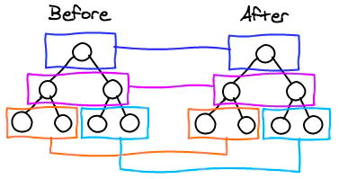
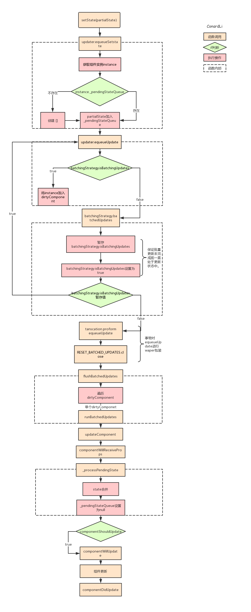
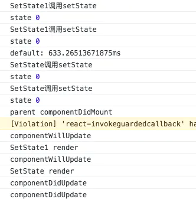
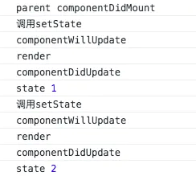
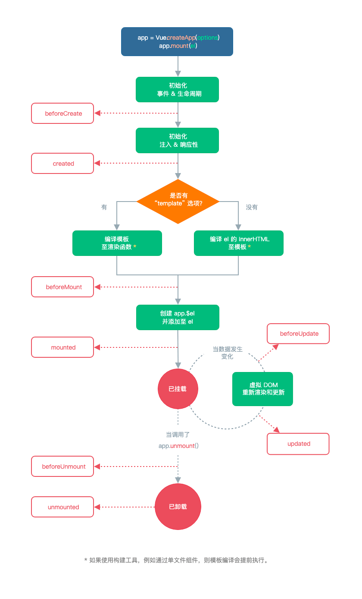
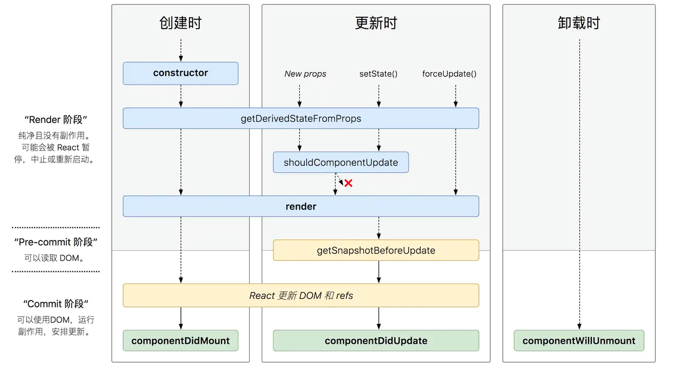

# 框架相关

## 1 合成事件

### 1.1 知识点

**合成事件的特点：**

1. `React` 上注册的事件最终会绑定在 `document` 这个 `DOM` 上，而不是 `React` 组件对应的 DOM(减少内存开销就是因为所有的事件都绑定在 `document` 上，其他节点没有绑定事件)
2. `React` 自身实现了一套事件冒泡机制，所以这也就是为什么我们 `event.stopPropagation()` 无效的原因。
3. `React` 通过队列的形式，从触发的组件向父组件回溯，然后调用他们 `JSX` 中定义的 `callback`
4. `React` 有一套自己的合成事件 `SyntheticEvent`，不是原生的，这个可以自己去看官网
5. `React` 通过对象池的形式管理合成事件对象的创建和销毁，减少了垃圾的生成和新对象内存的分配，提高了性能

### 1.2 题目：react 为什么需要合成事件

- `React` 使用了事件代理，`React` 上注册的事件最终会绑定在 `document` 这个 `DOM` 上
- 消除了浏览器之间的兼容性问题
- 提高性能

### 1.3 题目：react 合成事件是什么，和原生事件的区别

**react 合成事件是什么：**

> 合成事件是 react 自己构建的，对原生事件进行了包装。`React` 上注册的事件最终会绑定在 `document` 这个 `DOM` 上，而不是 `React` 组件对应的 DOM

- 通过 `JSX` 方式绑定的事件就是合成事件
- 通过 `addEventListener` 绑定的事件就是原生事件

**合成事件和原生事件的区别：**

- 合成事件对原生事件进行了包装，可以兼容所有浏览器
- 它还拥有和浏览器原生事件相同的接口，包括 `stopPropagation()` 和 `preventDefault()`
- 但是这些接口是针对它自己的事件机制的，跟原生事件的 `stopPropagation` 不是同一个东西
- 可以通过 `nativeEvent` 属性来获取浏览器的底层事件

## 2 virtual dom

**什么是 virtual dom：**

- 是一个简单的 JS 对象，用来模拟 dom 树，而不是操作真实的 dom
- 这样就方便做一些性能优化，不会频繁渲染页面

**diff 算法：**

- 当内容有改变的时候，会将旧的虚拟 dom 和新的虚拟 dom 做对比
- 找出变更的节点，只更新变更的节点，提高性能
- diff 算法，逐级比较两个树
- 如果用循环生成一组相同的节点，通常需要添加 key 属性，用来判断节点是否要更新



## 3 setState 过程

### 3.1 setState 执行过程



**说明：**

- `partialState`：`setState` 传入的第一个参数，对象或函数
- `_pendingStateQueue`：当前组件等待执行更新的 `state` 队列
- `isBatchingUpdates`：`react` 用于标识当前是否处于批量更新状态，所有组件公用
- `dirtyComponent`：当前所有处于待更新状态的组件队列
- `transcation`：`react` 的事务机制，在被事务调用的方法外包装 `n` 个 `waper` 对象，并一次执行：`waper.init`、被调用方法、`waper.close`
- `FLUSH_BATCHED_UPDATES`：用于执行更新的 `waper`，只有一个 `close` 方法

**setState 执行过程：**

1. 将 `setState` 传入的 `partialState` 参数存储在当前组件实例的 `state` 暂存队列中
2. 判断当前 React 是否处于批量更新状态，如果是，将当前组件加入待更新的组件队列中
3. 如果未处于批量更新状态，将批量更新状态标识设置为 `true`，用事务再次调用前一步方法，保证当前组件加入到了待更新组件队列中
4. 调用事务的 `waper` 方法，遍历待更新组件队列依次执行更新
5. 执行生命周期 `componentWillReceiveProps`
6. 将组件的 `state` 暂存队列中的 `state` 进行合并，获得最终要更新的 `state` 对象，并将队列置为空
7. 执行生命周期 `componentShouldUpdate`，根据返回值判断是否要继续更新
8. 执行生命周期 `componentWillUpdate`
9. 执行真正的更新，`render`
10. 执行生命周期 `componentDidUpdate`

### 3.2 react setState 是同步还是异步

分两个情况：

1. 钩子函数和 React 合成事件中的 setState，异步
2. 异步函数和原生事件中的 setstate，同步

### 3.3 钩子函数和 React 合成事件中

**钩子函数和 React 合成事件中的 setState：**

```js
class TestState {
  componentDidMount() {
    console.log('SetState调用setState');
    this.setState({
      index: this.state.index + 1
    });
    console.log('state', this.state.index);

    console.log('SetState调用setState');
    this.setState({
      index: this.state.index + 1
    });
    console.log('state', this.state.index);
  }
}
```



**说明：**

1. 调用 setState 不会立即更新
2. 所有组件使用的是同一套更新机制，当所有组件 didmount 后，父组件 didmount，然后执行更新
3. 更新时会把每个组件的更新合并，每个组件只会触发一次更新的生命周期

**原因：**

1. 在 `react` 的生命周期和合成事件中，`react` 仍然处于他的更新机制中，这时 `isBranchUpdate` 为 `true`
2. 按照上述过程，这时无论调用多少次 `setState`，都会不会执行更新，而是将要更新的 `state` 存入 `_pendingStateQueue`，将要更新的组件存入 `dirtyComponent`
3. 当上一次更新机制执行完毕，以生命周期为例，所有组件，即最顶层组件 `didmount` 后会将 `isBranchUpdate` 设置为 `false`。这时将执行之前累积的 `setState`

### 3.4 异步函数和原生事件中

**异步函数和原生事件中的 setstate：**

```js
class TestState {
  componentDidMount() {
    setTimeout(() => {
      console.log('调用setState');
      this.setState({
        index: this.state.index + 1
      });
      console.log('state', this.state.index);
      console.log('调用setState');
      this.setState({
        index: this.state.index + 1
      });
      console.log('state', this.state.index);
    }, 0);
  }
}
```



**说明：**

1. 在父组件 `didmount` 后执行
2. 调用 `setState` 同步更新

**原因：**

1. 由执行机制看，`setState` 本身并不是异步的，而是如果在调用 `setState` 时，如果 `react` 正处于更新过程，当前更新会被暂存，等上一次更新执行后在执行，这个过程给人一种异步的假象
2. 在生命周期，根据 JS 的异步机制，会将异步函数先暂存，等所有同步代码执行完毕后在执行，这时上一次更新过程已经执行完毕，`isBranchUpdate` 被设置为 `false`，根据上面的流程，这时再调用 `setState` 即可立即执行更新，拿到更新结果

### 3.5 为什么有时 react 两次 setState 只执行一次

1. 直接传递对象的 `setstate` 会被合并成一次
2. 使用函数传递 `state` 不会被合并

```js
this.setState(
  preState => ({ index: preState.index + 1 }),
  () => {
    console.log(this.state.index);
  }
);
```

### 3.6 题目： react setState 是同步还是异步

### 3.7 题目：为什么有时 react 两次 setState，只执行一次

## 4 fiber

### 4.1 知识点

**为什么需要 fiber：**

- react 渲染需要递归比对虚拟 DOM 树，找出需要变动的节点，然后同步更新它们
- 这个是一个比较耗时的操作
- 一则会导致用户触发的事件得不到响应, 二则会导致掉帧，用户可以感知到这些卡顿

**react fiber 原理：**

- fiber 就是时间分片
- 在浏览器的一次事件循环内(一帧) (即处理用户输入事件、Javascript 执行、requestAnimation 调用、布局 Layout、绘制 Paint)
- 如果有空闲时间，就执行 React 的任务。react 使用 requestIdleCallback 这个 api 实现
- 而且，React 渲染的过程可以被中断，如果一定时间内没有执行完任务，就会将控制权交回浏览器，让位给高优先级的任务，浏览器空闲后再恢复渲染

- `Fiber` 树：`React` 在 `render` 第一次渲染时，会通过 `React.createElement` 创建一颗 `Element` 树，可以称之为 `Virtual DOM Tree`，由于要记录上下文信息，加入了 `Fiber`，每一个 `Element` 会对应一个 `Fiber Node`，将 `Fiber Node` 链接起来的结构成为 `Fiber Tree`。`Fiber Tree` 一个重要的特点是链表结构，将递归遍历编程循环遍历，然后配合 `requestIdleCallback API`, 实现任务拆分、中断与恢复

**react fiber 优点：**

- 在空闲的时间执行 React 渲染
- 提高用户的响应时间，减少掉帧

### 题目：react 为什么需要 fiber

### 题目：react fiber 有哪些优点，怎样做到的

## 5 高阶组件

### 5.1 知识点

**什么是高阶组件：**

高阶组件就是一个 React 组件包裹着另外一个 React 组件。用来实现逻辑的复用或者封装样式、布局，组件组合更灵活

高阶组件相当于是一个装饰器，跟装饰器的理念是类似的

HOC 不会修改传入的组件，也不会使用继承来复制其行为。相反，HOC 通过将组件包装在容器组件中来组成新组件。HOC 是纯函数，没有副作用

**使用场景：**

Redux 的 connect，antd 的 form 组件

**高阶组件的写法：**

```js
// 此函数接收一个组件...
function withSubscription(WrappedComponent) {
  // ...并返回另一个组件...
  return class extends React.Component {
    constructor(props) {
      super(props);
      this.state = {
        str: 'this is hoc'
      };
    }
    render() {
      // ... 并使用新数据渲染被包装的组件!
      // 请注意，我们可能还会传递其他属性
      return <WrappedComponent str={this.state.str} {...this.props} />;
    }
  };
}
```

### 3.2 题目：什么是高阶组件，请举例说明

如上

## 6 错误处理

### 6.1 知识点

**错误边界组件：**

如果一个 `class` 组件中定义了 `static getDerivedStateFromError()` 或 `componentDidCatch()` 这两个生命周期方法中的任意一个（或两个）时，那么它就变成一个错误边界

可以捕获到子组件的错误，并且你可以选择渲染一个错误 UI

通常我们会写一个通用的错误组件来处理错误

```js
class ErrorBoundary extends React.Component {
  constructor(props) {
    super(props);
    this.state = { hasError: false };
  }

  static getDerivedStateFromError(error) {
    // 更新 state 使下一次渲染能够显示降级后的 UI
    return { hasError: true };
  }

  componentDidCatch(error, errorInfo) {
    // 你同样可以将错误日志上报给服务器
    logErrorToMyService(error, errorInfo);
  }

  render() {
    if (this.state.hasError) {
      // 你可以自定义降级后的 UI 并渲染
      return <h1>Something went wrong.</h1>;
    }

    return this.props.children;
  }
}
```

**可捕获的错误：**

- 可捕获渲染期间、生命周期方法和整个组件树的构造函数中的错误

**不可捕获的错误：**

- 事件处理
- 异步代码（例如 `setTimeout` 或 `requestAnimationFrame` 回调函数）
- 服务端渲染
- 它自身抛出来的错误（并非它的子组件）

### 题目：react 如何处理异常

## 7 性能优化

- 使用 PureComponent，props 和 state 仅做浅层的比较
- 谨慎使用 Redux，只取需要的值

### 题目：react 有哪些性能优化的点

## 8 redux 核心原则

### 8.1 redux 三大原则

1. **单一数据源** - 整个应用的 `state` 被储存在一棵 `object tree` 中，并且这个 `object tree` 只存在于唯一一个 `store` 中
2. **State 是只读的** - 唯一改变 `state` 的方法就是触发 `action`，`action` 是一个用于描述已发生事件的普通对象
3. **使用纯函数来执行修改** - 为了描述 `action` 如何改变 `state tree`，你需要编写 `reducers`

```js
// 单一数据源
console.log(store.getState());
```

```js
// State 是只读的
store.dispatch({
  type: 'COMPLETE_TODO',
  index: 1
});
```

## 9 redux 核心逻辑

### 9.1 核心逻辑

**首先，我们看下几个核心概念：**

- **Store：** 保存数据的地方，你可以把它看成一个容器，整个应用只能有一个 Store
- **State：** Store 对象包含所有数据，如果想得到某个时点的数据，就要对 Store 生成快照，这种时点的数据集合，就叫做 State
- **Action：** State 的变化，会导致 View 的变化。但是，用户接触不到 State，只能接触到 View。所以，State 的变化必须是 View 导致的。Action 就是 View 发出的通知，表示 State 应该要发生变化了。
- **Action Creator：** View 要发送多少种消息，就会有多少种 Action。如果都手写，会很麻烦，所以我们定义一个函数来生成 Action，这个函数就叫 Action Creator。
- **Reducer：** Store 收到 Action 以后，必须给出一个新的 State，这样 View 才会发生变化。这种 State 的计算过程就叫做 Reducer。Reducer 是一个函数，它接受 Action 和当前 State 作为参数，返回一个新的 State。
- **dispatch：** 是 View 发出 Action 的唯一方法。

**然后我们过下整个工作流程：**

1. 首先，用户（通过 View）发出 Action，发出方式就用到了 dispatch 方法
1. 然后，Store 自动调用 Reducer，并且传入两个参数：当前 State 和收到的 Action，Reducer 会返回新的 State
1. State 一旦有变化，Store 就会调用监听函数，来更新 View

### 9.2 demo

```js
import { createStore } from 'redux';

let defaultState = {
  name: 'qiu',
  age: 10
};

/**
 * 新建store
 * 通过reducer建立
 * 根据老的state和action生成新的state
 */
function counter(state = defaultState, action) {
  switch (action.type) {
    case 'addAge': {
      state.age = state.age + 1;
      return state;
    }
    case 'changeName':
      state.name = action.name;
      return state;
    default:
      return state;
  }
}

const store = createStore(counter);

// 监听store，每次store改变会触发
store.subscribe(function() {
  console.log(store.getState());
});

// 派发事件，传递action
store.dispatch({ type: 'addAge' });
store.dispatch({ type: 'addAge' });
store.dispatch({
  type: 'changeName',
  name: '啦啦啦'
});
```

### 题目：redux 中间件机制

## 10 数据绑定原理

### 10.1 知识点

````js
```html
<div id="app">
  <form>
    <input type="text" v-model="number" />
    <button type="button" v-click="increment">增加</button>
  </form>
  <h3 v-bind="number"></h3>
  <form>
    <input type="text" v-model="count" />
    <button type="button" v-click="incre">增加</button>
  </form>
  <h3 v-bind="count"></h3>
</div>
````

```js
class MyVue {
  constructor(options) {
    this._init(options);
  }

  _init(options) {
    this.$options = options;
    this.$el = document.querySelector(options.el);
    this.$data = options.data;
    this.$methods = options.methods;

    this._binding = {};
    this._obverse(this.$data);
    this._complie(this.$el);
  }

  _obverse(obj) {
    var _this = this;
    Object.keys(obj).forEach(function(key) {
      if (obj.hasOwnProperty(key)) {
        _this._binding[key] = {
          _directives: []
        };
        console.log(_this._binding[key]);
        var value = obj[key];
        if (typeof value === 'object') {
          _this._obverse(value);
        }
        var binding = _this._binding[key];
        Object.defineProperty(_this.$data, key, {
          enumerable: true,
          configurable: true,
          get: function() {
            console.log(`${key}获取${value}`);
            return value;
          },
          set: function(newVal) {
            console.log(`${key}更新${newVal}`);
            if (value !== newVal) {
              value = newVal;
              binding._directives.forEach(function(item) {
                item.update();
              });
            }
          }
        });
      }
    });
  }

  _complie(root) {
    var _this = this;
    var nodes = root.children;
    for (var i = 0; i < nodes.length; i++) {
      var node = nodes[i];
      if (node.children.length) {
        this._complie(node);
      }

      if (node.hasAttribute('v-click')) {
        node.onclick = (function() {
          var attrVal = nodes[i].getAttribute('v-click');
          return _this.$methods[attrVal].bind(_this.$data);
        })();
      }

      if (node.hasAttribute('v-model') && (node.tagName === 'INPUT' || node.tagName === 'TEXTAREA')) {
        node.addEventListener(
          'input',
          (function(key) {
            var attrVal = node.getAttribute('v-model');
            _this._binding[attrVal]._directives.push(new Watcher('input', node, _this, attrVal, 'value'));

            return function() {
              _this.$data[attrVal] = nodes[key].value;
            };
          })(i)
        );
      }

      if (node.hasAttribute('v-bind')) {
        var attrVal = node.getAttribute('v-bind');
        _this._binding[attrVal]._directives.push(new Watcher('text', node, _this, attrVal, 'innerHTML'));
      }
    }
  }
}

class Watcher {
  constructor(name, el, vm, exp, attr) {
    this.name = name; //指令名称，例如文本节点，该值设为"text"
    this.el = el; //指令对应的DOM元素
    this.vm = vm; //指令所属myVue实例
    this.exp = exp; //指令对应的值，本例如"number"
    this.attr = attr; //绑定的属性值，本例为"innerHTML"

    this.update();
  }

  // 更新 html 中的值
  update() {
    this.el[this.attr] = this.vm.$data[this.exp];
  }
}

window.onload = function() {
  var app = new MyVue({
    el: '#app',

    data: {
      number: 0,
      count: 0
    },

    methods: {
      increment: function() {
        this.number++;
      },

      incre: function() {
        this.count++;
      }
    }
  });
};
```

### 题目：vue 的数据绑定机制是如何实现的

使用 getter setter 进行数据劫持，和观察者模式实现的

## 11 computed 和 watch

### 11.1 知识点

- 他们两者都是观察页面数据变化的
- **computed：** 当依赖的数据发送变化时，会执行方法，返回一个新的数据
- **watch：** watch 是监听数据的变化，触发操作

```js
var vm = new Vue({
  el: '#example',
  data: {
    message: 'Hello'
  },
  computed: {
    // 计算属性的 getter
    reversedMessage: function() {
      // `this` 指向 vm 实例
      return this.message
        .split('')
        .reverse()
        .join('');
    }
  }
});
```

`computed` 里面提供的方法将用作 `property` `vm.reversedMessage` 的 `getter` 函数

### 题目：vue 的 computed 和 watch 的区别

## 12 slot

## 13 next tick 原理

### 13.1 知识点

**什么是 next tick：**

在下次 DOM 更新循环结束之后执行延迟回调

```js
export default {
  methods: {
    setData() {
      this.msg = 'Hello';
      this.$nextTick(function() {
        // DOM 更新了
      });
    }
  }
};
```

**next tick 原理：**

- `Vue` 在更新 `DOM` 时是异步执行的
- 只要侦听到数据变化，`Vue` 将开启一个队列，并缓冲在同一事件循环中发生的所有数据变更
- 如果同一个 `watcher` 被多次触发，只会被推入到队列中一次 (同步的代码中)
- `Vue` 在内部对异步队列尝试使用原生的 `Promise.then`、`MutationObserver` 和 `setImmediate`，如果执行环境不支持，则会采用 `setTimeout(fn, 0)` 代替

### 题目：`vue $nextTick` 实现原理

## 14 keep alive

### 题目：说下 vue 的 keep alive

## 15 vue 生命周期



## 16 react 生命周期


