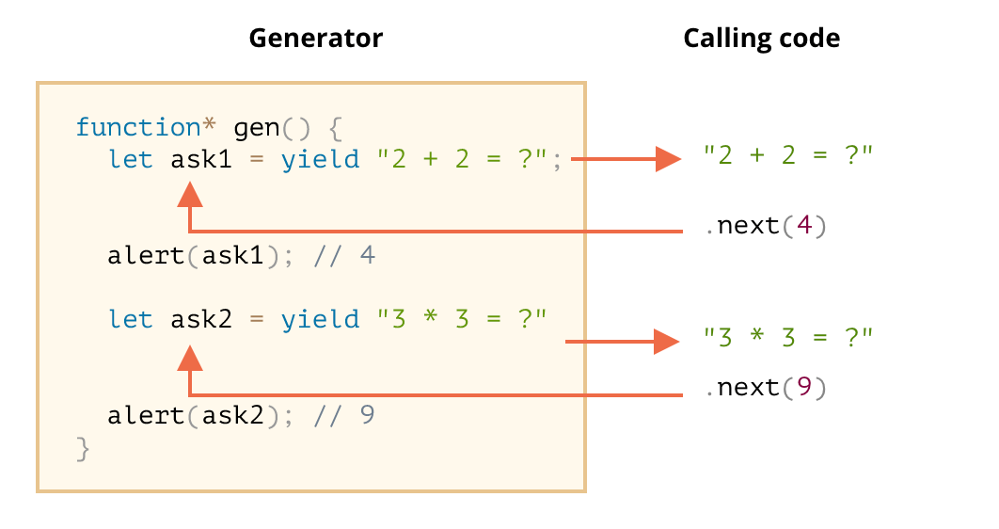

# Generator - 高级 iteration

## 1 Generator

**Generator 可以做什么：**

1. `Generators` 允许我们在函数执行过程中暂停、并在将来某一时刻恢复执行
2. 简化迭代器的创建
3. 简化异步方法的写法

### 1.1 Generator 函数

常规函数只会返回一个单一值（或者不返回任何值）。

而 `Generator` 可以按需一个接一个地返回（“yield”）多个值。它们可与 `iterable` 完美配合使用，从而可以轻松地创建数据流

要创建一个 `generator`，需要一个特殊的语法结构：`function*`，即 `Generator` 函数

```js
function* generateSequence() {
  yield 1;
  yield 2;
  return 3;
}

// "generator function" 创建了一个 "generator object"
let generator = generateSequence();
alert(generator); // [object Generator]
```

### 1.2 Generator 是可迭代的

generator 是可迭代的:

- 它具有 `.next()` 方法
- 它以 `{value: ..., done: true/false}` 的形式返回值

```js
function* generateSequence() {
  yield 1;
  yield 2;
  return 3;
}

let generator = generateSequence();

for (let value of generator) {
  alert(value); // 1，然后是 2
}
```

因为 generator 是可迭代的，所以可以使用 iterator 的所有相关功能，例如：`spread` 语法 `...`

```js
function* generateSequence() {
  yield 1;
  yield 2;
  yield 3;
}

let sequence = [0, ...generateSequence()];

alert(sequence); // 0, 1, 2, 3
```

### 1.3 使用 generator 进行迭代

使用普通函数的可迭代对象：

```js
let range = {
  from: 1,
  to: 5,

  // for..of range 在一开始就调用一次这个方法
  [Symbol.iterator]() {
    // ...它返回 iterator object：
    // 后续的操作中，for..of 将只针对这个对象，并使用 next() 向它请求下一个值
    return {
      current: this.from,
      last: this.to,

      // for..of 循环在每次迭代时都会调用 next()
      next() {
        // 它应该以对象 {done:.., value :...} 的形式返回值
        if (this.current <= this.last) {
          return { done: false, value: this.current++ };
        } else {
          return { done: true };
        }
      }
    };
  }
};

// 迭代整个 range 对象，返回从 `range.from` 到 `range.to` 范围的所有数字
alert([...range]); // 1,2,3,4,5
```

使用 `generator` 函数作为 `Symbol.iterator` 的可迭代对象：

```js
let range = {
  from: 1,
  to: 5,

  *[Symbol.iterator]() {
    // [Symbol.iterator]: function*() 的简写形式
    for (let value = this.from; value <= this.to; value++) {
      yield value;
    }
  }
};

alert([...range]); // 1,2,3,4,5
```

### 1.4 Generator 组合

```js
function* g1() {
  yield 1;
  yield 2;
}

function* g2() {
  yield 'a';
  yield* g1();
  yield 'b';
}

let g = g2();
// g.next 输出 a,1,2,b
```

`yield*` 指令将执行 `委托` 给另一个 `generator`。这个术语意味着 `yield* gen` 在 `generator gen` 上进行迭代，并将其产出（yield）的值透明地（transparently）转发到外部。就好像这些值就是由外部的 `generator yield` 的一样

### 1.5 yield 接收参数

`yield` 不仅可以向外返回结果，而且还可以将外部的值传递到 `generator` 内

> 第二个 `next` 传的参数作为第一个 `yield` 的结果传递回 `generator`

```js
function* gen() {
  let ask1 = yield '2 + 2 = ?';

  alert(ask1); // 4

  let ask2 = yield '3 * 3 = ?';

  alert(ask2); // 9
}

let generator = gen();

alert(generator.next().value); // "2 + 2 = ?"

alert(generator.next(4).value); // "3 * 3 = ?"

alert(generator.next(9).done); // true
```



## 2 异步迭代和 generator

### 2.1 异步可迭代对象

对象异步迭代：

- 使用 `Symbol.asyncIterator` 取代 `Symbol.iterator`
- `next()` 方法应该返回一个 `promise`（带有下一个值，并且状态为 `fulfilled`）
- 我们应该使用 `for await (let item of iterable)` 循环来迭代这样的对象

```js
let range = {
  from: 1,
  to: 5,

  [Symbol.asyncIterator]() {
    // 为了使一个对象可以异步迭代，它必须具有方法 Symbol.asyncIterator
    return {
      current: this.from,
      last: this.to,

      async next() {
        // 这个方法必须返回一个带有 next() 方法的对象，next() 方法会返回一个 promise

        // 注意：我们可以在 async next 内部使用 "await"
        // 这个 next() 方法可以不是 async 的，它可以是一个返回值是一个 promise 的常规的方法，但是使用
        // async 关键字可以允许我们在方法内部使用 await，所以会更加方便。这里我们只是用于延迟 1 秒的操作
        await new Promise(resolve => setTimeout(resolve, 1000));

        if (this.current <= this.last) {
          return { done: false, value: this.current++ };
        } else {
          return { done: true };
        }
      }
    };
  }
};

(async () => {
  for await (let value of range) {
    // 我们使用 for await(let value of range) 来进行迭代，也就是在 for 后面添加 await
    // 它会调用一次range[Symbol.asyncIterator]() 方法一次，然后调用它的 next() 方法获取值
    alert(value); // 1,2,3,4,5
  }
})();
```

### 2.2 异步 generator

在 `function*` 前面加上 `async`。这即可使 `generator` 变为异步的

然后使用 `for await (...)` 来遍历它

```js
async function* generateSequence(start, end) {
  for (let i = start; i <= end; i++) {
    // 哇，可以使用 await 了！
    await new Promise(resolve => setTimeout(resolve, 1000));

    yield i;
  }
}

(async () => {
  let generator = generateSequence(1, 5);
  for await (let value of generator) {
    alert(value); // 1，然后 2，然后 3，然后 4，然后 5（在每个 alert 之间有延迟）
  }
})();
```
