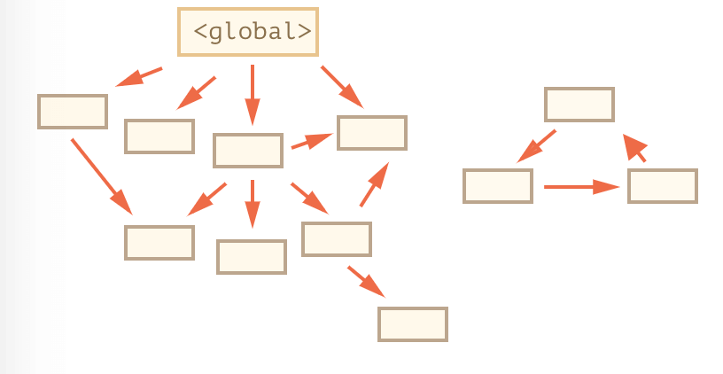
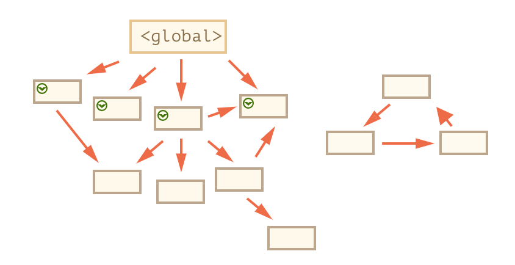
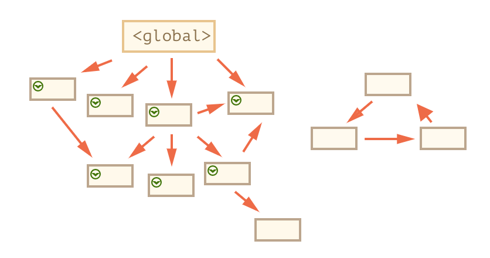
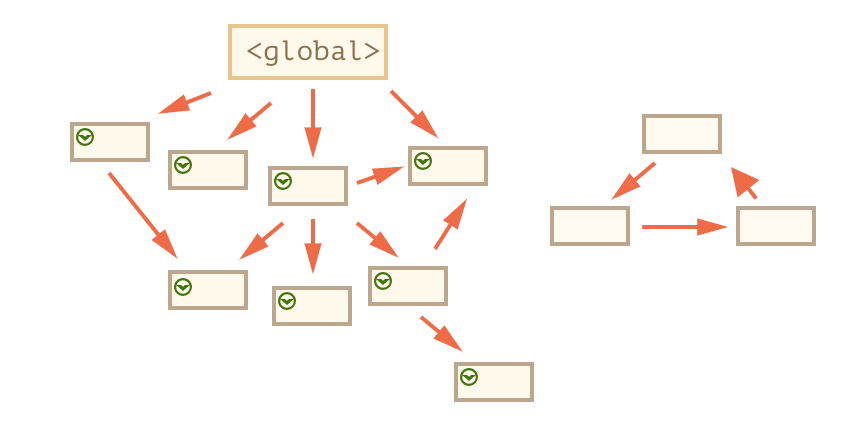
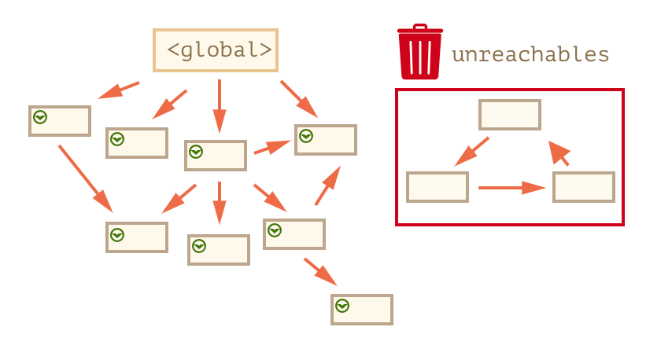

# 对象

## 1 基础知识

### 1.1 计算属性

当创建一个对象时，我们可以在对象字面量中使用方括号。这叫做**计算属性**

```javascript
let fruit = 'apple';

let bag = {
  [fruit]: 5
};

alert(bag.apple); // 如果 fruit="apple"
```

### 1.2 in 操作符

JavaScript 的对象有一个特性：能够被访问任何属性。**即使属性不存在也不会报错**

读取不存在的属性只会得到 `undefined`

```javascript
let user = { age: 30 };

let key = 'age';
alert(key in user); // true，属性 "age" 存在
```

大部分情况下与 `undefined` 进行比较来判断就可以了，但有一个例外情况：属性存在，但存储的值是 `undefined` 的时候

```javascript
let obj = {
  test: undefined
};

alert(obj.test); // 显示 undefined，所以属性不存在？

alert('test' in obj); // true，属性存在！
```

### 1.3 属性顺序

对象有顺序，整数属性会被进行排序，其他属性则按照创建的顺序显示

```javascript
let codes = {
  '49': 'Germany',
  '41': 'Switzerland',
  '44': 'Great Britain',
  '1': 'USA'
};

for (let code in codes) {
  alert(code); // 1, 41, 44, 49
}
```

如果属性名不是整数，那它们就按照创建时的顺序来排序，例如：

```javascript
let user = {
  name: 'John',
  5: 'Troy',
  surname: 'Smith',
  2: 'Tom'
};
user.age = 25; // 增加一个

// 非整数属性是按照创建的顺序来排列的
for (let prop in user) {
  alert(prop); // 2, 5, name, surname, age
}
```

## 2 对象的引用和复制

### 2.1 深拷贝

```javascript
let obj = {
  name: 'John',
  other: {
    age: 20
  }
};

// other 是一个对象的引用，Object.assign 只能拷贝一层，无法深拷贝
// 并且 for in 只遍历一层的话也无法深拷贝
```

浅拷贝是只只拷贝第一层

- `JSON.parse(JSON.stringify({}))` 无法拷贝其他引用类型、拷贝函数、循环引用等情况
- `for in` 能遍历所有属性吗，有什么限制，继承的属性能复制吗？
  - 会跳过 `Symbol` 属性
- `Object.assign` 不能深拷贝，只能拷贝一层

### 2.2 实现深拷贝

**注意点：**

1. 引用类型
2. 拷贝函数
3. 循环引用
4. WeakMap 的特性

```js
function isObject(target) {
  const type = typeof target;
  return type !== null && (type === 'object' || type === 'function');
}

function getType(target) {
  return Object.prototype.toString.call(target);
}

function clone(target, map = new WeakMap()) {
  if (!isObject(target)) {
    return target;
  }

  // 判断循环引用，es5 可以用数组代替
  if (map.get(target)) {
    return target;
  }

  // 用构造函数生成初始值
  let cloneTarget = new target.constructor();

  map.set(target, cloneTarget);

  // Object Array
  if (getType(target) === '[object Object]' || getType(target) === '[object Array]') {
    cloneTarget = Array.isArray(target) ? [] : {};

    for (let key in target) {
      cloneTarget[key] = clone(target[key], map);
    }
  }

  // 函数

  // 其他类型

  return cloneTarget;
}
```

## 3 垃圾回收

### 3.1 概念

对象是引用类型，它的垃圾回收机制会更复杂

JavaScript 的内存管理是自动的，JavaScript 中主要的内存管理概念是 `可达性`

下面是固有的可达值的基本集合，这些值明显不能被释放：

- 当前函数的局部变量和参数
- 嵌套调用时，当前调用链上所有函数的变量与参数
- 全局变量

对于对象：如果一个值可以通过引用或引用链从根访问任何其他值，则认为该值是可达的

```javascript
// user 具有对这个对象的引用
let user = {
  name: 'John'
};

let admin = user; // admin 和 John 都有对 John 的引用

user = null; // John 不会被回收，还存在其他的引用
admin = null; // 这时才会被回收
```

- 垃圾回收是自动完成的，我们不能强制执行或是阻止执行
- 当对象是可达状态时，它一定是存在于内存中的
- 被引用与可访问（从一个根）不同：一组相互连接的对象可能整体都不可达

### 3.2 垃圾回收算法

垃圾回收的基本算法被称为 “mark-and-sweep”。

定期执行以下“垃圾回收”步骤：

- 垃圾收集器找到所有的根，并“标记”（记住）它们
- 然后它遍历并“标记”来自它们的所有引用
- 然后它遍历标记的对象并标记 它们的 引用。所有被遍历到的对象都会被记住，以免将来再次遍历到同一个对象。
- ……如此操作，直到所有可达的（从根部）引用都被访问到。
- 没有被标记的对象都会被删除。

例如：



我们可以清楚地看到右侧有一个“无法到达的岛屿”。现在我们来看看“标记和清除”垃圾收集器如何处理它。

第一步标记所有的根：



然后它们的引用被标记了：



……如果还有引用的话，继续标记：



现在，无法通过这个过程访问到的对象被认为是不可达的，并且会被删除。



## 4 this

### 4.1 函数中的 this

在 JavaScript 中，`this` 关键字与其他大多数编程语言中的不同。JavaScript 中的 `this` 可以用于任何函数，即使它不是对象的方法

`this` 的值是在代码运行时计算出来的，它取决于代码上下文

```javascript
let user = { name: 'John' };
let admin = { name: 'Admin' };

function sayHi() {
  alert(this.name);
}

// 在两个对象中使用相同的函数
user.f = sayHi;
admin.f = sayHi;

// 这两个调用有不同的 this 值
// 函数内部的 "this" 是“点符号前面”的那个对象
user.f(); // John（this == user）
admin.f(); // Admin（this == admin）

admin['f'](); // Admin（使用点符号或方括号语法来访问这个方法，都没有关系。）
```

> 在没有对象的情况下调用：`this == undefined`，在非严格模式的情况下，this 将会是全局对象

```javascript
function sayHi() {
  alert(this);
}

sayHi(); // undefined
```

> `this` 的值是在调用时计算出来的，它的值并不取决于方法声明的位置。`this` 的值就是在点之前的这个对象，即调用该方法的对象

### 4.2 箭头函数中的 this

箭头函数没有自己的 `this`，从外部上下文中获取

## 5 构造器 和 new

### 5.1 构造函数

**构造函数在技术上是常规函数。不过有两个约定：**

1. 它们的命名以大写字母开头
2. 它们只能由 `new` 操作符来执行

> 构造器的主要目的 —— 实现可重用的对象创建代码

**当一个函数被使用 new 操作符执行时，它按照以下步骤：**

1. 一个新的空对象被创建并分配给 `this`
1. 函数体执行。通常它会修改 `this`，为其添加新的属性
1. 返回 `this` 的值

```js
function User(name) {
  // this = {};（隐式创建）

  // 添加属性到 this
  this.name = name;
  this.isAdmin = false;

  // return this;（隐式返回）
}
```

### 5.2 new.target

在一个函数内部，我们可以使用 `new.target` 属性来检查它是否被使用 `new` 进行调用了

对于常规调用，它为空，对于使用 `new` 的调用，则等于该函数：

```javascript
function User() {
  alert(new.target);
}

// 不带 "new"：
User(); // undefined

// 带 "new"：
new User(); // function User { ... }
```

### 5.3 构造器的 return

通常，构造器没有 return 语句。它们的任务是将所有必要的东西写入 this，并自动转换为结果。

但是，如果这有一个 return 语句，那么规则就简单了：

- 如果 return 返回的是一个对象，则返回这个对象，而不是 this
- 如果 return 返回的是一个原始类型，则忽略

## 6 可选链 ?.

```javascript
let user = {}; // 一个没有 "address" 属性的 user 对象

alert(user.address.street); // Error!
```

很多实际场景中，我们更希望得到的是 `undefined`（表示没有 street 属性）而不是一个错误

下面这是一种使用 `?.` 安全地访问 `user.address.street` 的方式：

```javascript
let user = {}; // user 没有 address 属性

alert(user?.address?.street); // undefined（不报错）
```

**其它变体：`?.()`，`?.[]`**

```javascript
let userGuest = {};
userGuest.admin?.(); // 啥都没有（没有这样的方法）

let user1 = {
  firstName: 'John'
};
let key = 'firstName';

alert(user1?.[key]?.something?.not?.existing); // undefined
```

我们可以使用 `?.` 来安全地读取或删除，但不能写入

```javascript
let user = null;

user?.name = 'John'; // Error，不起作用
// 因为它在计算的是 undefined = "John"
```

## 7 Symbol 类型

### 7.1 概念

根据规范，对象的属性键只能是字符串类型或者 `Symbol` 类型。不是 `Number`，也不是 `Boolean`，只有字符串或 `Symbol` 这两种类型。

```javascript
// id 是 symbol 的一个实例化对象
let id = Symbol();

// id 是描述为 "id" 的 Symbol
let id = Symbol('id');

alert(id.toString()); // Symbol(id)，现在它有效了

// 获取 symbol.description 属性，只显示描述（description）
alert(id.description); // id
```

```javascript
let id = Symbol('id');

let user = {
  name: 'John',
  [id]: 123 // 而不是 "id"：123
};
```

`Symbol` 保证是唯一的。即使我们创建了许多具有相同描述的 `Symbol`，它们的值也是不同

> `Symbol` 不会被隐式转换，`alert(Symbol('id'))` 会报错

```js
let id1 = Symbol('id');
let id2 = Symbol('id');

alert(id1 == id2); // false
```

### 7.2 隐藏属性

`Symbol` 允许我们创建对象的“隐藏”属性，代码的任何其他部分都不能意外访问或重写这些属性

1. Symbol 在 `for…in` 中会被跳过
2. `Object.keys()` 也会忽略 Symbol
3. 相反 `Object.assign` 会同时复制字符串和 symbol 属性

### 7.2 全局 Symbol

`全局 Symbol 注册表`。我们可以在其中创建 `Symbol` 并在稍后访问它们，它可以确保每次访问相同名字的 `Symbol` 时，返回的都是相同的 `Symbol`

**Symbol.for(key)**

该调用会检查全局注册表，如果有一个描述为 `key` 的 `Symbol`，则返回该 `Symbol`，否则将创建一个新 `Symbol（Symbol(key)）`，并通过给定的 `key` 将其存储在注册表中

```js
// 从全局注册表中读取
let id = Symbol.for('id'); // 如果该 Symbol 不存在，则创建它

// 再次读取（可能是在代码中的另一个位置）
let idAgain = Symbol.for('id');

// 相同的 Symbol
alert(id === idAgain); // true
```

**Symbol.keyFor**

通过全局 Symbol 返回一个名字

```js
// 通过 name 获取 Symbol
let sym = Symbol.for('name');
let sym2 = Symbol.for('id');

// 通过 Symbol 获取 name
alert(Symbol.keyFor(sym)); // name
alert(Symbol.keyFor(sym2)); // id
```

### 7.3 系统 Symbol

- `Symbol.hasInstance` 当对象使用 instanceof 运算符，判断是否为该对象的实例时，会调用这个方法
- `Symbol.isConcatSpreadable` 一个布尔值，表示该对象用于`Array.prototype.concat()`时，是否可以展开
- `Symbol.species` 指向当前对象的构造函数
- `Symbol.match` 指向一个函数。当执行 `str.match(myObject)` 时，如果该属性存在，会调用它，返回该方法的返回值
- `Symbol.replace` 指向一个方法，当该对象被 `String.prototype.replace` 方法调用时，会返回该方法的返回值
- `Symbol.search` 指向一个方法，当该对象被 `String.prototype.search` 方法调用时，会返回该方法的返回值
- `Symbol.split` 指向一个方法，当该对象被 `String.prototype.split` 方法调用时，会返回该方法的返回值
- `Symbol.iterator` 指向该对象的默认遍历器方法
- `Symbol.toPrimitive` 指向一个方法。该对象被转为原始类型的值时，会调用这个方法，返回该对象对应的原始类型值
- `Symbol.toStringTag` 指向一个方法。在该对象上面调用 `Object.prototype.toString` 方法时，如果这个属性存在，它的返回值会出现在 toString 方法返回的字符串之中，表示对象的类型
- `Symbol.unscopables` 向一个对象。该对象指定了使用 with 关键字时，哪些属性会被 with 环境排除

## 8 对象 — 原始值转换

### 8.1 概念

当对象相加 `obj1 + obj2`，相减 `obj1 - obj2`，或者使用 `alert(obj)` 打印时，对象会被自动转换为原始值，然后执行操作。例如，`Date` 对象可以相减，`date1 - date2` 的结果是两个日期之间的差值

- 所有的对象在布尔上下文中均为 true。所以对于对象，不存在 `to-boolean` 转换，**只有字符串和数值转换**
- 数值转换发生在对象相减或应用数学函数时。例如，`Date` 对象可以相减，`date1 - date2` 的结果是两个日期之间的差值
- 字符串转换 —— 通常发生在像 `alert(obj)` 这样输出一个对象和类似的上下文中

### 8.2 hint

当一个对象被用在需要原始值的上下文中时，对象会被转换为原始值

根据不同的场景会转换成不同的原始值，这种根据场景转换称为 `hint`

**hint 有三个值：**

**string**

对象到字符串的转换：

```js
// 输出
alert(obj);

// 将对象作为属性键
anotherObj[obj] = 123;
```

**number**

对象到数字的转换：

```js
// 显式转换
let num = Number(obj);

// 数学运算（除了二元加法）
let n = +obj; // 一元加法
let delta = date1 - date2;

// 小于/大于的比较
let greater = user1 > user2;
```

**default**

在少数情况下发生，当运算符不确定期望值的类型时，`hint` 为 `default`

例如，二元加法 + 可用于字符串连接，也可以用于数字相加，所以字符串和数字这两种类型都可以。因此，当二元加法得到对象类型的参数时，它将依据 `default` `hint` 来对其进行转换。如果对象被用于与字符串、数字或 `symbol` 进行 == 比较，这时到转换也不是很明确，因此使用 `default` `hint`

```js
// 二元加法使用默认 hint
let total = obj1 + obj2;

// obj == number 使用默认 hint
if (user == 1) {
  // ...
}
```

> 除了一种情况（Date 对象）之外，所有内建对象都以和 `number` 相同的方式实现 `default` 转换

> **没有 `boolean` `hint`**，在布尔上下文中所有对象都是 true

**JavaScript 会查找并调用下面三个对象方法进行转换：**

1. `obj[Symbol.toPrimitive](hint)` —— 带有 `symbol` 键 `Symbol.toPrimitive`（系统 symbol）的方法，如果这个方法存在的话
1. `hint` 是 `string` —— 尝试 `obj.toString()` 和 `obj.valueOf()`，无论哪个存在
1. `hint` 是 `number` 或 `default` —— 尝试 `obj.valueOf()` 和 `obj.toString()`，无论哪个存在

### 8.3 Symbol.toPrimitive

```js
obj[Symbol.toPrimitive] = function(hint) {
  // 返回一个原始值
  // hint = "string"、"number" 和 "default" 中的一个
};
```

```js
let user = {
  name: 'John',
  money: 1000,

  [Symbol.toPrimitive](hint) {
    alert(`hint: ${hint}`);
    return hint == 'string' ? `{name: "${this.name}"}` : this.money;
  }
};

alert(user); // hint: string -> {name: "John"}
alert(+user); // hint: number -> 1000
alert(user + 500); // hint: default -> 1500
```

### 8.4 toString/valueOf

**如果没有 `Symbol.toPrimitive`，就会按照下面的顺序进行尝试：**

1. 对于 string hint，`toString -> valueOf`
2. 其他情况，`valueOf -> toString`

> 这些方法必须返回一个原始值。如果 toString 或 valueOf 返回了一个对象，那么返回值会被忽略

**默认的 toString 和 valueOf 方法：**

- `toString` 方法返回一个字符串 `"[object Object]"`
- `valueOf` 方法返回对象自身

```js
let user = { name: 'John' };

alert(user); // [object Object]
alert(user.valueOf() === user); // true
```

改写 `toString` 和 `valueOf` 方法：

```js
let user = {
  name: 'John',
  money: 1000,

  // 对于 hint="string"
  toString() {
    return `{name: "${this.name}"}`;
  },

  // 对于 hint="number" 或 "default"
  valueOf() {
    return this.money;
  }
};

alert(user); // toString -> {name: "John"}
alert(+user); // valueOf -> 1000
alert(user + 500); // valueOf -> 1500
```

**返回类型：**

1. 这些方法必须返回一个原始值，而不是对象
1. 但是没有限制返回具体的原始值类型，例如没有限制 `toString()` 是否返回字符串，或 `Symbol.toPrimitive` 方法是否为 hint number 返回数字
1. 由于历史原因，如果 `toString` 或 `valueOf` 返回一个对象，**不会出现 error**
1. `Symbol.toPrimitive` 必须返回一个原始值，否则就会出现 error

### 8.5 二次转换

如果我们将对象作为参数传递，如果生成的原始值的类型不正确，会继续进行转换

例如：

```js
let obj = {
  // toString 在没有其他方法的情况下处理所有转换
  toString() {
    return '2';
  }
};

alert(obj * 2); // 4，对象被转换为原始值字符串 "2"，之后它被乘法转换为数字 2。
```

1. 乘法 `obj * 2` 首先将对象转换为原始值（字符串 "2"）
1. 之后 `"2" * 2` 变为 `2 * 2`（字符串被转换为数字）

## 复习

- in 操作符，`key in object` 对象是否有某个属性
- 计算属性 `[]` 可以使用变量
- 属性顺序，整数按大小，其他按添加顺序
- 深拷贝 `Object.assign` 只能拷贝第一层
- `JSON.parse(JSON.stringify({}))` 无法拷贝其他引用类型、拷贝函数、循环引用等情况
- 实现深拷贝
- 固有可达值不会被释放：当前函数的局部变量和参数；嵌套调用时，当前调用链上所有函数的变量与参数；全局变量
- 垃圾回收算法，举例
- `this` 的值是在代码运行时计算出来的，它取决于代码上下文 (谁调用它，this 指向谁)
- 箭头函数的 `this`
- 构造函数判断使用了 `new` 还是直接调用，`new.target`
- 构造函数中的 `return` 怎么返回
- 可选链 `user?.address?.street`
- `Symbol`：对象属性键只能是字符串类型或者 `Symbol` 类型
- `Symbol` 的基本用法，`Symbol` 保证值是唯一的
- `Symbol` 应用场景：隐藏属性，使用系统 Symbol 改变内置行为
- `Symbol` 的特性：
  - `Symbol` 在 `for…in` 中会被跳过
  - `Object.keys()` 也会忽略 `Symbol`
  - 相反 `Object.assign` 会同时复制字符串和 `symbol` 属性
- 对象-原始值转换
  - 调用 `obj[Symbol.toPrimitive](hint)` —— 带有 `symbol` 键 `Symbol.toPrimitive`
  - 否则，如果 `hint` 是 "string" —— 尝试 `obj.toString()` 和 `obj.valueOf()`
  - 否则，如果 `hint` 是 "number" 或 "default" —— 尝试 `obj.valueOf()` 和 `obj.toString()`
