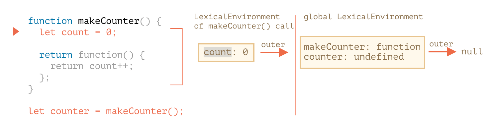
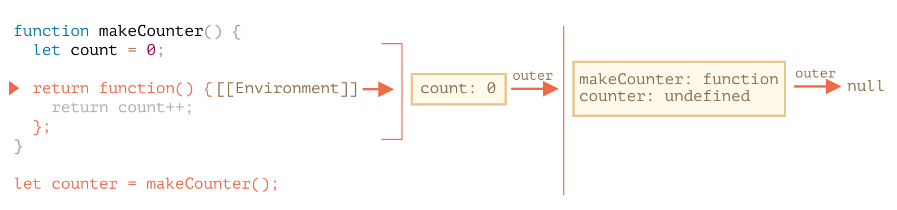
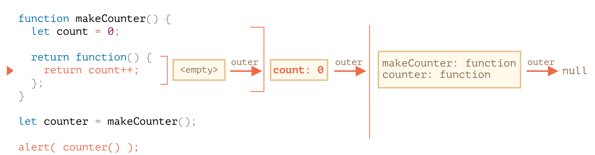

# 函数进阶

## 1 递归

> 递归跟循环相比，递归占用更多内存。但是递归代码更少，某些场景逻辑更清晰

为什么递归占用更多内存，需要先了解 `执行上下文`，递归函数每次调用都需要保存它的 `执行上下文`

**执行上下文：**

有关正在运行的函数的执行过程的相关信息被存储在其 `执行上下文` 中

`执行上下文` 是一个内部数据结构，它包含有关函数执行时的详细细节：当前控制流所在的位置，当前的变量，this 的值，以及其它的一些内部细节

在递归函数中，可以理解为函数周围的代码

## 2 Rest 参数与 Spread 语法

### 2.1 Rest 参数 ...

将参数收集到一个数组中

```javascript
function sumAll(...args) {
  // 数组名为 args
  let sum = 0;
  for (let arg of args) sum += arg;
  return sum;
}

alert(sumAll(1)); // 1
alert(sumAll(1, 2)); // 3
alert(sumAll(1, 2, 3)); // 6
```

### 2.2 arguments 变量

在过去，JavaScript 中没有 rest 参数，而使用 arguments 是获取函数所有参数的唯一方法

arguments 是一个类数组，是可迭代对象，但它不是数组。它不支持数组方法

> 箭头函数是没有 arguments

```javascript
function showName() {
  alert(arguments.length);
  alert(arguments[0]);
  alert(arguments[1]);

  // 它是可遍历的
  // for(let arg of arguments) alert(arg);
}

// 依次显示：2，Julius，Caesar
showName('Julius', 'Caesar');
```

### 2.3 Spread 语法

使用场景：

- `Rest` 参数用于创建可接受任意数量参数的函数
- `Spread` 语法用于将数组传递给通常需要含有许多参数的列表的函数

```javascript
let arr1 = [1, -2, 3, 4];
let arr2 = [8, 3, -8, 1];

alert(Math.max(...arr1, ...arr2)); // 8
```

拼和数组：

```javascript
let arr = [3, 5, 1];
let arr2 = [8, 9, 15];

let merged = [0, ...arr, 2, ...arr2];
```

任何可迭代对象都可以使用 Spread 语法：

```javascript
let str = 'Hello';

alert([...str]); // H,e,l,l,o 将字符串转换为字符数组
```

## 3 变量作用域

**什么是作用域：**

- 作用域是指程序源代码中定义变量的区域
- 作用域规定了如何查找变量，也就是确定当前执行代码对变量的访问权限
- JavaScript 采用词法作用域(lexical scoping)，也就是静态作用域
- 词法作用域，函数的作用域在函数定义的时候就决定了

> var 声明的变量只有函数作用域和全局作用域，没有块级作用域

**var 和 let 的区别：**

1. var 没有块级作用域
2. var 允许重复声明，let 重复声明会报错
3. var 存在变量提升，也就是变量声明会提到函数开头 (可以先使用，再声明)。let 不存在变量提升

**for 中的 let 变量：**

```javascript
var a = [];
for (var i = 0; i < 10; i++) {
  a[i] = function() {
    console.log(i);
  };
}
a[6](); // 10

// 变量i是var命令声明的，在全局范围内都有效，所以全局只有一个变量i
```

```javascript
var a = [];
for (let i = 0; i < 10; i++) {
  a[i] = function() {
    console.log(i);
  };
}
a[6](); // 6

// 变量i是let声明的，当前的i只在本轮循环有效，所以每一次循环的i其实都是一个新的变量
```

## 4 闭包

`闭包` 是指内部函数总是可以访问其所在的外部函数中声明的变量和参数，即使在其外部函数执行完了之后

闭包是指使用一个特殊的属性 `[[Environment]]` 来记录函数自身的创建时的环境的函数。它具体指向了函数创建时的词法环境

### 4.1 词法环境

为什么 JavaScript 中的所有函数都是闭包的？这里涉及词法环境的概念

**什么是词法环境：**

在 JavaScript 中，每个运行的函数，代码块 `{...}` 以及整个脚本，都有一个被称为 `词法环境（Lexical Environment）` 的内部（隐藏）的关联对象

**词法环境对象由两部分组成：**

1. `环境记录（Environment Record）` —— 一个存储所有局部变量作为其属性（包括一些其他信息，例如 this 的值）的对象
2. 对 `外部词法环境` 的引用，与外部代码相关联

**执行上下文，都有三个重要属性：**

1. 变量对象(Variable object，VO)
1. 作用域链(Scope chain)
1. this

> 一个“变量”只是 `环境记录` 这个特殊的内部对象的一个属性。“获取或修改变量”意味着“获取或修改词法环境的一个属性”

### 4.2 嵌套函数的词法环境

```javascript
function makeCounter() {
  let count = 0;

  return function() {
    return count++;
  };
}

let counter = makeCounter();
```

- 在每次 `makeCounter()` 调用的开始，都会创建一个新的词法环境对象，以存储该 `makeCounter` 运行时的变量
  
- 在执行 `makeCounter()` 的过程中创建了一个仅占一行的嵌套函数，**所有的函数在“诞生”时都会记住创建它们的词法环境**
  
- 因此，`counter.[[Environment]]` 有对 `{count: 0}` 词法环境的引用
- 当调用 `counter()` 时，会为该调用创建一个新的词法环境，并且其外部词法环境引用获取于 `counter.[[Environment]]`
  
- 现在，当 `counter()` 中的代码查找 `count` 变量时，它首先搜索自己的词法环境（为空，因为那里没有局部变量），然后是外部 `makeCounter()` 的词法环境，并且在哪里找到就在哪里修改

### 4.3 垃圾回收

通常，函数调用完成后，会将词法环境和其中的所有变量从内存中删除。因为现在没有任何对它们的引用了。与 JavaScript 中的任何其他对象一样，词法环境仅在可达时才会被保留在内存中

但是，如果有一个嵌套的函数在函数结束后仍可达，则它将具有引用词法环境的 `[[Environment]]` 属性

理论上当函数可达时，它外部的所有变量也都将存在

```js
function f() {
  let value = 123;

  return function() {
    alert(value);
  };
}

let g = f(); // 当 g 函数存在时，该值会被保留在内存中

g = null; // ……现在内存被清理了
```

**new Function：**

> 如果我们使用 `new Function` 创建一个函数，那么该函数的 `[[Environment]]` 并不指向当前的词法环境，而是指向全局环境。因此，此类函数无法访问外部（outer）变量，只能访问全局变量

## 5 全局对象

全局对象有一个通用名称 `globalThis`

在浏览器中全局对象为 `window`，Node.js 中全局对象为 `global`

## 6 函数对象

在 JavaScript 中，函数就是值。这个值就是对象，函数就是对象

我们不仅可以调用函数，还能把函数当作对象来处理：增/删属性，按引用传递等

### 6.1 name 属性

函数的名字。通常取自函数定义，但如果函数定义时没设定函数名，JavaScript 会尝试通过函数的上下文猜一个函数名（例如把赋值的变量名取为函数名）

```js
function sayHi() {
  alert('Hi');
}
alert(sayHi.name); // sayHi

let sayHi = function() {
  alert('Hi');
};
alert(sayHi.name); // sayHi
```

### 6.2 length 属性

返回函数入参的个数，rest 参数不参与计数

```js
function f1(a) {}
function f2(a, b) {}
function many(a, b, ...more) {}

alert(f1.length); // 1
alert(f2.length); // 2
alert(many.length); // 2
```

### 6.3 自定义属性

```js
function sayHi() {
  alert('Hi');
  // 计算调用次数
  sayHi.counter++;
}
sayHi.counter = 0; // 初始值

sayHi(); // Hi
sayHi(); // Hi

alert(`Called ${sayHi.counter} times`); // Called 2 times
```

## 7 new Function 语法

### 7.1 语法

**创建函数的语法：**

```js
let func = new Function([arg1, arg2, ...argN], functionBody);
```

```js
let sum = new Function('a', 'b', 'return a + b');

alert(sum(1, 2)); // 3
```

这种方法最大的不同在于，它实际上是通过运行时通过参数传递过来的字符串创建的

使用 `new Function` 创建函数的应用场景非常特殊，比如从服务器获取代码或者动态地从模板编译函数时才会使用

### 7.2 闭包

闭包是指使用一个特殊的属性 `[[Environment]]` 来记录函数自身的创建时的环境的函数。它具体指向了函数创建时的词法环境

如果我们使用 `new Function` 创建一个函数，那么该函数的 `[[Environment]]` 并不指向当前的词法环境，而是指向全局环境

此类函数无法访问外部（outer）变量，只能访问全局变量

```js
function getFunc() {
  let value = 'test';

  let func = new Function('alert(value)');

  return func;
}

getFunc()(); // error: value is not defined
```

## 8 setTimeout 和 setInterval

### 8.1 零延时的 setTimeout

在浏览器环境下，嵌套定时器的运行频率是受限制的。根据 [HTML5](https://html.spec.whatwg.org/multipage/timers-and-user-prompts.html#timers) 标准 所讲：**经过 5 重嵌套定时器之后，时间间隔被强制设定为至少 4 毫秒**

**5 重嵌套** 是什么意思：

```js
let start = Date.now();
let times = [];

setTimeout(function run() {
  times.push(Date.now() - start); // 保存前一个调用的延时

  if (start + 100 < Date.now()) alert(times); // 100 毫秒之后，显示延时信息
  else setTimeout(run); // 否则重新调度
});

// 输出示例：
// 1,1,1,1,9,15,20,24,30,35,40,45,50,55,59,64,70,75,80,85,90,95,100
```

使用 `setInterval` 也会发生类似的情况：`setInterval(f)` 会以零延时运行几次 `f`，然后以 4 毫秒以上的强制延时运行

> 对于服务端的 JavaScript，就没有这个限制，并且还有其他调度即时异步任务的方式。例如 `Node.js` 的 `setImmediate`

## 9 call apply

```javascript
function say(phrase) {
  alert(this.name + ': ' + phrase);
}

let user = { name: 'John' };

// user 成为 this，"Hello" 成为第一个参数
say.call(user, 'Hello'); // John: Hello
```

`call` `apply` 给调用的方法传递上下文，即 `this`

`call` 和 `apply` 之间唯一的语法区别是，`call` 期望一个参数列表，而 `apply` 期望一个包含这些参数的类数组对象

## 10 函数绑定 bind

### 10.1 丢失 this

当方法作为回调进行传递时，会丢失 this

```js
let user = {
  firstName: 'John',
  sayHi() {
    alert(`Hello, ${this.firstName}!`);
  }
};

setTimeout(user.sayHi, 1000); // Hello, undefined!

// 上面一行相当于这个写法
let f = user.sayHi;
setTimeout(f, 1000); // 丢失了 user 上下文
```

### 10.2 包装器

解决丢失 this，可以使用包装函数

```js
let user = {
  firstName: 'John',
  sayHi() {
    alert(`Hello, ${this.firstName}!`);
  }
};

setTimeout(function() {
  user.sayHi(); // Hello, John!
}, 1000);

// 或者箭头函数
setTimeout(() => user.sayHi(), 1000); // Hello, John!
```

### 10.3 bind

函数提供了一个内建方法 `bind`，它可以绑定 `this`

```js
let boundFunc = func.bind(context);
```

`func.bind(context)` 返回一个特殊的类似于函数的 `外来对象（exotic object）`，它可以像函数一样被调用，并且透明地将调用传递给 `func` 并设定 `this=context`

```js
let user = {
  firstName: 'John',
  sayHi() {
    alert(`Hello, ${this.firstName}!`);
  }
};

let sayHi = user.sayHi.bind(user); // (*)

// 可以在没有对象（译注：与对象分离）的情况下运行它
sayHi(); // Hello, John!

setTimeout(sayHi, 1000); // Hello, John!

// 即使 user 的值在不到 1 秒内发生了改变
// sayHi 还是会使用预先绑定（pre-bound）的值，该值是对旧的 user 对象的引用
user = {
  sayHi() {
    alert('Another user in setTimeout!');
  }
};
```

### 10.4 偏函数

偏函数是指通过 `bind` 绑定先有函数的一些参数来创建一个新函数

```js
function mul(a, b) {
  return a * b;
}

let double = mul.bind(null, 2);

alert(double(3)); // = mul(2, 3) = 6
alert(double(4)); // = mul(2, 4) = 8
alert(double(5)); // = mul(2, 5) = 10
```

## 11 箭头函数

**箭头函数特性：**

- 没有 `this`，`this` 在外部词法环境中查找
- 没有 `arguments`
- 不能使用 `new` 进行调用
- 没有 `super`

## 12 作用域和执行上下文

### 12.1 作用域

**什么是作用域：**

- 作用域是指程序源代码中定义变量的区域
- 作用域规定了如何查找变量，也就是确定当前执行代码对变量的访问权限
- `JavaScript` 采用词法作用域(lexical scoping)，也就是静态作用域
- 函数的作用域在函数定义的时候就决定了

**作用域分为：**

- 全局作用域
- 块级作用域
- 函数作用域

### 12.2 执行上下文

**什么是执行上下文：**

- 执行上下文是用来跟踪记录代码运行时环境的抽象概念
- 当执行全局的代码，块级代码或者函数的时候，会创建执行上下文

**对于每个执行上下文，都有三个重要属性：**

1. 变量对象(Variable object，VO) (ES6 叫做词法环境)
1. 作用域链(Scope chain)
1. this

### 12.3 执行上下文栈

- 代码中有很多地方需要创建执行上下文，通过执行上下文栈来管理，可以将它看成是一个数组
- 试想当 `JavaScript` 开始要解释执行代码的时候，最先遇到的就是全局代码，所以初始化的时候首先就会向执行上下文栈压入一个全局执行上下文
- 当执行一个函数的时候，就会创建一个执行上下文，并且压入执行上下文栈，当函数执行完毕的时候，就会将函数的执行上下文从栈中弹出

例如：

```js
function fun3() {
  console.log('fun3');
}
function fun2() {
  fun3();
}
function fun1() {
  fun2();
}

fun1();
```

```js
// 执行上下文栈的运作过程
// 伪代码

ECStack.push(fun1 functionContext); // fun1()
ECStack.push(fun2 functionContext); // fun1 中调用了 fun2，还要创建 fun2 的执行上下文
ECStack.push(fun3 functionContext); // fun2还调用了 fun3

ECStack.pop(); // fun3执行完毕
ECStack.pop(); // fun2执行完毕
ECStack.pop(); // fun1执行完毕

// javascript接着执行下面的代码，但是ECStack底层永远有个globalContext
```

### 12.4 变量对象 (词法环境)

**对于每个执行上下文，都有三个重要属性：**

1. 变量对象(Variable object，VO) (ES6 叫做词法环境)
1. 作用域链(Scope chain)
1. this

变量对象是与执行上下文相关的数据作用域，存储了在上下文中定义的变量和函数声明

**什么是变量对象：**

1. 全局上下文的变量对象初始化是全局对象
1. 函数上下文的变量对象初始化只包括 `arguments` 对象
1. 在进入执行上下文时会给变量对象添加形参、函数声明、变量声明等初始的属性值
1. 在代码执行阶段，会再次修改变量对象的属性值

举个例子：

```js
function foo(a) {
  var b = 2;
  function c() {}
  var d = function() {};

  b = 3;
}

foo(1);
```

在进入执行上下文后，这时候的 AO 是：

```js
AO = {
    arguments: {
        0: 1,
        length: 1
    },
    a: 1,
    b: undefined,
    c: reference to function c(){},
    d: undefined
}
```

### 12.5 作用域链

**什么是作用域链：**

- 当查找变量的时候，会先从当前上下文的变量对象中查找
- 如果没有找到，就会从父级(词法层面上的父级)执行上下文的变量对象中查找，一直找到全局上下文的变量对象，也就是全局对象
- 这样由多个执行上下文的变量对象构成的链表就叫做作用域链

**作用域链是怎么生成的：**

1. **函数创建：** 函数有一个内部属性 `[[scope]]`，当函数创建的时候，就会保存所有父 变量对象(词法环境) 到其中
1. **函数激活：** 当函数激活时，进入函数上下文，创建 `VO/AO(词法环境)` 后，就会将活动对象添加到作用链的前端

### 12.6 完整的流程

分析这段代码：

```js
var scope = 'global scope';
function checkscope() {
  var scope = 'local scope';
  function f() {
    return scope;
  }
  return f();
}
checkscope();
```

**执行过程如下：**

**1.** 执行全局代码，创建全局执行上下文，全局上下文被压入执行上下文栈

```
ECStack = [globalContext];
```

**2.** 全局上下文初始化

```
globalContext = {
  VO: [global],
  Scope: [globalContext.VO],
  this: globalContext.VO
};
```

**3.** 初始化的同时，`checkscope` 函数被创建，保存作用域链到函数的内部属性 `[[scope]]`

```
checkscope.[[scope]] = [
  globalContext.VO
];
```

**4.** 执行 `checkscope` 函数，创建 `checkscope` 函数执行上下文，`checkscope` 函数执行上下文被压入执行上下文栈

```
ECStack = [
  checkscopeContext,
  globalContext
];
```

**5.** `checkscope` 函数执行上下文初始化：

- 复制函数 `[[scope]]` 属性创建作用域链
- 用 `arguments` 创建活动对象
- 初始化活动对象，即加入形参、函数声明、变量声明
- 将活动对象压入 `checkscope` 作用域链顶端

同时 `f` 函数被创建，保存作用域链到 `f` 函数的内部属性 `[[scope]]`

```
checkscopeContext = {
  AO: {
    arguments: {
      length: 0
    },
    scope: undefined,
    f: reference to function f(){}
  },
  Scope: [AO, globalContext.VO],
  this: undefined
}
```

**6.** 执行 `f` 函数，创建 `f` 函数执行上下文，`f` 函数执行上下文被压入执行上下文栈

```
ECStack = [
  fContext,
  checkscopeContext,
  globalContext
];
```

**7.** `f` 函数执行上下文初始化, 以下跟第 4 步相同：

- 复制函数 `[[scope]]` 属性创建作用域链
- 用 `arguments` 创建活动对象
- 初始化活动对象，即加入形参、函数声明、变量声明
- 将活动对象压入 `f` 作用域链顶端

```js
fContext = {
  AO: {
    arguments: {
      length: 0
    }
  },
  Scope: [AO, checkscopeContext.AO, globalContext.VO],
  this: undefined
};
```

**8.** `f` 函数执行，沿着作用域链查找 `scope` 值，返回 `scope` 值

**9.** `f` 函数执行完毕，`f` 函数上下文从执行上下文栈中弹出

```
ECStack = [
  checkscopeContext,
  globalContext
];
```

**10.** `checkscope` 函数执行完毕，`checkscope` 执行上下文从执行上下文栈中弹出

```
ECStack = [
  globalContext
];
```

## 复习

- 什么是执行上下文
- `Rest` 参数 `...`
- `arguments` 是一个类数组，是可迭代对象，但它不是数组
- `var` 和 `let` 的区别 (3 个)
- `for` 循环中 `var` 和 `let` 的区别
- 什么是闭包？
- 为什么会有闭包？
- 闭包相关的垃圾回收机制
- 全局对象，浏览器中的全局对象，nodejs 中的全局对象
- 函数对象，函数是一个对象。`name` 属性、`length` 属性分别是什么？
- `call` `apply` 作用是什么，有什么区别
- 函数绑定 `bind` 作用是什么，`bind` 实现偏函数
- 箭头的数的 4 个特性
