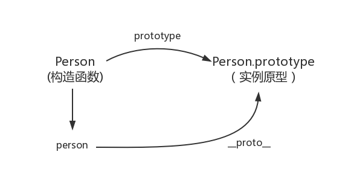
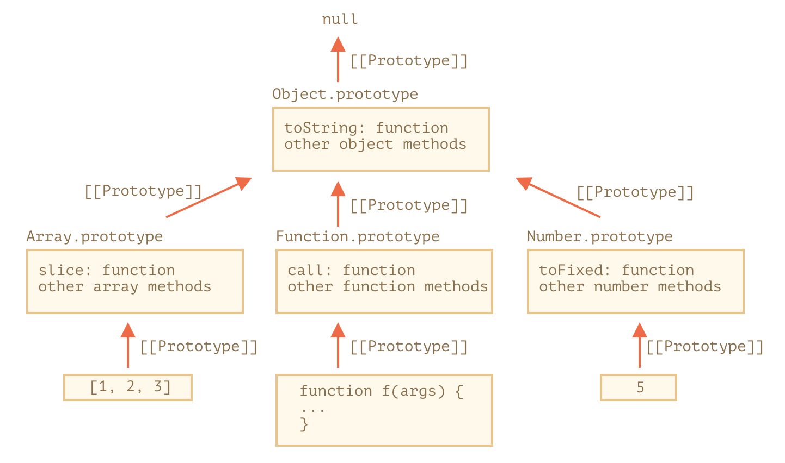

# 原型、继承

## 1 原型继承

对象有一个特殊的隐藏属性 `[[Prototype]]`，它要么为 `null`，要么就是对另一个对象的引用。该对象被称为“原型”

### 1.1 \_\_proto\_\_

> `__proto__` 是 `[[Prototype]]` 的因历史原因而留下来的 `getter/setter`。`__proto__` 与内部的 `[[Prototype]]` 不一样。现代编程语言建议使用函数 `Object.getPrototypeOf/Object.setPrototypeOf` 来取代 `__proto__` 去 `get/set` 原型

```js
function Person() {}

let p = new Person();

console.log(Person.prototype.constructor === Person); // true
console.log(p.__proto__ === Person.prototype); // true
```



```js
let animal = {
  eats: true
};
let rabbit = {
  jumps: true
};

rabbit.__proto__ = animal; // (*)

// 现在这两个属性我们都能在 rabbit 中找到：
alert(rabbit.eats); // true (**)
alert(rabbit.jumps); // true
```

### 1.2 this 的值

`this` 不受原型的影响

无论在哪里找到方法：在一个对象还是在原型中。在一个方法调用中，`this` 始终是点符号 `.` 前面的对象

```js
let animal = {
  walk() {
    alert(`${this.name} walk`);
  }
};

let rabbit = {
  name: 'rabbit',
  __proto__: animal
};

rabbit.walk(); // rabbit walk
```

### 1.3 for in 循环

`for..in` 循环会迭代继承的属性

几乎所有其他键/值获取方法，例如 `Object.keys` 和 `Object.values` 等，都会忽略继承的属性

## 2 F.prototype

> `F.prototype` 属性仅在 `new F` 被调用时使用，它为新对象的 `[[Prototype]]` 赋值。这里的 `F.prototype` 指的是 `F` 的一个名为 `prototype` 的常规属性。这听起来与 `原型` 这个术语很类似，但这里我们实际上指的是具有该名字的常规属性

```js
function Rabbit(name) {
  this.name = name;
}
Rabbit.prototype.eat = true;

let rabbit = new Rabbit('White Rabbit');
alert(rabbit.eats); // true
```

默认的 `prototype` 是一个只有属性 `constructor` 的对象，属性 `constructor` 指向函数自身

但是 `prototype` 可以更改：

```js
function Rabbit() {}
Rabbit.prototype = {
  jumps: true
};

let rabbit = new Rabbit();
alert(rabbit.constructor === Rabbit); // false
```

为了确保正确的 `constructor`，我们可以选择添加/删除属性到默认 `prototype`，而不是将其整个覆盖

```js
function Rabbit() {}

// 不要将 Rabbit.prototype 整个覆盖
// 可以向其中添加内容
Rabbit.prototype.jumps = true;
// 默认的 Rabbit.prototype.constructor 被保留了下来
```

## 3 原生的原型

### 3.1 内建对象

内建对象，像 `Array`、`Date`、`Function` 及其他，都在 `prototype` 上挂载了方法

所有的内建原型顶端都是 `Object.prototype`，一切都从对象继承而来



**验证：**

```js
let arr = [1, 2, 3];

// 它继承自 Array.prototype？
alert(arr.__proto__ === Array.prototype); // true

// 接下来继承自 Object.prototype？
alert(arr.__proto__.__proto__ === Object.prototype); // true

// 原型链的顶端为 null。
alert(arr.__proto__.__proto__.__proto__); // null
```

### 3.2 基本数据类型

基本数据类型并不是对象。但是如果试图访问它们的属性，那么临时包装器对象将会通过内建的构造器 `String`、`Number` 和 `Boolean` 被创建。它们提供给我们操作字符串、数字和布尔值的方法然后消失

> 特殊值 `null` 和 `undefined` 比较特殊。它们没有对象包装器，所以它们没有方法和属性。并且它们也没有相应的原型

## 4 原型方法

`__proto__` 被认为是过时且不推荐使用的（deprecated），`__proto__` 是 `[[Prototype]]` 的 `getter/setter`

**现代的方法有：**

- `Object.create(proto, [descriptors])` —— 利用给定的 `proto` 作为 `[[Prototype]]` 和可选的属性描述来创建一个空对象
- `Object.getPrototypeOf(obj)` —— 返回对象 `obj` 的 `[[Prototype]]`
- `Object.setPrototypeOf(obj, proto)` —— 将对象 obj 的 [[Prototype]] 设置为 `proto`

```js
let animal = {
  eats: true
};

// 创建一个以 animal 为原型的新对象
let rabbit = Object.create(animal);

alert(rabbit.eats); // true

alert(Object.getPrototypeOf(rabbit) === animal); // true

Object.setPrototypeOf(rabbit, {}); // 将 rabbit 的原型修改为 {}
```

> JavaScript 引擎对原型进行了高度优化，用 `Object.setPrototypeOf` 或 `obj.__proto__=` “即时”更改原型是一个非常缓慢的操作，因为它破坏了对象属性访问操作的内部优化

## 复习

- `__proto__` 是什么？`prototype` 是什么？
- `this` 不受原型的影响，`this` 始终是点符号 `.` 前面的对象
- `for..in` 循环会迭代继承的属性。几乎所有其他键/值获取方法，例如 `Object.keys` 和 `Object.values` 等，都会忽略继承的属性
- es5 如何实现继承
- 原生的原型，所有的内建原型顶端都是 `Object.prototype`
- `Object.create` 创建对象可以指定原型
