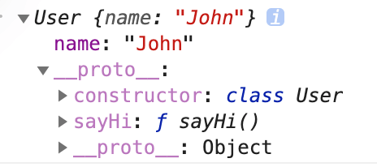
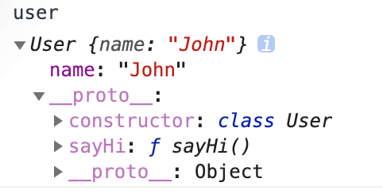
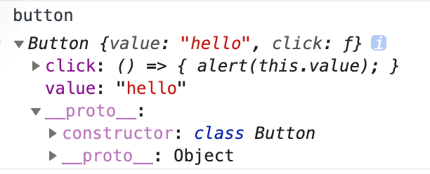
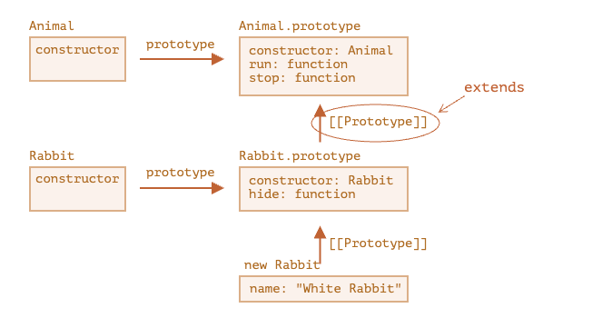

# 类

## 1 基本语法

### 1.1 语法

```js
class User {
  constructor(name) {
    this.name = name;
  }

  sayHi() {
    alert(this.name);
  }
}

let user = new User('John');
```



### 1.2 类和函数构造器的区别

1. `class` 创建的函数具有特殊的内部属性标记 `[[FunctionKind]]:"classConstructor"`，必须使用 `new` 来调用它
2. 类方法不可枚举。 类定义将 `prototype` 中的所有方法的 `enumerable` 标志设置为 `false`
3. 类总是使用 `use strict`

### 1.3 getters setters

```js
class User {
  constructor(name) {
    this.name = name; // 调用 setter
  }

  get name() {
    return this._name;
  }

  set name(value) {
    if (value.length < 4) {
      alert('Name is too short.');
      return;
    }
    this._name = value;
  }
}

let user = new User('John');
alert(user.name); // John

user = new User(''); // Name is too short.
```

### 1.4 class 字段

“类字段”是一种允许添加任何属性的语法

```js
class User {
  name = 'John';

  sayHi() {
    alert(`Hello, ${this.name}!`);
  }
}

new User().sayHi(); // Hello, John!
```

```js
// 等同于这种写法
class User {
  constructor() {
    this.name = 'John';
  }
}
```



> 类字段会在实例化的对象中生成，而不是设在 `User.prototype`

**this 丢失：**

```js
class Button {
  constructor(value) {
    this.value = value;
  }

  click = () => {
    alert(this.value);
  };
}

let button = new Button('hello');

setTimeout(button.click, 1000); // hello
```

```js
// 等同于这种写法
class Button {
  constructor(value) {
    this.value = value;

    this.click = () => {
      alert(this.value);
    };
  }
}
```

使用 class 字段方式可以解决 this 丢失问题

类字段 `click = () => {...}` 是基于每一个对象被创建的，在这里对于每一个 `Button` 对象都有一个独立的方法，在内部都有一个指向此对象的 this

class 字段声明的方法，也会在实例化的对象中生成：



## 2 class 继承

### 2.1 extends



在内部，关键字 `extends` 使用了很好的旧的原型机制进行工作

它将 `Rabbit.prototype.[[Prototype]]` 设置为 `Animal.prototype`。如果在 `Rabbit.prototype` 中找不到一个方法，JavaScript 就会从 `Animal.prototype` 中获取该方法

### 2.2 super

继承类的 `constructor` 必须调用 `super(...)`，并且一定要在使用 `this` 之前调用

- 执行 `super.method(...)` 来调用一个父类方法
- 执行 `super(...)` 来调用一个父类 `constructor`

> 子类必须在`constructor`方法中调用`super`方法，否则新建实例时会报错。这是因为子类没有自己的`this`对象，而是继承父类的`this`对象，然后对其进行加工。如果不调用`super`方法，子类就得不到`this`对象

> ES5 的继承，实质是先创造子类的实例对象`this`，然后再将父类的方法添加到`this`上面`（Parent.apply(this)）`。ES6 的继承机制完全不同，实质是先创造父类的实例对象`this`（所以必须先调用`super`方法），然后再用子类的构造函数修改`this`

```js
class Point {
  constructor(x, y) {
    this.x = x;
    this.y = y;
  }
}

class ColorPoint extends Point {
  constructor(x, y, color) {
    this.color = color; // ReferenceError
    super(x, y);
    this.color = color; // 正确
  }
}
```

## 3 静态属性和静态方法

### 3.1 静态方法

类相当于实例的原型，所有在类中定义的方法，都会被实例继承。如果在一个方法前，加上 `static` 关键字，就表示该方法不会被实例继承，而是直接通过类来调用，这就称为 “静态方法”

```js
class User {
  static staticMethod() {
    alert(this === User);
  }
}

User.staticMethod(); // true
```

这实际上跟直接将其作为属性赋值的作用相同：

```js
class User {}

User.staticMethod = function() {
  alert(this === User);
};

User.staticMethod(); // true
```

**this 指向：**

在 `User.staticMethod()` 调用中的 `this` 的值是类构造器 `User` 自身（点符号前面的对象 规则）

### 3.2 静态属性

```js
class Article {
  static publisher = 'Levi Ding';
}

alert(Article.publisher); // Levi Ding
```

### 3.2 继承静态属性和方法

> 静态属性和方法是可被继承的

```js
class Animal {}
class Rabbit extends Animal {}

// 对于静态的
alert(Rabbit.__proto__ === Animal); // true

// 对于常规方法
alert(Rabbit.prototype.__proto__ === Animal.prototype); // true
```

`Rabbit extends Animal` 创建了两个 `[[Prototype]]` 引用：

1. `Rabbit` 函数原型继承自 `Animal` 函数
2. `Rabbit.prototype` 原型继承自 `Animal.prototype`

## 4 私有属性和方法

### 4.1 约定

**目前未实现私有属性和方法的功能**

一般约定私有属性以下划线 `_` 作为前缀

### 4.2 只读属性

> 只设置 `getter`，而不设置 `setter`，就能让属性只读

```js
class CoffeeMachine {
  constructor(power) {
    this._power = power;
  }

  get power() {
    return this._power;
  }
}

let coffeeMachine = new CoffeeMachine(100);

alert(`Power is: ${coffeeMachine.power}W`); // Power is: 100W
coffeeMachine.power = 25; // Error（没有 setter）
```

### 4.3 \# 私有属性前缀

这是一个马上就会被加到规范中的已完成的 Javascript 提案，它为私有属性和方法提供语言级支持

私有属性和方法以 `#` 开头。它们只在类的内部可被访问

```js
class CoffeeMachine {
  #waterLimit = 200;

  #checkWater(value) {
    if (value < 0) throw new Error("Negative water");
    if (value > this.#waterLimit) throw new Error("Too much water");
  }
}

let coffeeMachine = new CoffeeMachine();

// 不能从类的外部访问类的私有属性和方法
coffeeMachine.#checkWater(); // Error
coffeeMachine.#waterLimit = 1000; // Error
```

> 私有字段不能通过 `this[name]` 访问

## 5 类检查 instanceof

### 5.1 instanceof

`instanceof` 操作符用于检查一个对象是否属于某个特定的 `class`，继承也会检查

```js
class Rabbit {}
let rabbit = new Rabbit();

// rabbit 是 Rabbit class 的对象吗？
alert(rabbit instanceof Rabbit); // true
```

```js
class Animal {}
class Rabbit extends Animal {}

let rabbit = new Rabbit();
alert(rabbit instanceof Animal); // true
```

### 5.2 instanceof 原理

**1. 首先判断目标对象是否有 Symbol.hasInstance**

如果有 `Symbol.hasInstance`，就调用这个方法判断

```js
// 设置 instanceOf 检查
// 并假设具有 canEat 属性的都是 animal
class Animal {
  static [Symbol.hasInstance](obj) {
    if (obj.canEat) return true;
  }
}

let obj = { canEat: true };

alert(obj instanceof Animal); // true：Animal[Symbol.hasInstance](obj) 被调用
```

**2. 如果没有 Symbol.hasInstance 就逐步对比原型链**

大多数 `class` 没有 `Symbol.hasInstance`。在这种情况下，标准的逻辑是：使用 `obj instanceOf Class` 检查 `Class.prototype` 是否等于 `obj` 的原型链中的原型之一

```js
obj.__proto__ === Class.prototype?
obj.__proto__.__proto__ === Class.prototype?
obj.__proto__.__proto__.__proto__ === Class.prototype?

// 如果任意一个的答案为 true，则返回 true
// 否则，如果我们已经检查到了原型链的尾端，则返回 false
```

### 5.3 Object.prototype.toString

内建的 `toString` 方法可以被从对象中提取出来，并在任何其他值的上下文中执行。其结果取决于该值

- 对于 `number` 类型，结果是 `[object Number]`
- 对于 `boolean` 类型，结果是 `[object Boolean]`
- 对于 `null：[object Null]`
- 对于 `undefined：[object Undefined]`
- 对于数组：`[object Array]`
- ……等（可自定义）

```js
let toString = Object.prototype.toString;

alert(toString.call(123)); // [object Number]
alert(toString.call(null)); // [object Null]
alert(toString.call(alert)); // [object Function]
```

## 6 Mixin 模式

mixin 就是使用一个对象来扩充类的方法

```js
// mixin
let sayHiMixin = {
  sayHi() {
    alert(`Hello ${this.name}`);
  },
  sayBye() {
    alert(`Bye ${this.name}`);
  }
};

// 用法：
class User {
  constructor(name) {
    this.name = name;
  }
}

// 拷贝方法
Object.assign(User.prototype, sayHiMixin);

// 现在 User 可以打招呼了
new User('Dude').sayHi(); // Hello Dude!
```

## 复习

- 类和函数构造器的区别 (3 点)
- 类中的 `getters` `setters`
- `class` 字段有什么特性，使用场景
- class 继承，es5 继承和 es6 继承有什么区别
- super 是什么
- 静态方法是什么？
- 私有属性如何约定？如何定义只读属性？
- `instanceof` 的作用是什么？
- `instanceof` 的原理是什么？
