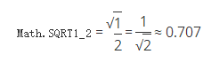

<a href="https://developer.mozilla.org/zh-CN/docs/Web/JavaScript/Reference/Global_Objects/Math/SQRT1_2" target="_blank">原文链接</a>
<a href="https://developer.mozilla.org/en-US/docs/Web/JavaScript/Reference/Global_Objects/Math/SQRT1_2" target="_blank">en</a>

# Math.SQRT1_2

概述

Math.SQRT1_2 属性表示 1/2 的平方根，约为 0.707：



## 描述

由于 SQRT1_2 是 Math 对象的静态属性，所以应该像这样使用：Math.SQRT1_2，而不是作为你创建的 Math 实例的属性（Math 不是构造函数）。

## 示例

下面的函数返回 1/2 的平方根：

```javascript
function getRoot1_2() {
   return Math.SQRT1_2
}

getRoot1_2() // 0.7071067811865476
```

## 规范

| Specification                           | Status   | Comment            |
|:----------------------------------------|:---------|:-------------------|
| ECMAScript 1rd Edition (ECMA-262)       | Standard | Initial definition |
| ECMAScript 5.1 (ECMA-262)               | Standard |                    |
| ECMAScript 2015 (6th Edition, ECMA-262) | Standard |                    |