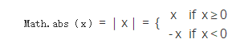

<a href="https://developer.mozilla.org/zh-CN/docs/Web/JavaScript/Reference/Global_Objects/Math/abs" target="_blank">原文链接</a>
<a href="https://developer.mozilla.org/zh-CN/docs/Web/JavaScript/Reference/Global_Objects/Math/abs" target="_blank">en</a>

# Math.abs()

Math.abs(x) 函数返回指定数字 “x“ 的绝对值。如下：



## 语法

```javascript
Math.abs(x);
```

###参数

* `x` 一个数值

## 说明

由于 Math.abs() 是 Math 中的一个静态方法，你应该通过 Math.abs() 调用。（Math 不是构造器）

## 示例

传入一个非数字形式的字符串或者 undefined/empty 变量，将返回 NaN。传入 null 将返回 0。

```javascript
Math.abs('-1');     // 1
Math.abs(-2);       // 2
Math.abs(null);     // 0
Math.abs("string"); // NaN
Math.abs();         // NaN
```

## 规范

| Specification                           | Status   | Comment            |
|:----------------------------------------|:---------|:-------------------|
| ECMAScript 1rd Edition (ECMA-262)       | Standard | Initial definition |
| ECMAScript 5.1 (ECMA-262)               | Standard |                    |
| ECMAScript 2015 (6th Edition, ECMA-262) | Standard |                    |