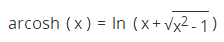

<a href="https://developer.mozilla.org/zh-CN/docs/Web/JavaScript/Reference/Global_Objects/Math/%E5%8F%8D%E5%8F%8C%E6%9B%B2%E4%BD%99%E5%BC%A6%E5%80%BC" target="_blank">原文链接</a>
<a href="https://developer.mozilla.org/en-US/docs/Web/JavaScript/Reference/Global_Objects/Math/acosh" target="_blank">en</a>

# Math.acosh()

Math.acosh()返回一个数字的反双曲余弦值，即：

```javascript
∀x≥1,Math.acosh(x)=arcosh(x)= the unique y≥0such thatcosh(y)=x
```

## 语法

```javascript
Math.acosh(x)
```

### 参数
* `x` 一个数字

### 返回值

返回指定参数的反双曲余弦值，如果指定的参数小于 1 则返回NaN。

## 描述

因为acosh()是Math对象的静态方法，所以你应该像这样使用它：Math.acosh(), 而不是作为你创建的Math实例的属性（Math不是构造函数）。

## 示例

```javascript
Math.acosh(-1);  // NaN
Math.acosh(0);   // NaN
Math.acosh(0.5); // NaN
Math.acosh(1);   // 0
Math.acosh(2);   // 1.3169578969248166
```

当参数小于1时， Math.acosh()将返回 NaN。

## 替代方案

当 x≥1 时



因此我们可以使用以下函数来模仿Math.acosh()：

```javascript
Math.acosh = Math.acosh || function(x) {
  return Math.log(x + Math.sqrt(x * x - 1));
};
```

## 规范

| Specification                           | Status   | Comment            |
|:----------------------------------------|:---------|:-------------------|
| ECMAScript 1rd Edition (ECMA-262)       | Standard | Initial definition |
| ECMAScript 5.1 (ECMA-262)               | Standard |                    |
| ECMAScript 2015 (6th Edition, ECMA-262) | Standard |                    |