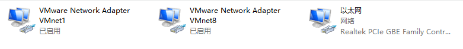
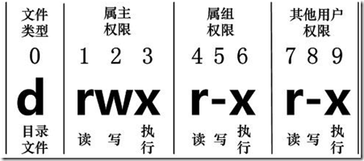

# linux

## vmware

卸载VMware往往卸不干净，使用Vmware-install.client可以完全卸载

不建议在创建虚拟机的自动安装linux系统

### 网络连接

* 桥接：和真实机一样的IP，使用真实网络连接，可以连接网络设备，推荐
* NAT ：使用WM-8虚拟网卡，虚拟连接，可以上网，不可使用网络设备
* Host-only：使用VM-1虚拟网卡，不能上网，只和本机连接



### 快照

相当于备份，可以保存系统某个状态，建议装好系统就保存一次快照

## 磁盘分区

### 磁盘分区

磁盘分区是使用分区编辑器在磁盘上划分几个逻辑部分。碟片一旦划分成数个分区，不同类的目录与文件可以存储进不同的分区

### 分区类型

* 主分区：最多只能4个
* 扩展分区：最多只能有1个，主分区加扩展分区最多有4个，不能写入数据，只能包含逻辑分区
* 逻辑分区：

### 格式化

格式化是写入文件系统，不单是清空磁盘

格式化（高级格式化）有称逻辑格式化，它是指根据用户选定的文件系统（如FAT16, FAT32, NTFS, EXT2, EXT3, EXT4等），在磁盘的特
定区域写入特定数据，在分区中划出一片用于存放文件分配表、目录表等用户文件管理的磁盘空间

## 硬件设备文件名

### linux下所有设备皆文件

每一个设备都有一个设备文件名

| 硬件              | 设备文件名           |
| :---------------- | :------------------- |
| IDE硬盘           | /dev/hd[a-d]         |
| SCSI/SATA/USB硬盘 | /dev/sd[a-p]         |
| 光驱              | /dev/cdrom或/dev/hdc |
| 软盘              | /dev/fd[0-1]         |
| 打印机（25针）    | /dev/lp[0-2]         |
| 打印机（USB）     | /dev/usb/lp[0-15]    |
| 鼠标              | /dev/mouse           |

### 分区设备文件名

#### 设备文件名

* /dev/hda1（IDE硬盘接口）
* /dev/sda1（SCSI硬盘接口、SATA硬盘接口）
（sd表示硬盘，a表示第一个硬盘，1表示第一个分区）

<p class="warning">注意：逻辑分区是从5开始，因为1-4表示主分区</p>

* 光驱用的就IDE接口，比较老，传输数率为每秒1百多兆
* SCSI是老式服务器硬盘的传输接口，每秒2百兆
* SATA为目前硬盘的标准接口分为SATA1、SATA2、SATA3代，SATA3可达每秒5百兆

#### 必须分区（以下两个分区是必须要分的）

* /（根分区）
* swap分区，即虚拟内存（交换分区，内存2倍，不超过2GB）

#### 推荐分区

* /boot（启动分区，200MB）

### 挂载

给分区分配盘符的过程叫挂载

* windows下的盘符（如本地磁盘E），就相当于是挂载点，linux下没有盘符这个概念，叫挂载点
* linux中不是拿abcd作为盘符，而是用目录作为盘符，任何一个目录都可以作为一个分区（即盘符）

## 命令提示符

```javascript
[root@localhost ~]#
```

* `root` 当前登录用户
* `localhost` 主机名
* `~` 当前所在目录（~为home目录）
* `#` 超级用户的提示符
* `$` 普通用户的提示符

### 修改命令提示符

配置文件

```javascript
/etc/profile        // 每个用户登录时都会运行的环境变量设置
```

要修改命令行提示符，需通过修改环境变量PS1来达到目的

命令列表的参数:
* \u 显示当前用户的用户名（user name）
* \h 显示主机名（host name）
* \W 显示当前工作目录的名字（work directory）
* \w 当前所在的完整路径
* \$ 显示$符作为提示符，如果用户是root的话，则显示#号
* \d 现在的系统日期
* \t 现在的系统时间

修改配置文件:

```javascript
export PS1='[\u@\h] \W\$ '
```

## 文件基本属性

```javascript
[root@www /]# ls -l
total 64
dr-xr-xr-x   2 root root 4096 Dec 14  2012 bin
dr-xr-xr-x   4 root root 4096 Apr 19  2012 boot
```



在Linux中第一个字符代表这个文件是目录、文件或链接文件等等

* \[ d \] 目录
* \[ - \] 文件
* \[ l \] 链接文档(link file)
* \[ b \] 装置文件里面的可供储存的接口设备(可随机存取装置)
* \[ c \] 装置文件里面的串行端口设备，例如键盘、鼠标(一次性读取装置)