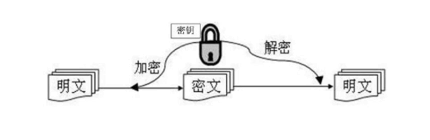

# 远程登录

## ssh

### 加密算法

#### 对称加密算法

采用单钥密码系统的加密方法，同一个密钥可以同时用作信息的加密和解密，这种加密方法称为对称加密，也称为单秘钥加密



#### 非对称加密算法

非对称加密算法又名“公开秘钥加密算法”，非对称加密算法需要两个秘钥：公开秘钥和私有秘钥

非对称加密与对称加密相比，其安全性更好：对称加密的通信双方使用相同的秘钥，如果一方的秘钥遭泄露，那么整个通信就会被破解。
而非对称加密使用一对秘钥，一个用来加密，一个用来解密，而且公钥是公开的，秘钥是自己保存的，不需要像对称加密那样在通信之前要先同步秘钥

### ssh使用

SSH (Secure Shell)安全外壳协议，主要用于远程登录

假定你要以用户名user，登录远程主机host

```javascript
$ ssh user@host
```

如果你是第一次登录对方主机，系统会出现下面的提示：

```
$ ssh user@host
The authenticity of host 'host (12.18.429.21)' can't be established.
RSA key fingerprint is 98:2e:d7:e0:de:9f:ac:67:28:c2:42:2d:37:16:58:4d.
Are you sure you want to continue connecting (yes/no)?
```

这段话的意思是，无法确认host主机的真实性，只知道它的公钥指纹，还想继续连接吗

<p class="warning">
当远程主机的公钥被接受以后，它就会被保存在文件$HOME/.ssh/known_hosts之中。下次再连接这台主机，系统就会认出它的公钥已经保
存在本地了，从而跳过警告部分，直接提示输入密码
</p>

### 公钥自动登录

公钥登录就是用户将自己的公钥储存在远程主机上。登录的时候，远程主机会向用户发送一段随机字符串，用户用自己的私钥加密后，再
发回来。远程主机用事先储存的公钥进行解密，如果成功，就证明用户是可信的，直接允许登录shell，不再要求密码

#### 1、生成公钥

运行结束以后，在$HOME/.ssh/目录下，会新生成两个文件：id_rsa.pub和id_rsa。前者是公钥，后者是私钥

```
$ ssh-keygen
```

#### 2、将公钥传送到远程主机host上面

```
$ ssh-copy-id user@host
```

如果还是不行，就打开远程主机的/etc/ssh/sshd_config这个文件，检查下面几行前面"#"注释是否取掉。

```
RSAAuthentication yes
PubkeyAuthentication yes
AuthorizedKeysFile .ssh/authorized_keys
```

然后，重启远程主机的ssh服务

```
// ubuntu系统
service ssh restart
// debian系统
/etc/init.d/ssh restart
```

## XShell

windows远程登录工具

## WinSCP

windows文件传输工具