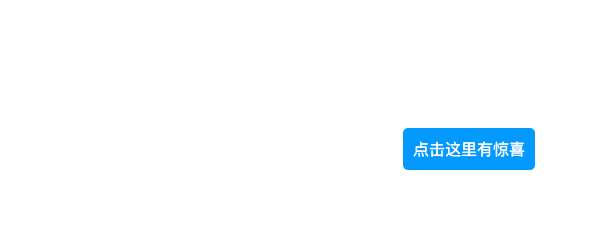
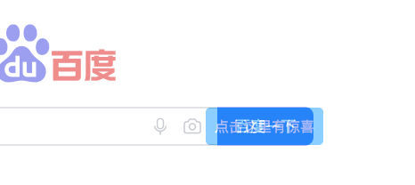
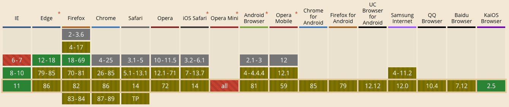

# 点击劫持

## 1 攻击原理

- 用户在登陆 A 网站的系统后，被攻击者诱惑打开第三方网站
- 而第三方网站通过 iframe 引入了 A 网站的页面内容
- 用户在第三方网站中点击某个按钮（被装饰的按钮），实际上是点击了 A 网站的按钮

特征：

- 用户亲手操作
- 用户不知情 (看不到真实的页面，被诱导点击)

## 2 场景

如图是一个平平无奇的按钮，页面中看不到其他内容：



但实际上这个按钮被一个 iframe 给覆盖了，这个 iframe 的透明度为 0

点击按钮时，实际上点击的是 iframe 内的按钮



实际情况中可能会用更丰富的引导做一些危险的操作，比如破坏、盗取数据，付款转账等。

## 3 点击劫持防御

点击劫持攻击的前提是网页能够通过 iframe 嵌套到其他网站，那么防止网页被嵌套到其他网站就能一定程度的防御点击劫持

### 3.1 javascript 禁止内嵌

有一个全局对象 `window.top`，返回窗口层级最顶层窗口的引用

如果当前页面没有被嵌套，那么 `window.top === window`

可以通过 `top.lcation === window.location` 来判断页面是否被嵌套

如果被嵌套，可以更改 `top.location.href` 将父级页面跳走

> 注意：受同源策略影响，如果嵌套的页面和父页面不同域，那么无法获取 top 对象下面的值。但是可以用在判断语句中，并且允许修改部分值，比如 `top.location.href`

但是这个方案有一个缺陷，iframe 可以阻止 script 运行

```html
<!-- 不允许运行脚本，只允许提交表单 -->
<iframe src="http:xxx.com" sandbox="allow-forms"></iframe>
<!-- sandbox allow-forms: 允许嵌入的浏览上下文提交表单。如果没有使用该关键字，则无法提交表单 -->
```

[sandbox 其他值见文档](https://developer.mozilla.org/zh-CN/docs/Web/HTML/Element/iframe)

### 3.2 X-Frame-Options

[X-Frame-Options 文档](https://developer.mozilla.org/zh-CN/docs/Web/HTTP/X-Frame-Options)

The X-Frame-Options HTTP 响应头是用来给浏览器 指示允许一个页面 可否在 `<frame>`, `<iframe>`, `<embed>` 或者 `<object>` 中展现的标记。站点可以通过确保网站没有被嵌入到别人的站点里面，从而避免 clickjacking 攻击

这个响应头需要在服务端设置

兼容性 (2020-11-03 数据)


