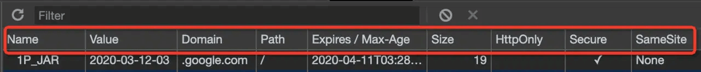

# cookies 问题

## 1 cookies 特性

- cookies 用于前端数据存储
- 后端可以设置 cookie，通过 http 头
- 请求是 http 头会自动带上 cookie
- 前端可读可写
- 遵守同源策略 (只能访问本域名的 cookie)

cookie 的属性:

- Name：cookie 的名称，同域名下 cookie 名称应该是唯一的，如果同域名下存在同名的 cookie 会被覆盖
- Value：cookie 的具体值，一般建议 cookie 值进行编码
- Domain：cookie 绑定的域名，如果不指定默认绑定到当前域名，也可以通过设置 Domian 属性实现跨域，就是通过将 cookie 绑定在一级域名下，从而实现二级域名访问跨域
- Path：cookie 绑定的访问路径，一般都是默认绑定在跟路径下即 `/`
- Expires/Max-Age：cookie 的有效期，一般 cookie 都是有有效时效的，时效范围内 cookie 是可用，过时效以后即失效
- HttpOnly：cookie 是否可以通过 JavaScript 进行操作，如果设置 HttpOnly 属性为 true 客服端将无法操作该 cookie 信息
- Secure：HTTP 不仅无状态且是不安全的协议，内容是以明文的方式传递的，而 Secure 这个属性就是标示 cookie 是不是仅在 https、ssl 等安全协议下使用，设置 secure 为 true 时及仅安全协议使用
- SameSite：用来限制第三方 cookie 的属性，避免风险，主要包括三个值 strict（最为严格，完全禁止第三方 cookie，跨站点时，任何情况下都不会发送 cookie。换言之，只有当前网页的 URL 与请求目标一致，才会带上 cookie）、Lax（稍稍放宽，大多数情况也是不发送第三方 cookie）、none（显式关闭 SameSite 属性，必须同时设置 Secure 属性（cookie 只能通过 HTTPS 协议发送），否则无效），目前 Chrome 80 已经将该属性默认设置为 Lax 规则

## 2 cookie 的作用

- 存储未登录用户唯一标识 (做统计时区分用户)
- 存储已登录用户的凭证 (免登录)
- 存储其他业务数据 (不推荐)

如何使用 cookie 存储用户登录凭证：

- 登录时将用户 id 使用加密算法生成一个字符串 (这个算法只能自己知道，别人无法破解，无法伪造)，这个字符串就是用户的凭证
- 将凭证和用户 id 存在 cookie 中
- 发起请求时，后端获取到凭证和用户 id，将凭证解密校验凭证是否有效。可以校验用户是否合法，并且获取用户信息，进行自动登录

## 3 cookie 与 XSS CSRF 的关系

- XSS 可以偷取 cookie，以及页面内的所有数据。
  设置 http-only 可以使 js 获取不到 cookie，防止 XSS 偷取
- CSRF 利用了用户的 cookie，但是攻击网站无法读写 cookie。CSRF 是利用了请求自动带上目标网站 cookie 的特性
  设置 samesite 可以阻止第三方网站的请求带上 cookie
