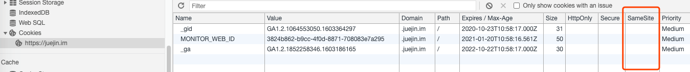
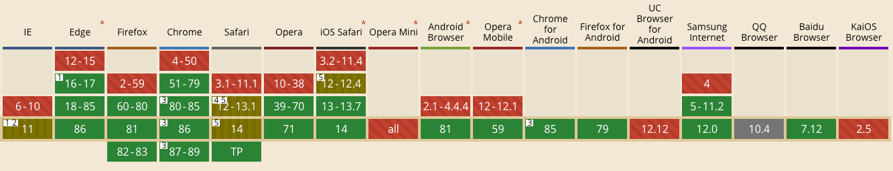

# CSRF 跨站请求伪造

CSRF 漏洞就是利用网站权限校验方面的漏洞在用户不知觉的情况下发送请求，达到“伪装”用户的目的

操作是在其他网站上面执行的

## 1 漏洞原理

目前有一些网站采用的还是 session 会话任务的方式。session 机制简单的来说就是服务端使用一个键值对记录登录信息，同时在 cookie 中将 session id（即刚才说的键）存储到 cookie 中。另外我们又知道浏览器中 HTTP(s) 请求是会自动帮我们把 cookie 带上传给服务端的。这样在每次请求的时候通过 cookie 获取 session id，然后通过它在服务端获取登录信息即可完成用户权限的校验。

如果一个用户在 A 网站登录了，如果用户在 B 网站访问的时候发送了一个 A 网站的请求，那么这个请求会带上 A 网站的 cookie

> CSRF 有两个特点：利用 cookie 自动携带的特性以及跨站攻击

> chrome 80 后的版本 Cookie SameSite 的默认值为 Lax，也就是跨站无法带上 cookie

详情见这篇文章 [Chrome 80 跨域 cookie 无法携带](https://juejin.im/post/6844904088165941262)

## 2 危害

- 攻击者能够欺骗受害用户完成该受害者所允许的任一状态改变的操作，比如：更新账号细节，完成购物，注销甚至登录等操作
- 获取用户的隐私数据
- 配合其他漏洞攻击
- CSRF 蠕虫

危害：

- 利用用户的登录态
- 用户不知情。虽然用户的身份，但不是用户主动操作的
- 盗取用户资金、消费
- 冒充用户发帖、评论
- 损害网站声誉

## 3 攻击场景

### 3.1 跨站调用接口

用 B 站举例，假如 B 站未做 CSRF 防御。B 站的视频页面有点赞功能

那么进行下面的操作：

- 浏览器已打开 B 站的页面并已登录，或者浏览器登录过 B 站，登录态还保留
- 这时打开了一个攻击者页面 (诱导点击的，或者是别人发的)
- 攻击页面带有一个表单 (ajax 可能会跨域)，会自动调用 B 站的点赞接口
- 这时点赞接口会自动带上你 B 站的 cookie 进行提交
- 回到 B 站，你会看到你在不知情的情况下点了一个赞

```html
<!-- 攻击页面的代码 -->
<!-- form target 指向一个 iframe 就不会跳转到 action -->
<form
  id="csrfFrom"
  name="csrfFrom"
  target="csrfFrame"
  method="post"
  action="http://test.mscode.co/api/visitor/v1/web/project/like"
>
  <input type="text" name="id" value="123456" />
</form>

<iframe name="csrfFrame" style="display: none;"></iframe>
```

### 3.2 GET 方式

有一部分接口是用 get 方式提交的，而 get 方式的接口会更加方便与 CSRF 攻击

可以用表单的方式自动提交，和上面 POST 接口类似

或者使用链接诱导用户点击

```html
<a href="http://test.mscode.co/api/visitor/v1/web/project/like?id=123456">千万不要点这里</a>
```

也可以直接把接口放在 img 标签的 src 上，这样打开页面就会自动提交

### 3.3 CSRF 蠕虫

CSRF 蠕虫常见的出现方式就是使用 GET 方式提交评论

例如下面场景：

- 你浏览 B 站视频的评论，其中一条评论有一个链接
- 你手贱点击了这个链接，进入到一个页面
- 这个页面是一个 CSRF 攻击页面，这个页面会自动给你发一条评论，评论的内容就是当前的这个攻击页面
- 然后你的这条评论又会诱导其他用户点击，点击后就会自动发一条评论
- 这样就会无限传播

这个就是 CSRF 蠕虫，它可以短时间内扩散到非常多的人群

## 4 CSRF 防御

### 4.1 samesite

从上面的原理可以了解到，CSRF 攻击是在 B 站给 A 网站发送了请求，这个请求自动带上了 A 的 cookie

那么有没有方法可以只能让自己的网站发送的请求带上 cookie

答案是有的，就是使用 samesite

> samesite 用来限制第三方 cookie 的属性，避免风险，主要包括三个值 strict（最为严格，完全禁止第三方 cookie，跨站点时，任何情况下都不会发送 cookie，只有当前网页的 URL 与请求目标一致，才会带上 cookie）、Lax（稍稍放宽，大多数情况也是不发送第三方 cookie）、none（显式关闭 SameSite 属性，必须同时设置 Secure 属性（cookie 只能通过 HTTPS 协议发送），否则无效），目前 Chrome 80 已经将该属性默认设置为 Lax 规则



但是 samesite 是一个新的标准，兼容性不太好 (2020-10 月数据)：



### 4.2 验证码和 token

CSRF 有个特性是不经过 A 网站的前端，所以 B 网站无法拿到 A 网站的数据，B 网站只能发送请求

那么在 A 网站加一些验证信息，这个验证信息只有 A 网站能拿到。就可以用来给接口做安全校验，只有 A 网站发出的请求能成功

- 验证码: (就是常规的验证码，图形或者短信，需要用户手动输入)，这个防御很有效，但是体验不好。
  一般用在操作不频繁而且安全要求很高的地方，比如付款、转账
- token: 登录时生成一个 token，将 token 设置到 cookie 中同时返回给前端。
  A 网站请求接口的时候会在表单内容里面带上 token，然后后端对比表单内容的 token 和 cookie 里面的 token 是否一致，来判断请求是否有效。
  这个过程用户是无感的，体验比较好

B 站的点赞接口就是用的 CSRF token:


### 4.3 验证 referer

HTTP Referer 是 header 的一部分，当浏览器向 web 服务器发送请求的时候，一般会带上 Referer，告诉服务器是从哪个页面发送的请求

Referer 也有为空的情况，就是这个请求并不是在某个页面里面发出的。比如直接打开一个图片的地址，这时 Referer 为空

CSRF 攻击时，请求是从 B 网站发出的，所以 Referer 的地址也是 B 网站。那么后端就可以通过比对 Referer 的地址来防止 CSRF 攻击

referer 的其他用途：

- 防盗链：只允许自己的网站访问静态资源
- 防止恶意请求
