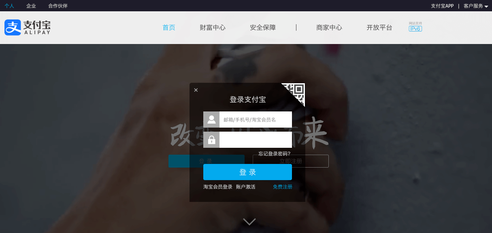

# 传输安全

## 1 http 窃听

http 协议是明文协议，也就是说请求不会做加密变换，直接发送到网络中，然后传输到服务器。服务器的返回也是明文返回，不做加密，经过各种链路和网络返回的浏览器

这里的链路就是网络上的各种中转设备，路由器、网关等

也就是说浏览器跟服务器之间的通信会经过非常多的节点，这些节点每一个都会转发流量数据，转发过程中可以知道这些数据的内容，并且可以修改数据。这就是传输链路的窃听和修改

使用 `traceroute` 可以查看一个访问到达服务器需要经过的节点

## 2 危害

http 窃听：

- 窃听用户密码
- 窃听传输的敏感信息
- 非法获取个人资料

http 篡改：

- 插入广告 (网页中会出现一些广告，但并不是网站的制作者放的，而是在传输过程中放入的)
- 重定向网站 (http 响应可以被随意修改)
- 无法防御的 XSS 和 CSRF 攻击 (前面提到的防御方式都可以被修改)

## 3 案例

### 3.1 运营商劫持

访问某个网页时弹出运营商的广告，运营商可以查看和修改你所有传输的数据：

(弹页面形式的广告)

(页面内嵌的小广告)

### 3.2 局域网劫持

通过一些手段将局域网中的流量导入到自己的机器，相当于自己的机器成了一个代理

比如当访问支付宝网页(已修复)的时候，你访问到的网页经过攻击者的机器后，已经被插入了一些恶意代码，这样就能盗取到用户名和密码

### 3.3 公共 wifi

连了一个 wifi 后，你所有的流量都会经过那个路由器。这些数据都可能被查看和修改

## 4 https

HTTPS（全称：Hyper Text Transfer Protocol over Secure Socket Layer），是以安全为目标的 HTTP 通道，简单讲是 HTTP 的安全版。即 HTTP 下加入 SSL 层，HTTPS 的安全基础是 SSL，因此加密的详细内容就需要 SSL

http 协议的缺点：

- **通信使用明文**
  通信使用明文意味着安全性大大降低，当通信过程被窃听后，无需花费额外的投入就可看到传输的数据。例如使用抓包工具，无需任何配置就可查看任何使用 HTTP 协议的通信数据
- **不验证通信方身份**
  不验证通信方的身份，将导致通信过程被窃听后，可能会遭遇伪装，例如使用抓包工具抓取数据后，就可按照数据包的格式构造 HTTP 请求
- **无法验证报文的完整性**
  不验证报文的完整性，数据在传输过程中就可能被篡改

`Https = Http + 加密 + 认证 + 完整性验证`

> 如果直接使用对称加密的方式进行加密，如果密钥不被泄漏是安全，但问题是密钥无法传递给客户端。而非对称加密，数据传输之前，服务端将自己的公钥传输给客户端，客户端在传输数据时，使用接收的公钥进行加密，服务端接收到数据后使用私钥进行解密，理论上可行，但是解密计算量很大，效率低。所以 https 使用到 TLS(SSL) 协议加密

TLS 协议的握手过程:

1. 客户端先给服务端发送一个消息，消息内容包括：客户端支持的加密方式，支持的压缩方法，SSL 的版本号，客户端生成的随机数，文本内容“Hello”等
2. 服务端接收到消息后，也回发一个 Hello，并携带从客户端支持的加密方式中选择的加密方式，服务端生成的随机数，服务端的 SSL 版本号等信息
3. 随后服务器给客户端发送一个 Certificate 报文，报文中包含服务端的公钥证书
4. 紧接着服务器给客户端发送 Server Hello Done, 表示最初的协商握手过程结束
5. 客户端接收到服务端发送的握手结束的消息后，以 Client Key Exchange 作为回应，此报文中包含通信加密过程中使用的一种被称为 Pre-master secret 的随机密码串，并使用第三步接收到的公钥证书进行了加密
6. 接着客户端发送 Change Cipher Spec 报文，该报文告知服务端，此步骤之后的所有数据将使用第五步中生成的 master secret 进行加密
7. 随后客户端发送 Finish 报文，此报文中包含连接至今所有报文的整体校验值，用于完整性验证
8. 服务端接收到客户端发送的 Change Cliper Spec 报文后，同样以 Change Cliper Spec 报文作为回应
9. 接着服务端发送 Finish 报文给客户端，表示服务端已正确解析客户端发送的整体校验值，至此，SSL 握手的过程结束
10. 随后开始使用 HTTP 协议传输使用 master secret 加密过的数据

> 证书需要向正规的服务商申请，而且浏览器内置了一个信任的 CA 证书列表，如果证书不是来自这个列表那么校验不通过

TLS 协议安全性几个关键的点：

- 证书无法伪造 (证书是向 CA 申请的)
- 证书私钥不被泄漏 (保证服务端不被攻击，私钥被盗)
- 域名管理权不泄漏
- CA 坚守原则 (CA 不随意发证书)
