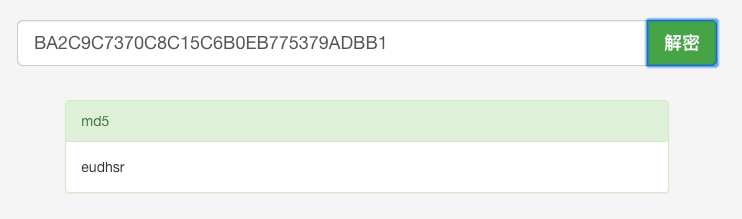

# 密码安全

## 1 泄漏渠道

- 数据库被偷
- 服务器被入侵 (可篡改服务器代码)
- 通讯被窃听
- 内部人员泄漏数据
- 其他网站 (用户多个网站的密码可能是相同的，盗取到 A 网站的密码后可以登录到 B 网站)

## 2 密码存储安全

密码容易泄漏，那么有没有可能即使密码泄漏，仍然保证用户密码是安全的呢？这就需要在密码存储上做一些加密

密码存储安全遵守的原则：

- 严禁明文存储 (防泄漏)
- 单向变换 (无法解密，拿到密文后，无法得到真实的密码)
- 变换复杂度要求 (防暴力破解)
- 密码复杂度要求 (防猜解，比如 6 个字符以上，不能用纯数字)
- 加盐 (帮用户增加密码复杂度)

### 2.1 哈希算法

单向变换使用的是哈希算法(信息摘要算法)

哈希算法的特征：

- 原文-密文一一对应，一个原文只对应一个密文
- 雪崩效应，原文微小的改动都会使密文完全不一样
- 密文无法反推到原文，密文是一个摘要
- 密文固定长度，密文跟原文长度无关
- 常见的哈希算法，md5、sha1、sha256

| 原文   | 密文 (md5)                       |
| :----- | :------------------------------- |
| 123456 | E10ADC3949BA59ABBE56E057F20F883E |
| eudhsr | BA2C9C7370C8C15C6B0EB775379ADBB1 |

> 虽然密文无法反推到原文，但是原文和密文是一一对应的，也就是说一个数据的密文是固定的，这就可以通过彩虹表去查询到对应的原文。所以单一的加密方式很容易破解，实际应用中需要使用多种加密方式组合



当密码达到一定的长度，并且组合了字母或符号时，彩虹表就会很难查询到，8 位数字+小写字母就有 2.8 万亿种组合，9 位有 100 万亿种组合

```javascript
md5(sha1(md5(ID + 原始密码 + 随机字符串 + 盐)));
```

经过上面的加密后，密码已经无法通过彩虹表破译。而密码加解密计算的复杂度也会提高很多，进一步提高破译成本

## 3 密码传输安全

- https 传输
- 频率限制 (防止密码猜解)
- 前端密码加密

前端密码加密在一定程度上是有意义的。

传输层窃听可以获取到用户的密码，即使密码经过前端加密，将加密过的密码传给后端还是能正常登录，窃取用户的信息。所以前端加密并不能阻止盗取密码

前端加密只能阻止攻击者获取用户的明文密码。因为有很多用户不同的账户设的密码是一样的，所以阻止获取明文密码是有一定意义的

## 4 生物特征码

生物特征码在某些方法要比密码安全，并且更方便。但是也比较容易泄漏，不具备私密性

生物特征码的准确性无法做到完全准确，比如人脸识别，会有误差

生物特征码具有唯一性，无法修改。比如指纹泄漏后，没有防御措施，无法更改

- 指纹 (可以通过照片或者触摸过的地方提取)
- 声纹 (录音)
- 虹膜
- 人脸识别 (拍照/录像)
