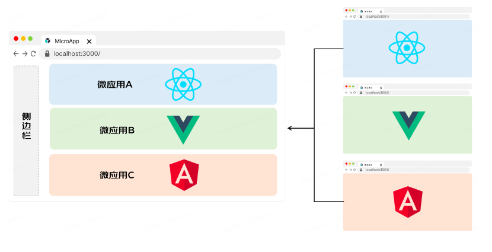

# 介绍

## 1 什么是微前端

**背景：**

有一些功能复杂且陈旧的项目，用着旧的技术和框架，经历了众多人员的开发，慢慢堆积为“屎山代码”。久而久之项目变得难以维护，开发效率降低，运行和部署也变的耗时，产生的性能问题优化困难。同时持续的有新需求需要在上面迭代

这种项目如果要重构需要花费大量的人力，很难做到兼顾重构和新需求的迭代。即时开发完成重构，也需要耗费大量的测试资源进行全量的测试，容易产生 bug

微前端主要解决了两个问题：

1. 随着项目迭代应用越来越庞大，难以维护
1. 跨团队或跨部门协作开发项目导致效率低下的问题

**基本概念：**

微前端的概念是由 ThoughtWorks 在 2016 年提出的

它借鉴了微服务的架构理念，核心在于将一个庞大的前端应用拆分成多个独立灵活的小型应用，每个应用都可以独立开发、独立运行、独立部署，再将这些小型应用融合为一个完整的应用，或者将原本运行已久、没有关联的几个应用融合为一个应用。微前端既可以将多个项目融合为一，又可以减少项目之间的耦合，提升项目扩展性，相比一整块的前端仓库，微前端架构下的前端仓库倾向于更小更灵活。

**核心思想：**

分割了大型应用，同时又将分割后的应用组合起来

**使用场景和收益：**

- 增量升级。通过独立的开发和部署进行产品的迭代，减少影响到整个应用，从而减少冲突
- 灵活性。技术栈无关，维护不同的子模块时可以使用不用技术栈
- 稳定性。各微应用各司其职，不相互影响，减少不稳定性
- 独立性。独立开发、测试、部署
