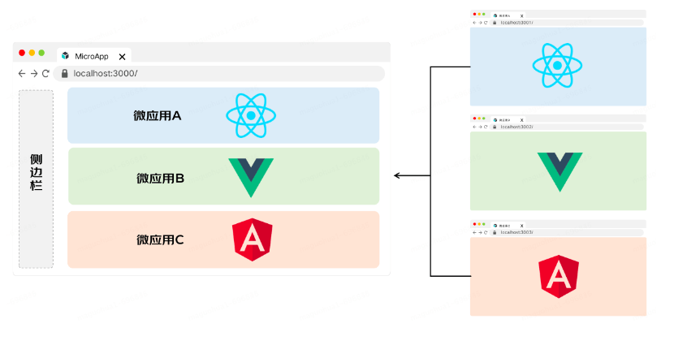

# 介绍

## 1 什么是微前端

**背景：**

有一些功能复杂且陈旧的项目，用着旧的技术和框架，经历了众多人员的开发，慢慢堆积为“屎山代码”。久而久之项目变得难以维护，开发效率降低，运行和部署也变的耗时，产生的性能问题优化困难。同时持续的有新需求需要在上面迭代

这种项目如果要重构需要花费大量的人力，很难做到兼顾重构和新需求的迭代。即时开发完成重构，也需要耗费大量的测试资源进行全量的测试，容易产生 bug

微前端主要解决了两个问题：

1. 随着项目迭代应用越来越庞大，难以维护
1. 跨团队或跨部门协作开发项目导致效率低下的问题

**基本概念：**

微前端的概念是由 ThoughtWorks 在 2016 年提出的

它借鉴了微服务的架构理念，核心在于将一个庞大的前端应用拆分成多个独立灵活的小型应用，每个应用都可以独立开发、独立运行、独立部署，再将这些小型应用融合为一个完整的应用，或者将原本运行已久、没有关联的几个应用融合为一个应用。微前端既可以将多个项目融合为一，又可以减少项目之间的耦合，提升项目扩展性，相比一整块的前端仓库，微前端架构下的前端仓库倾向于更小更灵活。

**核心思想：**



分割了大型应用，同时又将分割后的应用组合起来

**使用场景和收益：**

- 增量升级。通过独立的开发和部署进行产品的迭代，减少影响到整个应用，从而减少冲突
- 灵活性。技术栈无关，维护不同的子模块时可以使用不用技术栈
- 稳定性。各微应用各司其职，不相互影响，减少不稳定性
- 独立性。独立开发、测试、部署

## 2 实现方案

### 2.1 路由分发式

通过路由将不同的业务分发到不同的、独立前端应用上。其通常可以通过 HTTP 服务器的反向代理来实现，又或者是应用框架自带的路由来解决

```nginx
http {
  server {
    listen       80;
    server_name  www.phodal.com;
    location /api/ {
      proxy_pass http://http://172.31.25.15:8000/api;
    }
    location /web/admin {
      proxy_pass http://172.31.25.29/web/admin;
    }
    location /web/notifications {
      proxy_pass http://172.31.25.27/web/notifications;
    }
    location / {
      proxy_pass /;
    }
  }
}
```

**适用场景：**

- 不同技术栈之间差异比较大，难以兼容、迁移、改造
- 项目不想花费大量的时间在这个系统的改造上
- 现有的系统在未来将会被取代
- 系统功能已经很完善，基本不会有新需求

**缺点：**

- 基础的服务无法统一管理，例如登录态、全局弹窗、消息提醒等
- 应用间跳转体验不好

### 2.2 iframe

通过 iframe 加载子应用。 通信可以通过 postMessage 进行通信

**优点：**

- 简单
- 隔离
- 安全

**缺点：**

- 布局约束
- 性能开销
- 破坏了语义化，对无障碍可访问性支持不好哦
- 不利于 seo，会当成 2 个页面
- url 不同步。浏览器刷新 iframe url 状态丢失、后退前进按钮无法使用。
- UI 不同步，DOM 结构不共享。想象一下屏幕右下角 1/4 的 iframe 里来一个带遮罩层的弹框，同时我们要求这个弹框要浏览器居中显示，还要浏览器 resize 时自动居中
- 全局上下文完全隔离，内存变量不共享。iframe 内外系统的通信、数据同步等需求，主应用的 cookie 要透传到根域名都不同的子应用中实现免登效果。
- 慢。每次子应用进入都是一次浏览器上下文重建、资源重新加载的过程

### 2.3 ajax

### 2.4 web component

将前端应用程序分解为自定义 HTML 元素。 基于 CustomEvent 实现通信

Shadow DOM 天生的作用域隔离

重写现有的前端应用，使用 Web Components 来完成整个系统的功能

- 被 Web 标准广泛支持
- 自定义元素 shadow DOM 支持隔离
- 引入了生命周期
- shadow 兼容性支持度不够好

## 3 微前端框架

### 3.1 single-spa

- 实现一套生命周期，在 load 时加载子 app
- 监听 url 的变化，url 变化时，会使得某个子 app 变成 active 状态，**然后走整套生命周期**
- 子应用最关键的一步就是导出 bootstrap, mount, unmount 三个生命周期钩子
- 基于浏览器原生的事件系统，无框架耦合，全局开箱可用
- load 方法需要知道子项目的入口文件
- 把多个应用的运行时集成起来需要项目间自行处理内存泄漏，样式污染问题
- 没有提供父子数据通信的方式

### 3.2 qiankun

qiankun 基于 single-spa 进行了二次开发

- 主应用：只需要输入子应用的 html 入口
- 子应用：与 single-spa 基本一致，导出了三个生命周期函数
- js 隔离
  - Proxy 沙箱，它将 window 上的所有属性遍历拷贝生成一个新的 fakeWindow 对象，紧接着使用 proxy 代理这个 fakeWindow，用户对 window 操作全部被拦截下来，只作用于在这个 fakeWindow 之上
- css 隔离
  - ShadowDOM 样式沙箱会被开启。在这种模式下 qiankun 会为每个微应用的容器包裹上一个 shadow dom 节点，从而确保微应用的样式不会对全局造成影响
  - Scoped CSS，qiankun 会遍历子应用中所有的 CSS 选择器，通过对选择器前缀添加一个固定的带有该子应用标识的属性选择器的方式来限制其生效范围，从而避免子应用间、主应用与子应用的样式相互污染
  - 但如果用户在运行时引入了新的外联样式或者自行创建了新的内联标签，那么 qiankun 并不会做出反应
- qiankun 在框架内部预先设计实现了完善的发布订阅模式

### 3.3 无界

无界通过继承 iframe 的优点，解决 iframe 的缺点，打造一个接近完美的 iframe 方案

**使用 iframe 有三个难以解决的问题：**

- 路由状态丢失，刷新一下，iframe 的 url 状态就丢失了
- dom 割裂严重，弹窗只能在 iframe 内部展示，无法覆盖全局
- 通信非常困难，只能通过 postMessage 传递序列化的消息

**实现原理：**

在应用 A 中构造一个 shadow 和 iframe，然后将应用 B 的 html 写入 shadow 中，js 运行在 iframe 中，iframe 保持和主应用同域但是保留子应用的路径信息，这样子应用的 js 可以运行在 iframe 的 location 和 history 中保持路由正确

**渲染子应用步骤：**

- 创建一个 iframe，插入主应用 document
- 立即停止 iframe 的加载
  - 因为 iframe 的 src 要设置为主应用的域名，继续请求资源会失败
  - 修改为主应用域名是为了通信
- 修改请求的域名为子应用的真实域名
  - 所以子应用需要能支持跨域
- 解析子应用的入口 html
  - 识别出 html 部分，分离 style 和 js
  - 处理 css 重新注入 html （有插件系统，可以对子应用的 css 定义）
  - 创建 webComponent 并挂载 HTML
  - CSS 由于在 shadowDOM 内，样式也不会影响到外部，也不会受外部样式影响。
- 创建 script 标签，并插入到 iframe 的 head 中
- 对 iframe 的 document.querySelector 进行改造，需要劫持 document 改为从 shadowRoot 里面查找，才能使 Vue 组件能够正确找到挂载点

### 3.4 micro app

