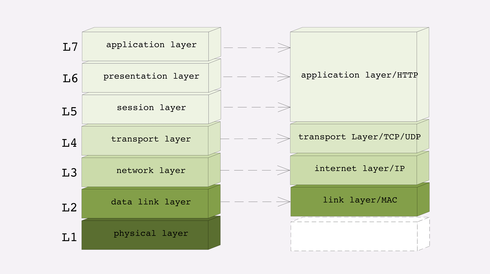

# 网络分层模型

## 1 TCP/IP 网络分层模型

还是先从 TCP/IP 协议开始讲起，一是因为它非常经典，二是因为它是目前事实上的网络通信标准，研究它的实用价值最大。

TCP/IP 当初的设计者提出了“分层”的概念，把复杂的网络通信划分出多个层次，再给每一个层次分配不同的职责，层次内只专心做自己的事情就好，用“分而治之”的思想把一个“大麻烦”拆分成了数个“小麻烦”，从而解决了网络通信的难题。

TCP/IP 协议总共有四层，就像搭积木一样，每一层需要下层的支撑，同时又支撑着上层，任何一层被抽掉都可能会导致整个协议栈坍塌。

TCP/IP 协议不是 TCP 和 IP 这两个协议的合称，而是指因特网整个 TCP/IP 协议族

| OSI 7 层模型               | TCP/IP 4 层模型 |                |
| :------------------------- | :-------------- | :------------- |
| 应用层 表示层 会话层 | 应用层          | HTTP、FTP、DNS |
| 传输层                     | 传输层          | TCP、UDP       |
| 网络层                     | 网际互联层      | IP             |
| 数据链路层                 | 网络接口层      | Ethernet 802.3 |
| 物理层                     |                 |                |

### 1.1 网络接口层

第一层叫“链接层”（link layer），负责在以太网、WiFi 这样的底层网络上发送原始数据包，工作在网卡这个层次，使用 MAC 地址来标记网络上的设备，所以有时候也叫 MAC 层。

数据链路层是负责接收 IP 数据包并通过网络发送，或者从网络上接收物理帧，抽出 IP 数据包，交给 IP 层。ARP 是正向地址解析协议，通过已知的 IP，寻找对应主机的 MAC 地址。RARP 是反向地址解析协议，通过 MAC 地址确定 IP 地址。比如无盘工作站还有 DHCP 服务。

网络接口层相关协议：

- `Ethernet 802.3`
- `Token Ring 802.5`
- `X.25`
- `Frame relay`
- `HDLC`
- `PPP ATM`

### 1.2 网络层

第二层叫“网际层”或者“网络互连层”（internet layer），IP 协议就处在这一层。因为 IP 协议定义了“IP 地址”的概念，所以就可以在“链接层”的基础上，用 IP 地址取代 MAC 地址，把许许多多的局域网、广域网连接成一个虚拟的巨大网络，在这个网络里找设备时只要把 IP 地址再“翻译”成 MAC 地址就可以了。

网络层负责相邻计算机之间的通信。

其功能包括三方面：

1. 处理来自传输层的分组发送请求，收到请求后，将分组装入 IP 数据报，填充报头，选择去往信宿机的路径，然后将数据报发往适当的网络接口
2. 处理输入数据报：首先检查其合法性，然后进行寻径--假如该数据报已到达信宿机，则去掉报头，将剩下部分交给适当的传输协议；假如该数据报尚未到达信宿，则转发该数据报
3. 处理路径、流控、拥塞等问题

网络层相关协议：

- `IP` (Internet Protocol）协议
- `ICMP` (Internet Control Message Protocol)控制报文协议
- `ARP` (Address Resolution Protocol）地址转换协议
- `RARP` (Reverse ARP)反向地址转换协议

IP 是网络层的核心，通过路由选择将下一条 IP 封装后交给接口层。IP 数据报是无连接服务。

ICMP 是网络层的补充，可以回送报文。用来检测网络是否通畅。

Ping 命令就是发送 ICMP 的 echo 包，通过回送的 echo relay 进行网络测试。

### 1.3 传输层

第三层叫“传输层”（transport layer），这个层次协议的职责是保证数据在 IP 地址标记的两点之间“可靠”地传输，是 TCP 协议工作的层次，传输层另外还有 UDP 协议

提供应用程序间的通信。其功能包括：一、格式化信息流；二、提供可靠传输。为实现后者，传输层协议规定接收端必须发回确认，并且假如分组丢失，必须重新发送，即耳熟能详的“三次握手”过程，从而提供可靠的数据传输。

- `TCP` 传输控制协议 (Transmission Control Protocol）
- `UDP` 用户数据报协议 (User Datagram protocol）

TCP 是一个有状态的协议，需要先与对方建立连接然后才能发送数据，而且保证数据不丢失不重复。而 UDP 则比较简单，它无状态，不用事先建立连接就可以任意发送数据，但不保证数据一定会发到对方。两个协议的另一个重要区别在于数据的形式。TCP 的数据是连续的“字节流”，有先后顺序，而 UDP 则是分散的小数据包，是顺序发，乱序收。

### 1.4 应用层

协议栈的第四层叫“应用层”（application layer），由于下面的三层把基础打得非常好，所以在这一层就“百花齐放”了，有各种面向具体应用的协议。例如 Telnet、SSH、FTP、SMTP 等等，当然还有我们的 HTTP。

向用户提供一组常用的应用程序，比如电子邮件、文件传输访问、远程登录等。远程登录 TELNET 使用 TELNET 协议提供在网络其它主机上注册的接口。TELNET 会话提供了基于字符的虚拟终端。文件传输访问 FTP 使用 FTP 协议来提供网络内机器间的文件拷贝功能。

应用层相关协议：

- `FTP` (File Transfer Protocol）是文件传输协议，一般上传下载用 FTP 服务，数据端口是 20H，控制端口是 21H。
- `Telnet` 服务是用户远程登录服务，使用 23H 端口，使用明码传送，保密性差、简单方便。
- `DNS` (Domain Name Service）是域名解析服务，提供域名到 IP 地址之间的转换，使用端口 53。
- `SMTP` (Simple Mail Transfer Protocol）是简单邮件传输协议，用来控制信件的发送、中转，使用端口 25。
- `NFS`（Network File System）是网络文件系统，用于网络中不同主机间的文件共享。
- `HTTP` (Hypertext Transfer Protocol）是超文本传输协议，用于实现互联网中的 WWW 服务，使用端口 80。

## 2 OSI 网络分层模型

OSI，全称是“开放式系统互联通信参考模型”（Open System Interconnection Reference Model）。

TCP/IP 发明于 1970 年代，当时除了它还有很多其他的网络协议，整个网络世界比较混乱。这个时候国际标准组织（ISO）注意到了这种现象。于是设计出了一个新的网络分层模型，想用这个新框架来统一既存的各种网络协议。

OSI 模型分成了七层，部分层次与 TCP/IP 很像，分别是：

| 层  | 模型       | 协议           | 数据单位 |
| :-- | :--------- | :------------- | :------- |
| 7   | 应用层     | 应用层协议     | APDU     |
| 6   | 表示层     | 表示层协议     | PPDU     |
| 5   | 会话层     | 会话层协议     | SPDU     |
| 4   | 传输层     | 传输层协议     | TPDU     |
| 3   | 网络层     | 网络层协议     | 报文     |
| 2   | 数据链路层 | 数据链路层协议 | 帧       |
| 1   | 物理层     | 物理层协议     | 比特     |

- 第一层：物理层，网络的物理形式，例如电缆、光纤、网卡、集线器等等
- 第二层：数据链路层，它基本相当于 TCP/IP 的链接层。成帧、用 MAC 地址访问媒介、错误检测与修正
- 第三层：网络层，相当于 TCP/IP 里的网际层。提供逻辑地址、选路
- 第四层：传输层，相当于 TCP/IP 里的传输层。可靠与不可靠的传输、传输前的错误检查、流控
- 第五层：会话层，维护网络中的连接状态，即保持会话和同步
- 第六层：表示层，把数据转换为合适、可理解的语法和语义
- 第七层：应用层，面向具体的应用传输数据

TCP/IP 等协议已经在许多网络上实际运行，再推翻重来是不可能的。所以，OSI 分层模型在发布的时候就明确地表明是一个“参考”，不是强制标准

但 OSI 模型也是有优点的。对比一下就可以看出，TCP/IP 是一个纯软件的栈，没有网络应有的最根基的电缆、网卡等物理设备的位置。而 OSI 则补足了这个缺失，在理论层面上描述网络更加完整。

还有一个重要的形式上的优点：OSI 为每一层标记了明确了编号，最底层是一层，最上层是七层，而 TCP/IP 的层次从来只有名字而没有编号。显然，在交流的时候说“七层”要比“应用层”更简单快捷，特别是英文，对比一下“Layer seven”与“application layer”。

综合以上几点，在 OSI 模型之后，“四层”“七层”这样的说法就逐渐流行开了。不过在实际工作中你一定要注意，这种说法只是“理论上”的层次，并不是与现实完全对应。

## 3 两个分层模型的映射关系

现在我们有了两个网络分层模型：TCP/IP 和 OSI，新的问题又出现了，一个是四层模型，一个是七层模型，这两者应该如何互相映射或者说互相解释呢？

好在 OSI 在设计之初就参考了 TCP/IP 等多个协议，可以比较容易但不是很精确地实现对应关系。

- 第一层：物理层，TCP/IP 里无对应
- 第二层：数据链路层，对应 TCP/IP 的链接层
- 第三层：网络层，对应 TCP/IP 的网际层
- 第四层：传输层，对应 TCP/IP 的传输层
- 第五、六、七层：统一对应到 TCP/IP 的应用层

所以你看，这就是“理想与现实”之间的矛盾。理想很美好，有七层，但现实很残酷，只有四层，“多余”的五层、六层就这样“消失”了。

但这也有一定的实际原因。

OSI 的分层模型在四层以上分的太细，而 TCP/IP 实际应用时的会话管理、编码转换、压缩等和具体应用经常联系的很紧密，很难分开。例如，HTTP 协议就同时包含了连接管理和数据格式定义。

到这里，你应该能够明白一开始那些“某某层”的概念了。

所谓的“四层负载均衡”就是指工作在传输层上，基于 TCP/IP 协议的特性，例如 IP 地址、端口号等实现对后端服务器的负载均衡。

所谓的“七层负载均衡”就是指工作在应用层上，看到的是 HTTP 协议，解析 HTTP 报文里的 URI、主机名、资源类型等数据，再用适当的策略转发给后端服务器。

## 4 TCP/IP 协议栈的工作方式

你可以把 HTTP 利用 TCP/IP 协议栈传输数据想象成一个发快递的过程。

假设你想把一件毛绒玩具送给朋友，但你要先拿个塑料袋套一下，这件玩具就相当于 HTTP 协议里要传输的内容，比如 HTML，然后 HTTP 协议为它加一个 HTTP 专用附加数据。

你把玩具交给快递小哥，为了保护货物，他又加了层包装再贴了个标签，相当于在 TCP 层给数据再次打包，加上了 TCP 头。

接着快递小哥下楼，把包裹放进了三轮车里，运到集散点，然后再装进更大的卡车里，相当于在 IP 层、MAC 层对 TCP 数据包加上了 IP 头、MAC 头。

之后经过漫长的运输，包裹到达目的地，要卸货再放进另一位快递员的三轮车，就是在 IP 层、MAC 层传输后拆包。

快递员到了你朋友的家门口，撕掉标签，去除了 TCP 层的头，你朋友再拆掉塑料袋包装，也就是 HTTP 头，最后就拿到了玩具，也就是真正的 HTML 页面。

这个比喻里省略了很多 TCP/IP 协议里的细节，比如建连、路由、数据切分与重组、错误检查等，但核心的数据传输过程是差不多的。

HTTP 协议的传输过程就是这样通过协议栈逐层向下，每一层都添加本层的专有数据，层层打包，然后通过下层发送出去。

接收数据是则是相反的操作，从下往上穿过协议栈，逐层拆包，每层去掉本层的专有头，上层就会拿到自己的数据。

但下层的传输过程对于上层是完全“透明”的，上层也不需要关心下层的具体实现细节，所以就 HTTP 层次来看，它不管下层是不是 TCP/IP 协议，看到的只是一个可靠的传输链路，只要把数据加上自己的头，对方就能原样收到。

## 5 总结

1. TCP/IP 分为四层，核心是二层的 IP 和三层的 TCP，HTTP 在第四层
2. OSI 分为七层，基本对应 TCP/IP，TCP 在第四层，HTTP 在第七层
3. OSI 可以映射到 TCP/IP，但这期间一、五、六层消失了
4. 日常交流的时候我们通常使用 OSI 模型，用四层、七层等术语
5. HTTP 利用 TCP/IP 协议栈逐层打包再拆包，实现了数据传输，但下面的细节并不可见

有一个辨别四层和七层比较好的（但不是绝对的）小窍门，“两个凡是”：凡是由操作系统负责处理的就是四层或四层以下，否则，凡是需要由应用程序（也就是你自己写代码）负责处理的就是七层。

## 6 扩展问题

1. 你能用自己的话解释一下“二层转发”“三层路由”吗？
2. 你认为上一讲中的 DNS 协议位于哪一层呢？
3. 你认为 CDN 工作在那一层呢？
