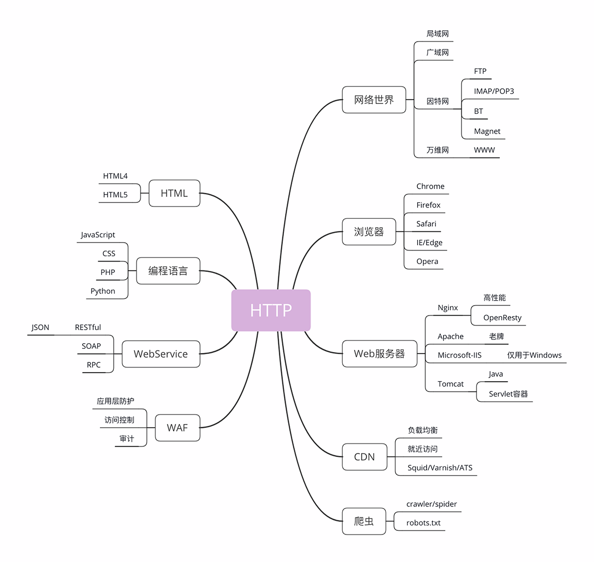
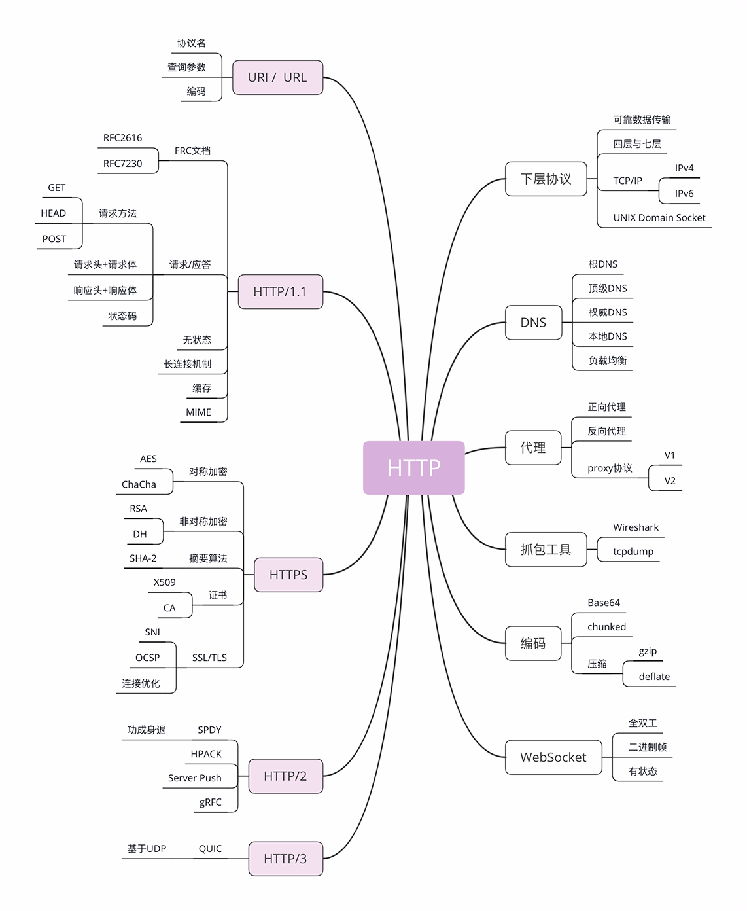

# 与 http 相关的概念和协议

## 1 与 http 相关的概念



### 1.1 互联网

互联网的正式名称是 `Internet`，里面存储着无穷无尽的信息资源，我们通常所说的“上网”实际上访问的只是互联网的一个子集“万维网”（`World Wide Web`），它基于 HTTP 协议，传输 HTML 等超文本资源，能力也就被限制在 HTTP 协议之内。

互联网上还有许多万维网之外的资源，例如常用的电子邮件、BT 和 Magnet 点对点下载、FTP 文件下载、SSH 安全登录、各种即时通信服务等等，它们需要用各自的专有协议来访问。

不过由于 HTTP 协议非常灵活、易于扩展，而且“超文本”的表述能力很强，所以很多其他原本不属于 HTTP 的资源也可以“包装”成 HTTP 来访问，这就是我们为什么能够总看到各种“网页应用”——例如“微信网页版”“邮箱网页版”——的原因。

综合起来看，现在的互联网 90% 以上的部分都被万维网，也就是 HTTP 所覆盖，所以把互联网约等于万维网或 HTTP 应该也不算大错。

### 1.2 浏览器

浏览器的正式名字叫“`Web Browser`”，顾名思义，就是检索、查看互联网上网页资源的应用程序，名字里的 Web，实际上指的就是“World Wide Web”，也就是万维网。

浏览器本质上是一个 HTTP 协议中的请求方，使用 HTTP 协议获取网络上的各种资源。当然，为了让我们更好地检索查看网页，它还集成了很多额外的功能。

例如，HTML 排版引擎用来展示页面，JavaScript 引擎用来实现动态化效果，甚至还有开发者工具用来调试网页，以及五花八门的各种插件和扩展。

在 HTTP 协议里，浏览器的角色被称为“User Agent”即“用户代理”，意思是作为访问者的“代理”来发起 HTTP 请求。不过在不引起混淆的情况下，我们通常都简单地称之为“客户端”。

### 1.3 Web 服务器

刚才说的浏览器是 HTTP 里的请求方，在协议另一端的应答方就是服务器，`Web Server`。

Web 服务器是一个很大也很重要的概念，它是 HTTP 协议里响应请求的主体，通常也把控着绝大多数的网络资源，在网络世界里处于强势地位。

当我们谈到“Web 服务器”时有两个层面的含义：硬件和软件。

硬件含义就是物理形式或“云”形式的机器，在大多数情况下它可能不是一台服务器，而是利用反向代理、负载均衡等技术组成的庞大集群。但从外界看来，它仍然表现为一台机器，但这个形象是“虚拟的”。

软件含义的 Web 服务器可能我们更为关心，它就是提供 Web 服务的应用程序，通常会运行在硬件含义的服务器上。它利用强大的硬件能力响应海量的客户端 HTTP 请求，处理磁盘上的网页、图片等静态文件，或者把请求转发给后面的 Tomcat、Node.js 等业务应用，返回动态的信息。

比起层出不穷的各种 Web 浏览器，Web 服务器就要少很多了，一只手的手指头就可以数得过来。

Apache 是老牌的服务器，到今天已经快 25 年了，功能相当完善，相关的资料很多，学习门槛低，是许多创业者建站的入门产品。

Nginx 是 Web 服务器里的后起之秀，特点是高性能、高稳定，且易于扩展。自 2004 年推出后就不断蚕食 Apache 的市场份额，在高流量的网站里更是不二之选。

此外，还有 Windows 上的 IIS、Java 的 Jetty/Tomcat 等，因为性能不是很高，所以在互联网上应用得较少。

### 1.4 CDN

浏览器和服务器是 HTTP 协议的两个端点，那么，在这两者之间还有别的什么东西吗？

当然有了。浏览器通常不会直接连到服务器，中间会经过“重重关卡”，其中的一个重要角色就叫做 CDN。

CDN，全称是“`Content Delivery Network`”，翻译过来就是“内容分发网络”。它应用了 HTTP 协议里的缓存和代理技术，代替源站响应客户端的请求。

它可以缓存源站的数据，让浏览器的请求不用“千里迢迢”地到达源站服务器，直接在“半路”就可以获取响应。如果 CDN 的调度算法很优秀，更可以找到离用户最近的节点，大幅度缩短响应时间。

CDN 也是现在互联网中的一项重要基础设施，除了基本的网络加速外，还提供负载均衡、安全防护、边缘计算、跨运营商网络等功能，能够成倍地“放大”源站服务器的服务能力，很多云服务商都把 CDN 作为产品的一部分

### 1.5 爬虫

前面说到过浏览器，它是一种用户代理，代替我们访问互联网。

但 HTTP 协议并没有规定用户代理后面必须是“真正的人类”，它也完全可以是“机器人”，这些“机器人”的正式名称就叫做“爬虫”（`Crawler`），实际上是一种可以自动访问 Web 资源的应用程序。

据估计，互联网上至少有 50% 的流量都是由爬虫产生的，某些特定领域的比例还会更高，也就是说，如果你的网站今天的访问量是十万，那么里面至少有五六万是爬虫机器人，而不是真实的用户。

爬虫是怎么来的呢？

绝大多数是由各大搜索引擎“放”出来的，抓取网页存入庞大的数据库，再建立关键字索引，这样我们才能够在搜索引擎中快速地搜索到互联网角落里的页面。

爬虫也有不好的一面，它会过度消耗网络资源，占用服务器和带宽，影响网站对真实数据的分析，甚至导致敏感信息泄漏。所以，又出现了“反爬虫”技术，通过各种手段来限制爬虫。其中一项就是“君子协定”robots.txt，约定哪些该爬，哪些不该爬。

无论是“爬虫”还是“反爬虫”，用到的基本技术都是两个，一个是 HTTP，另一个就是 HTML。

### 1.6 HTML/WebService/WAF

HTML 是 HTTP 协议传输的主要内容之一，它描述了超文本页面，用各种“标签”定义文字、图片等资源和排版布局，最终由浏览器“渲染”出可视化页面。

HTML 目前有两个主要的标准，HTML4 和 HTML5。广义上的 HTML 通常是指 HTML、JavaScript、CSS 等前端技术的组合，能够实现比传统静态页面更丰富的动态页面。

接下来是 Web Service，它的名字与 Web Server 很像，但却是一个完全不同的东西。

`Web Service` 是一种由 W3C 定义的应用服务开发规范，使用 client-server 主从架构，通常使用 WSDL 定义服务接口，使用 HTTP 协议传输 XML 或 SOAP 消息，也就是说，它是一个基于 Web（HTTP）的服务架构技术，既可以运行在内网，也可以在适当保护后运行在外网。

因为采用了 HTTP 协议传输数据，所以在 Web Service 架构里服务器和客户端可以采用不同的操作系统或编程语言开发。例如服务器端用 Linux+Java，客户端用 Windows+C#，具有跨平台跨语言的优点。

WAF 是近几年比较“火”的一个词，意思是“网络应用防火墙”。与硬件“防火墙”类似，它是应用层面的“防火墙”，专门检测 HTTP 流量，是防护 Web 应用的安全技术。

WAF 通常位于 Web 服务器之前，可以阻止如 SQL 注入、跨站脚本等攻击，目前应用较多的一个开源项目是 ModSecurity，它能够完全集成进 Apache 或 Nginx。

### 1.7 总结

1. 互联网上绝大部分资源都使用 HTTP 协议传输；
2. 浏览器是 HTTP 协议里的请求方，即 User Agent；
3. 服务器是 HTTP 协议里的应答方，常用的有 Apache 和 Nginx；
4. CDN 位于浏览器和服务器之间，主要起到缓存加速的作用；
5. 爬虫是另一类 User Agent，是自动访问网络资源的程序。

## 2 与 http 有关的协议



### 2.1 TCP/IP

`TCP/IP` 协议是目前网络世界“事实上”的标准通信协议。

`TCP/IP` 协议实际上是一系列网络通信协议的统称，其中最核心的两个协议是 TCP 和 IP，其他的还有 UDP、ICMP、ARP 等等，共同构成了一个复杂但有层次的协议栈。

这个协议栈有四层，最上层是“应用层”，最下层是“链接层”，TCP 和 IP 则在中间：TCP 属于“传输层”，IP 属于“网际层”。协议的层级关系模型非常重要，下一讲专门讲解

IP 协议是“`Internet Protocol`”的缩写，主要目的是解决寻址和路由问题，以及如何在两点间传送数据包。IP 协议使用“IP 地址”的概念来定位互联网上的每一台计算机。可以对比一下现实中的电话系统，你拿着的手机相当于互联网上的计算机，而要打电话就必须接入电话网，由通信公司给你分配一个号码，这个号码就相当于 IP 地址。

现在我们使用的 IP 协议大多数是 v4 版，地址是四个用“.”分隔的数字，例如“192.168.0.1”，总共有 2^32，大约 42 亿个可以分配的地址。看上去好像很多，但互联网的快速发展让地址的分配管理很快就“捉襟见肘”。所以，就又出现了 v6 版，使用 8 组“:”分隔的数字作为地址，容量扩大了很多，有 2^128 个，在未来的几十年里应该是足够用了。

TCP 协议是“`Transmission Control Protocol`”的缩写，意思是“传输控制协议”，它位于 IP 协议之上，基于 IP 协议提供可靠的、字节流形式的通信，是 HTTP 协议得以实现的基础。

“可靠”是指保证数据不丢失，“字节流”是指保证数据完整，所以在 TCP 协议的两端可以如同操作文件一样访问传输的数据，就像是读写在一个密闭的管道里“流动”的字节。

HTTP 是一个"传输协议"，但它不关心寻址、路由、数据完整性等传输细节，而要求这些工作都由下层来处理。因为互联网上最流行的是 TCP/IP 协议，而它刚好满足 HTTP 的要求，所以互联网上的 HTTP 协议就运行在了 TCP/IP 上，HTTP 也就可以更准确地称为“HTTP over TCP/IP”。

### 2.2 DNS

在 TCP/IP 协议中使用 IP 地址来标识计算机，数字形式的地址对于计算机来说是方便了，但对于人类来说却既难以记忆又难以输入。

于是“域名系统”（`Domain Name System`）出现了，用有意义的名字来作为 IP 地址的等价替代。设想一下，你是愿意记“95.211.80.227”这样枯燥的数字，还是“nginx.org”这样的词组呢？

在 DNS 中，“域名”（`Domain Name`）又称为“主机名”（Host），为了更好地标记不同国家或组织的主机，让名字更好记，所以被设计成了一个有层次的结构。

域名用“.”分隔成多个单词，级别从左到右逐级升高，最右边的被称为“顶级域名”。对于顶级域名，可能你随口就能说出几个，例如表示商业公司的“com”、表示教育机构的“edu”，表示国家的“cn”“uk”等，买火车票时的域名还记得吗？是“www.12306.cn”。

但想要使用 TCP/IP 协议来通信仍然要使用 IP 地址，所以需要把域名做一个转换，“映射”到它的真实 IP，这就是所谓的“域名解析”。

继续用刚才的打电话做个比喻，你想要打电话给小明，但不知道电话号码，就得在手机里的号码簿里一项一项地找，直到找到小明那一条记录，然后才能查到号码。这里的“小明”就相当于域名，而“电话号码”就相当于 IP 地址，这个查找的过程就是域名解析。

域名解析的实际操作要比刚才的例子复杂很多，因为互联网上的电脑实在是太多了。目前全世界有 13 组根 DNS 服务器，下面再有许多的顶级 DNS、权威 DNS 和更小的本地 DNS，逐层递归地实现域名查询。

HTTP 协议中并没有明确要求必须使用 DNS，但实际上为了方便访问互联网上的 Web 服务器，通常都会使用 DNS 来定位或标记主机名，间接地把 DNS 与 HTTP 绑在了一起。

### 2.3 URI/URL

有了 TCP/IP 和 DNS，是不是我们就可以任意访问网络上的资源了呢？

还不行，DNS 和 IP 地址只是标记了互联网上的主机，但主机上有那么多文本、图片、页面，到底要找哪一个呢？就像小明管理了一大堆文档，你怎么告诉他是哪个呢？

所以就出现了 URI（`Uniform Resource Identifier`），中文名称是 统一资源标识符，使用它就能够唯一地标记互联网上资源。

URI 另一个更常用的表现形式是 URL（`Uniform Resource Locator`）， 统一资源定位符，也就是我们俗称的“网址”，它实际上是 URI 的一个子集，不过因为这两者几乎是相同的，差异不大，所以通常不会做严格的区分。

拿 Nginx 网站来举例，看一下 URI 是什么样子的。

```
http://nginx.org/en/download.html
```

你可以看到，URI 主要有三个基本的部分构成：

1. 协议名：即访问该资源应当使用的协议，在这里是 “http”；
2. 主机名：即互联网上主机的标记，可以是域名或 IP 地址，在这里是 “nginx.org”；
3. 路径：即资源在主机上的位置，使用“/”分隔多级目录，在这里是 “/en/download.html”。

还是用打电话来做比喻，你通过电话簿找到了小明，让他把昨天做好的宣传文案快递过来。那么这个过程中你就完成了一次 URI 资源访问，“小明”就是“主机名”，“昨天做好的宣传文案”就是“路径”，而“快递”，就是你要访问这个资源的“协议名”。

### 2.4 HTTPS

假设你打电话找小明要一份广告创意，很不幸，电话被商业间谍给窃听了，他立刻动用种种手段偷窃了你的快递，就在你还在等包裹的时候，他抢先发布了这份广告，给你的公司造成了无形或有形的损失。

有没有什么办法能够防止这种情况的发生呢？确实有。你可以使用“加密”的方法，比如这样打电话：

```
你：“喂，小明啊，接下来我们改用火星文通话吧。”
小明：“好啊好啊，就用火星文吧。”
你：“巴拉巴拉巴拉巴拉……”
小明：“巴拉巴拉巴拉巴拉……”
```

如果你和小明说的火星文只有你们两个才懂，那么即使窃听到了这段谈话，他也不会知道你们到底在说什么，也就无从破坏你们的通话过程。

HTTPS 就相当于这个比喻中的“火星文”，它的全称是“HTTP over SSL/TLS”，也就是运行在 SSL/TLS 协议上的 HTTP。

注意它的名字，这里是 SSL/TLS，而不是 TCP/IP，它是一个负责加密通信的安全协议，建立在 TCP/IP 之上，所以也是个可靠的传输协议，可以被用作 HTTP 的下层。

因为 HTTPS 相当于“HTTP+SSL/TLS+TCP/IP”，其中的“HTTP”和“TCP/IP”我们都已经明白了，只要再了解一下 SSL/TLS，HTTPS 也就能够轻松掌握。

SSL 的全称是“`Secure Socket Layer`”，由网景公司发明，当发展到 3.0 时被标准化，改名为 TLS，即“`Transport Layer Security`”，但由于历史的原因还是有很多人称之为 SSL/TLS，或者直接简称为 SSL。

SSL 使用了许多密码学最先进的研究成果，综合了对称加密、非对称加密、摘要算法、数字签名、数字证书等技术，能够在不安全的环境中为通信的双方创建出一个秘密的、安全的传输通道，为 HTTP 套上一副坚固的盔甲。

你可以在今后上网时留心看一下浏览器地址栏，如果有一个小锁头标志，那就表明网站启用了安全的 HTTPS 协议，而 URI 里的协议名，也从“http”变成了“https”。

### 2.5 代理

代理（`Proxy`）是 HTTP 协议中请求方和应答方中间的一个环节，作为“中转站”，既可以转发客户端的请求，也可以转发服务器的应答。

代理有很多的种类，常见的有：

- 匿名代理：完全“隐匿”了被代理的机器，外界看到的只是代理服务器；
- 透明代理：顾名思义，它在传输过程中是“透明开放”的，外界既知道代理，也知道客户端；
- 正向代理：靠近客户端，代表客户端向服务器发送请求；
- 反向代理：靠近服务器端，代表服务器响应客户端的请求；

CDN 实际上就是一种代理，它代替源站服务器响应客户端的请求，通常扮演着透明代理和反向代理的角色。

由于代理在传输过程中插入了一个“中间层”，所以可以在这个环节做很多有意思的事情，比如：

- 负载均衡：把访问请求均匀分散到多台机器，实现访问集群化；
- 内容缓存：暂存上下行的数据，减轻后端的压力；
- 安全防护：隐匿 IP, 使用 WAF 等工具抵御网络攻击，保护被代理的机器；
- 数据处理：提供压缩、加密等额外的功能。

关于 HTTP 的代理还有一个特殊的“代理协议”（`proxy protocol`），它由知名的代理软件 HAProxy 制订，但并不是 RFC 标准

### 2.6 总结

1. TCP/IP 是网络世界最常用的协议，HTTP 通常运行在 TCP/IP 提供的可靠传输基础上；
2. DNS 域名是 IP 地址的等价替代，需要用域名解析实现到 IP 地址的映射；
3. URI 是用来标记互联网上资源的一个名字，由“协议名 + 主机名 + 路径”构成，俗称 URL；
4. HTTPS 相当于“HTTP+SSL/TLS+TCP/IP”，为 HTTP 套了一个安全的外壳；
5. 代理是 HTTP 传输过程中的“中转站”，可以实现缓存加速、负载均衡等功能。

## 3 扩展问题

1. 你觉得 CDN 在对待浏览器和爬虫时会有差异吗？为什么？
2. 你怎么理解 WebService 与 Web Server 这两个非常相似的词？
3. DNS 与 URI 有什么关系？
